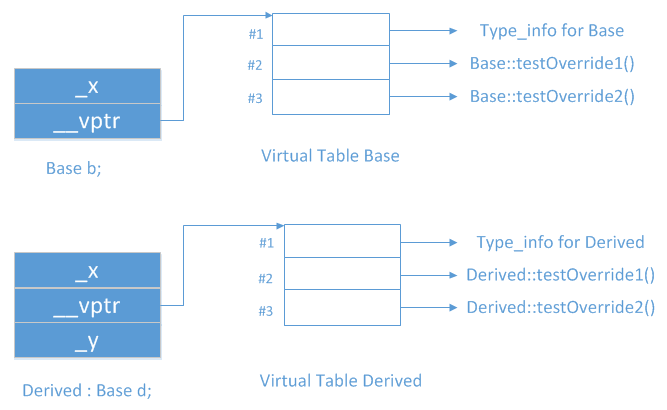

本文通过一个简单的[C++例程](../download/20161106/OverloadOverride.zip)展示重载和覆盖的区别

下面的是C++的语法实现的一个实验程序，在Delphi的面向对象语法中也是有这两个概念的，之前也有整理过相关的文章[《override和inherited关键字在Delphi面向对象多态机制中的作用》](http://www.xumenger.com/delphi-oo-override-inherited-20160719/)

```
#include<stdio.h>
#include<stdlib.h>
#include<iostream>

using namespace std;

class Base{
	private:
		int _x;
	public:
		void testOverload(){
			cout << "Base::testOverload" << endl;
		}
		virtual void testOverride1(){
			cout << "Base::testOverride1" << endl;
		}
		virtual void testOverride2(){
			cout << "Base::testOverride2" << endl;
		}
};

class Derived : public Base{
	private:
		int _y;
	public:
		void testOverload(){
			cout << "Derived::testOverload" << endl;
		}
		void testOverride1(){
			cout << "Derived::testOverride1" << endl;
		}
};

int main()
{
	Base *b = new Derived();

	b->testOverride1();
	b->testOverride2();
	b->testOverload();

	system("pause");
	return 0;
}
```

运行的效果如下：


为什么b->testOverride1();调用的是子类的方法，而b->testOverload();却调用的是父类的方法呢？

## 重载与覆盖

重载(overload)与覆盖(override，也叫改写)是很容易混淆的，上面的这个简单的程序其实可以很好的展示两者的区别

首先讲一下覆盖(override)，覆盖是实现C++多态的语法基础：父类中定义virtual方法，子类override该方法，然后就可以用一个父类的指针或引用寻址到一个子类对象实体。就像上面的例子，父类定义了virtual函数testOverride1()，然后子类覆盖了该函数，当通过new Derived()实例化一个子类对象并且用父类的指针指向该对象时，就正好满足上面对于多态的描述，所以当使用父类指针调用testOverride1()方法时，其结果就是寻址到子类的testOverride1()方法，所以得到这样的运行结果

而对于testOverride2()，虽然其也是定义为virtual方法，但因为只有Base实现了该方法，Derived没有实现该方法，所以调用的还是父类的方法

>在Delphi中，要想实现多态直接就需要使用override关键字了：在父类中使用关键字virtual定义方法，然后在子类中使用关键字override重新实现该方法。只不过C++中不需要在子类中再使用关键字override罢了

再看重载(overload)，上面使用父类的指针调用testOverload()方法，虽然父类的指针指向的是子类的实体，但因为没有使用virtual关键字，所以程序在运行的时候并不知道，既然是使用父类的指针调用的，那么结果就是调用父类的testOverload()方法了

## 背后的内存模型

好吧，上面的解释实在是太肤浅了，再追问一下：

* 为什么是否使用virtual关键字有这么大的不同？
* 在语法上多态是通过virtual关键字实现的，但背后是如何做到的呢？

这就要涉及到C++对象的内存模型了

其实在C++中多态特性的实现是通过vptr做到的，如果一个类以及其父类中没有定义任何一个virtual方法，那么编译器不会为该类生成一个vptr，但如果一个类或者其父类中有定义一个或多个virtual方法，那么编译器在编译该类时会在该类对象的内存中填补一个4byte的空间，用于存储vptr

比如上面的这个例子中Base、Derived的内存模型是这样的(不过对于Base，其vptr可能在\_x前，也可能在其后面，这个要看不同的编译器实现)：



很显然，Base、Derived分别有自己的vptr，指向自己的virtual function表(虚函数表中各个指针再分别指向各个虚函数)，所以调用b->testOverride1();的时候可以根据vptr寻址到子类的testOverride1()方法，然后调用；对于testOverride2()，因为只有父类实现了该virtual方法，子类没有实现，所以其实子类的虚函数表中指向的还是父类的方法，所以调用的还是父类的testOverride2()；但对于testOverload()，因为其不是virtual function，所以Base和Derived都的vptr指向的虚函数指针表中不存在该方法的地址，所以调用b->testOverload();直接根据父类指针就调用了父类的方法了

>注：对于Base::testOverload()和Derived::testOverload()都是分别存储在其内存外面的，并不占用类对象的内存空间，所有的Base对象共用一个Base::testOverload()；同理，所有的Derived对象共用一个Derived::testOverload()

这里只是展示的单一继承情况下的实现多态的内存模型，多重继承下的内存模型就复杂的多了，还是去看《深度探索C++对象模型》这本书吧！
