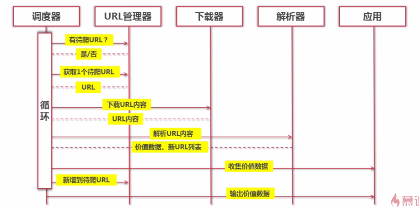
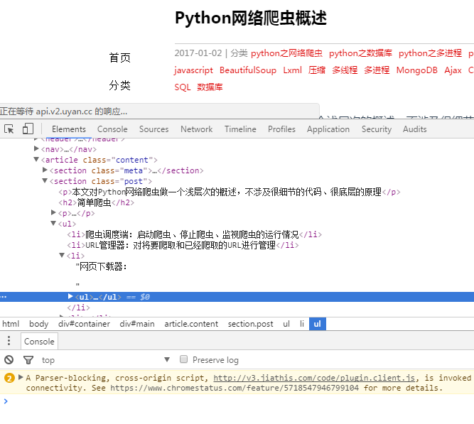
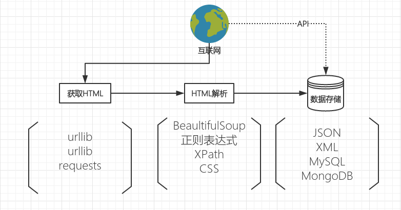
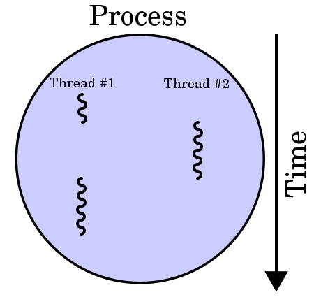
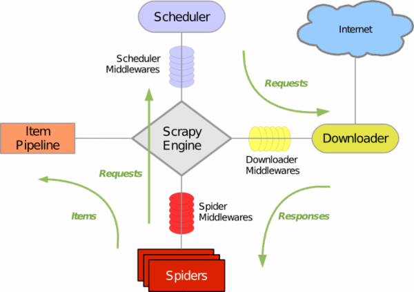

本文对Python网络爬虫做一个浅层次的概述，不涉及很细节的代码、很底层的原理

## 简单爬虫架构

如[《Python网络爬虫简单架构》](http://www.xumenger.com/python-spider-20160608/)中总结的一个简单的爬虫架构

对应使用方便理解的语言描述该逻辑如下：

* 爬虫调度端：启动爬虫、停止爬虫、监视爬虫的运行情况
* URL管理器：对将要爬取和已经爬取的URL进行管理
* 网页下载器：
	* 从URL管理器中获取一个将要爬取的URL，传给网页下载器
	* 下载器将URL指向的网页下载并存储为一个字符串
* 网页解析器：
	* 将网页下载器下载下来的字符串进行解析
	* 一方面获取有价值数据
	* 另一方面每个URL中往往还有指向其他页面的URL，需要补充道URL管理器中
* 上面的逻辑就形成了一个循环，只要有相关联的URL，就可以一直运行下去
* 这个简单的爬虫架构的运行，就可以将互联网上相关联的所有网页都爬取下来

## 数据抓取

要想从网页中抓取有价值的数据，需要了解当前网页的HTML结构，所有的浏览器都有查看源代码、检查网页元素的方法

了解了网页的结构之后，就开始抓取网页中的内容了，其实这部分就是网页解析器的工作。主要的抓取网页数据的方法分别是正则表达式、Beautiful Soup、Lxml

正则表达式为我们提供了抓取数据的快捷方式，但该方法过于脆弱，因为好多网站网页的HTML结构会经常变动，而正则表达式方式很难兼容HTML结构的变化

Beautiful Soup是一个非常流行的Python模块。该模块可以解析网页，并提供定位内容的快捷接口。使用Beautiful Soup的第一步是将已下载的HTML内容解析为soup文档，由于大多数网页都不具备良好的HTML格式，因此Beautiful Soup需要对其实际格式进行确认，比如将确实闭合标签等的HTML文档先转换成标准的HTML，然后再进行解析。使用Beautiful Soup解析网页的方式，虽然代码会比正则表达式复杂些，但是更容易构造和理解。而且，像多余的空格和标签属性这种布局上的小变化，我们也无须再担心了

Lxml是基于libxml2这一XML解析库的Python封装。该模块使用C语言编写，解析速度比Beautiful  Soup更快，不过安装也更为复杂。和Beautiful Soup一样，使用Lxml模块的第一步也是将有可能不合法的HTML解析为统一格式。由于Lxml在搜索元素之前，必须将输入解析为内部格式，因此会产生额外开销，而当抓取同一网页的多个特征时，这种初始化解析产生的开销就会降低，Lxml也就更具竞争力！

使用正则表达式方式解析网页是三种方法中最快的（其是用C语言编写的），但是使用难度较高；Beautiful Soup因为是纯用Python实现的，所以性能较慢，相比于正则表达式可能要慢超过6倍之多，但是使用起来比较简单；而Lxml也是C语言编写的，所以性能也比较高，只是稍微比正则表达式慢一点点，使用起来语法上也比较简单，只是安装的时候可能比较困难

通常情况下，Lxml是抓取数据的最好选择，这是因为该方法既快速又健壮，而正则表达式和Beautiful Soup只在某些特定场景下使用

## 下载缓存

假如我们N天前抓取了网页中的用户名、性别等信息，但是今天还想抓取另一个字段，比如用户图像URL，那么我们需要重新下载整个网站。对于一个比较小型的网站可能并不是特别大的问题，但是对于那些拥有数百万网页的网站而言，重新爬取可能需要耗时几个星期。所以有必要对于已爬取的网页进行缓存，后续不需要再重复下载

>网络传输正常情况下是比磁盘IO更慢的操作

最容易想到的方案，就是讲下载到的网页存储在文件系统中。基于磁盘的缓存系统比较容易实现，无须安装其他模块，并且在文件管理器中就能查看结果。但该方法存在一个缺陷，即受限于本地文件系统的限制。比如多个URL映射为安全文件名后可能映射到一个相同的文件上；如果缓存存储在FAT32文件系统中，每个目录的最大文件数是65535，该限制可以通过将缓存分割到不同目录来避免，但文件系统可存储的文件总数也是有限制的，ext4分区目前支持略多于1500万个文件，但一个大型网站可能拥有超过1亿个网页

要想避免以上的问题可以将多个缓存网页合并到一个文件中，并使用类似B+树的算法进行索引。这个倒不用我们自己编程实现，可以选择实现这类算法的数据库

为了避免次磁盘缓存方案的已知限制，可以在数据库系统之上创建缓存。爬取时，可能需要缓存大量数据，但又无须任何复杂的连接操作，因此可以选择NoSQL数据库

NoSQL全称为Not Only SQL，是一种相对比较新的数据库设计方式。传统的关系模型使用的是固定模式，并将数据分割到不同表中。然而，对于大数据集的情况，数据太大使其难以存放在单一服务器中，此时就需要扩展到多台服务器。不过关系模型对于这种扩展的支持并不够好，因为在查询多个表时，数据可能在不同的服务器中。相反，NoSQL数据库通常是无模式的，从设计之初就考虑了跨服务器无缝分片的问题。在NoSQL中，有多种方式可以实现该目标，分别是列数据存储（如HBase）、键值对存储（如Redis）、面向文档的数据库（如MongoDB）以及图形数据库（如Neo4j）

可以选择MongoDB，以URL为主键，URL对应的网页HTML字符串为内容存储到MongoDB数据库中，不需要像使用磁盘系统那样，先将URL转换成安全文件名，而是直接使用原始的URL

>因为是在本地将网页缓存起来，所以需要考虑本地网页相比较于实际的网页过期的问题

## 并发下载

在爬取规模较小的网站时，串行下载尚可应付，但面对大型网站时就显得捉襟见肘了。在爬取拥有100万网页的大型网站时，假设我们以每秒一个网页的速度昼夜不停下载，耗时也要超过11天。如果我们可以同时下载多个网页，那么下载时间将会得到显著改善。可以应用多线程、多进程

>注意，如果滥用并发下载这一功能，爬虫请求内容速度过快，可能会造成服务器过载，或是IP地址被封禁

当运行Python脚本或其他计算机程序时，就会创建包含有代码和状态的进程。这些进程通过计算机的一个或多个CPU来执行。不过，同一时刻每个CPU只会执行一个进程，然后在不同的进程间快速切换，这样就给人以多个程序同时运行的感觉。同理，在一个进程中，程序的执行也是在不同线程间进行切换的，每个线程执行程序的不同部分。这就意味着当一个线程等待网页下载时，进程可以切换到其他线程执行，避免浪费CPU时间。因此为了充分利用计算机的所有资源尽可能快地下载数据，我们需要将下载分发到多个进程和线程中

性能的增长与线程和进程的数量并不成线性比例的，而是趋于对数。比如，使用1个进程和5个线程时，性能大约是串行时的4倍；而是用20个线程时性能只达到了串行下载时的10倍。虽然新增的线程能够加快下载速度，但是起到的效果相比于之前增加的线程会越来越小。其实这是可以预见到的现象，因为此时需要在更多的线程之间进行切换，专门用于每一个线程的时间就会变少。此外，下载的带宽是有限的，最终添加的新线程将无法带来更快的下载速度。因此，要想获得更好的性能，就需要在多台服务器上分布式部署爬虫，并且所有服务器都要指向用一个MongoDB队列实例！

## 动态内容

和单页面应用的简单表单事件不同，使用JavaScript时，不再是加载后立即下载所有页面内容。这样就会造成许多网页在浏览器中展示的内容不会出现在HTML源码中，所以普通的通过HTML抓取的技术也就无法正常运转了

以下是AJAX原理的流程图

对于这种依赖JavaScript的动态网站，至少有两种抓取其数据的方法：JavaScript逆向工程、渲染JavaScript

虽然AJAX事件可以被逆向工程，但不同类型的网站页面使用不用的AJAX调用，而且网站经常会变更这些调用结构，所偶一抓取这些页面需要持续维护。因此除非性能十分重要，否则最好使用浏览器渲染引擎执行JavaScript事件，然后访问生产的HTML页面

**AJAX原理简介**

AJAX的原理简单来说就是：通过XMLHttpRequest对象来向服务器发送异步请求，从服务器获得数据，然后用JavaScript来操作DOM而更新页面。XMLHttpRequest是AJAX的核心机制，它是在IE5中首先引入的，是一种支持异步请求的技术，简单的说，也就是JavaScript可以及时向服务器提出请求和处理响应，而不阻塞用户，达到无刷新的效果

可以把服务端看成一个数据接口，它返回的是纯文本流，当然这个文本可以是XML格式，可以是HTML，可以是JSON，可以是JavaScript代码，也可以只是一个字符串。这时候，XMLHttpRequest向服务端请求这个页面，服务端将文本的结果写入页面，这和普通的Web开发流程是一样的，不同的是，客户端在异步获取这个结果后，不直接显示在页面，而是先由JavaScript来处理，然后再显示在页面。至于现在流行的很多AJAX控件，比如magicajax等，可以返回DataSet等数据类型，只是将这个过程封装了的结果，本质上它们并没有太大的区别

推荐阅读[《Ajax工作原理》](http://www.cnblogs.com/mingmingruyuedlut/archive/2011/10/18/2216553.html)

## 表单交互

平时我们访问的大多数网页都不是简单的静态网页，而是需要用户与网页进行交互，根据用户的输入返回对应的内容。比如

* 发送POST请求提交表单
* 使用cookie登录网站

比如有些信息必须在登录之后才有权访问，对应的爬虫要在登录之后才能下载这些网页中的数据，所以爬虫自动地与表单交互，比如登录某网站就变得很重要了

## 验证码处理

验证码的全称是全自动区分计算机和人类的公开图灵测试。从其全称可以看出，验证码用于测试用户是否为真实人类。一个典型的验证码是由扭曲的文本组成，此时计算机程序难以解析，但人类仍然可以阅读。许多网站使用验证码来预防与其网站交互的机器人程序

光学字符识别（OCR）用于从图像中抽取文本。但是对于更加复杂的验证码图像，OCR可能就无法顺利应对了。为了处理这些更加复杂的图像，我们将使用验证码处理服务。验证码处理服务有很多，比如2captcha.com和deathbycapcha.com，当把验证码图像传给它们的API时，会有人进行人工查看，并在HTTP响应中给出解析后的文本，一般来说，这个过程在30秒以内

## Scrapy

Scrapy是一个流行的网络爬虫框架，它拥有许多简化网站爬取的高级函数

在爬取网站时，暂停爬虫并于稍后恢复而不是重新开始，是很常用的功能。比如，软件更新后重启计算机，或是要爬取的网站出现错误需要稍后继续爬取时，都可能会中断爬虫。非常方便的是，Scrapy内置了对暂停与恢复爬取的支持！

当然Scrapy还有除了以上功能之外的更多功能
