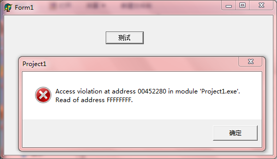

之前在[《C++对象内存模型：C++的string和Delphi的string》](http://www.xumenger.com/cpp-delphi-string-20161116/)、[《Delphi使用FillChar时候如果有string可能导致内存泄漏》](http://www.xumenger.com/delphi-string-memory-20151118/)等文章中对于Delphi的string类型的内存模型有过专门的整理

但是今天又排查了一个关于string类型的问题！

## 简单描述

大致的代码如下，意图是从数据表中取出来路径字段，如果路径是没有以'\'字符结尾，则添加'\'为结尾字符

```
var
  adoQry: TADOQuery;
  path: string;
begin
  ....

  path := adoQry.FieldByName('file_path').AsString;
  if '\' <> path[Length(path)] then
  begin
    path := path + '\';
  end;
  
  ....
end;
```

当数据表的file_path不为''时，使用`path[Length(path)]`来访问最后一个字符是没有问题的

但是如果数据表的file_path为''时，使用`path[Length(path)]`实际的效果是`path[0]`，因为string类型是从1开始索引的，如果使用0去索引获取值，就会出现非法内存访问错误！

## 复现问题

编写一个测试程序，string类型的变量str值为空，然后通过`str[Length(str)]`索引方式去访问str的某个字符

```
procedure TForm1.btn1Click(Sender: TObject);
var
  str: string;
begin
  str := '';
  ShowMessage(str[Length(str)])
end;
```

点击按钮后运行效果如下，报错：Access violation at address 00452280 in module 'Project1.exe'. Read of address FFFFFFFF


