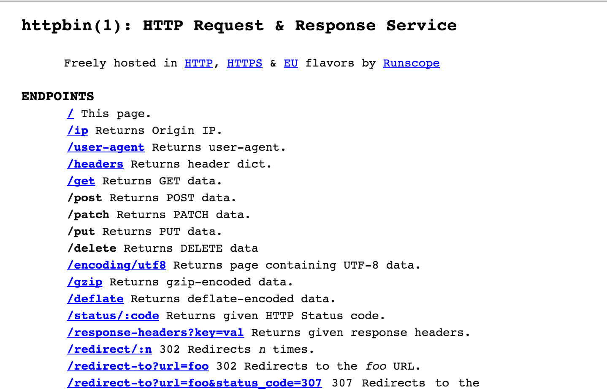
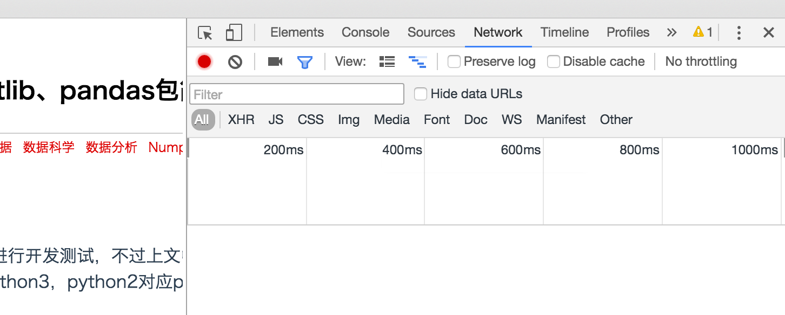
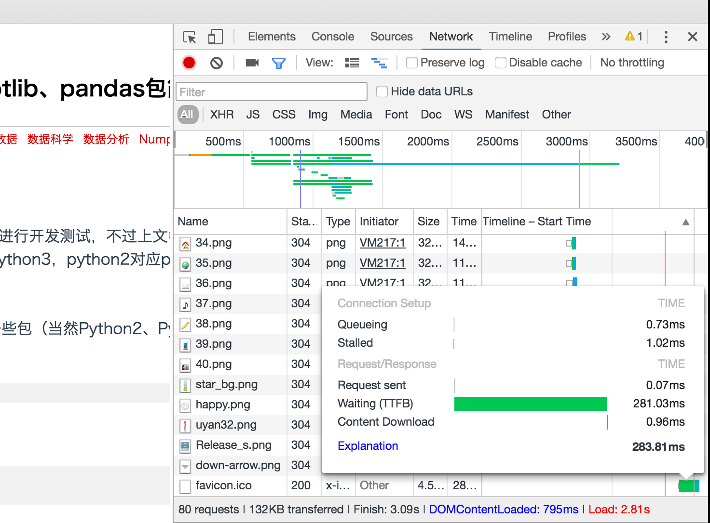
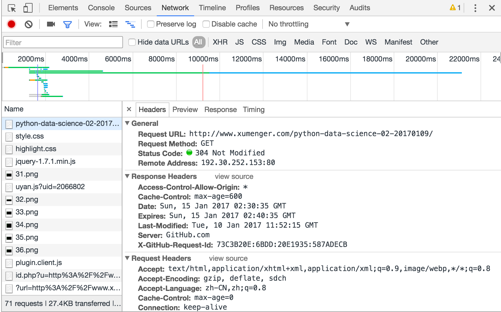
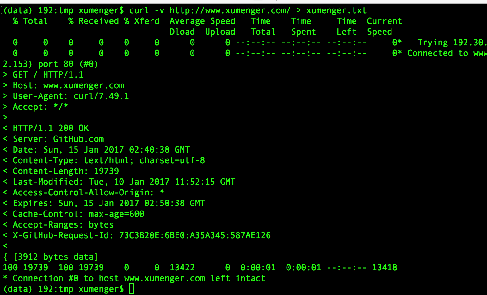
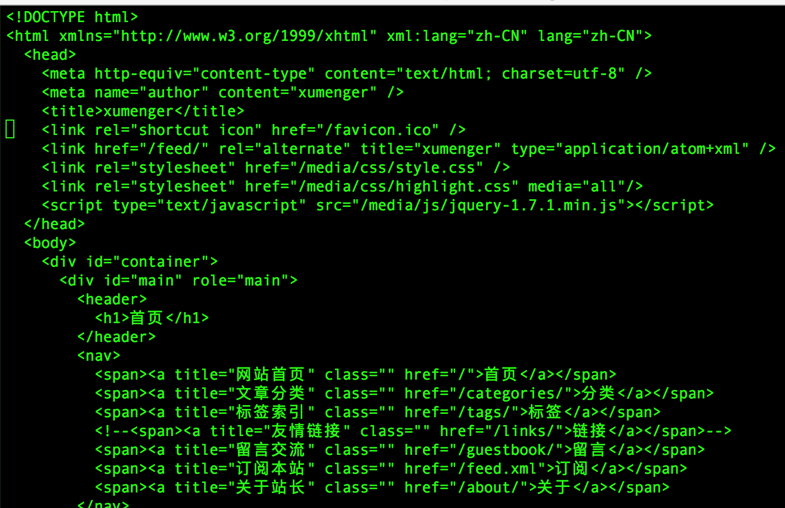
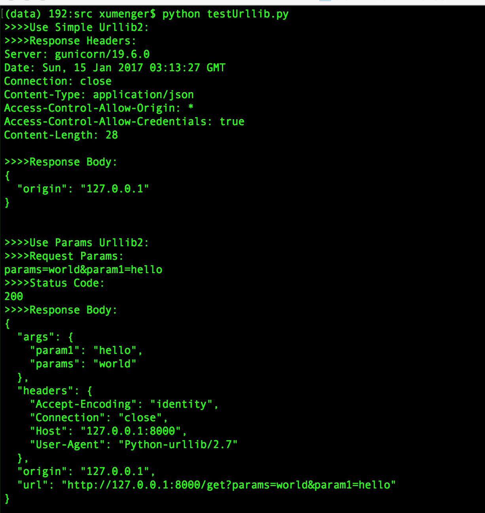

参考[http://www.imooc.com/video/13079](http://www.imooc.com/video/13079)

##Requests简介

>Python使用Requests库从Web上获取（下载）资源。看到Requests的这个作用，第一感觉就是可以方便的应用到网络爬虫的开发中；另外也可以使用Request库对服务端的接口进行自动化测试……

Requests相关信息

* 文档地址：[http://cn.python-requests.org/zh_CN/latest/](http://cn.python-requests.org/zh_CN/latest/)
* github地址：[https://github.com/kennethreitz/requests](https://github.com/kennethreitz/requests)
* 作者博客：[https://www.kennethreitz.org/](https://www.kennethreitz.org/)

使用Python进行网络爬虫开发的时候，有一些原生的库，比如urllib、urllib2，但易用性并不太好

选择Python2、Requests2.10.0进行开发测试，使用[httpbin](https://www.baidu.com/link?url=8dzK8R45rMJhk3QutO33FZypyeXaS_gOPRm0d4eXe_V_mKcmSe875i3ogjWOztoJrnXZL5pHujJ9wcEs2DSqbgxX0G7BsaFSq-xprP2CJUW&wd=&eqid=c3dd0b700000b45900000004587adb08)来作为一个简单的服务端测试Requests

```
$ pip install requests==2.10.0
$ pip install gunicorn
$ pip install httpbin
```

然后执行`gunicorn httpbin:app`就可以启动httpbin服务器，监听的是本地的8000端口



##HTTP协议简介

关于网络协议和HTTP的简介可以参见[《TCP/IP学习笔记：网络协议的层结构》](http://www.xumenger.com/network-1-20161021/)

>HTTP协议是典型的一求一答的模式：客户端按照HTTP规定的格式发送请求，服务端收到请求后按照HTTP规范返回应答

打开Chrome浏览器的开发者工具，进入Network这个Tab页



比如刷新[http://www.xumenger.com/python-data-science-02-20170109/](http://www.xumenger.com/python-data-science-02-20170109/)，可以看到这个Network这个Tab页变成如下的样子



其中的一个个的绿色进度条就表示从服务端加载的各种资源，比如图片、HTML、CSS、JS等的情况

然后双击打开[http://www.xumenger.com/python-data-science-02-20170109/](http://www.xumenger.com/python-data-science-02-20170109/)这个选项，可以看到HTTP请求的头部、应答的头部、应答HTML、耗时等详细的信息



推荐[《Google Chrome 浏览器 开发者工具 使用教程》](http://devework.com/google-chrome-developer-tools-tutorial.html)去更深入的学习Chrome开发者工具

>使用开发者工具是很好的了解HTTP的很多细节信息的方法

还可以在命令行使用curl命令来模拟浏览器访问网站，比如我访问[http://www.xumenger.com/](http://www.xumenger.com/)，执行`curl -v http://www.xumenger.com/ > xumenger.txt`命令，可以看到HTTP的一些详细信息如下



`vim xumenger.txt`可以查看对应的HTML信息



关于HTTP协议更详细的信息，建议阅读[《HTTP协议详解（真的很经典）》](http://www.cnblogs.com/li0803/archive/2008/11/03/1324746.html)

##Request与urllib

urllib、urllib2、urllib3并不是进化关系。python2中有urllib、urllib2，是并存的；python3中就只有一个urllib包了。另外，Requests库使用了urllib3，其特点是多次请求重复使用一个socket，HTTP底层还是使用TCP通信，建立一次连接就要经过一次三次握手，很耗费网络资源，而urllib3可以多次请求重复使用一个socket连接，这样就能比较节省网络资源

下面分别使用urllib(2)和Requests展示其使用方法，测试使用的Server就使用httpbin

**使用urllib和urllib2**

```
# -*- coding: utf-8 -*-
import urllib
import urllib2

URL_IP = 'http://127.0.0.1:8000/ip'
URL_GET = 'http://127.0.0.1:8000/get'

def use_simple_urllib2():
	response = urllib2.urlopen(URL_IP)
	print '>>>>Response Headers:'
	print response.info()

	print '>>>>Response Body:'
	print ''.join([line for line in response.readlines()])

def use_params_urllib2():
	#构建请求参数
	params = urllib.urlencode({'param1': 'hello', 'params': 'world'})
	print '>>>>Request Params:'
	print params
	#发送请求
	response = urllib2.urlopen('?'.join([URL_GET, '%s']) % params)
	#处理响应
	print '>>>>Status Code:'
	print response.getcode()
	print '>>>>Response Body:'
	print ''.join([line for line in response.readlines()])

if __name__ == '__main__':
	print '>>>>Use Simple Urllib2:'
	use_simple_urllib2()

	print ''
	print '>>>>Use Params Urllib2:'
	use_params_urllib2()

```

执行`python testUrllib.py`输出信息如下：



可以看到connection: close，说明请求应答后就断开连接了，还有很多其他的详细信息

**使用Requests库**

```
# -*- coding: utf-8 -*-
import requests

URL_IP = 'http://127.0.0.1:8000/ip'
URL_GET = 'http://127.0.0.1:8000/get'

def use_simple_requests():
	response = requests.get(URL_IP)
	print '>>>>Response Headers:'
	print response.headers

	print '>>>>Response Body:'
	print response.text

def use_params_requests():
	#构建请求参数
	params = {'param1': 'hello', 'params': 'world'}
	#发送请求
	response = requests.get(URL_GET, params=params)
	#处理响应
	print '>>>>Status Code:'
	print response.status_code
	print '>>>>Response Body:'
	print response.json()a

if __name__ == '__main__':
	print '>>>>Use Simple Requests:'
	use_simple_requests()

	print ''
	print '>>>>Use Params Requests:'
	use_params_requests()

```

执行`python testRequests.py`输出信息如下：


可以看到第二个输出的Connection的值是keep-alive，而不是close，说明连接继续保持，多次请求利用一个连接，可以节省网络资源

Requests的更多API的详细说明参见[帮助手册](http://cn.python-requests.org/zh_CN/latest/)

