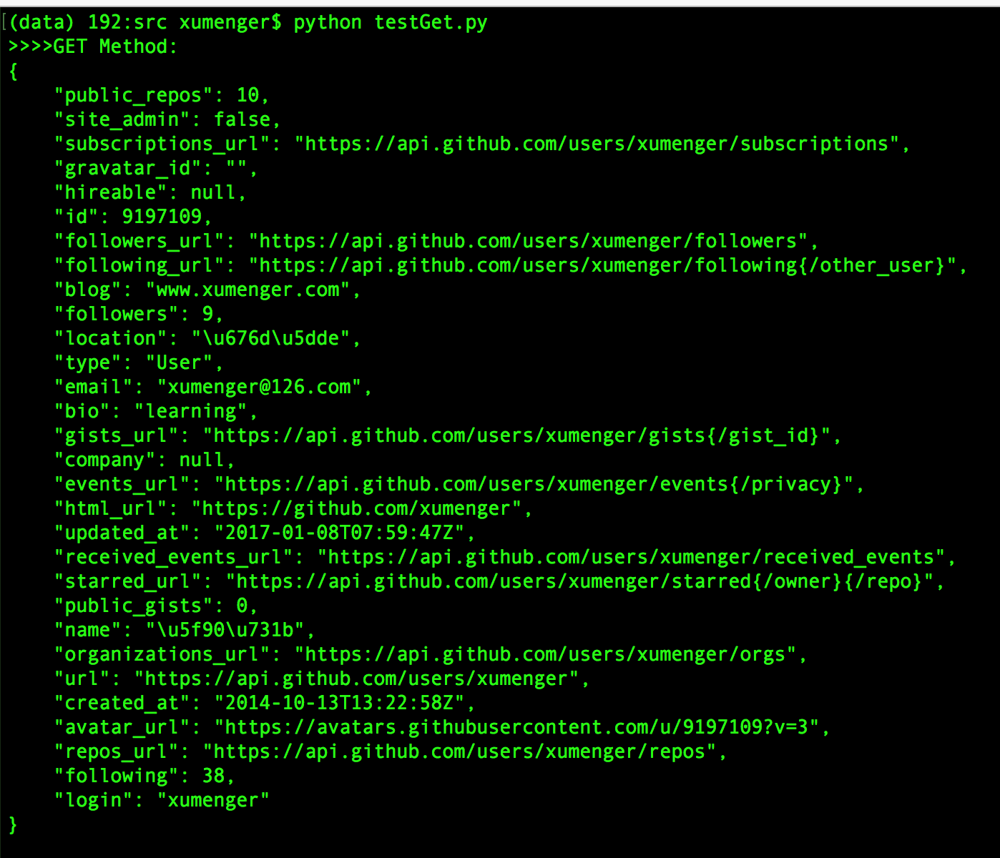
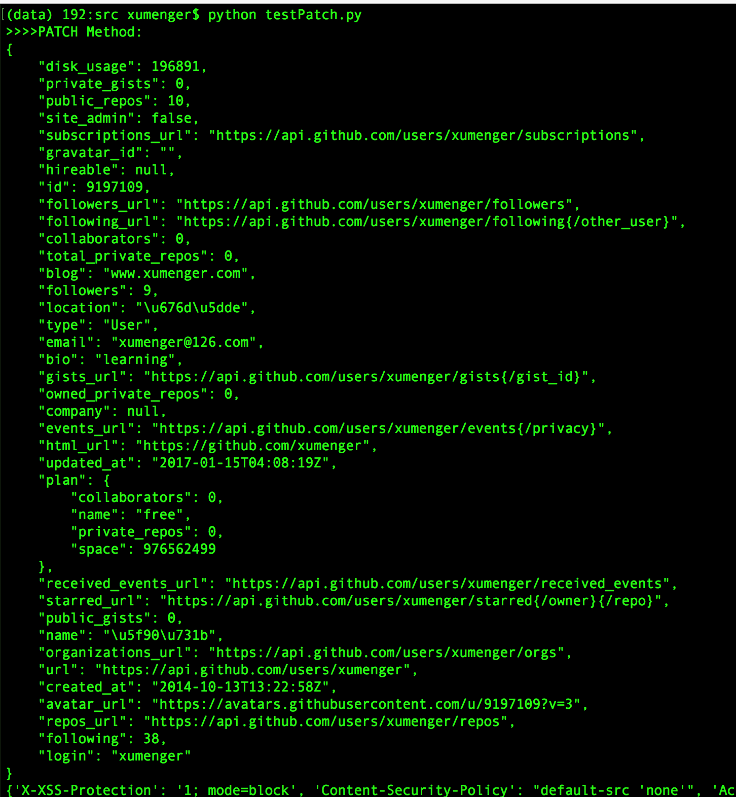
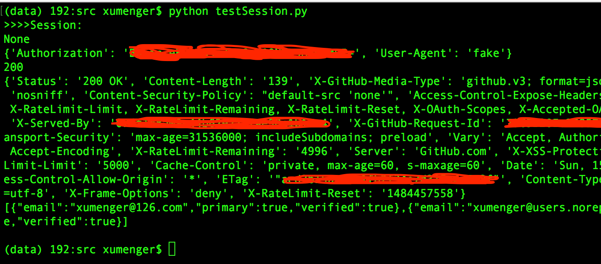
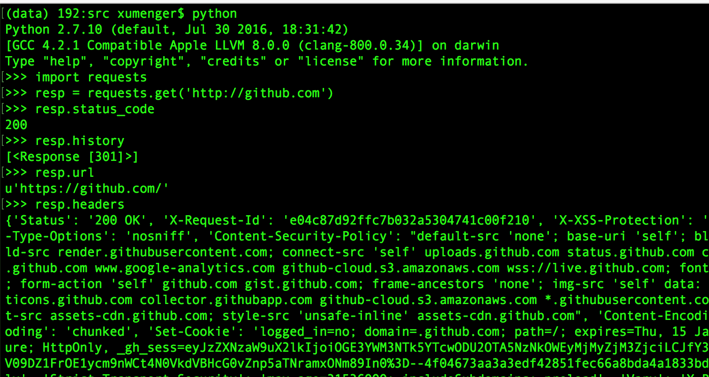

参考[http://www.imooc.com/video/13079](http://www.imooc.com/video/13079)

>对应使用的Python是Python2

## 请求方法

使用GitHub API进行相关的测试，其开发手册地址是：[https://developer.github.com/](https://developer.github.com/)

HTTP的请求方法有以下几种，其中最常用的就是GET、POST：

* GET：查看资源
* POST：增加资源
* PUT/PATCH：修改资源
* DELETE：删除资源
* HEAD：查看响应头
* OPTIONS：查看可用请求方法

Requests库使用请求方法的语法规范是：`requests.[method](url)`

Github API的使用方法必须参考Github API对应的官方文档！

## GET方法查看信息

```
# -*- coding: utf-8 -*-
import json
import requests

URL = 'https://api.github.com'

def build_uri(endpoint):
	return '/'.join([URL, endpoint])

def better_print(json_str):
	return json.dumps(json.loads(json_str), indent=4)

def request_get_method():
	#获取用户xumenger的相关信息
	response = requests.get(build_uri('users/xumenger'))
	print better_print(response.text)

if __name__ == '__main__':
	print '>>>>GET Method:'
	request_get_method()
	print ''

```

执行`python testGet.py`输出如下，可以看到以Json的格式输出xumenger用户的详细信息



Github API应答的包体内容是Json格式的，然后我们解析Json包获取详细应答信息

## PATCH/POST方法修改资源

使用Requests通过Github API修改xumenger的个人博客网站信息，先通过github的网页把网址信息修改为'www.test.com'


编写程序如下，将网址修改为'www.xumenger.com'

```
# -*- coding: utf-8 -*-
import json
import requests

URL = 'https://api.github.com'

def build_uri(endpoint):
	return '/'.join([URL, endpoint])

def better_print(json_str):
	return json.dumps(json.loads(json_str), indent=4)

def request_patch_method():
	#修改用户xumenger的个人网站信息
	response = requests.post(build_uri('user'), auth=('xumenger', '********'), json={'blog': 'www.xumenger.com'})
	print better_print(response.text)
	print response.headers

if __name__ == '__main__':
	print '>>>>PATCH Method:'
	request_patch_method()
	print ''

```

>这里使用明文的密码是不够安全的，不过有其他方法可以规避直接使用明文密码进行认证！后续进行介绍

执行`python testPatch.py`的输出如下



再去Github刷新主页，看到用户的个人网站信息被修改了


## 请求异常处理

实际的网络环境总会出现各种各样的问题，比如网络链路问题、路由解析问题、服务端异常等

对于这种异常情况，最好在请求的时候设置好超时时间，当超过这个时间后还没有收到应答，那么直接终止本次请求

```
# 设置总的超时时间为10s
requests.get(url, timeout=(10))

# 设置TCP连接超时为3s，HTTP请求超时为7s
requests.get(url, timeout=(3, 7))

# 捕获异常
from requests import exceptions
...

try:
	response = requests.get('https://github.com', timeout=(0.1))
except exceptions.Timeout as e:
	print e.message
else:
	print response.text
...

```

## 自定义Request

通过自定义的Request可以伪造HTTP的请求头部信息，比如下面的程序可以伪造HTTP请求头的User-Agent信息

```
# -*- coding: utf-8 -*-
import json
import requests
from requests import exceptions

URL = 'https://api.github.com'

def build_uri(endpoint):
	return '/'.join([URL, endpoint])

def better_print(json_str):
	return json.dumps(json.loads(json_str), indent=4)

def hard_request():
	from requests import Request, Session
	#自定义HTTP请求头
	s = Session()
	headers = {'User-Agent': 'fake'}
	req = Request('GET', build_uri('user/emails'), auth=('xumenger', '*******'), headers=headers)
	#准备Request
	prepped = req.prepare()
	#获取请求信息
	print prepped.body
	print prepped.headers
	
	#使用Session发送请求
	resp = s.send(prepped, timeout=(5))
	#输出应答信息
	print resp.status_code
	print resp.headers
	print resp.text

if __name__ == '__main__':
	print '>>>>Session:'
	hard_request()
	print ''

```

运行效果如下



一个Session可以用于管理多个HTTP请求！

## HTTP响应

HTTP的请求包格式如下


HTTP的应答包格式如下


应答包中主要的信息是[状态码](http://kb.cnblogs.com/page/168720/)，另外附属体部分主要是应答的Body信息，对于网页一般是HTML格式、Json格式、CSS文件、Image、JavaScript文件等

Requests库中的Response对象的基本API

```
#状态码
status_code
#状态码的解释
reason
#应答头部信息
headers
#应答从哪个URL回来的
url
#如果状态码是3XX，即重定向，可以查看其历史跳转状况
history
#这个请求到应答耗费了多长时间
elapsed
#获取应答对应的请求对象
request

#响应的主体是什么编码格式
encoding
#直接读取原始的response对象
raw
#二进制格式的应答主体内容
content
#unicode格式的应答主体内容
text
```



## 使用Requests下载图片、文件

可以开发爬虫自动下载图片、远程下载服务器上的文本文件

比如开发程序下载这个图片：http://www.xumenger.com/media/image/2016-09-19/03.png

```
# -*- coding: utf-8 -*-
import requests

def download_image():
	url = 'http://www.xumenger.com/media/image/2016-09-19/03.png'
	#模拟Chrome浏览器的身份
	headers = {'User-Agent': 'Mozilla/5.0 (Macintosh; Intel Mac OS X 10_12_1) AppleWebKit/537.36 (KHTML, like Gecko) Chrome/50.0.2661.102 Safari/537.36'}
	#因为png图片不是文本格式，而是二进制格式，所以使用流的方式保存到磁盘
	#使用上下文及时关闭流
	from contextlib import closing
	with closing(requests.get(url, headers=headers, stream=True)) as response:
		#打开文件
		with open('demo.png', 'wb') as fd:
			#每128字节写入磁盘一次
			for chunk in response.iter_content(128):
				fd.write(chunk)
			

if __name__ == '__main__':
	download_image()

```

执行该脚本后，即可以成功下载图片

## 事件钩子（Event Hook）

事件钩子是一种事件驱动型的开发模式。JavaScript的很多开发模式都是基于回调的，回调就是事件完成之后引起的一系列动作

像上面的各种演示HTTP的请求／应答都是线程的处理方式：发起请求-->等待应答-->处理应答，使用了事件钩子就可以改变这种线性的开发模式：发起请求同时注册事件钩子-->请求结束之后，会自动回调钩子来处理应答

```
# -*- coding: utf-8 -*-
import requests

#回调函数
def get_key_info(response, *args, **kwargs):
	print response.headers['Content-Type']

def main():
	print 'api.github.com:'
	requests.get('https://api.github.com', hooks=dict(response=get_key_info))
	print 'www.xumenger.com:'
	requests.get('http://www.baidu.com', hooks=dict(response=get_key_info))

if __name__ == '__main__':
	main()

```

以上程序的执行效果如下


可以看到程序在发送请求等到应答回来后，会自动回调钩子函数去处理应答
