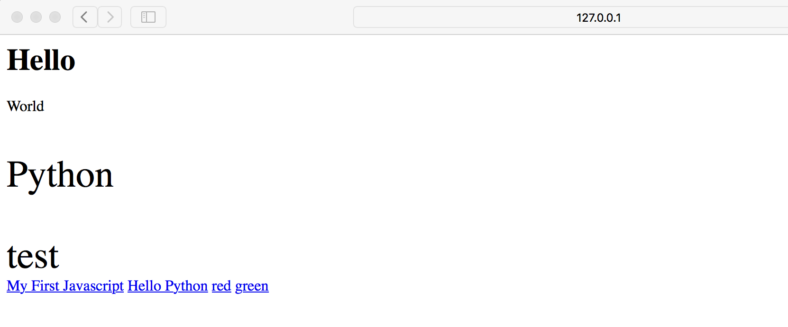
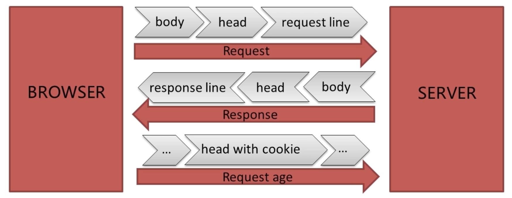
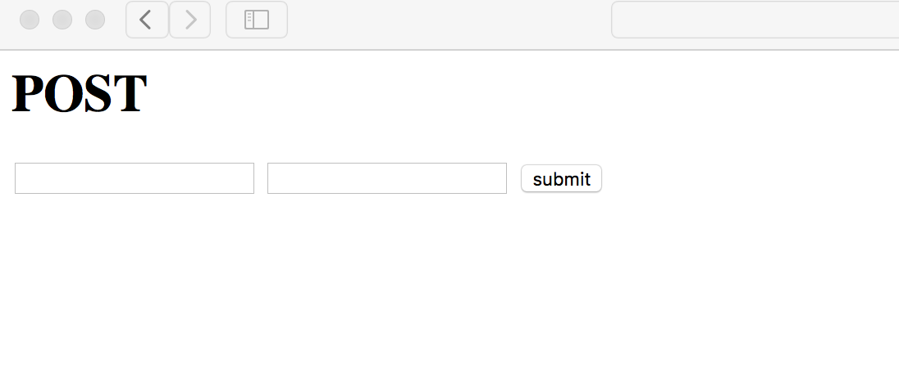
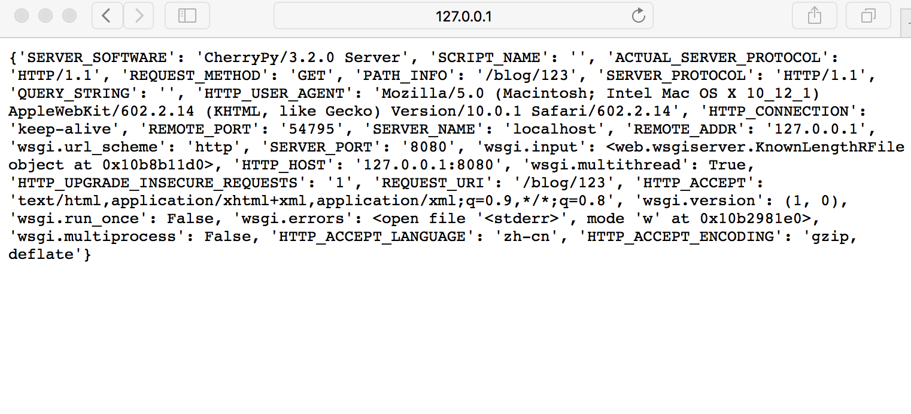
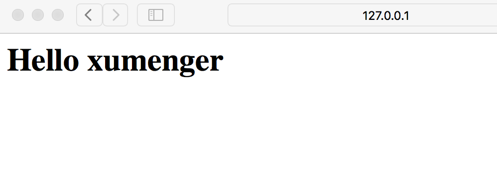
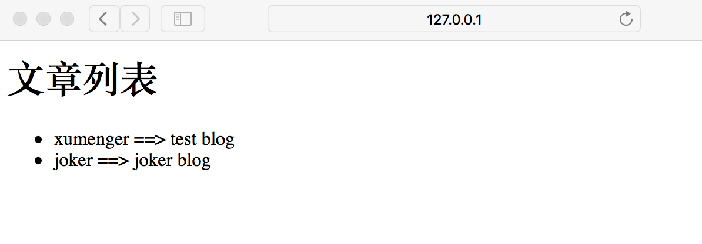

参考自：[http://www.imooc.com/learn/753](http://www.imooc.com/learn/753)

>对应使用的Python版本是Python2

##简介与安装

Web.py是一个非常轻量级的Python Web框架，简单但功能强大，很多自带的组件都可以灵活地被第三方组件替换

执行`pip install web.py`即可安装web.py框架

编写一个简单的测试程序（文件名为WebApp.py）

```
# -*- coding: utf-8 -*-
import web

urls = (
	'/(.*)', 'hello'
)

app = web.application(urls, globals())

class hello:
	def GET(self, name):
		if not name:
			name = 'World'
		return 'Hello, ' + name + '!'

if __name__ == '__main__':
	app.run()

```

执行`python WebApp.py`即可启动服务器


在浏览器中输入'127.0.0.1:8080/xumenger'即可访问


##使用web.py展示web网页

现在有一个包含HTML、CSS、JavaScript的静态Web页面如下

```
<html>
	<head>
		<title>Hello</title>
		<script>
			function show_text(id, text){
				document.getElementById(id).innerHTML = text;
			}
			function show_color(id, color){
				document.getElementById(id).style.color = color;
			}
		</script>
		<style>
			div p { color : #f00; }
			.py { font-size : 40px; }
			#l1 { width : 200px; font-size : 40px; }
		</style>
	</head>
	<body>
		<h1>Hello</h1>
		<div>World</div>
		<p class="py">Python</p>
		<label id="l1">test</label>
		<div>
			<a href="javascript:void(0);" onclick='javascript:show_text("l1", "My First Javascript");'>My First Javascript</a>
			<a href="javascript:void(0);" onclick='javascript:show_text("l1", "Hello Python");'>Hello Python</a>
			
			<a href="javascript:void(0);" onclick='javascript:show_color("l1", "#f00");'>red</a>
			<a href="javascript:void(0);" onclick='javascript:show_color("l1", "#0f0");'>green</a>
		</div>
	</body>
</html>
```

直接在本地打开的效果如下，可以点击这些链接得到不同的展示效果（这里涉及到最简单的HTML、CSS、JavaScript的基础知识）


对应WebApp.py源码修改如下

```
# -*- coding: utf-8 -*-
import web

urls = (
	'/(.*)', 'hello'
)

app = web.application(urls, globals())

class hello:
	def GET(self, name):
		#读取index.html中的内容直接返回给客户端
		return open(r'./index.html', 'r').read()
		

if __name__ == '__main__':
	app.run()

```

同样，执行`python WebApp.py`即可启动服务器，然后浏览器中输入'127.0.0.1:8080'访问即可看到下面的输出



其实直接在本地用浏览器打开index.html也是一样的效果，不过上面的方式才是真正的互联网访问web的方式：

* 客户端发起请求，通过网络传给服务端
* 服务端收到请求，根据请求URL和Method(Get or Post ..)，获取对应的信息比如这里是将index.html中的文本获取，或者修改服务端的信息
* 然后服务端将处理结果以应答的方式通过互联网再发送给客户端
* 客户端获取应答信息，比如这里获取到HTML格式的信息
* 由客户端比如浏览器解析HTML/CSS/JavaScript，将其展示在浏览器上

##URL映射

web.py中的URL映射有3中方式：

* URL完全匹配：`/index`
* URL模糊匹配：`/post/\d+`，也就是正则表达式的匹配方式，不会传递给对应的处理函数
* URL带组匹配：`/post/(\d+)`，也就是带组的模糊匹配，它会把组里获取的内容传递给对应的处理函数

修改WebApp.py的源码如下

```
# -*- coding: utf-8 -*-
import web

#URL映射，URL后面对应的就是请求处理类名
urls = (
	#URL完全匹配
	'/index', 'index',
	#URL模糊匹配
	'/blog/\d+', 'blog',
	#URL带组匹配
	'/(.*)', 'hello',
)

app = web.application(urls, globals())

class index:
	def GET(self):
		return 'index method'

class blog:
	def GET(self):
		return 'blog method'
	def POST(self):
		return 'blog post method'

class hello:
	def GET(self, name):
		return 'hello' + name 
		

if __name__ == '__main__':
	app.run()
```

使用URL'http://127.0.0.1:8080'访问


使用URL'http://127.0.0.1:8080/blog/1'访问


使用URL'http://127.0.0.1:8080/blog/1/12'访问


URL匹配的时候，会按照程序中列举的URL顺序依次匹配，当第一个URL映射可以匹配成功的时候，就不会继续匹配下面的其他URL，所以建议在排列URL匹配规则的时候，按照URL匹配范围排列，匹配范围小的在上面，匹配范围大的在下面

##请求处理

其实在上面讲URL映射的时候，其实比较清楚的可以看到，要先在urls中维护好URL以及对应的处理类，然后处理类内部分别实现GET、POST等方法，当请求来到时，根据请求URL找到对应的处理类，再根据请求的方法，找到处理类的GET或POST或其他方法来进行处理，或者是修改数据，或者是获取相关信息

请求流程大致如下



其中第二次请求相比于第一次请求会比较特殊，请求头中包含了cookie，这个cookie是服务端针对第一次请求的响应时所设置的cookie信息，第二次请求时带着这个cookie信息，这样服务器就可以知道这个客户端是不是之前访问过

在web.py框架中，收到请求后，可以web.input()获取请求参数，无论GET还是POST方法都可以使用；使用web.ctx.env获取请求头信息，比如远程IP等信息。然后根据请求具体进行业务处理……

修改index.html为一个Form表单，方便我们测试Post方法

```
<html>
	<head>
		<title>Hello</title>
	<body>
		<h1>POST</h1>
		<form action="/blog/123" method="POST">
			<input type="text" name="id" value=""/>
			<input type="password" name="password" value=""/>
			<input type="submit" value="submit"/>
		</form>
	</body>
</html>
```

再次修改WebApp.py的代码如下

```
# -*- coding: utf-8 -*-
import web

#URL映射，URL后面对应的就是请求处理类名
urls = (
	#URL完全匹配
	'/index', 'index',
	#URL模糊匹配
	'/blog/\d+', 'blog',
	#URL带组匹配
	'/(.*)', 'hello',
)

app = web.application(urls, globals())

class index:
	def GET(self):
		#获取GET请求参数
		query = web.input()
		return query

class blog:
	def GET(self):
		#获取GET请求头
		headers = web.ctx.env
		return headers
		
	def POST(self):
		#获取POST请求参数
		data = web.input()
		return data

class hello:
	def GET(self, name):
		return open(r'index.html').read()
		

if __name__ == '__main__':
	app.run()

```

启动服务器，输入'127.0.0.1:8080/index?user=xumenger'得到如下网页，获取GET的请求参数


输入'127.0.0.1:8080/'得到如下网页表单



在表单中填写相关信息点击提交后，得到如下页面，获取POST的请求参数


同时去浏览器的地址栏可以看到此时的URL是'127.0.0.1:8080/blog/123'，因为是表单的方式提交的，所以这个URL其实是POST

同样的URL，即'127.0.0.1:8080/blog/123'，也可以通过GET方法请求服务器，我们可以通过直接在浏览器的地址栏中输入'127.0.0.1:8080/blog/123'，然后回车，而不是通过表单，这样就将该URL以GET方法提交到服务端

输出GET请求头信息



##响应处理

Web服务端收到客户端的请求（一般是URL+Method）之后，处理请求，或者是获取相关信息（读取数据库、读取HTML文件等）、或者是修改相关信息（修改数据库信息等），然后将应答返回给客户端

以GET方法获取一个HTML页面为例，以上的几个例子我们是直接通过读取HTML文件的方式将HTML信息作为应答的Body返回给客户端，作为一个Web框架，一般会提供模板的功能来使这个过程更方便、功能更强大

修改WebApp.py源码如下

```
# -*- coding: utf-8 -*-
import web

#定义模板文件夹
render = web.template.render('template')

#URL映射，URL后面对应的就是请求处理类名
urls = (
	#URL带组匹配
	'/(.*)', 'hello',
)

app = web.application(urls, globals())

class hello:
	def GET(self, name):
		#引用模板文件夹下同名的模板文件，还可以传递参数
		return render.hellohtml(name)
		

if __name__ == '__main__':
	app.run()
```

在WebApp.py所在目录下新建一个template文件夹，下面创建一个hellohtml.html文件（这样就可以和render.hellohtml(name)一一对应）

```
$def with(name)
<html>
	<head>
		<title>Hello</title>
	</head>
	<body>
		<h1>Hello $name</h1>
	</body>
</html>
```

启动服务器，输入'127.0.0.1:8080/xumenger'访问服务器，服务端可以动态根据URL结合模板输出动态信息



在mac上执行`brew install mysql`即可安装mysql，然后执行`mysqld`即可启动mysql服务器

然后执行`mysql -u root`即可连接上mysql服务器，因为第一次安装，所以初始密码为空，这里为了测试使用暂不修改密码

执行以下sql创建需要的表，以及向表中插入测试数据

```
create database webpy;
use webpy;
create table blog(user char(10), create_at char(10), content text);
insert into blog values('xumenger', '2017-01-15', 'test blog');
insert into blog values("joker", "2017-10-15", "joker blog");
```

然后执行`pip install MySQL-python`安装mysql驱动

修改WebApp.py源码如下

```
# -*- coding: utf-8 -*-
import web
import MySQLdb
import MySQLdb.cursors

#定义模板文件夹
render = web.template.render('template')

#URL映射，URL后面对应的就是请求处理类名
urls = (
	'/article', 'article',
	#URL带组匹配
	'/(.*)', 'hello',
)

app = web.application(urls, globals())

class hello:
	def GET(self, name):
		#引用模板文件夹下同名的模板文件，还可以传递参数
		return render.hellohtml(name)
	
class article:
	def GET(self):
		#创建数据库连接
		conn = MySQLdb.connect(host='localhost', user='root', passwd='', db='webpy', port=3306, cursorclass=MySQLdb.cursors.DictCursor)
		#生成数据库游标
		cur = conn.cursor()
		#执行sql
		cur.execute('select * from blog')
		r = cur.fetchall()
		cur.close()
		conn.close()
		#将搜索结果传给模版文件，生成最终的HTML
		return render.article(r)

if __name__ == '__main__':
	app.run()

```

在template文件夹下面创建一个article.html文件

```
$def with(r)
<html>
	<head>
		<meta charset="uttf-8"/>
		<title>article</title>
	</head>
	<body>
		<h1>文章列表</h1>
		<ul>
		$for l in r:
			<li>$l.get('user') ==> $l.get('content')</li>
		</ul>
	</body>
</html>
```

启动服务器后，在浏览器上输入'127.0.0.1:8080/article'，显示网页如下



##简单总结

以上简单讲解了URL映射、请求处理、模板、数据库操作，这些就是Web开发的最基本的一些知识点了。基于以上的技术点去构建一些比较复杂的Web系统应该有一个比较清晰的思路的了

经过以上的简单学习，再结合[《什么是Web框架？》](http://www.xumenger.com/web-framework-20160727/)，对于Web框架的架构逻辑也应该有了一个比较深刻的认知！

更进阶、更细节的知识就可以基于对整体架构的认知再具体的学习后应用了，主要有：Cookie、Session、数据库、服务器性能、多线程、多进程……

有一个简单的基于web.py、jinj2开发的博客系统可以作为学习web.py的很好的资料，学习如何拆分python文件、如何分类管理功能代码，github地址是[https://github.com/sunchen009/chouyangblog](https://github.com/sunchen009/chouyangblog)

最近学习了Python爬虫开发、Python Web服务端开发，这里也顺便做个小总结

* 爬虫其实就是开发HTTP客户端：
	* 发送HTTP请求
	* 收到应答，应答中包括需要的资源，img、html、json、javascript、css……
	* 解析应答获取需要的数据，或者存储，或者进行数据分析
* Python Web服务端开发：
	* 收到客户端的请求
	* 处理请求，或者修改数据库、或者生成HTML信息
	* 返回应答给客户端
