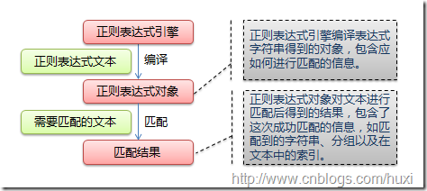

>正则表达式不只可用于解析网页，它可以处理所有的字符串，而网页无非是html格式的一个长字符串罢了。最近读了一本书，其实正则表达式也可以用于编译器的词法分析

[《正则表达式与文件格式化处理》](http://www.xumenger.com/regex-20160904/)中介绍过正则表达式的基础语法

本文展示Python使用正则表达式解析一个典型的HTML网页，获取其中的重要数据，其在网络爬虫中有着比较重要的应用。如此来了解常用的正则表达式

##正则表达式基础

以下内容转载自[《Python正则表达式指南
》](http://www.cnblogs.com/huxi/archive/2010/07/04/1771073.html)的一部分

正则表达式并不是Python的一部分。正则表达式是用于处理字符串的强大工具，拥有自己独特的语法以及一个独立的处理引擎，效率上可能不如str自带的方法，但功能十分强大。得益于这一点，在提供了正则表达式的语言中，正则表达式的语法都是一样的，区别只是在于不同的编程语言实现支持的语法数量不同。但不用担心，不被支持的语法通常是不常用的部分。如果已经在其他语言里使用过正则表达式，只需要简单看一看就可以上手了

下图展示了使用正则表达式进行匹配的流程



正则表达式的大致匹配过程是：

* 依次拿出表达式和文本中的字符进行比较，如果每一个字符都能匹配成功，则匹配成功
* 一旦有匹配不成功的字符则匹配失败
* 如果表达式中有量词或边界，这个过程会稍微有一些不同，但也是很好理解的，看最后的《Python支持的正则表达式元字符和语法》附件以及多练习即可理解

##Python正则表达式简单语法

Python通过re模块提供对正则表达式的支持。使用re的一般步骤是将正则表达式的字符串形编译为pattern实例，然后使用pattern实例处理文本并获得一个匹配结果（一个Match实例），最后使用Match实例获得信息，进行其他的操作

```
>>> import re
>>> 
>>> # 将正则表达式编译成pattern对象
>>> pattern = re.compile(r'hello')
>>> 
>>> # 使用pattern匹配文本，获得匹配结果，无法匹配时返回None
>>> match = pattern.match('hello world!')
>>> 
>>> if (match is not None):
	# 使用match获得分组信息
	print match.group()

	
hello
>>> 
```

##用正则表达式处理一个典型网页

下面这个Python源文件中，使用正则表达式解析一个简单的典型HTML网页，获取其中的信息：

```
# -*- coding: utf-8 -*-


```

运行程序输出的结果是


##附：Python支持的正则表达式元字符和语法

