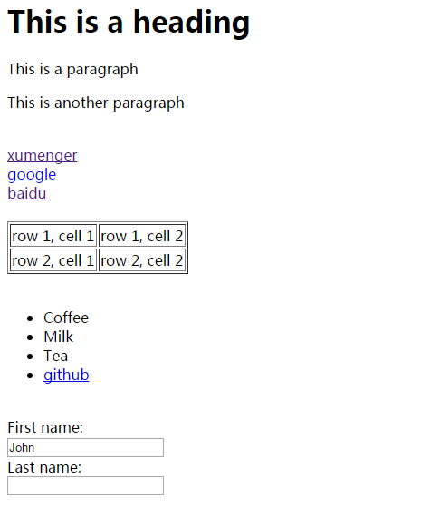

>正则表达式不只可用于解析网页，它可以处理所有的字符串，而网页无非是html格式的一个长字符串罢了。最近读了一本书，其实正则表达式也可以用于编译器的词法分析

[《正则表达式与文件格式化处理》](http://www.xumenger.com/regex-20160904/)中介绍过正则表达式的基础语法

本文展示Python使用正则表达式解析一个典型的HTML网页，获取其中的重要数据，其在网络爬虫中有着比较重要的应用。如此来了解常用的正则表达式

##正则表达式基础

以下内容转载自[《Python正则表达式指南
》](http://www.cnblogs.com/huxi/archive/2010/07/04/1771073.html)的一部分

正则表达式并不是Python的一部分。正则表达式是用于处理字符串的强大工具，拥有自己独特的语法以及一个独立的处理引擎，效率上可能不如str自带的方法，但功能十分强大。得益于这一点，在提供了正则表达式的语言中，正则表达式的语法都是一样的，区别只是在于不同的编程语言实现支持的语法数量不同。但不用担心，不被支持的语法通常是不常用的部分。如果已经在其他语言里使用过正则表达式，只需要简单看一看就可以上手了

下图展示了使用正则表达式进行匹配的流程


正则表达式的大致匹配过程是：

* 依次拿出表达式和文本中的字符进行比较，如果每一个字符都能匹配成功，则匹配成功
* 一旦有匹配不成功的字符则匹配失败
* 如果表达式中有量词或边界，这个过程会稍微有一些不同，但也是很好理解的，看最后的《Python支持的正则表达式元字符和语法》附件以及多练习即可理解

正则表达式通常用于在文本中查找匹配的字符串。Python里数量词默认是贪婪的（在少数语言里也可能是默认非贪婪），总是尝试匹配尽可能多的字符；非贪婪的则相反，总是尝试匹配尽可能少的字符。例如：正则表达式"ab\*"如果用于查找"abbbc"，将找到"abbb"。而如果使用非贪婪的数量词"ab\*?"，将找到"a"

与大多数编程语言相同，正则表达式里使用"\"作为转义字符，这就可能造成反斜杠困扰。假如你需要匹配文本中的字符"\"，那么使用编程语言表示的正则表达式里将需要4个反斜杠"\\\\\\\\"：前两个和后两个分别用于在编程语言里转义成反斜杠，转换成两个反斜杠后再在正则表达式里转义成一个反斜杠。Python里的原生字符串很好地解决了这个问题，这个例子中的正则表达式可以使用r"\\\\"表示。同样，匹配一个数字的"\\\\d"可以写成r"\d"。有了原生字符串，再也不用担心是不是漏写了反斜杠，写出来的表达式也更直观

##Python正则表达式简单语法

Python通过re模块提供对正则表达式的支持。使用re的一般步骤是将正则表达式的字符串形编译为pattern实例，然后使用pattern实例处理文本并获得一个匹配结果（一个Match实例），最后使用Match实例获得信息，进行其他的操作

```
# -*- coding: utf-8 -*-


```

运行该脚本的输出是

```

```

##用正则表达式处理一个典型网页

下面这个Python源文件中，使用正则表达式解析一个简单的典型HTML网页，获取其中的信息，比如获取HTML网页中的URL、标题等信息，下面给出一个例子：

```
# -*- coding: utf-8 -*-

html = """
  <html>
    <head>
      <title>Test Python re</title>
    </head>
    <body>
      <h1>This is a heading</h1>
      <p>This is a paragraph</p>
      <p>This is another paragraph</p>
      <br>

      <a href="http://www.xumenger.com" target="_blank">xumenger</a><br>
      <a href="http://www.google.com">google</a><br>
      <a href="http://www.baidu.com">baidu</a><br>
      <br>

      <table border="1">
        <tr>
          <td>row 1, cell 1</td>
          <td>row 1, cell 2</td>
        </tr>
        <tr>
          <td>row 2, cell 1</td>
          <td>row 2, cell 2</td>
        </tr>
      </table>
      <br>

      <ul>
        <li>Coffee</li>
        <li>Milk</li>
        <li>Tea</li>
        <li><a href="http://www.github.com" target="_blank">github</a><br></li>
      </ul>
      <br>

      <form action="">
        First name:<br>
        <input type="text" name="firstname" value="John" readonly>
        <br>
        Last name:<br>
        <input type="text" name="lastname">
       </form> 
       
    </body>
  </html>
"""
```

其中上面的这个HTML在浏览器中显示的效果是


运行该脚本的输出是

```

```

##附：Python支持的正则表达式元字符和语法


