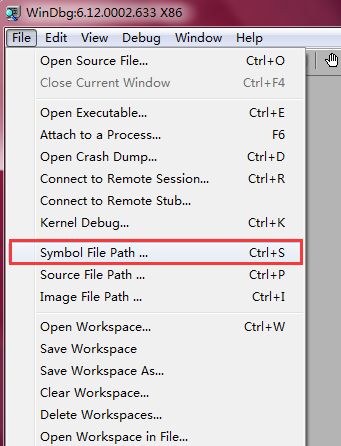
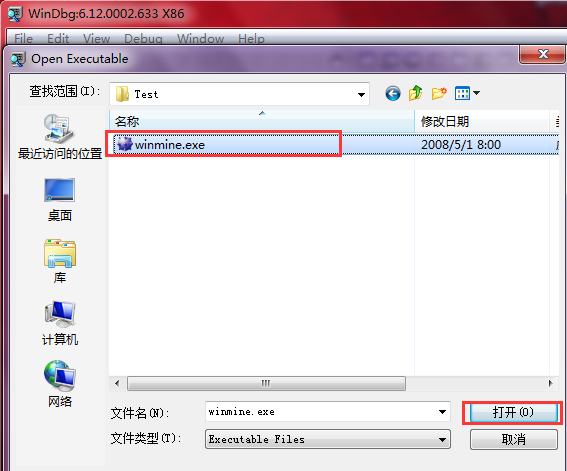
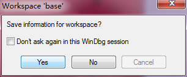
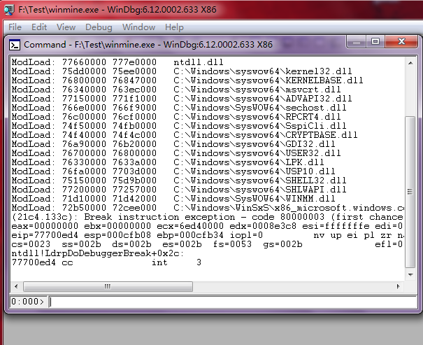

去年5月份出差，在客户现场遇到一个诡异的问题：一个专门压缩日志的在压缩完成后调用SuspendThread方法却无法将其挂起，线程一直在疯狂运行，导致大量占用CPU资源，又因为该线程会发送消息给主线程，主线程将信息打印到界面，进而导致主线程过度繁忙地处理消息使得界面完全无法点击和拖动，差点引起生产问题（这可是我们的产品在客户那里第一次上线，第一天就没法进行股票交易可是大问题），幸好通过暂时更换一台机器的方式解决了这个问题

但更换机器只是暂时的解决方案，为什么在之前的机器上就是存在问题？为什么线程根本就停不下来？我使用普通的排查方法，比如注释代码、分析代码根本没有什么有效的进展

回到公司后请教了技术专家；另外请客户现场的同事配合原来的机器上复现问题，并且使用procdump获取该进程此时的内存转储文件，然后发回公司进行分析

不愧是技术专家，使用WinDbg，发现了这个进程加载了几个异常的DLL，查资料发现这几个DLL是与Windows兼容模式有关，然后在自己的机器上做一个简单的多线程程序，修改其【兼容Windows 98】，然后运行，确实调用SuspendThread会无效，线程无法正常被挂起，而且也发现这种修改了兼容性的情况并不需要更换新机器，在原有的机器上更换一下可执行文件的目录就可以。再让现场的同事帮确认，确实是因为程序以【兼容Windows 98】运行，在“有问题”的机器上更换新的目录页确实可以正常工作了

>上面是在把问题排查清楚后的复述，看起来思路很清楚，也没有什么难度，但当第一次遇到线程无法挂起的诡异现象，有没有任何有效信息，从0开始排查，可想而知其难度有多大：怎么去分析Dump文件？怎么发现这些异常的DLL有问题？如何进行合理的猜测，再针对这个猜测去试验和验证？怎么查以及去什么地方查关于这些异常DLL的资料？这些都需要长期的软件调试实践的积累（经验），以及对于计算机原理、操作系统原理等知识的深刻掌握（基础知识）

当然会吐槽是哪个二货把程序的兼容模式修改了。但也正是因为这个二货让我第一次感受到WinDbg的强大，正确的说是感受到技术专家能力之强，毕竟工具再强大自己不会用也是白搭。也就是在那个时候对软件调试产生了巨大的兴趣

##WinDbg和调试简介

[《使用WinDbg、Map文件、Dump文件定位Access Violation的代码行》](http://www.xumenger.com/windbg-map-access-violation-20160715/)中简单地提到WinDbg；[《汇编与逆向基础：使用IDA和OllyDbg分析C函数调用》](http://www.xumenger.com/c-assembly-ollydbg-ida-20161216/)中讲到了Windows平台上的另一个调试工具OllyDbg的使用，还算是比较深入的。学习软件调试的时候，在Windows平台可以OllyDbg和WinDbg配合着研究，另外也可以同时研究Linux平台的软件调试，[《初步了解如何用GDB分析Core文件》](http://www.xumenger.com/linux-c-cpp-gdb-coredump-20160908/)

接下来对WinDbg的应用、原理做一个简单的介绍，背后涉及到的调试原理、CPU、操作系统原理、编译原理、汇编等知识的体量之大，是不可能在短短的一篇文章中说清的

WinDbg可以启动一个新进程进行调试、可以Attach到一个正在运行的进程上进行调试、可以分析进程内存转储文件；可以在用户态进行调试，也可以在内核态进行调试；可以调试本机进程，也可以进行远程调试……

可以在用户生产环境设置JIT调试器为WinDbg，然后在程序崩溃时可以自动将WinDbg调试器Attach到崩溃进程上，然后在配合远程调试通过网络在自己的本机上进行调试，如此处理客户环境程序的崩溃问题难度将大大降低；再不济，可以使用procdump或者任务管理器，在程序崩溃时及时将程序Dump下来，然后使用WinDbg在本地分析Dump文件也是很好的调试崩溃问题、地址异常问题等的好方法。如此一来，面对蛋疼的崩溃问题、非法地址问题都不再像以前那样棘手了

一个成熟的计算机系统从硬件到软件都会有对调试有很好的支持：

* CPU的调试支持：INT1、INT3，调试寄存器、陷阱标志、中断异常和分支监视
* 操作系统的调试支持：调试事件的分发和管理，用户态调试子系统、内核调试引擎、调试API
* 编译器的调试支持：调试符号、运行期检查
* 调试器的调试功能，以及被调试软件的可调试性

调试能力需要依赖于以下的知识、技能：

* 比如Windows，要熟知各种重要的dll的作用，比如kernel32.dll、ntdll.dll等
* 熟知调试器的基础命令，然后更多的在实践中积累
* 熟悉各种调试器（WinDbg、OllyDbg、GDB等）的调试交互逻辑
* 了解调试的原理
* 熟悉栈回溯
* 熟悉汇编语言
* 熟悉进程的内存结构
* 熟悉CPU的工作原理
* CPU、操作系统、编译原理等这些计算机基础知识当然是知道越多越好

>当然计算机组成原理、操作系统原理、编译原理相关的知识都是接下来需要恶补的

##使用WinDbg“扫雷”

这个例子是展示如何使用WinDbg调试、破解扫雷程序，也算是一个最简单的逆向工程的例子了，对应的扫雷程序点击[这里](../download/20170214/winmine.zip)下载

打开WinDbg，选择符号文件设置

输入：`SRV*c:\symbol* http://msdl.microsoft.com/download/symbols`，然后点击OK即可。之前在[《WinDbg配置Symbol(符号)》](http://www.xumenger.com/windbg-symbol-20160521/)中的方法并不值得参考

然后使用WinDbg打开扫雷程序

然后弹出如下对话框，选择Yes、No都可以

打开后界面是如下的

然后输入命令`g`将被调试程序运行起来，并且操作被调试的扫雷程序，将其修改为难度为99个雷的模式

然后点击下面红框中的按钮，让被调试程序暂停运行

如此才可以在命令框中输入命令进行调试

在有调试符号的情况下，输入`x winmine!*`即可输出被调试程序winmine.exe的所有符号信息

>x命令显示所有上下文中匹配指定模板的符号。可用字符通配符

可以看到其中很多符号后面带有` = <no type information>`信息，因为我们没有私有符号，只有公开符号，所以不知道这些变量的类型是什么

