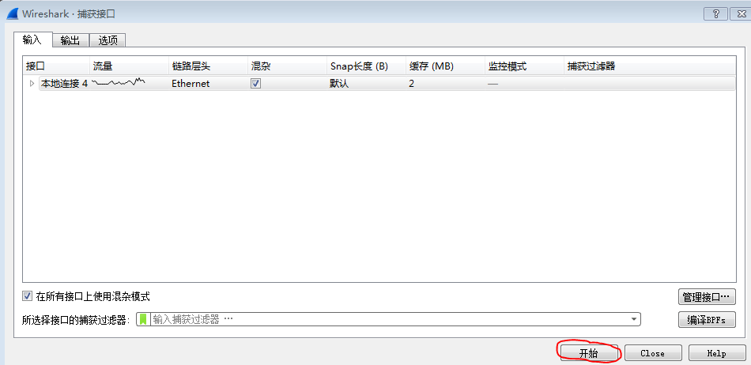

最近出差帮助上交所使用自动化测试工具测试报单接口（其网络协议是在TCP基础上制定的），用例一直能正常运行，突然就出现了在某笔请求之后收不到应答的情况，主要是客户端接收应答的日志没有打印出来

这时候只能上WireShark去抓包分析问题！同时去检查服务端到底有没有把应答发送出来？！

之前在[《使用WireShark分析TCP的三次握手过程》](http://www.xumenger.com/wireshark-tcp-20160716/)中有简单介绍WireShark抓取并分析TCP的三次握手过程

本文中抓包用到的WireShark版本相比于上篇文章中用到的有所变化，不过基本的操作逻辑都是一致的

##使用WireShark抓包

首先选择抓包的那个网卡，【捕获】->【选项】



然后设置WireShark抓包的过滤规则，因为服务端IP是196.131.3.134，端口是7080，所以设置过滤规则是

```
(ip.src==196.131.3.134 and tcp.srcport==7080) or (ip.dst==196.131.3.134 and tcp.dstport==7080)
```


设置好过滤规则，回车即可抓包，如此就可以捕获来自196.131.3.134:7080，或发送到196.131.3.134:7080的网络包了

关于WireShark抓包过滤规则，推荐[《WireShark简明教程》](http://openmaniak.com/cn/wireshark_filters.php)

然后运行自动化测试程序去发送请求和接收应答，与此同时，WireShark正在进行抓包工作

测试完成后，如下图点击菜单上的按钮，WireShark停止抓包，然后【文件】->【保存】即可保存WireShark的抓包结果方便后续随时分析，也可以拿到其他安装了WireShark的机器上分析网络包


##分析问题原因

>开发中遇到问题去分析流程，根据信息确认是哪个步骤出现的问题，再去针对这个步骤为什么出错进行排查。这个套路适用于排查绝大多数问题

抓包完成后无非以下几种情况，然后根据实际结果针对性的进行分析

**情况1：**测试正常，请求应答都没有丢失，说明这个问题不是必现的，最好接下来每次都测试的时候都用WireShark进行抓包，等到复现时可以及时对比下面的情况2、3、4进行排查

**情况2：**服务端没有发送应答，那么就去排查服务端的问题

**情况3：**服务端发送应答，本机的WireShark抓到应答，但本机的客户端没收到应答，那么很大的可能是客户端程序编码问题导致的，比如出现了阻塞或其他处理网络的代码不合理导致的

**情况4：**服务端发送应答，本机的WireShark没有抓到应答，那么就排查客户端机器与服务端机器之间的网络传输问题，比如防火墙、路由器等

##网络问题排查与网络协议破解

像上面这种是在清楚网络协议的情况下，排查网络问题，相对而言会简单的多

另外还有更复杂的情况

* 并不是基于TCP开发的，而是在IP基础上自定义的全新的协议
* 完全不清楚协议的规则，那么就需要去根据报文反向推导出网络协议规则
* 网络是加密传输的，那么就要涉及到解密，其难度可想而知
* 网络环境极其复杂
* 可能不是在TCP层面出错，而是在网络层、数据链路层、物理层出现的问题
* 等等
