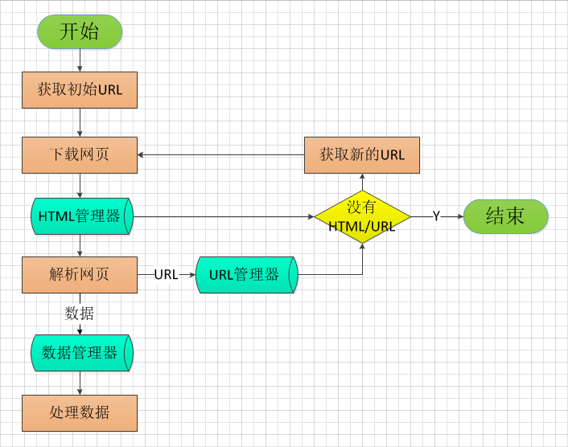

##项目简介

Python爬虫框架和使用该框架实现的各种爬虫。对应Python版本是Python2

编码规范参考：

* [《Python语言规范》](http://zh-google-styleguide.readthedocs.io/en/latest/google-python-styleguide/python_language_rules/)
* [《Python风格规范》](http://zh-google-styleguide.readthedocs.io/en/latest/google-python-styleguide/python_style_rules/)

扩展阅读：[《高质量的工程代码为什么难写》](http://hellojava.info/?p=508)

>做成一件事，使用的方法越简单越好，所以这个项目我坚持如下原则：在实现功能的基础上，代码量尽可能少、逻辑尽可能简单

##项目背景介绍

Python在互联网时代有很多天然的优势：

* 有诸多Python开发的Web框架：django、flask、web.py等，可以方便的拿来做Web开发
* Python开发爬虫也有天然的优势，比如自带的urllib、urllib2、htmlparser、re等模块，还有很多的第三方开发包，比如Requests、Beautiful Soup、lxml等，可以很方便的处理HTTP、下载网页、解析网页等
* Python在数据分析方面也有很强的优势，比如可以使用Numpy、matplotlib、pandas等包对爬下来的数据进行数据分析、处理，通过图表等方式进行人性化的展示
* 当然对于用爬虫爬取并分析的数据，还可以用Python进行Web开发来在网站上展示数据的分析结果

可以看到Python在爬虫、数据分析、开发Web网站展示数据等全流程上发挥作用

以上是我个人对于Python的一些思考，也正是基于如此的原因才激发我学习Python的兴趣

然而光学习而不动手的话，当时学到的东西很快就遗忘了，尤其是在计算机领域，单纯的学习Python语法、了解Python并没有什么用处，必须实实在在的用Python做出来东西才是最好的深刻学习Python的方法，不光是Python，计算机领域的诸多应用层面都应该如此：编程、调试、设计……

一直对Python爬虫比较感兴趣，在[《Python网络爬虫简单架构》](http://www.xumenger.com/python-spider-20160608/)、[《Python网络爬虫概述》](http://www.xumenger.com/python-crawler-20170102/)两篇文章中对于Python爬虫的简单逻辑、涉及到的各个方面进行了比较全面的讲述，所以计划基于这两篇文章的思想实现一个简单的爬虫框架

开发的过程中必然会遇到各种问题，必须去逐个针对性的解决，这也正是为什么实践是最好的学习方法的原因所在：遇到问题，思考应该用什么知识解决这个问题，再去针对性地学习这方面知识

##如何设计简单爬虫框架

计划实现的这个爬虫框架只用于抓取最简单的HTML页面，然后处理，不考虑Cookie、Session、验证码、AJAX、表单等复杂的东西

设计框架时需思考的问题：

* 多线程，其固有的Python GIL锁问题
* 多进程，进程间通信是个棘手的问题
* 解析网页属于CPU密集型的工作
* 下载网页属于网络IO
* 一般将网页解析结果保存到文件或数据库，所以其大都是磁盘IO

既然是爬虫框架，那么就需要先把所有爬虫的相同点、不同点摘取出来，在框架中将相同点封装起来，不同点可以通过开放接口的方式由每个具体的爬虫来实现

下面的总结是针对最简单的爬虫，暂不考虑登录、cookie、session、验证码、AJAX、表单等高级的东西

* 下载网页：简单的爬虫可以共用这部分逻辑，同
* 解析网页：不同的网页结构需要不同的解析方法，异
* 管理URL：爬虫可以共用这部分逻辑，同
* 输出内容：或者输出到数据库，或者输出到磁盘，异

开发大多数软件项目，有着相同的固定套路

* 普通业务程序的开发，需要弄清楚该程序对接的上游程序的接口、对接的下游程序的接口，然后按照接口对应实现内部功能逻辑
* 开发一个框架性的程序，需要先规划好开放出来的接口具体是什么样的，如何方便开发者调用，然后针对这个接口规划内部架构逻辑

综上而言，最重要的就是“接口”二字。接口是开发很好的切入点，从接口开始入手把整个流程逻辑梳理清楚。当然了这只是基于我现阶段知识和经验所产生的拙见

所以在没有开发之前我期望的爬虫框架的接口是这样的

* 有一个配置文件，配置URL正则表达式以及与之匹配的URL对应的处理类
* URL处理类中实现两个方法，Parse、Output
* Parse入参是[url, html]格式的数据，存储URL，以及URL对应网页的HTML字符串
* Parse方法内部实现对于HTML的解析
* Parse返回是[url, content]格式的数据，存储URL，以及该URL网页解析的结果
* Output入参是[url, content]格式的数据，Output内部用于将解析网页获取的内容进行输出

接口的初步设计粗略说明就是这样，接下来就是针对接口来规划框架内部应该如何实现了

对于[《Python网络爬虫简单架构》](http://www.xumenger.com/python-spider-20160608/)的框架做了一些完善，设计的爬虫框架逻辑如下

