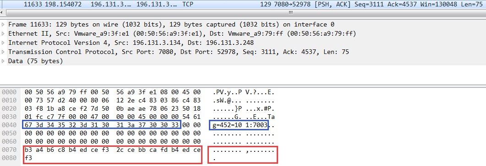
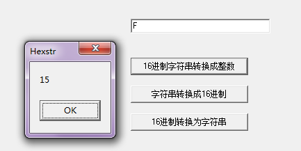
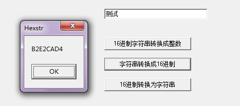

今天排查一个网络问题，通过使用WireShark抓包然后去和程序记录的日志进行对比以分析问题，排查到底是发过来的网络包本身有问题，还是程序内部的解析处理出现问题。在WireShark抓到的包中英文、数字字符可以显示，可以对比程序的日志去一步一步有策略地排查，但汉字在WireShark不能正常显示，所以只能根据对应的16进制格式去反推到底是什么汉字

下面使用Delphi实现了一个小工具，可以实现将字符串(含汉字)转换成16进制，或者将16进制转换成字符串(含汉字)，这样也可以方便在以后使用WireShark分析网络报文时自动地将16进制网络包转换成字符串(含汉字)以加快分析效率。除此之外需要注意字符编码的问题，可以简单参考[《Delphi和C/C++配合编程时传递字符串的规范》](http://www.xumenger.com/delphi-vcpp-string-chararray-20160511/)

点击[这里](../download/20170223/HexStr.zip)下载程序源码

```
unit MainFrm;

interface

uses
  Windows, Messages, SysUtils, Variants, Classes, Graphics, Controls, Forms,
  Dialogs, StdCtrls;

type
  TForm1 = class(TForm)
    btnStrToHex: TButton;
    btnHexToInt: TButton;
    btnHexToStr: TButton;
    edtInput: TEdit;
    procedure btnHexToIntClick(Sender: TObject);
    procedure btnStrToHexClick(Sender: TObject);
    procedure btnHexToStrClick(Sender: TObject);
  private
    { Private declarations }
  public
    { Public declarations }
  end;

function HexToInt(Hex: string): Integer;
function StringToHex(Str: string): string;
function HexToString(Str: string): string;

var
  Form1: TForm1;

implementation

{$R *.dfm}

procedure TForm1.btnHexToIntClick(Sender: TObject);
var
  input: string;
  iRet: Integer;
begin
  input := edtInput.Text;
  iRet := HexToInt(input);

  ShowMessage(IntToStr(iRet));
end;

procedure TForm1.btnStrToHexClick(Sender: TObject); 
var
  input: string;
  sRet: string;
begin
  input := edtInput.Text;
  sRet := StringToHex(input);

  ShowMessage(sRet);
end;

procedure TForm1.btnHexToStrClick(Sender: TObject);
var
  input: string;
  hRet: string;
begin
  input := edtInput.Text;
  hRet := HexToString(input);

  ShowMessage(hRet);
end;

//16进制字符串转换成整数
function HexToInt(Hex: string): Integer;
var
  i: Integer;
  function Ncf(num, f: Integer): Integer;
  var
    i: Integer;
  begin
    Result := 1;
    if f = 0 then exit;
    for i := 1 to f do
    begin
      Result := Result * num;
    end;
  end;
  function HexCharToInt(HexToken: char): Integer;
  begin
    if HexToken > #97 then
    begin
      HexToken := Chr(Ord(HexToken) - 32);
      Result := 0;
    end;
    if (HexToken > #47) and (HexToken < #58) then { chars 0....9 }
    begin
      Result := Ord(HexToken) - 48
    end
    else if (HexToken > #64) and (HexToken < #71) then { chars A....F }
    begin
      Result := Ord(HexToken) - 65 + 10;
    end;
  end;
begin
  Result := 0;
  Hex := AnsiUpperCase(Trim(Hex));
  if Hex = '' then
  begin
    Exit;
  end;
  for i := 1 to Length(Hex) do
  begin
    Result := Result + HexCharToInt(Hex[i]) * Ncf(16, Length(Hex) - i);
  end;
end;

//字符串转换成16机制字符
function StringToHex(Str: string): string;
var
  i: Integer;
  s: string;
begin
  for i:=1 to Length(Str) do
  begin
    s := s + IntToHex(Integer(Str[i]),2);
  end;
  Result := s;
end;

//16进制字符转字符串
function HexToString(Str: string): string;
var
  s, t: string;
  i: Integer;
begin
  s := '';
  i := 1;
  while i < Length(Str) do
  begin
    t := Str[i] + Str[i+1];
    s := s + Chr(HexToInt(t));
    i := i + 2;
  end;
  Result := s;
end;

end.
```

输入"F"，然后将16进制转换成十进制数字



输入"测试"，然后可以将该字符串转换成16进制形式显示，对应是"B2E2CAD4"



输入"B2E2CAD4"，然后将其转换成对应的字符串，可以看到结果是"测试"


