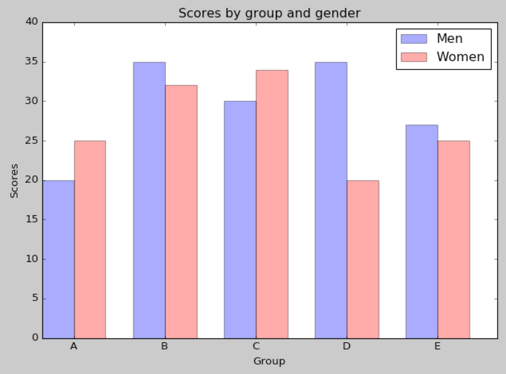

假如你采集了大量数据，并且对数据进行了分析、统计，最终产生的结果要如何体现出来？写长篇大论的文章？这样好枯燥！所以最好是将数据分析的结果使用图表来将其可视化，任何一个人都可以一目了然的通过图表获取你要表达的结论！

饼状图、柱状图、条形图等基本的图表其实在高中数学中就已经很详细的介绍了，只是当时纯粹是为了教学演示，所处理的数据很少，图表也都只是用纸和笔来绘制。而在Python中有强大的matplotlib包，可以通过编程来绘制图表，在处理大批量数据分析的时候有明显的好处！

[《Python数据科学基础：用Numpy、matplotlib、pandas包简单分析数据》](http://www.xumenger.com/python-data-science-02-20170109/)讲到的干货太少，只是一个了解，本文计划使用matplotlib将各种常见的图表形式绘制出来以展示matplotlib的用法

另外关于matplotlib包，推荐以下资料：

* [《matplotlib简介》](http://www.cnblogs.com/vamei/archive/2012/09/17/2689798.html)
* [《matplotlib Basemap简介》](http://www.cnblogs.com/vamei/archive/2012/09/16/2687954.html)
* [《matplotlib核心剖析》 ](http://www.cnblogs.com/vamei/archive/2013/01/30/2879700.html)
* [《matplotlib-绘制精美的图表》](http://old.sebug.net/paper/books/scipydoc/matplotlib_intro.html)
* [《官方手册》](http://matplotlib.org/contents.html)有更详细的使用说明

##柱状图

核心代码`matplotlib.pyplot.bar(left, height, width=0.8, bottom=None, hold=None, **kwargs)`里面重要的参数是左边起点、高度、宽度

比如下面的例子

```
# -*- coding: utf-8 -*-

import numpy as np
import matplotlib.pyplot as plt

count = 5
bar_width = 0.35
opacity = 0.4
men = (20, 35, 30, 35, 27)

fig, ax = plt.subplots()
index = np.arange(count)

rects1 = plt.bar(index, men, bar_width, alpha=opacity, color='b', label='Men')

plt.xlabel('Group')
plt.ylabel('Scores')
plt.title('Scores by group and gender')
plt.xticks(index + bar_width, ('A', 'B', 'C', 'D', 'E'))
plt.ylim(0, 40)
plt.legend()

plt.tight_layout()
plt.show()
```

执行后显示的图形如下


也可以简单修改代码，支持同时以柱状图显示两种可对比的数据

```
# -*- coding: utf-8 -*-

import numpy as np
import matplotlib.pyplot as plt

count = 5
bar_width = 0.35
opacity = 0.4
men = (20, 35, 30, 35, 27)
women = (25, 32, 34, 20, 25)

fig, ax = plt.subplots()
index = np.arange(count)

rects1 = plt.bar(index, men, bar_width, alpha=opacity, color='b', label='Men')
rects2 = plt.bar(index + bar_width, women, bar_width, alpha=opacity, color='r', label='Women')

plt.xlabel('Group')
plt.ylabel('Scores')
plt.title('Scores by group and gender')
plt.xticks(index + bar_width, ('A', 'B', 'C', 'D', 'E'))
plt.ylim(0, 40)
plt.legend()

plt.tight_layout()
plt.show()
```

运行后显示的图形如下



