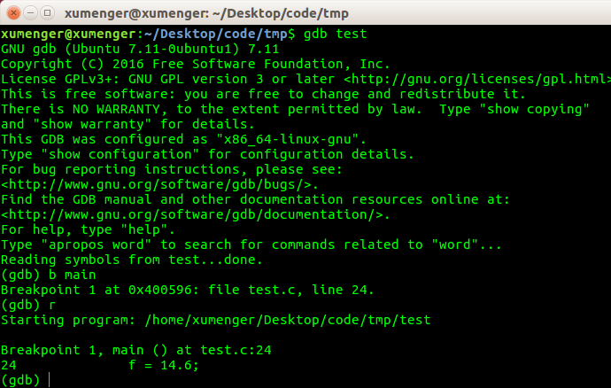
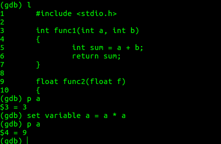
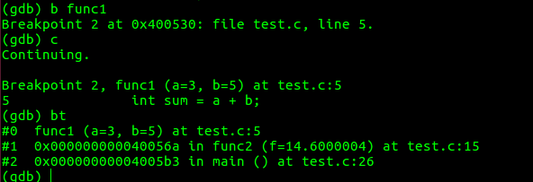
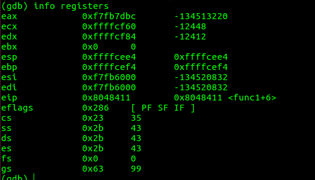
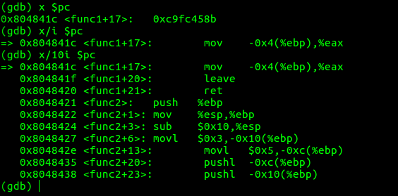
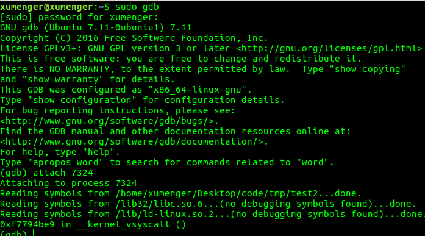
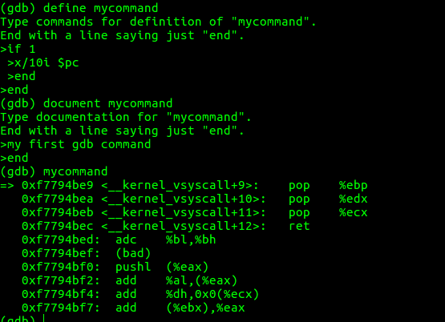

Windows上对调试功能有强大的支持，比如WinDbg、OllyDbg都是很强大的调试工具。在[《汇编与逆向基础：使用IDA和OllyDbg分析C函数调用》](http://www.xumenger.com/c-assembly-ollydbg-ida-20161216/)、[《WinDbg小试牛刀》](http://www.xumenger.com/windbg-20170214/)、[《用WinDbg调试分析进程》](http://www.xumenger.com/windbg-debug-20170217/)这三篇文章中对于OllyDbg、WinDbg的调试逻辑有了很好的讲解，接下来要去探究一下GDB的调试逻辑

GDB是一个纯命令行的调试器！在[《指针和字符串和字符串常量、用gdb来获取非法内存中的内容》](http://www.xumenger.com/pointer-string-const-gdb/)中使用GDB分析了一个小问题；在[《Linux gdb调试器用法全面解析》](http://www.xumenger.com/linux-gdb-debug/)讲到了GDB的一些基础命令；在[《初步了解如何用GDB分析Core文件
》](http://www.xumenger.com/linux-c-cpp-gdb-coredump-20160908/)中有讲到如何在程序出现异常时使用GDB分析Core文件。所以对GDB算是有了一些了解的

>Linux下的GDB、Windows下WinDbg/OllyDbg，可以从调试逻辑、调试命令、等诸多方面对比这学习。Linux、Windows最底层无非就是CPU、内存、汇编这些相同的东西！

##测试程序1

```
#include <stdio.h>

int func1(int a, int b)
{
	int sum = a + b;
	return sum;
}

float func2(float f)
{
	int a, b, s;
	float ret;
	a = 3;
	b = 5;
	s = func1(a, b);

	ret = f - s;
	return ret;
}

int main(void)
{
	float f, ret;
	f = 14.6;

	ret = func2(f);
	printf("%f\n", ret);

	return 0;
}
```

接着执行命令`gcc -m32 -g test.c -o test`编译该C程序

加-g参数，是因为要在编译的时候将符号表信息包括在内，这样调试器才能根据符号表进行友好的调试

加-m32参数，是为了在64位平台下编译得到32位程序，因为接下来要针对32位程序研究调试汇编、CPU相关的知识点

##控制被调试程序

[gdb test]，使用gdb命令直接启动进程，然后在main函数入口设置断点[b main]，继续执行[run]命令将程序跑起来并且会在第一个断点处停止



设置断点(break/b)、条件断点(break 断点 if 条件)、单步(next/n、step/s)、继续运行(continue/c)、运行程序直到当前函数完成返回(finish)、断点管理(info break、delete、disable、enable)、显示变量(print/p)等基础的调试手法在[《Linux gdb调试器用法全面解析》](http://www.xumenger.com/linux-gdb-debug/)中已经很详细的讲了，这里就不说了

##查看和修改变量的值

[p a]查看变量a的值，[set variable a = a \* a]将a的值进行修改



##栈帧和寄存器

[b func1]在func1处下断点，[c]继续运行到func1处的断点，执行[backtrace/bt]可以显示栈帧



从下到上依次显示最先到最近调用的函数，看起来和WinDbg的[kv]命令是相同的作用

执行[info registers]查看寄存器信息



eax、ecx等都是32位下的寄存器名称。其、

还可以使用[print $eax]这样格式的命令查看寄存器的内容，就像查看变量名一样


默认显示的是十进制的值，还可以用[p/x ..]以16进制格式显示寄存器值或变量值、[p/d ..]以10进制格式、[p/u ..]以无符号十进制格式、[p/o ..]8进制、[p/t ..]二进制、[p/a ..]地址格式、[p/c ..]字符格式、[p/f ..]浮点小数、[p/s ..]显示为字符串、[p/i ..]显示为机器语言

其中eip或称之为pc是程序指针寄存器，在[《WinDbg小试牛刀》](http://www.xumenger.com/windbg-20170214/)中有讲到通过修改eip寄存器的值改变程序调用的函数，eip寄存器就是存储执行接下来执行的指令！


程序在func1处的断点处停止，执行[p $eip]可以看到接下来执行的指令地址是0x8048411，在func1函数地址往后偏移6个字节的地方；执行[n]往下单步一次，再[p $eip]输出接下来执行的指令地址是0x804841c，在func1函数地址往后偏移17个字节的地方

##反汇编

还可以使用[x 地址]命令查看内存中的内容

[x $pc]查看pc寄存器指向的内存处的值，[x/i $pc]显示汇编指令，[x/10i $pc]显示pc所指地址开始的10条指令



也有对应的反汇编命令[disassemble/disas]

* [disas]反汇编当前整个函数
* [disas $pc]反汇编程序计数器所在函数的整个函数


##转储文件

在gdb调试下可以执行[generate-core-file]可以生成转储文件


有了内核转储文件和调试对象，以后就能查看生成转储文件当时进程的运行历史（寄存器值、内存值等）

另外还有[gcore]命令可以不依赖与GDB，直接从命令行生成内核转储文件，和Windows下的prcodump很类似，该命令无须停止正在运行的程序以获得内核转储文件，当需要在其他机器上单独分析问题原因，或是分析客户现场发生的问题时十分有效

##测试程序2

```
#include <stdio.h>
#include <unistd.h>

int func1(int a, int b)
{
	int sum = a + b;
	return sum;
}

float func2(float f)
{
	int a, b, s;
	float ret;
	a = 3;
	b = 5;
	s = func1(a, b);

	ret = f - s;
	return ret;
}

int main(void)
{
	float f, ret;
	f = 14.6;

	ret = func2(f);
	//加个死循环，让该进程一直运行
	while(1){
		usleep(10);
	}
	printf("%f\n", ret);

	return 0;
}
```

`gcc -m32 -g test2.c -o test2`编译该程序，`./test2`启动程序，因为有一个死循环，所以该进程会一直运行

##GDB调试已经启动的进程

和WinDbg一样，GDB也可以调试已经启动的进程！一般程序无法退出，或者界面卡死无非就是死循环、死锁、阻塞这些原因，Attach到进程上之后就可以针对性的调试和分析了

启动了test2之后，再开启一个新的终端，`ps aux|grep test2`，可以看到test2进程的进程ID是7324


`sudo gdb`启动GDB，否则可能在attach时没有权限。执行[attach 7324]即可Attach到该进程上，然后就可以对其进行调试了



然后就可以继续使用上面介绍的查看变量值、断点、查看栈帧等基础的命令对其进行调试了。比如查看进程此时的栈帧信息


##GDB更多功能

**初始化文件和命令文件**

Linuxh环境下的初始文件为.gdbinit。如果存在.gdbinit文件，GDB就会在启动之前将其作为命令文件运行。初始化文件和命令文件的运行顺序如下

1. $HOME/.gdbinit
2. 运行命令行选项
3. ./.gdbinit
4. 通过-X选项给出的命令文件

初始化文件的语法和命令文件的语法相同，都是由GDB命令组成

**自定义命令**

利用[define]可以自定义命令，还可以使用[document]给自动义命令说明，[help 命令名]查看命令的定义



可以看到，GDB也支持if这种简单的逻辑语句，可以看作是一种轻量级的脚本语言

其实WinDbg也有类似的支持的

