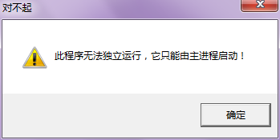
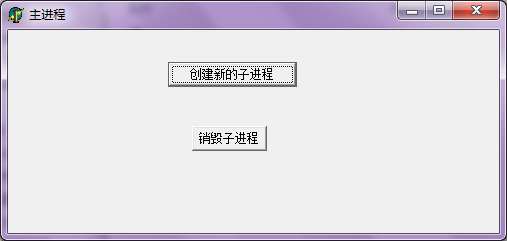
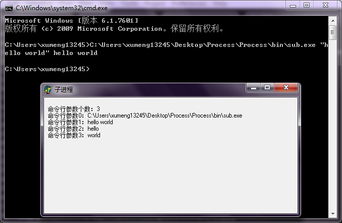

[《Linux开发简单多进程应用》](http://www.xumenger.com/linux-process-20170210/)中讲到Linux下多进程编程很简单，调用fork()就能创建一个新的进程，然后可以选择使用管道、共享内存、Socket等方式实现进程间的通信；[《Python2简单并发编程》](http://www.xumenger.com/python2-20170205/)中讲到Python下的多进程编程也是很简单的，multiprocessing已经将多进程封装好了，使用起来在接口层面其实和多线程threading模块是类似的，另外多进程间的通信使用multiprocessing.Queue可以很简单的实现

那Windows下使用WinAPI开发多进程应用是不是也这么方便呢？

之前在[《实例展示Delphi共享内存的使用》](http://www.xumenger.com/windows-delphi-sharemem-ipc-20160507/)、[《实例展示Delphi共享内存的使用【续】》](http://www.xumenger.com/windows-delphi-sharemem-ipc-20160511/)展示了Windows下多进程通过共享内存进行通信；[《Delphi：进程频繁给自己发消息导致进程卡死》](http://www.xumenger.com/delphi-message-1-20160521/)、[《Delphi：进程A给进程B频繁发生消息导致进程B卡死》](http://www.xumenger.com/delphi-message-2-20160521/)则讲解了使用消息来在多进程之间传递消息；单进程多线程的程序可以使用轻量级的锁临界区来实现线程的同步以保护线程间的共享数据，要实现多进程的同步，则可能需要可以跨进程的锁，比如[《Delphi通过互斥量控制进程启动》](http://www.xumenger.com/delphi-mutex-01-20160121/)、[《Delphi通过互斥量控制跨进程的多线程》](http://www.xumenger.com/delphi-mutex-02-20160121/)介绍的互斥量就可以满足这个要求

接下来不再针对进程间的通信、同步进行过多的讲解，简单的讲解一下如何创建多进程

>Windows下并发编程建议尽量使用多线程，而不要多进程，除非一个特殊的需求场景或者一些躲不开的限制。扩展阅读[《多进程跟多线程如何取舍，在不同系统，不同场景下？》](https://www.zhihu.com/question/48153562/answer/109506150)

##Windows进程相关API

创建进程

```
BOOL CreateProcess(
			PCTSTR psApplicationName, 			//可执行文件的名字
			PTSTR pszCommandLine, 				//命令行字符串
			PSECURITY_ATTRIBUTES psaProcess,   	//进程对象的安全性
			PSECURITY_ATTRIBUTES psaThread,   	//线程对象的安全性
			BOOL bInheritHandles, 				//句柄可继承性
			DWORD fdwCreate,   					//标识符(优先级)
			PVOID pvEnvironment, 				//指向环境字符串
			PCTSTR pszCurDir,   				//子进程当前目录
			PSTARTUPINFO psiStartInfo,
			PPROCESS_INFORMATION ppiProcInfo);  //进程线程句柄及ID，当返回值用
```

打开进程

```
HANDLE OpenProcess(
			DWORD dwDesiredAccess, 	//访问安全属性
			BOOL bInheritHandle, 	//继承属性
			DWORD hProcessId);   	//进程ID
```

进程自己终止自己

```
VOID ExitProcess(
			UINT fuExitCode); 		//退出代码
```

终止自身进程或其他进程

```
BOOL TerminateProcess(
			HANDLE hProcess, 		//进程句柄
			UINT fuExitCode); 		//退出代码
```

更多API参见[《Windows多进程编程》](http://blog.csdn.net/bxhj3014/article/details/2082255)，[MSDN](https://msdn.microsoft.com/zh-cn/default.aspx)

##主进程代码

```
unit MainForm;

interface

uses
  Windows, Messages, SysUtils, Variants, Classes, Graphics, Controls, Forms,
  Dialogs, StdCtrls;

type
  TForm1 = class(TForm)
    lblParam: TLabel;
    procedure FormCreate(Sender: TObject);
  private
    { Private declarations }
  public
    { Public declarations }
  end;

var
  Form1: TForm1;
  ParamMsg: string;
  i: Integer;

implementation

{$R *.dfm}

procedure TForm1.FormCreate(Sender: TObject);
begin
  lblParam.Caption := ParamMsg;
end;

initialization

  //根据传入的命令行参数个数判断其是由主进程启动的还是用户点击启动的
  if ParamCount < 2 then
  begin
    Application.MessageBox('此程序无法独立运行，它只能由主进程启动！', '对不起', MB_OK + MB_ICONWARNING + MB_TOPMOST);
    Application.Terminate;
    Exit;
  end;

  ParamMsg := '命令行参数个数：' + IntToStr(ParamCount);
  for i:=0 to ParamCount do
  begin
    ParamMsg := ParamMsg + #13#10 + '命令行参数' + IntToStr(i) + '：' + ParamStr(i);
  end;

end.
```

##运行效果展示

>以上代码可以点击[这里](../download/20170303/Process.zip)下载

直接双击打开子进程可以看到报错



打开主进程的界面如下



点击【创建新的子进程】，如下，可以看到成功创建了子进程


这里针对进程间的命令行参数做一下说明，在Linux下我们常用Shell执行命令，Windows下我们常用cmd执行一些命令


比如上面，ping命令本身就是ParamStr(0)，第0个参数；后面的127.0.0.1就是第一个参数

不过使用ParamCount获取的命令行参数个数不包括命令名本身，对应上面的子进程就是可执行文件名。参数是字符串格式，用空格分开，如果参数本身包含空格，则需要用双引号将其包起来

针对这个子进程我们也可以直接在cmd中传入多个参数来启动它


