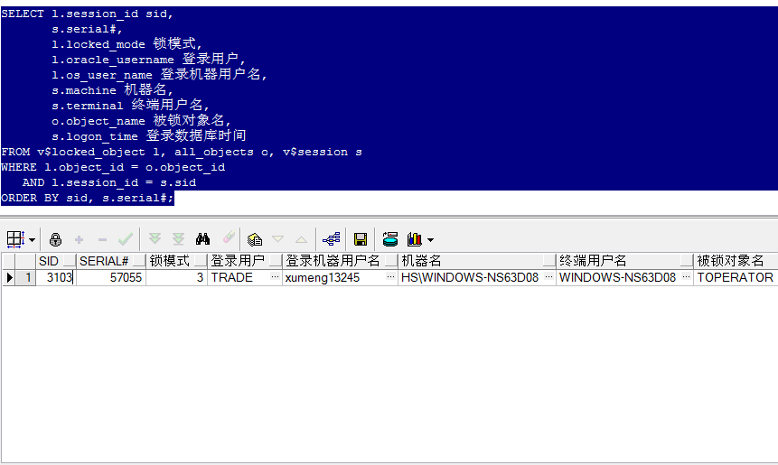
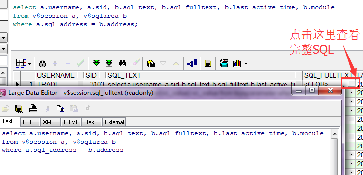
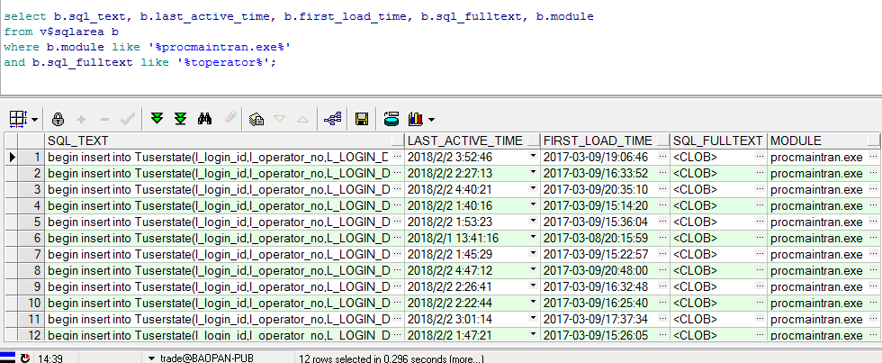

## 查看Oracle当前被锁的对象

比如执行下面的语句将toperator进行加锁

```
select * from toperator t for update;
```

然后执行下面的SQL查看当前被锁的对象

```
SELECT l.session_id sid,
       s.serial#,
       l.locked_mode 锁模式,
       l.oracle_username 登录用户,
       l.os_user_name 登录机器用户名,
       s.machine 机器名,
       s.terminal 终端用户名,
       o.object_name 被锁对象名,
       s.logon_time 登录数据库时间
FROM v$locked_object l, all_objects o, v$session s
WHERE l.object_id = o.object_id
   AND l.session_id = s.sid
ORDER BY sid, s.serial#;
```



## 查看Oracle正在执行的SQL

```
select a.username, a.sid, b.sql_text, b.sql_fulltext, b.last_active_time, b.module
from v$session a, v$sqlarea b
where a.sql_address = b.address;
```

输出如下


可以看到这条SQL本身因为也正在执行，所以也在其中显示，另外last_active_time显示最近一次执行的时间，这里因为Oracle的日期时间配置的有问题，所以虽然现在日期为2017-03-09，但显示为2018-02-02，不过每次重新执行这条SQL，可以看到其last_active_time的时间是对应更新的。module显示是在哪个进程中执行的这个SQL，可以看到其是在PL/SQL Developer中执行的

另外还可以通过sql_fulltext查看完整的SQL



## 查看Oracle执行过的SQL

```
select b.sql_text, b.last_active_time, b.first_load_time, b.sql_fulltext
from v$sqlarea b
where b.module like '%EXE名称%'
and b.sql_fulltext like '%部分SQL%';
```

用于查某个特定进程执行的SQL

比如我想查看进程名为procmaintran.exe执行包含toperator表的SQL的历史信息

```
select b.sql_text, b.last_active_time, b.first_load_time, b.sql_fulltext, b.module
from v$sqlarea b
where b.module like '%procmaintran.exe%'
and b.sql_fulltext like '%toperator%';
```

可以看到输出结果



这个方法可以查看在PLSQL中执行的SQL、可以查看Delphi中拼接的普通SQL、也可以查看proc程序中的SQL等，对于排查SQL相关的问题还是很有帮助的

只不过proc中的SQL会比较特殊，大概的格式如下（其中:b0、:b1表示proc中定义使用的变量）

```
select t.name, t.age 
into :b0, :b1 
from userinfo t 
where t.age > :b2
```

如果要在PLSQL中执行看结果需要对其进行简单的修改，替换其中的变量，变成标准的普通SQL，然后再去执行。比如上面的SQL修改成

```
select t.name, t.age 
from userinfo t 
where t.age > 10
```

## 查看数据库连接数

在[《测试SQL Server的连接数》](http://www.xumenger.com/sqlserver-conn-20160606/)讲到了如何查看SQL Server的连接数

Oracle当然也是可以查看其连接数据的，主要是通过**v$session**

```
select count(*) from v$session t where t.PROGRAM like '进程名'
```

执行上面的SQL可以查看当前某个进程和Oracle建立的连接数，比如下图查看testADO.exe和Oracle的连接数


通过**v$session**还可以获取更多信息，连接的用户等信息

比如执行下面的SQL可以看到所有列信息

```
select * from v$session t where t.PROGRAM like '进程名'
```

