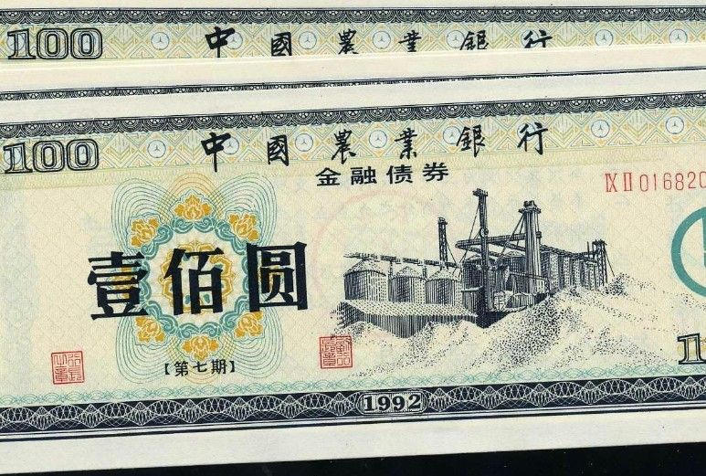

债券本身是一种有价证券、金融契约，是政府、金融机构、工商企业等直接向社会借债筹措资金时，向投资者发行，同时承诺按一定利率支付利息并按约定条件偿还本金的债权债务凭证

所有债券都具有四大基本要素：债券面值、债券价格、债券利率、债券的还本期限与方式

债券，一方面可以长期持有，等到期后获得本金和利息；另一方面也可以在市场上流通买卖，通过低买高卖获取差价收益



##债券面值和价格

债券面值就是债券券面上标明的金额。在国内发行的债券，通常以本国货币计价，若是在国际市场上发行的债券，则通常以发行地所在国家的货币或者国际上通用的货币计价，为了方便记账结算，债券面值通常都是整数

确定债券面值时，需要根据债券的发行对象、市场资金以及债券发行费用等因素综合考虑。面值小时，便于小额投资者购买，分布范围相对广泛，但印刷和发行成本可能较高；面值大时，则利于大额投资者认购，印刷及发行费用等也相应减少

投资者在购买债券时，并不都是按照债券面值进行交易的，关键是要看发行价格，当债券的发行价格高于债券面值时，称为溢价发行，它代表了债券的票面利率高于市场利率，投资者需要以高于债券面值的资金购买；当发行价格等于债券面值时，称为折价发行，它代表了债券的票面利率低于市场利率，发行人为了吸引投资者购买，于是选择降价发行；当发行价格等于债券面值时，就是平价发行。我国的债券多数是以评价发行，少数溢价发行，但不允许折价发行

##债券利率

债券利率又称债息率、票面利率，指债券发行人向购买者承诺支付利息的标准

```
收益 = 本金 * 利率
```

很明显，利率是直接关系到我们的收益的。根据计算方法的不同，利率分为单利和复利两种

* **单利**俗称一次性还本付息，不论期限长短，所生利息均不加入本金重复计算。在我国尤其是国债，主要采用单利方式
* **复利**也称为“利滚利”，每经过一个计息期后，都会将所生利息加入本金，重复计息。美国和加拿大等国家主要采取复利方式

由于债券是可以在市面上流通的，其发行难免会受到市场利率的影响。假如某张面值为100元的债券，其债券利率为6%，当市场利率上升至8%时，投资者选择银行定期存款会比购买债券收益更多，为了吸引投资者，债券发行人可以选择折价发行，以低于面值的价格发行债券；相反，当市场利率跌至5%时，债券利率比市场利率高时，投资者倾向于选择债券，出现债券供不应求的情况，此时发行人可以提高债券的价格，进行溢价发行

##公司债和企业债

公司债是企业发行的债券。企业为筹措长期资金而向一般大众举借款项，承诺于指定到期日向债券人无条件支付票面金额，并于固定期间按期依据约定利率支付利息

我国，企业机构发行的债券有两种：公司债、企业债。公司债的发行人必须是“公司”，即股份有限公司或有限责任公司；而企业债的发行人一般是中央政府部门所属机构，或国有独资企业，或国有控股企业等

在资金使用方面，只要不违反有关规定，公司债筹集的资金如何使用完全由公司决定；而企业债的资金却被限制于固定资产投资和技术改造等方面，并与政府审批项目直接关联

公司债的发行通常实行登记注册制，只要登记材料符合要求便可发行，整个过程由证监会监管；而发行企业债，需经国家发改委报国务院审批。公司债的还款来源是发债公司的经营利润，如果公司经营不善，公司债的持有者将会有损失利息和本金的风险

公司债作为一种有着固定收益的金融工具，拥有众多投资者，因此投资风险被有效的分散，进而增加了金融市场的稳定性；同时发行公司为了履行发行公司债后还本付息的法定义务，也会激励管理层努力工作，优化公司的管理结构，从而对公司产生较强的监督和约束作用

>公司债是公司融资的手段，也为投资者提供了一个较好的理财选择

##公司破产

公司在经营发展的过程中，公司往往会向银行、投资者等借入资金，扩大经营规模，追求更大收益。但当公司无力偿还到期债务、无力继续经营时，会由法院宣布停止营业（也就是破产），然后进行债权债务清理

债务人是指欠钱的公司，债权人是借出钱的机构或个人，按照破产法规定，债权人和债务人都可以向法院提出公司破产申请，而法院会对申请进行审查，例如公司是否已经严重亏损且无力清偿到期债务等

在债权人提出破产申请，法院受理的三个月内，公司可以和债权人达成和解协议，经法院批准后，公司会进入整顿期，以延期偿还债务，如果整顿期结束，公司还未能偿还债务，则由法院执行破产处理，这时就只能破产了。法院会成立清算组，对公司财产进行估价、变卖，在财产分配对象上，清算组会按照职工、国家、债权人的顺序依次清偿，当公司清偿完职工与国家，不足以清偿多个债权人时，剩余资金则会按照一定的比例分配给债权人

##国债

国债，又称为国家公债，是由中央政府为筹集资金而发行的一种债券（国家以其信用作为保障），承诺在一定时期内偿还本金、支付利息。可以理解为中央政府开出的借据，其发行量大，品种多，是债券市场上最主要的融资和投资工具

投资者可以通过银行或证券交易所购买国债

可供选择的品种一般有记账式国债和凭证式国债。其中，记账式国债是电子式国债，实行无纸化发行，通过电脑系统记录债券；而凭证式国债则需要填写纸质收款凭证

>购买国债的利息收入是免费的

##美国国债

截至2016年5月底，中国已持有美国国债1.244万亿美元，相当于83艘最新型的美国航空母舰。之所以持有如此多的美国国债，主要是将其当作重要的外汇储备

##应计利息

应计利息是指上一利息支付日至买卖结算日产生的利息收入

债券收益的很大一部分来自利息，利息的多少很明显与持有时间密切相关，如果投资者一直持有债券，在债券到期日自然能获得全部利息，可如果投资者因一时资金紧张，或不看好后市行情，将债券转手他人，那么此时，买方还需支付卖方在持有债券期间应得的利息，也就是应计利息

以每年付息一次的附息债券为例，假定其每天产生的利息是1元，原本一年到期后，应该获得365元的利息。可如果投资者在持有半年后就转手交易，那么应计利息就是182.5元，这样，买方最终还需额外支付182.5元给卖方。对投资者来说，应计利息既是卖方收益的一部分，也是买方不可忽略的成本，当债券的成交价格保持不变时，应计利息增多债券的结算价格也会随之上升，投资者所获收益或花费成本也会增加

>这当然也可以理解的，虽然我把债券卖了，但毕竟之前我也持有这么久了，利息不能就这么算了，这期间的收益还应该是我的呀！

具体而言，零息债券是指发行起息日至交割日所含利息金额；附息债券是指本付息期起息日至交割日所含利息金额；贴现债券也可以计算其隐含的票面利率

##净价交易

净价交易是指以不含应计利息的方式进行报价的交易方式。所谓净价，指交易系统显示的债券价格，是摒除了应计利息而显示出来的一个报价

我国实行净价交易的债券品种，主要包括了在交易所挂牌上市的国债、公司债、企业债以及部分可转换公司债等。在现券买卖中，交易双方在交易系统上对债券实行净价报价，达成一致后再办理债券的转让和资金的交收

不过净价交易仅指报价，结算还是以全价计算，投资者需要在净价上加上应计利息，全价付款给卖方方可获得债券的所有权

目前，净价交易是国际间交易常用的报价惯例。实行与国际统一的报价方式，将有利于我国债券市场的发展，便于与国际市场接轨。此外，债券净价的形成及变动也有助于体现债券的内在价值、供求关系及市场利率的变动趋势

净价交易的成交价格是受到市场利率直接影响的，一般来说，当市场利率低于票面利率时，报价会高于债券面值，通过债券价格的变化，投资者可以及时把握市场利率的波动情况，并以此为依据判断投资方向、衡量投资价值

##浮息债券

浮息债券是由固定中长期资金需要的公司发行的一般融资工具，其券面利率紧随市场利率定期浮动的债券。具体来说，浮息债券的利率通常是以某一利率为参考，加上一定的利差来确定

我国发行的浮息债券主要以一年期定期存款利率或上海银行间同行拆借利率等为参照，比如某只浮息债券，规定利率以一年期定期存款利率为参考，利差为1.80%，假设一年期定期存款利率为1.50%，该债券的利率就是3.30%，发行人以此为依据计算应付的利息。浮息债券每年至少付息一次，利率根据付息日所参考利率的具体数值进行调整

因为其利率是实时变动的，所以在购买的时候并无法预期到期后的收益。如果预计市场利率上涨，那么购买浮息债券，其利率会随着市场而上涨，是比较好的能稳定获益的投资方式

##零息债券

零息债券，以低于自身面值的价格进行发行（以贴现方式发行），不附息票（没有标明利率和付息期限等信息的息票），而于到期日按面值进行一次性支付本利的债券

而且发行人也不会在债务期间支付利息，也不允许提前赎回债券

```
零息债券收益 = 面值 - 发行价格
```

##定息债券

定息债券，又称固定利率债券。是一种票面息率固定的债券，债券的票面息率是固定的，直至期满，期间不会因为市场上任何的波动而有所变化。所以定息债券的收益是可以预先计算得到的

对于债券发行人来说，若未来市场利率下降，可以用更低的利率发行债券，那么原先的债券成本就显得相对高昂，若未来市场利率上涨，新发行债券的成本增加，那么原先的发行成本就显得较低；对于债券投资者，假如市场利率上涨，那么投资定息债券相当于收益缩水，一般来所，预计未来市场利率下降时，投资定息债券是一个比较好的选择

##附息债券

附息债券是指在债券券面上附有息票（标有利息额、付利息的期限和债券号码等内容）的债券，或按照债券票面载明的利率及支付方式支付利息的债券

>息票：早期的附息债券附有息票，息票是纸质债券票面的一部分，上面标有利息额、付利息的期限和债券号码等内容，债券持有人可以从债券上剪下息票，在规定的付息日以此为凭证领取利息。虽然现在发行的债券多采用电子形式，原本意义上的息票已经不复存在，但是附息债券按照一定的利率和支付期限定期支付利息的本质并没有因此改变

附息债券在发行的时候就明确了债券利率、付息频率和付息日等信息。一般来说，附息债券是长期债券，一般在5年以上，在发行期内，发行人会按照债券利率每季度、每半年或每年定期支付利息给持有人，在债券到期后向持有人支付最后一次利息，并将本金还回

##可转换债券

可转换债券是债券的一种，由上市公司发行，在一定条件下可以转换为债券发行公司的股票，通常具有较低的票面利率

可转债兼有债券和股票的特征。首先，可转债是一种公司债券，发行时的面值为100元，期限一般为5年，票面利率通常比市场利率低，投资者持有债券可以定期获取利息；其次，在债券发行的6个月后，投资者能够按照约定的价格，将可转债转换为该上市公司的股票，由公司的债权人变成公司的股东，参与公司决策，享受利润分红

对上市公司而言，使用可转债可以使用较低的利率获取资金，融资成本相对较低，假如投资者选择把债券转换成股票，公司可以不必再支付债券利息以及返还本金，相当于更进一步降低了融资成本

对于投资者而言，可转债具有投资和避险的双重功能，当公司业绩上涨，股价上扬时，可转债价格也会随股价上涨，投资者直接卖出债券，或者将其转换为股票都可以赚取利益；而当市场低迷时，投资者也可以一直持有获得利息收入

##债务抵押债券

债务抵押债券，是一种信用衍生品。它是一种新兴的投资组合，以一个或多个类别且分散化的抵押债务信用为基础，重新分割投资回报和风险，以满足不同风险偏好者投资的需要

比如，某人因买方向银行按揭贷款，银行每年收取他一定的利息和本金，但要几十年才能收完，期间还可能遭受违约的风险，于是一些银行就会把贷款卖给中间机构SPV。SPV将收购来的贷款汇集成一个资产池，并以资产池中的贷款收益为基础发行债券卖给投资者。这样一来，银行不仅迅速回笼了资金，也将风险转嫁到了投资者身上

债务抵押债券使得原来不能进入市场的产品进入市场（比如贷款），增加了资金的流动性，在金融市场中扮演了重要的角色。但同时，债务抵押债券的风险管理非常复杂和困难，就像一个链条，如果其中一环出现违约，就会产生多米诺骨牌效应

>其巨大的影响力让它成为了2007年美国次贷危机的罪魁祸首

##信用风险和债券信用评级

信用风险又称违约风险，是指借款人未能履行约定契约中的义务而造成经济损失的风险，即受信人不能履行还本付息的责任而使授信人的预期收益与实际收益发生偏差的可能性，它是金融风险的主要类型


债券信用评级是以企业或经济主体发行的有价债券为对象进行的信用评级。1909年，美国人约翰·穆迪开创了信用评级的先河，对当时发行的铁路债券进行评级，后来信用评级也应用到其它金融产品

目前我国针对债券进行信用评级的机构分别有：中诚信、大公国际、上海新世纪、联合资信等，它们通常会从债券发行单位的偿债能力、能否按期付息、发行的费用、投资人承担的风险程度四个方面评估企业的风险系数，并对该债券的信用定级。投资者可以通过证券交易所的网站，查看各企业债券的评级情况

我国规定，企业在发行债券前，都必须向相关机构申请信用评级

证券交易市场上，信用是需要着重考虑的因素，在进行交易之前，充分了解证券的信用情况有利于对于风险有个全面的把控

##无货沽空

无货沽空又叫裸卖空，是指投资者在交易市场上出售或声称出售自己并不持有的商品或资产，并希望在将来以较低的价格买入同等数量的同种商品或资产的投机行为

假如现在的金价是350元/g，某个人预计金价将降低到300元/g，于是他可以在不持有黄金的情况下，和其他人约定在1个月以后以350元/g的价格出售黄金，如果到时候金价如愿下跌，就可以在一个月后自己用300元/g的价格从市场上买入黄金，再以350元/g的价格卖出，如此就可以赚取差价；但是如果一个月后价格上涨了，那就……

无货沽空与做空有着本质的区别。以期货为例，市场中卖出期货合约和买入期货合约总是一一对应的，做空者不能单方面创造新的合约，而且期货是保证金交易，只有交付足够的保证金才能进行。而无货沽空就像一种赌博，赌的就是价格下跌

>在中国，无货沽空被完全禁止；美国在2008年金融危机后，由美国证券交易委员会宣布永久禁止无货沽空

