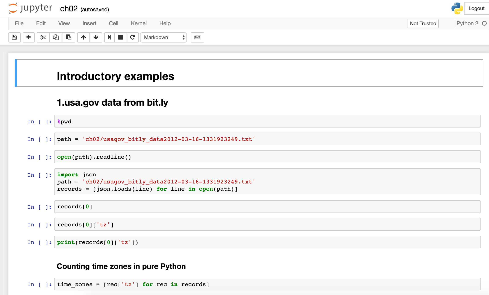
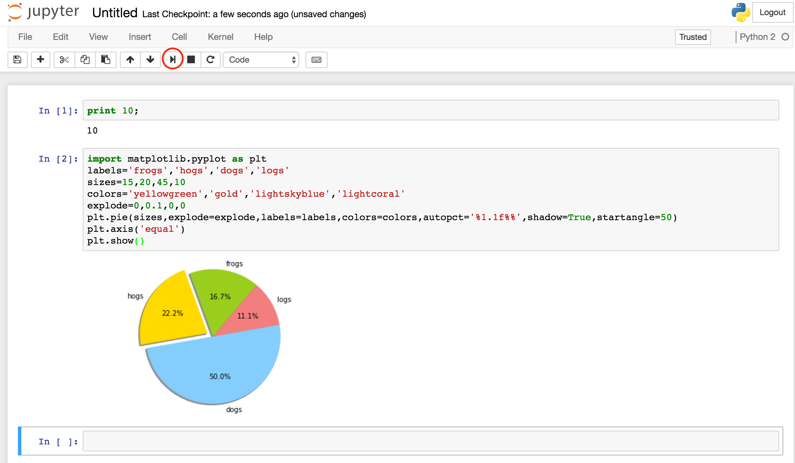

## IPython Notebook简介

IPython Notebook是web based IPython封装，可以展示富文本，使得整个工作可以以笔记的形式展示、存储，对于交互编程、学习非常方便

IPython Notebook的设计目的是让数据分析更容易分享和再生，目前用它来给科研做详细记录、设计教学模型以及与他人合作，其科学家用户越来越多

数据科学家面临一个棘手的问题：他们很难详细地分享自己的原始代码，或对其进行便于理解的描述，让其他人在他们研究的基础上有所扩展。其原因部分是由于很多涉及到大量计算的研究领域的科研人员都是以重复和零碎的方式写代码，因为每次分析都会出现新发现，丢弃掉研究中的多重思路

记录产生各种数据的每个不同版本的代码并把那些文件和注释笔记相结合，是个令人头疼的问题。而发表后的成果对于跟进该研究的读者来说往往不够详细。IPython笔记本通过帮助科学家记录他们的工作，使这些资料更容易分享，并让其他人了解其代码解决了上述哪些问题。应用程序名称IPython中的“I”代表帮助用户运行代码、访问变量、总结数据分析包裹以及了解研究过程的“交互式”命令窗口，而“Python”则指的是作为笔记本程序基础的通用计算机程序语言

## 安装IPython Notebook

我选择在虚拟环境下安装，关于虚拟环境可以参见[《搭建Python虚拟环境》](http://www.xumenger.com/python-environment-20160801/)。然后分别执行

```
pip install ipython
pip install "ipython[notebook]"
```

如果安装出现超时，说明pip的源有问题，可以更换源，在Linux/Mac环境下，建个文件 ~/.pip/pip.conf，写入如下内容，然后重新执行`pip install`即可

```
[global]  
  
timeout =6000  
  
index-url =http://pypi.douban.com/simple/  
  
[install]  
  
use-mirrors =true  
  
mirrors =http://pypi.douban.com/simple/  
  
trusted-host =pypi.douban.com 
```

## IPython Notebook使用方法

IPython Notebook使用浏览器作为界面，向后台的IPython服务器发送请求，并显示结果，在浏览器的界面中使用单元（Cell）保存各种类型。Cell有多种类型，经常使用的有表示格式化文本的Markdown单元，和表示代码的Code单元

每个代码单元都有一个输出区域，在Code单元中输入代码，按`Shift+Enter`将运行此代码，代码中最后一个表达式的值在输出区域显示。如果希望屏蔽输出，可以在最后一条语句之后添加一个分号`;`。此外，代码中还可以使用print语句在输出区域中显示信息

打开命令行，切换到某个目录下，输入`ipython notebook`。它会启动服务器，并输出类似如下信息

```
(_LAB) xumengerdeMacBook-Pro:Laboratory xumenger$ ipython notebook
[TerminalIPythonApp] WARNING | Subcommand `ipython notebook` is deprecated and will be removed in future versions.
[TerminalIPythonApp] WARNING | You likely want to use `jupyter notebook` in the future
[I 00:38:02.297 NotebookApp] Writing notebook server cookie secret to /Users/xumenger/Library/Jupyter/runtime/notebook_cookie_secret
[I 00:38:02.327 NotebookApp] Serving notebooks from local directory: /Users/xumenger/Desktop/code/Laboratory
[I 00:38:02.327 NotebookApp] 0 active kernels 
[I 00:38:02.327 NotebookApp] The Jupyter Notebook is running at: http://localhost:8888/?token=d0e2227d4dd8ca2724716b00a1caf8cf1847764f86ccbf33
[I 00:38:02.327 NotebookApp] Use Control-C to stop this server and shut down all kernels (twice to skip confirmation).
[C 00:38:02.328 NotebookApp] 
    
    Copy/paste this URL into your browser when you connect for the first time,
    to login with a token:
        http://localhost:8888/?token=d0e2227d4dd8ca2724716b00a1caf8cf1847764f86ccbf33
0:97: execution error: “"http://localhost:8888/tree?token=baf8590833a913c97d32b8f27b3a7fae3b71e8263548f1b6"”不理解“open location”信息。 (-1708)
```

然后在浏览器中输入URL：`http://localhost:8888/tree?token=baf8590833a913c97d32b8f27b3a7fae3b71e8263548f1b6`打开如下页面


可以打开当前目录下的.ipynb文件



如果要新建一个文件的话，点按钮`New->Python 2`就好了


然后可以在这里编码，并查看输出、图形




当然也可以保存和重命名.ipynb文件


>真的是好工具！实时编程练习、调试程序、查看结果的整个过程都完整的记录下来了！这也将自己的整个思考过程都记录下来了！

## 非常赞的技巧

* 可以选择MarkDown，用MarkDown来写说明
* 若在函数、模块、类后面输入`?`，按住`Ctrl+Entry`就回跳出帮助文档。若是两个`??`的话，连源代码都会给出来
* 在网页中输入`%matplotlib inline`将matplotlib库导入，要显示的图片就可以嵌入到网页中了
* 使用`ipython nbconvert [.ipynb文件]`命令生成默认格式(html格式)还可用--to选项转换为指定的格式，如：
	* ipython nbconvert --to latex mynotebook.ipynb
	* ipython nbconvert mynotebook.ipynb --to pdf
	* ipython nbconvert --to html --template basic mynotebook.ipynb
	* ipython nbconvert mynotebook.ipynb --to markdown
* `%load`可以从文件或者网址载入代码到一个新的单元中，例如下面载入某个matplotlib的示例程序，并执行`
%load http://matplotlib.org/mpl_examples/pylab_examples/histogram_demo.py`
* IPython中Magic命令有两种执行方式，以`%`开始的命令被称为行命令，它只对单行有效，以`%%`开头的为单元命令，它放在单元的第一行，对整个单元有效
* `%prun`用于代码的执行性能分析，可以作为行命令和单元命令使用

## 参考资料

* [《一种新软件有望成为科学数据分享新利器》](http://news.sciencenet.cn/htmlnews/2014/11/307201.shtm)
* [《IPython Notebok的使用》](http://www.jianshu.com/p/0b7a834b2c1e)
* [《ipython notebook》](http://www.cnblogs.com/zhuangzhuang1988/archive/2012/11/19/2777195.html)

