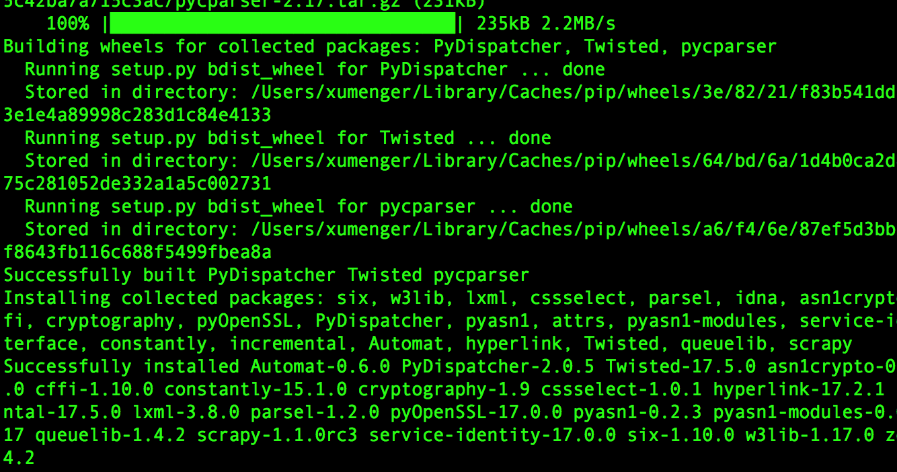

## Mac搭建Python3虚拟环境

之前在[《搭建Python虚拟环境》](http://www.xumenger.com/python-environment-20160801/)、[《Python数据科学基础：Python3基础数据类型》](http://www.xumenger.com/python-data-science-01-20170109/)、[《Python数据科学基础：用Numpy、matplotlib、pandas包简单分析数据》](http://www.xumenger.com/python-data-science-02-20170109/)讲解了如何搭建Python的虚拟环境，但都是针对Python2的，接下来使用Scrapy进行的开发是基于Python3.X的，所以还是先弄一下Python3的虚拟环境

Python、virtualenv的安装不再赘言。直接执行`virtualenv _LAB3 --python=python3`创建一个虚拟环境

然后执行`source _LAB3/bin/activate`进入虚拟环境

## 安装Scrapy

如果直接使用pip安装，那么默认是Python2版本，所以执行`python3 -m pip install ...`来进行Python库的安装

先执行`python3 -m pip install -U pip`将Python3对应的pip版本进行升级

然后执行`python3 -m pip install scrapy==1.1.0rc3`安装对应版本的Scrapy

然后执行`scrapy startproject testScrapy`创建一个爬虫项目成功，说明Scrapy安装成功

## 编写一个简单的小爬虫

上面的步骤中已经创建了一个testScrapy爬虫项目，接下来就继续这个项目，爬取我的个人网站[www.xumenge.com](www.xumenge.com)来展示Scrapy的用法

