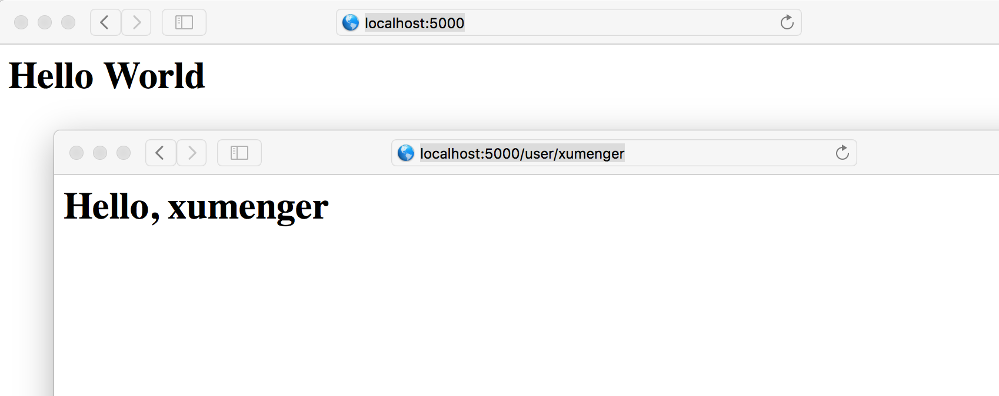

之前整理过[《Python使用web.py进行简单Web开发》](http://www.xumenger.com/python-webpy-20170115/)，本文一方面梳理Flask的用法，同时也会和Web.py的用法进行简单的对比

## 一个最简单的Web应用

关于Python2、Flask环境的搭建这里不赘言，直接虚拟环境、pip就可以了。然后直接上代码，保存在文件first.py中

```
# -*- coding: utf-8 -*-
from flask import Flask
app = Flask(__name__)

# 主页
@app.route('/')
def index():
    return '<h1>Hello World</h1>'

# 用户URL
@app.route('/user/<name>')
def user(name):
    return '<h1>Hello, %s</h1>' % name

if __name__ == '__main__':
    app.run(debug = True)
```

执行`python first.py`


然后在浏览器中可以输入对应的网址进行访问



这里可以看出web.py是使用元组进行路由的，比如

```
# -*- coding: utf-8 -*-
import web

urls = (
	'/(.*)', 'hello'
)

app = web.application(urls, globals())

class hello:
	def GET(self, name):
		#读取index.html中的内容直接返回给客户端
		return open(r'./index.html', 'r').read()
		

if __name__ == '__main__':
	app.run()
```

而Flask是使用装饰器来进行路由的！

## Flask请求应答

Flask从客户端收到请求时，要让视图函数能访问一些对象，这样才能处理请求。请求对象就是一个很好的例子，它封装了客户端发送的HTTP请求。要让视图函数能够访问请求对象，一个显而易见的方式是将其作为参数传给视图函数，不过这会导致程序中的每个视图函数都增加了一个参数。除了访问请求对象，如果视图函数在请求时还要访问其他对象，情况会变得很糟

为了避免大量可有可无的参数把视图函数弄的一团糟，Flask使用`上下文`临时把某些对象变为全局可访问。有了上下文，就可以写出这样的视图函数

```
# -*- coding: utf-8 -*-
from flask import Flask
from flask import request
app = Flask(__name__)

# 主页
@app.route('/')
def index():
    return '客户端请求头部是：' + str(request.headers)

if __name__ == '__main__':
    app.run(debug = True)
```

然后访问`http://localhost:5000`，看到如下输出信息


>事实上，request不可能是全局变量。试想，在多线程服务器中，多个线程同时处理不同客户端发送的不同请求时，每个线程看到的request对象必然不同。Flask使用上下文让特定的变量在一个线程中全局可访问，与此同时却不干扰其他线程

处理request，Flask还有current_app、g、session等其他上下文

## Flask模板引擎


