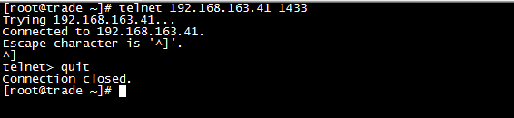
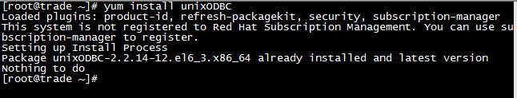
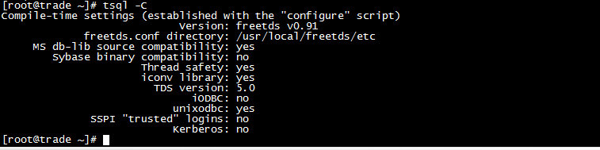
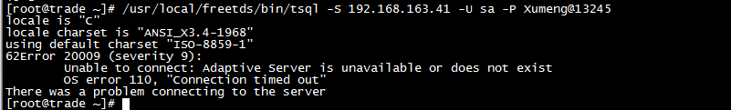
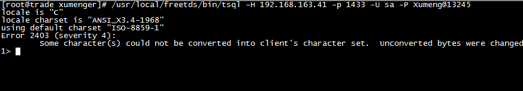
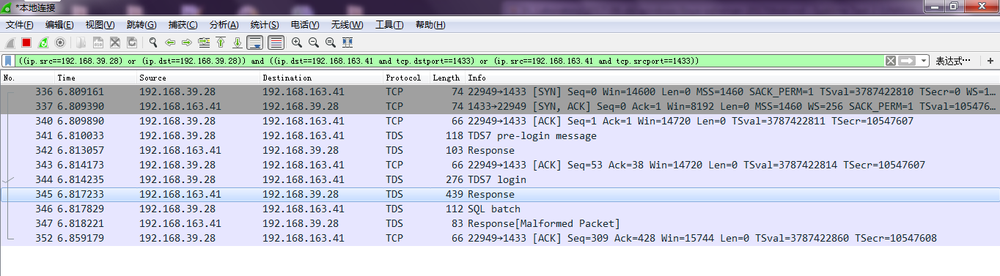
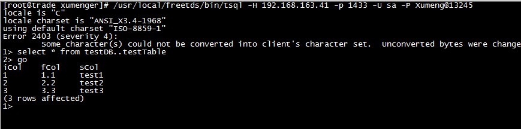
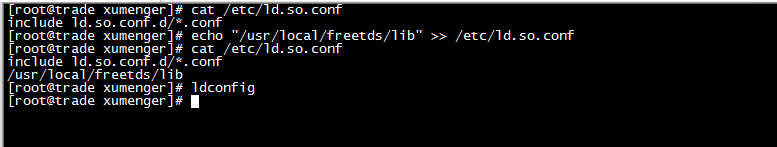
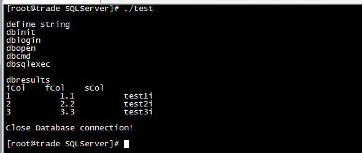

SQL Server没有Linux版本，所以是不可能在Linux上安装SQL Server的，但可以在Linux上通过ODBC连接Windows上的SQL Server

## 测试联通性

>测试环境：Linux-2.6.32 、Red Hat、gcc-4.4.7、freetds-0.91、Windows 7、SQL Server 2008

SQL Server默认的端口是1433，在Linux上执行`telnet 192.168.163.41 1433`测试网络是通的



Linux上为了访问Windows上的SQL Server，首先需要安装必要的软件包：Linux系统的ODBC、连接SQLServer或Sybase的驱动

首先安装ODBC，我的环境上已经安装过了



然后安装freetds，这个软件能够用Linux连接SQL Server。首先在[官网](http://www.freetds.org/software.html)下载软件包。或者点击[这里](http://www.freetds.org/software.html)直接下载

然后执行下面的命令安装freetds

```
# tar vxzf freetds-stable.tgz

# cd freetds-0.91/

# ./configure --prefix=/usr/local/freetds --with-tdsver=8.0 --enable-msdblib
# 如果这步报错configure: error: newly created file is older than distributed files!
# 那么执行比如`date -s 2017-06-29`命令修改系统时间即可
# 否则无法执行下面的make和make install来编译和安装程序

# make

# make install
```

然后对freetds进行配置，配置文件目录为`/usr/local/freetds/etc/freetds.conf`，修改为以下内容：

```
#   $Id: freetds.conf,v 1.12 2007/12/25 06:02:36 jklowden Exp $
#
# This file is installed by FreeTDS if no file by the same 
# name is found in the installation directory.  
#
# For information about the layout of this file and its settings, 
# see the freetds.conf manpage "man freetds.conf".  

# Global settings are overridden by those in a database
# server specific section
[global]
        # TDS protocol version
        tds version = 4.2

        # Whether to write a TDSDUMP file for diagnostic purposes
        # (setting this to /tmp is insecure on a multi-user system)
;       dump file = /tmp/freetds.log
;       debug flags = 0xffff

        # Command and connection timeouts
;       timeout = 10
;       connect timeout = 10

        # If you get out-of-memory errors, it may mean that your client
        # is trying to allocate a huge buffer for a TEXT field.  
        # Try setting 'text size' to a more reasonable limit 
        text size = 64512

# A typical Sybase server
[egServer50]
        host = symachine.domain.com
        port = 5000
        tds version = 5.0

# A typical Microsoft server
[SQLServer2008]
        host = 192.168.163.41
        port = 1433
        tds version = 7.0
        client charset = UTF-8
```

其中的[SQLServer2008]代表在客户端使用的SQL Server服务器名称（在tsql命令中要加入-S SQLServer2008），host代表SQLServer服务器的IP地址，port代表端口，client charset 是客户端使用的字符集， client charset 必需大于或等于服务端数据库使用的字符集

将freetds的库文件所在路径配置到`LD_LIBRARY_PATH`，这样做是为了避免加载FreeTds库文件加载不上的情况

```
export PATH=$PATH:/usr/local/freetds/bin
export LD_LIBRARY_PATH=$LD_LIBRARY_PATH:/usr/local/freetds/lib

source /root/.bashrc
```

输入`tsql -C`查看安装情况



参考[《Linux下通过ODBC连接sqlserver》](http://www.cnblogs.com/yangliheng/p/5778711.html)，执行`/usr/local/freetds/bin/tsql -S 192.168.163.41 -U sa -P Xumeng@13245`，但是报错



执行`/usr/local/freetds/bin/tsql -H 192.168.163.41 -p 1433 -U sa -P Xumeng@13245`就可以成功连接数据库



在Windows上用WireShark抓1433端口的网络包发现在Linux上执行上面的命令的时候，确实有连接进来



然后可以继续输入SQL查看执行结果！如下图，确实查询到SQL Server的testDB..testTable的数据



## 编程实现数据库操作

以上的配置过程路已经通了，下面试着在代码中实现对SQL Server的操作。之前在[《Linux下进行Proc开发》](http://www.xumenger.com/linux-pc-20170516/)演示了对Oracle进行编程的相关语法，这里对Linux下操作SQL Server进行研究

下面的代码简单展示一些语法上的东西

```
#include <stdio.h>
#include <string.h>
#include <stdlib.h>
#include <unistd.h>

//use command `find / -name "*sysbfront.h"` search header file's position
//this header files are used to SQL Server
#include </usr/local/freetds/include/sybfront.h>
#include </usr/local/freetds/include/sybdb.h>

int main(){
  printf("\n");
  printf("define string\n");
  char szUserName[32] = "sa";
  char szPassword[32] = "Xumeng@13245";
  char szServer[32] = "192.168.163.41:1433";

  printf("dbinit\n");
  dbinit();

  printf("dblogin\n");
  LOGINREC* loginrec = dblogin();
  DBSETLUSER(loginrec, szUserName);
  DBSETLPWD(loginrec, szPassword);
  printf("dbopen\n");
  DBPROCESS* dbprocess = dbopen(loginrec, szServer);
  if(FAIL == dbprocess){
    printf("Connect to MS SQL Server Fail, Exit!\n");
    return -1;
  }

  printf("dbcmd\n");
  dbcmd(dbprocess, "select iCol, fCol, sCol from testDB..testTable");
  printf("dbsqlexec\n");
  if(FAIL == dbsqlexec(dbprocess)){
    printf("Query table Error\n");
    return -1;
  }

  DBINT result_code;
  printf("\n");
  printf("dbresults\n");
  while(NO_MORE_RESULTS != (result_code = dbresults(dbprocess))){
    if(SUCCEED == result_code){
      int nColumns = dbnumcols(dbprocess);
      char colValue[nColumns][256];
      int iCol = 0;

      //loop get column
      for(iCol=1; iCol<=nColumns; iCol++){
        char* colName = dbcolname(dbprocess, iCol);
        int colType = dbcoltype(dbprocess, iCol);
        int colSize = dbcollen(dbprocess, iCol);
        if(SYBCHAR != colType)
          colSize = dbwillconvert(colType, SYBCHAR);
        dbbind(dbprocess, iCol, CHARBIND, (DBCHAR)colSize, (BYTE*)colValue[iCol-1]);
        printf("%s\t", colName);
      }
      printf("\n");

      //loop get row
      while(NO_MORE_ROWS != (dbnextrow(dbprocess))){
        for(iCol=1; iCol<=nColumns; iCol++){
          printf("%s\t", colValue[iCol-1]);
        }
        printf("\n");
      }
    }
  }
  
  printf("\n");
  printf("Close Database connection!\n");
  printf("\n");
  dbclose(dbprocess);

  return 0;
}
```

>上面这段代码，对FreeTds的使用其实有很多不规范的地方，规范的用法请参见[FreeTDS API](http://www.freetds.org/reference/)；另外安全性、稳定性方面也都没有考虑得很全面

因为freetds的共享库文件安装到/usr/local/freetds/lib/，需要先将新共享库目录加入到共享库配置文件/etc/ld.so.conf添加一行`/usr/local/freetds/lib/`，然后执行`ldconfig`。`ldconfig`的主要是在默认搜寻目录(/lib和/usr/lib)以及动态库配置文件/etc/ld.so.conf内所列的目录下，搜索出可共享的动态链接库(格式如lib*.so*)，进而创建出动态装入程序(ld.so)所需的连接和缓存文件。缓存文件默认为/etc/ld.so.cache，此文件保存已排好序的动态链接库名字列表



然后执行`gcc test.c -o test -L/usr/local/freetds/lib -lsybdb -I/usr/local/freetds/include`编译程序，然后输入`./test`运行程序



>不过返回的sCol列的值有问题，具体原因是为什么还是需要继续排查定位的

>但到目前为止，如何维护环境的问题已经解决了

## 参考资料

* [FreeTDS官方API文档](http://www.freetds.org/reference/index.html)
* [《linux下的find文件查找命令与grep文件内容查找命令》](http://www.cnblogs.com/huninglei/p/5824205.html)
* [《在Linux上配置Telnet服务》](http://www.cnblogs.com/hyddd/archive/2009/09/19/1570214.html)
* [《退出telnet 命令》](http://blog.csdn.net/beyondlpf/article/details/7546120)
* [《SQL Server数据库的默认端口号》](http://database.51cto.com/art/201006/206353.htm)
* [《Linux下通过ODBC连接sqlserver》](http://www.cnblogs.com/yangliheng/p/5778711.html)
* [《error: newly created file is older than distributed file》](http://blog.sina.com.cn/s/blog_75a07c3b0101kqnr.html)
* [FreeTDS - Unable to connect: Adaptive Server is unavailable or does not exist](https://stackoverflow.com/questions/22991584/freetds-unable-to-connect-adaptive-server-is-unavailable-or-does-not-exist)
* [[freetds] Cannot connect to MS SQL 2008 server from OS X using	FreeTDS](http://lists.ibiblio.org/pipermail/freetds/2012q2/027805.html)
* [《配置SQLServer，允许远程连接》](http://www.cnblogs.com/weizhengLoveMayDay/p/3267756.html)
* [《Linux下使用C/C++访问数据库——SQL Server篇》](http://www.linuxidc.com/Linux/2011-04/35157p2.htm)
* [《linux下利用freetds 访问sqlserver数据库》](http://blog.csdn.net/handsome_wl/article/details/54892977)
* [《unixODBC , freetds , tsql》](http://blog.csdn.net/qdujunjie/article/details/9948635)
* [《Linux下使用FreeTDS访问MS SQL Server 2005数据库(包含C测试源码)》](http://blog.csdn.net/zhangm168/article/details/6859112)
* [《linux下find查找命令用法》](http://www.cnblogs.com/hushaojun/p/4851485.html)
* [《error while loading shared libraries: xxx.so.x"错误的原因和解决办法 》](http://blog.chinaunix.net/uid-26212859-id-3256667.html)
* [《FreeTDS库函数dbbind参数详解》](http://blog.csdn.net/kofiory/article/details/5739831)
* [FreeTDS User Guide](http://www.freetds.org/userguide/)

## 补充说明

```
dbbind(dbprocess, iCol, CHARBIND, (DBCHAR)colSize, (BYTE*)colValue[iCol-1]);
```

获取数据表列值的逻辑还是存在问题

关于FreeTds的用法还需要深入研究，因为是C，所以很涉及到内存方面的管理，出现一个字节的误差就会有问题
