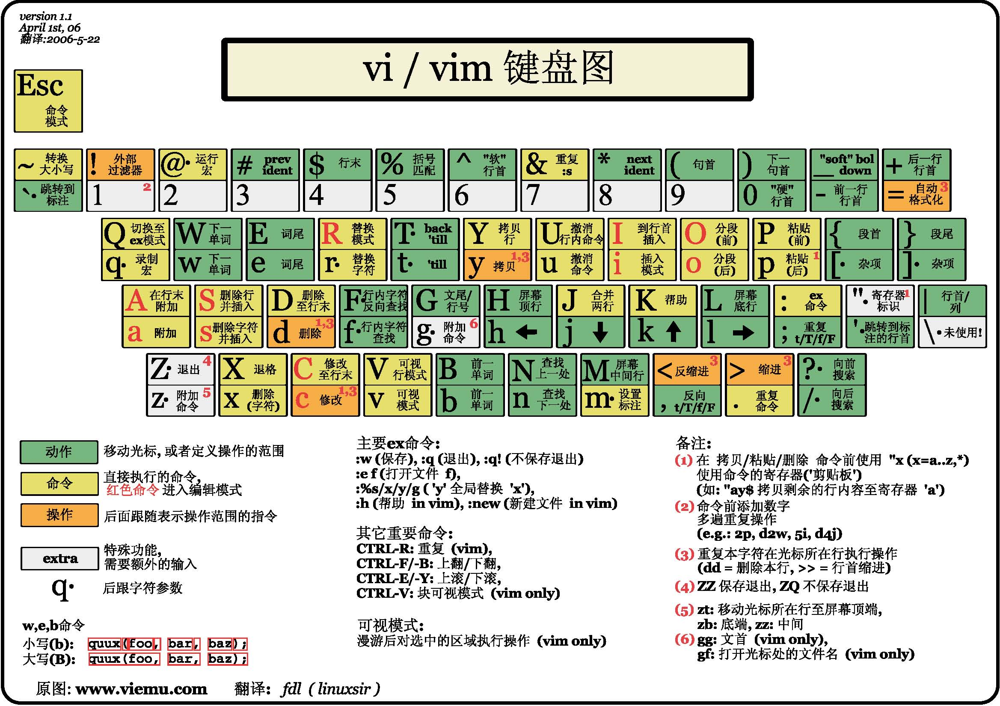

Windows下的UE是很强大的文本编辑器、Total Command是很强大的文件资源管理器。这里介绍Linux平台下的一些好用的工具，不过只整理一些常用的功能，详细的命令参数和更多功能请`man ...`

## vim编辑器

`:open file` 在vim窗口打开一个新文件；`:split file` 在新窗口打开文件

`i` 在当前位置前插入；`I` 在当前行首插入；`a` 在当前位置后插入；`A` 在当前行为插入

`o` 在当前行后插入一行；`O` 在当前行之前插入一行

/text 查找文本中的text字符串，按n查找下一个，按N查找前一个

`gg` 移动到文件头；`G` 移动到文件尾

`u` 撤销；`Ctrl + r` 重做，即撤销的撤销

`dd` 删除当前行；`dj` 删除上一行；`dk` 删除下一行；`D` 删除当前字符至行尾；`:1,10d`删除1-10行

`yy` 拷贝当前行；`3yy` 拷贝当前行以及下2行；`p` 在当前光标后粘贴之前复制的内容，若之前使用yy命令复制一行，那么就在当前行的下一行粘贴

## find

## awk

## sed

## grep