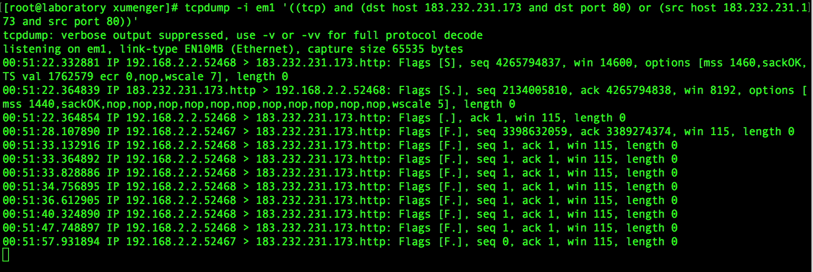

## tcpdump

WireShark是一个可视化的网络抓包工具，支持Windows、Linux、MacOS平台。而tcpdump也是一款经典的网络抓包工具，tcpdump给使用者提供了大量的选项，用以过滤数据包或者定制输出格式

`tcpdump -i em1 '((tcp) and (dst host 183.232.231.173 and dst port 80) or (src host 183.232.231.173 and src port 80))'` 抓取网卡em1上目的ip是183.232.231.173目的端口是80，或者源ip是183.232.231.173源端口是80的tcp网络包

## nc(瑞士军刀)

nc主要用来快速构建网络连接。可以让它以服务器方式运行，监听某个端口并接收客户连接，因此它可以用于测试客户端程序；也可以让它以客户端形式运行，向服务器发起连接并收发数据，因此它可以用来调试服务器程序

## netstat

## strace

## vmstat

## mpstat

## lsof

lsof(list open file)是一个列出当前系统打开的文件描述符的工具。通过它我们可以了解某个进程打开了哪些文件描述符，或者某个文件描述符被哪些进程打开

