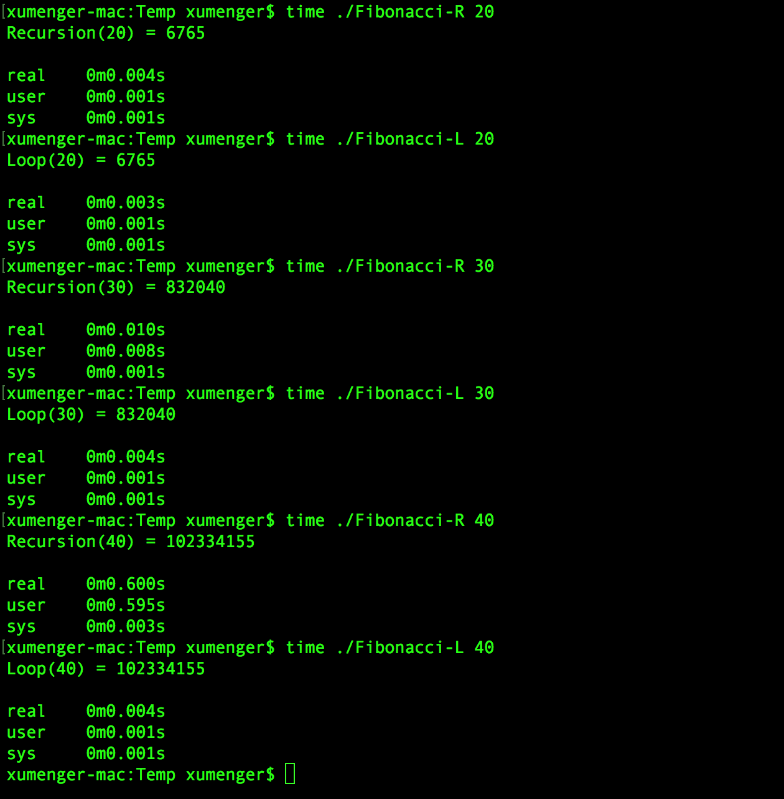
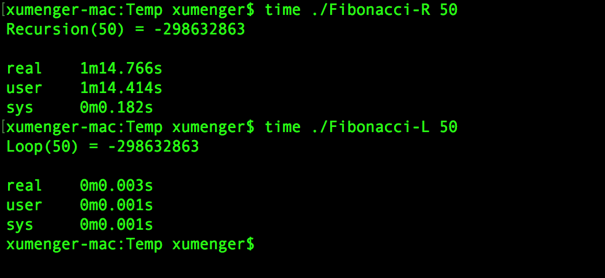
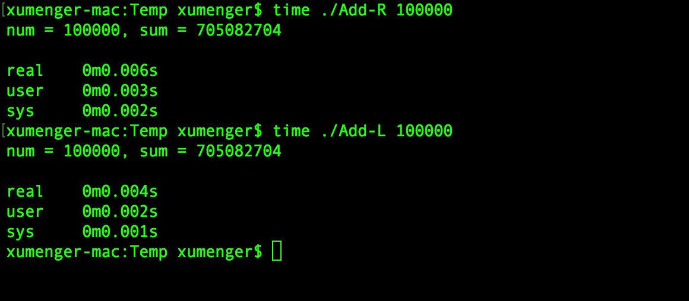
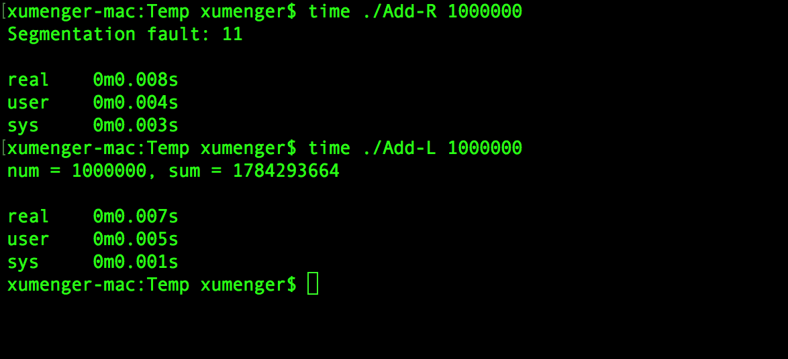
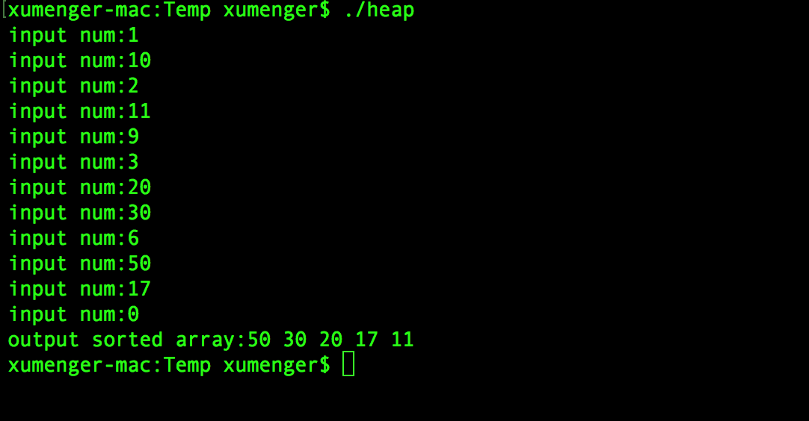

>很简单的东西，从晚上写到了凌晨，作死！

## 最简单的递归例子

题目：给出一个正数N，计算从N+(N-1)+...+1的结果

这里给一个很简单的C递归函数

```
#include <stdio.h>

int Add_recursion(int num)
{
    if(num <= 1)
        return 1;
    return num + Add_recursion(num-1);
}

int main(int argc, char **argv)
{
    int num;
    if(argc < 2)
        num = 1;
    else
        num = atoi(argv[1]);
    printf("num = %d, sum = %d\n", num, Add_recursion(num));
    return 0;
}
```

同样的，可以很简单地用循环实现

```
#include <stdio.h>

int Add_loop(int num)
{
    if(num <= 1)
        return 1;
    int i;
    int sum = 0;
    for(i=num; i>0; i--)
       sum = sum + i;
    return sum;
}

int main(int argc, char **argv)
{
    int num;
    if(argc < 2)
        num = 1;
    else
        num = atoi(argv[1]);
    printf("num = %d, sum = %d\n", num, Add_loop(num));
    return 0;
}
```

明显，这个例子中使用递归实现没有循环实现直接，用递归反而是走了弯路。但是有很多问题用递归更加直白以及符合直观思维

## 菲波那切问题

菲波那切数列又称为黄金分割数列，指的是这样一个数列：1、1、2、3、5、8、13、21、34、55……

可以被递归的定义为：

```
F(n) = 1                    ; n = 1
F(n) = 1                    ; n = 2
F(n) = F(n-1) + F(n-2)      ; n > 2
```

要求用C语言实现一个函数用于计算F(n)的值

看到上面其使用递归方式定义斐波那契数列，所以很容易想到用递归函数实现

```
#include <stdio.h>

int Fibonacci_Recursion(int n)
{
    if(n <= 0)
        return 0;
    if(n == 1)
        return 1;
    if(n == 2)
        return 1;
    return Fibonacci_Recursion(n-1) + Fibonacci_Recursion(n-2);
}

int main(int argc, char **argv)
{
    int n = 0;
    if(argc < 2)
        n = 1;
    else
        n = atoi(argv[1]);
    printf("Recursion(%d) = %d\n", n, Fibonacci_Recursion(n));
    return 0;
}
```

那么对应的使用循环实现为

```
#include <stdio.h>

int Fibonacci_Loop(int n)
{

    if(n <= 0)
        return 0;
    int i;
    int f = 1;
    int f1 = 0;
    int f2 = 1;
    for(i=2; i<=n; i++){
        f = f1 + f2;
        f1 = f2;
        f2 = f;
    }
    return f;
}

int main(int argc, char **argv)
{
    int n = 0;
    if(argc < 2)
        n = 1;
    else
        n = atoi(argv[1]);
    printf("Loop(%d) = %d\n", n, Fibonacci_Loop(n));
    return 0;
}
```

可以在Linux下测试一下递归实现和循环实现计算F(20)、F(30)、F(40)、F(50)的性能！



很明显，计算F(30)时，递归版本耗时0m0.010s而循环版本耗时0m0.004s；而到F(40)时，递归版本耗时0m0.600s而循环版本耗时0m.0004s，很明显数字越大，递归版本耗时越长，而循环版本相对耗时短得多！

而如果要计算F(50)的值，再去对比一下，递归耗时达1m14.766s，而循环还是只要0m0.003s，这次的性能简直是天差地别



>注：计算得到负数，是因为出现了整数溢出！

为什么会有这么大的差别，那么我们就去分析一下时间复杂度，循环很简单，当F(50)的时候，只需要循环50次，显然瞬间完成，所以其时间复杂度只有O(N)

接下来我们分析一下这种递归计算斐波那契数列的算法的时间复杂度。假设计算F(n)需要递归调用F()的次数用Count(n)表示

计算F(1)，很简单，直接判断`n == 1`，得到结果1。调用1次F(n)，Count(1) = 1

计算F(2)，很简单，直接判断`n == 2`，得到结果1。调用1次F(n)，Count(2) = 1

计算F(3)，调用F(3) = F(2) + F(1)，所以会分别调用一次F(2)和F(1)。Count(3) = 1 + Count(2) + Count(1) = 3

计算F(4)，调用F(4) = F(3) + F(2) = F(2) + F(1) + F(2)。Count(4) = 1 + Count(3) + Count(2) = 5

F(5) = F(4) + F(3) = F(3) + F(2) + F(2) + F(1) = F(2) + F(1) + (F2) + F(2) + F(1)。Count(5) = 1 + Count(4) + Count(3) = 9

F(6) = F(5) + F(4) = F(4) + F(3) + F(3) + F(2) = F(3) + F(2) + F(2) + F(1) + F(2) + F(1) + F(2) = F(2) + F(1) + F(2) + F(2) + F(1) + F(2) + F(1) + F(2)

计算F(n)需要调用F()的次数为Count(n) = 1 + Count(n-1) + Count(n-2) 约等于 Count(n-1) + Count(n-2)，很明显时间复杂度达到了O(2^n)

因为其中有明显的重复计算，比如调用F(5)，那么F(4)调用1次、F(3)调用2次，F(2)调用3次，F(1)调用5次。当然，并不是所有的递归都像这个例子一样有如此多的重复计算

因为每次计算F(n)都要分别调用F(n-1)与F(n-2)，所以时间复杂度是O(2^n)

## 再看第一个例子

直接输入100000，计算结果，并且统计耗时情况



虽然循环耗时0m0.004s，递归耗时0m0.026s，但是完全没有斐波那契数列那种天大的差别

为什么呢？

因为斐波那契数列实现中，是F(n) = F(n-1) + F(n-2)，一个调用的内部会有两个子调用，1->2->4->8->...->1024->...->8192..->1048576->...，很明显出现了幂增长，很明显随着n的增长，会导致明显的子调用增长。同时会产生大量的重复计算

而对于本例，调用A(n) = n + A(n-1)，一个调用内部只会产生一个子调用，1->1->1->1...->1，完全不会像斐波那契那样出现严重的幂增长！

将数量级继续增大到1000000，看会是什么效果？



循环实现的因为和太大出现了整数溢出，这个算正常现象，换位数更多的整型即可解决，但是递归实现的因为栈内存的持续正常导致了栈溢出，进而导致进程崩溃！

>测试在一台RedHat机器上，递归计算10000000时才出现栈溢出，而在mac上递归计算1000000就栈溢出了，这个编译器、分配给线程的栈大小都有关

## 典型的用到递归的场景：树的遍历

在对二叉树进行遍历的时候使用递归很好实现，比如下面的简单实现

```
typedef struct BiTNode{
    //数据
    int data;
    //左右孩子节点
    struct BitNode *lchild, *rchild;
}BiTNode;

//先序遍历
void PreOrder(BiTNode *root){
    if(NULL != root){
        //先访问根节点
        printf("%d\n", root->data);
        //再访问左子节点
        PreOrder(root->lchild);
        //最后访问右子节点
        PreOrder(root->rchild);
    }
}

//中序遍历
void InOrder(BiTNode *root){
    if(NULL != root){
        //先访问左子节点
        InOrder(root->lchild);
        //再访问根节点
        printf("%d\n", root->data);
        //最后访问右子节点
        InOrder(root->rchild);
    }
}

//后序遍历
void PostOrder(BiTNode *root){
    if(NULL != root){
        //先访问左子节点
        PostOrder(root->lchild);
        //再访问右子节点
        PostOrder(root->rchild);
        //最后访问根节点
        printf("%d\n", root->data);
    }
}
```

树的递归遍历也是一个调用里面调用2个子调用，那么会不会和斐波那契一样有极高的时间复杂度呢？细想想，斐波那契是F(n)=F(n-1)+F(n-2)，每个子调用的规模比父调用略小，而在二叉树的递归遍历中，其实可以约等于F(n)=F(n/2)+F(n/2)，每个子调用都是父调用规模的1/2，所以完全不会像斐波那契那样的高时间复杂度！

对于递归的树遍历，是不是可以对应得到其非递归版本？

那就需要使用自己实现的栈而不是进程的栈内存来实现了。以先序遍历为例：访问根节点root之后，将root入栈，遍历左子树；遍历完左子树返回时，栈顶元素是root，出栈，再先序遍历root的右子树

```
void PreOrder(BiTNode *root)
{
    stack<BiTNode *> stack;
    //p是遍历指针
    BiTNode *p = root;
    //栈不空或者p不空时循环
    while(p || stack.empty()){
        if(p != NULL){
            //压栈
            stack.push(p);
            //访问根节点
            printf("%d\n", root->data);
            //遍历左子树
            p = p->child;
        }else{
            //退栈
            p = stack.top();
            stack.pop();
            //访问右子树
            p = p->rchild;
        }
    }//while
}
```

>很多时候，可以尾调用的递归还不如显式写作迭代；不可以尾调用的递归，要换做迭代方法就自建stack，较为复杂，但有可能降低时间和空间的系数，并且能支持最大的深度。来自[《为什么说递归效率低？》](https://www.zhihu.com/question/35255112?sort=created)中[Milo Yip](https://www.zhihu.com/people/miloyip/answers)的回答

## 典型的用到递归的场景：堆排序

在堆排序中调整堆的时候使用递归很方便，比如下面例程，用户输出N个数，使用(小顶)堆排序选择其中最大的5个数

```
#include<stdio.h>

void RebuildMinHeap(int *heap, int count, int root);
void MinHeap2SortArr(int *heap, int count);

int main()
{
    //堆是一个完全二叉树，可以存储在数组中
    //第n个元素的左节点是2n+1，右节点是2n+2
    int heap[5] = {0, 0, 0, 0, 0};
    int num = 0;
    while(1){
        printf("input num:");
        scanf("%d", &num);
        if(0 == num)
            break;
        if(num > heap[0]){
            heap[0] = num;
            RebuildMinHeap(heap, 5, 0);
        }
    }
    MinHeap2SortArr(heap, 5);
    int i;
    printf("output sorted array:");
    for(i=0; i<5; i++)
        printf("%d ", heap[i]);
    printf("\n");
    return 0;
}

//调整数组为小顶堆
void RebuildMinHeap(int *heap, int count, int root)
{
    int tmpValue;
    int left = 2 * root + 1;
    int right = 2 * root + 2;
    int pos;
    if(left >= count)
        return ;
    if(right >= count)
        pos = left;
    else
        pos = heap[left] > heap[right] ? right : left;
    if(heap[root] > heap[pos]){
        tmpValue = heap[root];
        heap[root] = heap[pos];
        heap[pos] = tmpValue;
        RebuildMinHeap(heap, count, pos);
    }
}

//将小顶堆的数组变成顺序数组
void MinHeap2SortArr(int *heap, int count)
{
    int i;
    int tmpValue;
    for(i=0; i <count; i++){
        tmpValue = heap[count-i-1];
        heap[count-i-1] = heap[0];
        heap[0] = tmpValue;
        RebuildMinHeap(heap, count-i-1, 0);
    }
}
```

运行效果如下



这里面递归调用`RebuildMinHeap(int *, int , int )`又如何替换为循环呢？

>在libevent中就是使用小根堆来对定时器进行管理的！

>堆也是top K问题的一种经典解决方案！

## 函数式编程

无论C、C++都是基于计算机都是命令式编程语言，需要用“机器的方式”思考

那在函数式编程语言中的递归和循环又是什么特点呢？

函数式编程语言和命令式编程语言的更多异同？

算法在函数式编程语言中以什么样的方式存在和应用呢？

## 扩展阅读

* [《所有递归都可以写成循环吗？》](https://www.zhihu.com/question/20418254)
* [《为什么说递归效率低？》](https://www.zhihu.com/question/35255112?sort=created)
* [《C语言中递归问题？》](https://www.zhihu.com/question/39987845/answer/84108690)
* [《递归算法和非递归算法的区别和转换》](https://wenku.baidu.com/view/0c2409c55fbfc77da269b1c8.html)
* [《一步一步写算法（之循环和递归）》](http://blog.csdn.net/feixiaoxing/article/details/6838362)
* [《关于Java中尾递归的优化》](http://it.deepinmind.com/jvm/2014/04/16/tail-call-optimization-and-java.html)
