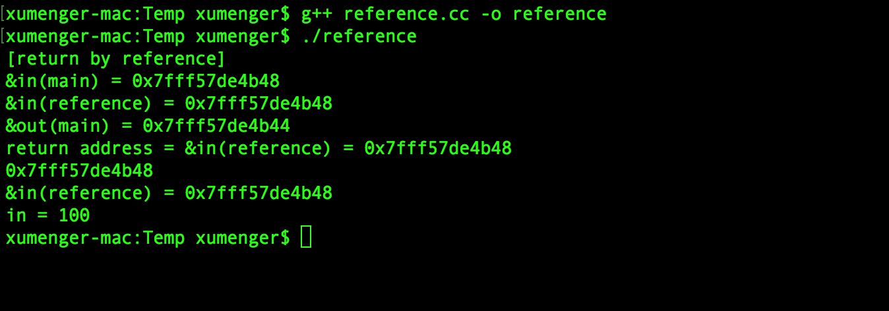
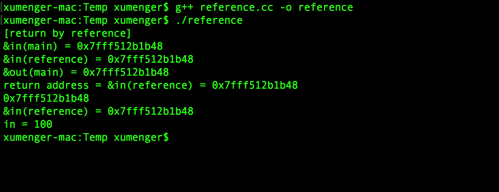
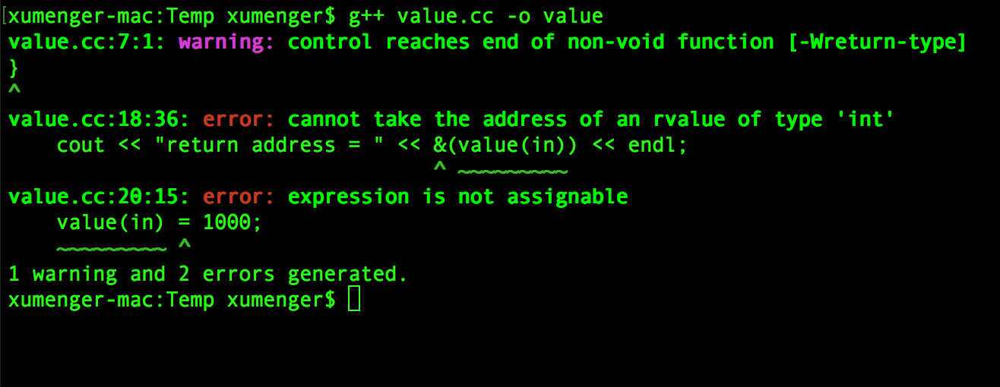

在[《正确理解C/C++中的传值调用/传址调用/引用调用》](http://www.xumenger.com/c-cpp-function-value/)中对调用函数传入参数的方法进行了简述，C中只有传值调用（传址调用本质上就是传值调用），而C++中又增加了引用调用的语法支持。其实在函数中参数是这样的，返回值也是这样的！

下面的示例用C++编写，用`g++ ***.cc -o ***`编译

## 引用返回

下面给出一个引用传值的例子

```
#include <iostream>

using namespace std;

int &reference(int &in){
   cout << "&in(reference) = " << &in << endl; 
   return in;
}

int main()
{
    int in = 10;
    
    cout << "[return by reference]" << endl;    

    cout << "&in(main) = " << &in << endl;
    int out = reference(in);
    cout << "&out(main) = " << &out << endl;
    cout << "return address = " << &(reference(in)) << endl;

    reference(in) = 100;
    cout << "in = " << in << endl;

    return 0;
}
```

编译后输出如下



其中特别注意`int out = reference(in)`还是进行了将返回值拷贝的过程，因为明显可以看到out和in的地址是不同的。所以引用返回的特殊性主要体现在`reference(in) = 100`调用方式而不是`int out = reference(in)`方式。这里就涉及到**左值**的概念了

>引用返回左值。返回引用的函数返回一个左值，因此这样的函数可用于任何要求使用左值的地方

当然如果想“用一个临时变量保存引用返回值”，并且不让程序出现拷贝，那么就不应该`int out = reference(in)`的方式定义out，而应该是`int &out = reference(in)`的方式定义一个引用

修改之后，编译运行程序，看到地址是一致的



## 传值返回形式

```
#include <iostream>

using namespace std;

int value(int &in){
   cout << "in(value) = " << &in << endl;
}

int main()
{
    int in = 10;
    
    cout << "[return by value]" << endl;

    cout << "&in(main) = " << &in << endl;
    int out2 = value(in);
    cout << "out2(main) = " << &out2 << endl;
    cout << "return address = " << &(value(in)) << endl;
    
    value(in) = 1000;
    cout << "in = " << in << endl;

    return 0;
}
```

在进行编译的时候直接报错



其中rvalue是right value的缩写，表示右值；同理lvalue表示左值。中缀表达式一般是这样的`a = b;`a在左边，表示可以被赋值的值，b在右边，表示用于赋值的值 

## 防止对返回值的修改

由于引用返回方式直接指向了一个生命期尚未结束的变量，因此，对于函数返回值（或者称为函数结果）本身的任何操作，实际上都是对那个变量的操作，这就是引入const类型的返回的意义。当使用了const关键字后，即意味着函数的返回值不能立即得到修改！

所以上面的引用返回方式定义的函数加了const之后可以重新定义为下面这个样子：

```
#include <iostream>

using namespace std;

const int &reference(int &in){
   cout << "&in(reference) = " << &in << endl; 
   return in;
}

int main()
{
    int in = 10;
    
    cout << "[return by reference]" << endl;    

    cout << "&in(main) = " << &in << endl;
    int out = reference(in);
    cout << "&out(main) = " << &out << endl;
    cout << "return address = " << &(reference(in)) << endl;

    reference(in) = 100;
    cout << "in = " << in << endl;

    return 0;
}
```

那么直接在编译的时候报错


## 千万不要返回局部变量的引用

```
#include <iostream>

using namespace std;

int &reference(){
   int test = 10;
   cout << "&test(reference) = " << &test << endl;
   return test;
}

int main()
{
    
    cout << "[return by reference]" << endl;    

    int out = reference();
    cout << "&out(main) = " << &out << endl;
    cout << "return address = " << &(reference()) << endl;

    reference() = 100;

    return 0;
}
```

编译的时候有警告信息，但是还是可以编译通过


运行输出如下


虽然编译通过了，但是当reference返回之后，其局部变量test其实已经从栈上弹出了，原来test所在地址上的内容已经变成其他了，所以后续调用`reference() = 100`就破坏了堆栈。详细可以参考[《堆栈小记》](http://www.xumenger.com/linux-c-local-stack-20170704/)

因为这里是int类型，int的内存结构比较简单，所以虽然破坏了堆栈，但是可能后续也用不到所以就没有导致异常，那么如果使用string来试试呢？

```
#include <iostream>

using namespace std;

string &reference(){
   string test = "local string";
   cout << "&test(reference) = " << &test << endl;
   return test;
}

int main()
{
    
    cout << "[return by reference]" << endl;    

    string out = reference();
    cout << "&out(main) = " << &out << endl;
    cout << "return address = " << &(reference()) << endl;

    reference() = "out string";

    return 0;
}
```

编译还是同样报警告


然后运行时直接出现Segmentation Fault

```
[user@user ~]# ./local-string
[return by reference]
&test(reference) = 0x7fffe8a5adb0
Segmentation fault (core dumped)
```

上面是在一台redhat机器上测试出现的segmentation fault，下面截图是在mac上运行的，没有出问题，所以这正是其可怕之处！


在`string out = reference();`调用的时候，可以看到是在返回的地方崩溃。因为当函数执行完毕时，将释放分配给局部变量的存储空间，此时对局部对象的引用就会指向不确定的内存

## 扩展：函数对象

这里是讲的C++原生函数，在C++中其实结合面向对象、运算符重载的语法，也支持函数对象的概念

可以参考[《STL使用上的更多细节》](http://www.xumenger.com/cpp-stl-usage-more-detail-20170916/)的相关部分
