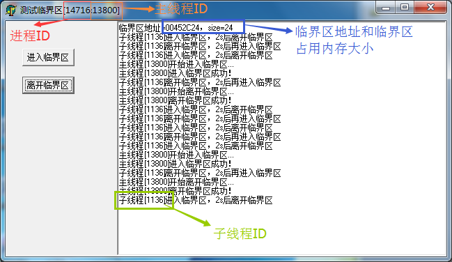
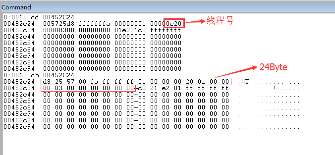
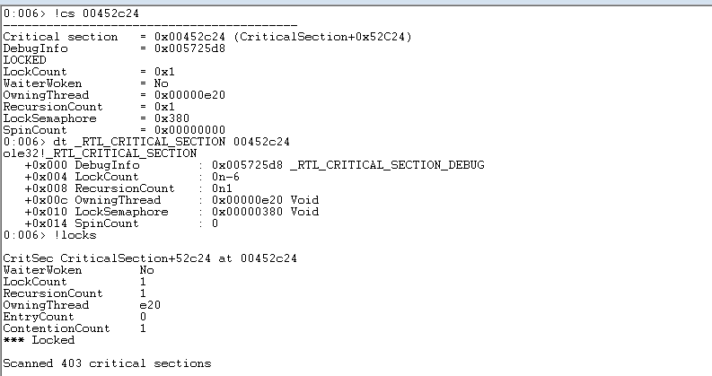

## 多线程同步问题

在Windows下，实现多线程同步主要有以下方案：

* 临界区。非内核态对象、轻量级，所以非常适用于同一个进程内的多线程同步
* 事件对象。内核对象，适用于多进程间的线程同步
* 互斥对象。内核对象，适用于多进程间的线程同步

本文先针对比较常用的临界区来分析其在Windows进程内存中的状态，关于事件对象、互斥对象后续再做研究！

## 测试进程

使用Delphi做一个用于本次测试的进程，界面如下：



子线程循环是这样的，循环进入、离开临界区，并且会给主线程发消息，让主线程更新到界面上

```
procedure TTestThread.Execute;
begin
  while not Terminated do
  begin
    EnterCriticalSection(CS);
    try
      SendMessage(Form1.Handle, WM_CS, 1, GetCurrentThreadId());
      Sleep(2000);
    finally
      LeaveCriticalSection(CS);
      SendMessage(Form1.Handle, WM_CS, 2, GetCurrentThreadId());
      Sleep(2000);
    end;
  end;
  Self.Free();
end;
```

主线程也就是UI线程，允许用户通过点击界面上的按钮进入临界区、离开临界区

## 开始用WinDbg调试

重新打开进程后，子线程输出一些信息后赶紧按【进入临界区】按钮，使得子线程阻塞，防止其发送太多消息展示在界面上不利于调试


简单分析一下进程输出的一些信息：

* 进程ID：8244
* 主线程ID：3616，对应的16进制值是E20
* 子线程ID：13748，对应的16进制值是35B4
* 临界区地址：00452C24，在Win32进程中

接下来使用WinDbg Attach到该进程上，进行调试

首先我们到临界区的地址处`00452C24`看一下。因为临界区的大小是24Byte，所以我们看这24字节



这24字节中比较熟悉的就是`0e20`，正好等于当前进入临界区的主线程的线程号

使用`locks`命令查看当前锁住的临界区信息。可以看到该命令查看了共403个临界区，发现其中一个是锁住的状态，就是我们测试的这个临界区，地址是`00452c24`


还可以使用`!cs 00452c24`、`dt _RTL_CRITICAL_SECTION 00452c24`输出该临界区的信息



可以看到每种查看临界区的方式都输出了一些信息，下面分别解释一下

```
//此字段包含一个指针，指向系统分配的伴随结构体，_RTL_CRITICAL_SECTION_DEBUG，这一结构中包含更多即有价值的信息
DebugInfo          = 0x005725d8    

LOCKED                             

//这是临界区中最重要的字段，初始化为数值-1，此数值大于等于0，表示此临界区被占用
//当其不等于-1时，OwningThread字段包含了拥有此临界区的线程ID
//该字段与(RecursionCount)数值之间的差值表示有多少个其他线程在等待获得该临界区
LockCount          = 0x1           

WaiterWoken        = No            

//包含当前拥有此临界区的线程ID
OwningThread       = 0x00000e20    

//此字段包含所有者线程已经获得该临界区的次数
//如果该数值为0，下一次尝试获取该临界区的线程会成功
RecursionCount     = 0x1           

//此字段的命名不恰当，它实际上是一个自复位事件，而不是信号
//它是一个内核对象句柄，用于通知操作系统：该临界区现在空闲
//操作系统在一个线程第一次尝试获得该临界区，但被另一个已经拥有该临界区的线程所阻止时，自动创建这样一个句柄
//应当调用DeleteCriticalSection，它将发出一个调用该事件的CloseHandle调用，并在必要时释放该调试结构，否则将会发生资源泄漏
LockSemaphore      = 0x380         

//仅用于多处理器系统
//在多处理器系统中，如果该临界区不可用，调用线程将在对该临界区相关的信号执行等待操作做之前，旋转SpinCount次
//如果该临界区在旋转操作期间变为可用，该调用线程就避免了等待操作
//旋转计数可以在多处理器计算机上提供更佳性能，其原因在于在一个循环中旋转通常要快于进入内核模式等待状态
SpinCount          = 0x00000000    
```

>参考[《深入理解CRITICAL_SECTION》](http://www.cnblogs.com/dirichlet/archive/2011/03/16/1986251.html)

## \_RTL\_CRITICAL\_SECTION\_DEBUG结构体

上面提到了`_RTL_CRITICAL_SECTION`结构体中包含一个指向`_RTL_CRITICAL_SECTION_DEBUG`结构体的指针，所以可以继续分析一下这个结构体

`dt _RTL_CRITICAL_SECTION_DEBUG 0x005725d8`查看其信息


该结构体由InitializeCriticalSection分配和初始化，它既可以由NTDLL内的预分配数组分配，也可以由进程对分配

同样的，我们分析一下这个结构的每个字段

```
//该字段未被使用，被初始化为0
   +0x000 Type             : 0

//仅用于诊断情形中
//在注册表项HKLM\Software\Microsoft\Windows NT\CurrentVersion\Image File Execution Options\YourProgram 之下是 keyfield、GlobalFlag 和 StackTraceDatabaseSizeInMb 值
   +0x002 CreatorBackTraceIndex : 0

//指向对应的_RTL_CRITICAL_SECTION结构体
   +0x004 CriticalSection  : 0x00452c24 _RTL_CRITICAL_SECTION

//用于表示双向链表中节点的标准Windows数据结构
   +0x008 ProcessLocksList : _LIST_ENTRY [ 0x572608 - 0x572590 ]

   +0x010 EntryCount       : 0
   +0x014 ContentionCount  : 1
   +0x018 Flags            : 0
   +0x01c CreatorBackTraceIndexHigh : 0
   +0x01e SpareUSHORT      : 0
```

关于临界区在[《深入理解CRITICAL_SECTION》](http://www.cnblogs.com/dirichlet/archive/2011/03/16/1986251.html)中有更为详细的理论解释，这里只是就调试实践做一些梳理，方便以后自己使用WinDbg排查一些多线程死锁之类的问题！

