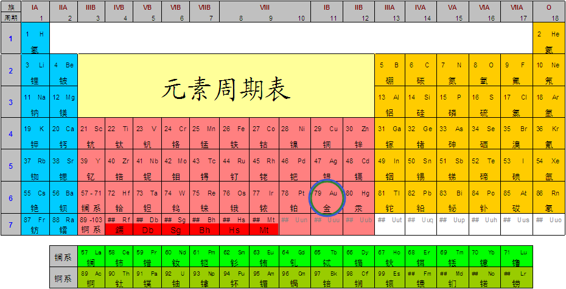
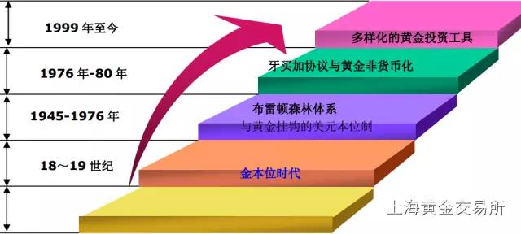
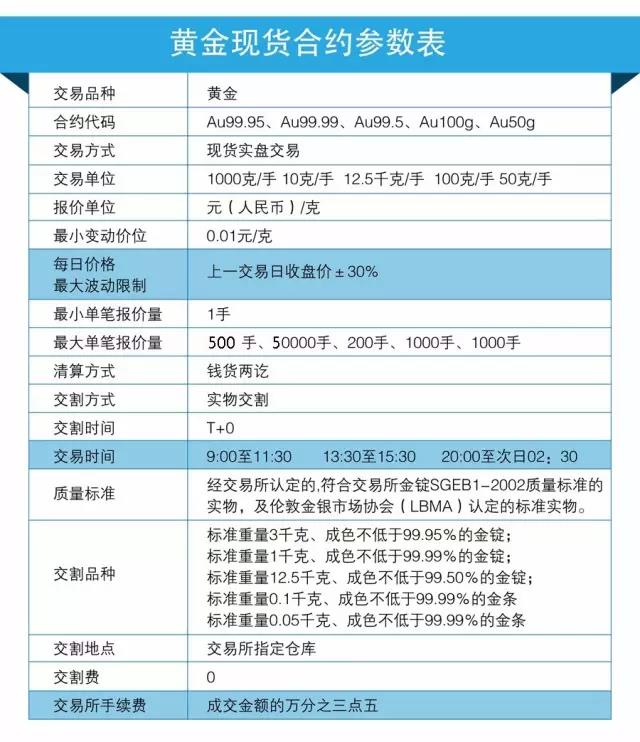
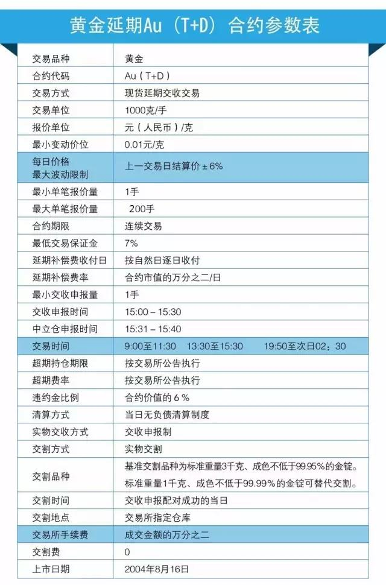
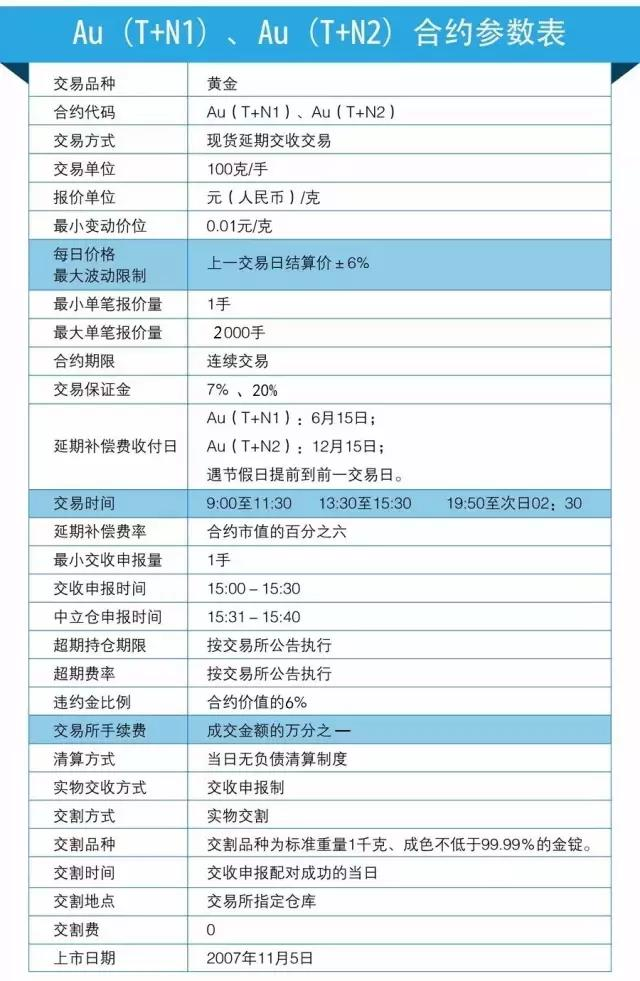
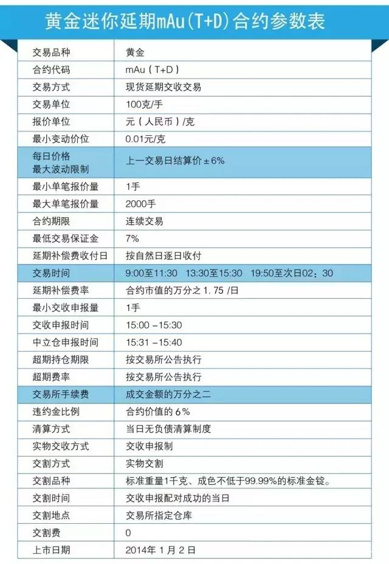
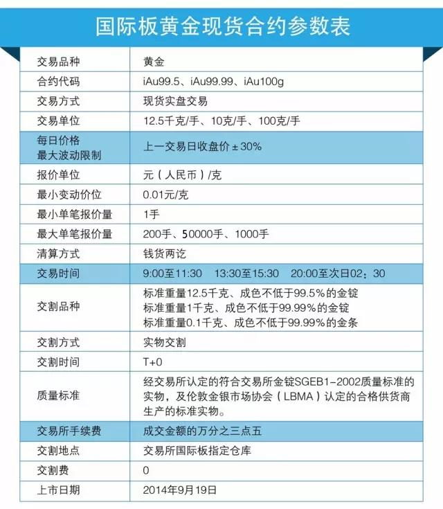
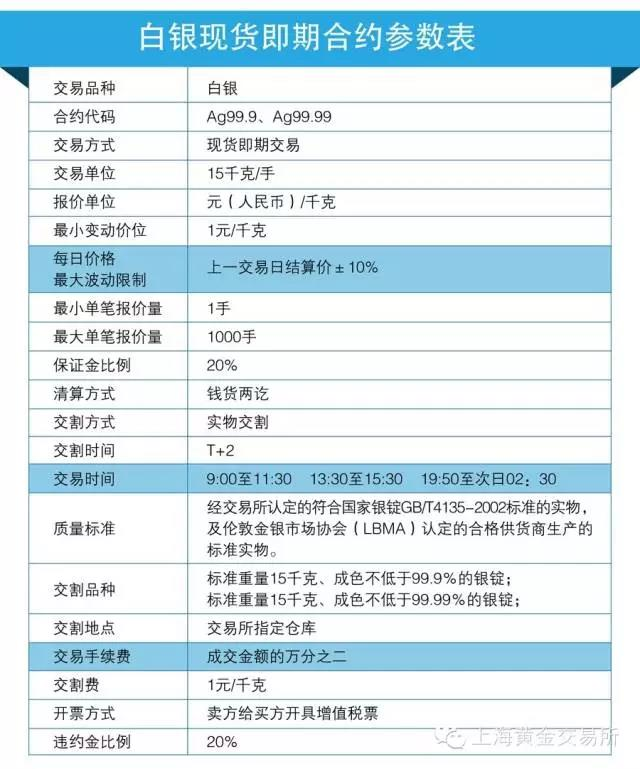
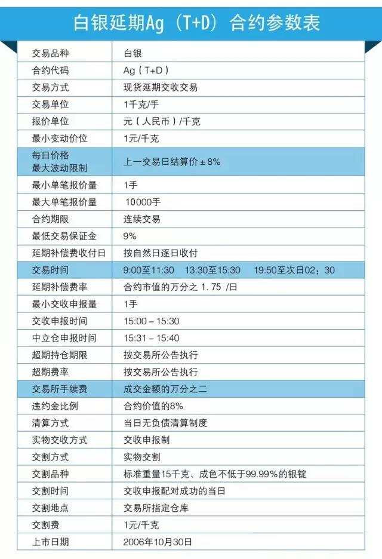
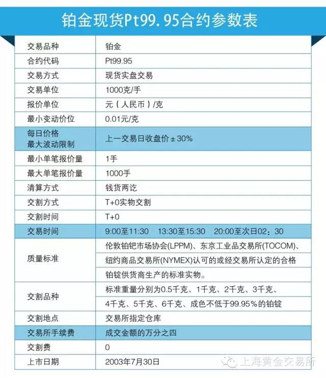

>本文主要根据[上海黄金交易所许罗德理事长在2014年的演讲内容](http://www.sge.com.cn/tzzjy/hjdjt/521447)进行的简单整理

# 黄金本身

黄金的元素符号是Au，其在元素周期表中的原子序数是79、核电荷数是79、核外电子数是79

黄金的熔点非常高，达到1000多度。经常说真金不怕火炼就是指这点

黄金的延展性好，因为经常用来做金首饰，所以这个特点大家可能知道，但延展性好到怎样一个程度大家就不一定知道了，一克黄金（半粒大米那么大），就可以拉伸到4000米

它这些很特殊的物理性质决定了黄金特别的用途

# 黄金的历史

从人类开始挖掘黄金，黄金进入我们人类的视野已有4000年历史，作为货币也大概将近3000年。黄金非常稀有，从4000多年前发现到现在，一共也就17万吨

>现在17万吨黄金里面，40%还是被用于央行储备和私人投资的。中国大概储备了1054吨，第一位美国8000多吨，第二位是德国3000多吨，全球一共储备了30000多吨。它在央行储备里面是除了美国国债、日债以外的第三大资产，说明黄金作为资产储备这一金融属性就很明显

目前可查的最早黄金货币为当时称为吕底亚古国的铸金币。吕底亚古国位于现在土耳其西部地区一个地方，它在2700多年前就把黄金作为货币。当然那个时候没有那么纯，大概50%左右；黄金在我国作为货币最早是春秋战国时期，也有2500多年的历史！

黄金作为货币最鼎盛的时候，就是金本位制的时候。16-18世纪当时因为黄金量比较少，所以白银和货币都是作为本位，黄金也是货币，白银也是货币。到了18、19世纪，因为大量的发现了黄金、开采了黄金，黄金存量大幅的增加，仅19世纪后半叶，人类生产的黄金就超过了过去5000年的产量总和。由于黄金产量的增加，人类增加的黄金需求也有了现实的物质条件，人类社会进入了长达一个多世纪的“金本位时期”

随着美元逐步崛起，国际货币体系从金本位转为美元与黄金挂钩的布雷顿森林体系。大家知道，布雷顿森林体系实质是以黄金为基础的美元本位制货币体系。美元之所以能够成为世界货币，是因为当时美国把全球2/3黄金都储备起来了，美元跟黄金挂钩，拥有了美元就等同于拥有黄金

但后来美元成为世界货币以后，它觉得我美元已经是世界货币了，你这黄金是一个比我美元更厉害的货币替代，它觉得不可以，所以后来美元就把布雷顿森林体系打破了，说现在黄金跟美元不挂钩了，美元独立了，所以美国就开始唱衰黄金。在1976年时候有一个《牙买加协议》，规定黄金非货币化，就是黄金不是货币了。那个时候的货币体系有什么特征呢？根据国际货币基金组织在牙买加制定了一个决议，原来在货币基金组织成员国之间债务的清偿必须用黄金，但现在不用黄金也可以，用美元就可以了。这就是牙买加协议，牙买加协议后，黄金就非货币化了

但黄金非货币化以后，国际金融危机也不断出现，大大小小，各国央行又开始意识到黄金很重要，从1999年开始，又搞了一个央行售金协议。央行售金协议是什么？就是欧元区所有的央行加上欧央行，加上瑞士和瑞典，搞了一个协议，协议就各国央行对黄金的拥有和出售有一个约定，不能随便卖，还应该保有的一定量，不然会影响黄金市场。1999年的《央行售金协议》还重申了“黄金仍然是全球金融储备的重要组成部分”

>图片来自[上海黄金交易所官方微信](https://mp.weixin.qq.com/s?__biz=MzAwNTExMzYyOQ==&mid=203023229&idx=1&sn=ec120662749bb8b4da55639324fecef1&scene=18#rd)

# 黄金市场

金融市场包括哪些？金融市场包括资本市场（即证券市场）、债券市场、货币市场、外汇市场、以及黄金市场，黄金市场是金融市场里面一个非常重要的组成部分。当然它体量不是最大的，但它是最有特色的。它是以黄金作为标的，既有实物交易，也有衍生品等投资交易，它的形成相对独立，是相对有特色的一个市场

现在从全球看黄金市场发展是什么情况？黄金市场看全球最有影响力的地方在哪里？就是伦敦和纽约

### 伦敦市场

伦敦的市场有300多年历史，但它真正成为有影响力的全球市场还是在1919年，伦敦推出了伦敦金。伦敦金的推出，包含了一个很重要的东西，伦敦金的品牌和伦敦金的定价。**伦敦之所以能够成为全球金融中心，就是它的话语权和定价权**。伦敦有两个最有名定价权，一个资金定价权，一个黄金定价权！

资金定价权是什么？叫做Libor，就是全球美元离岸市场资金价格。全球美元资金价格怎么定，比如借美元这个价格在哪里？价格在伦敦，英国银行家联盟（BBA）每天要发布资金的价格，全球各种各样派生出来的贷款也好，借款也好都要参考它定的那个价格

伦敦还有一个价格就是黄金的价格，叫做伦敦金，伦敦金建立在1919年。他们开始打造这个伦敦金，一直到现在。黄金定价是伦敦市场上五个大的商业银行做市，定了伦敦金的价格

### 纽约市场

从全球市场看，伦敦之外还有一个纽约，纽约主要是衍生品交易，以黄金期货为主

### 上海市场

现在在整个黄金市场里面看，中国是世界第一大黄金进口国，2013年我们进口1540吨黄金，这是什么概念，当年全球一年一共生产了大概3500吨，中国就进口了1500多吨。同时现在我们是全球第一大黄金生产国，去年生产了将近430多吨黄金，进口的加上生产的2000吨黄金，实物黄金上来讲我们占了全球60%还要多，中国的现货黄金市场是全球最大的黄金市场，这些现货都在[上海黄金交易所](https://mp.weixin.qq.com/s?__biz=MzAwNTExMzYyOQ==&mid=502824902&idx=1&sn=8ba604353f522f7859e404042897f950&chksm=032d4db4345ac4a20baeb06f1c916b4d14c110e50d32959a4a7e0ee2f684a06baba25b94285c&scene=18#rd)进行交易，所以现在上海黄金交易所是全球最大的现货黄金交易所。从这个意义上来说，我国在实物黄金应该是很有话语权的，但是现在话语权很小，就是我们黄金定价没有定价权！

上面说到伦敦的资金定价权（Libor），和黄金定价权（伦敦金）。上海建国际金融中心时候说人民币也要有一个价格，所以上海搞了一个Shibor，就是资金的价格；同样的，上海黄金交易所在黄金定价权方面正在努力打造“上海金”品牌。上面讲到伦敦金的定价有五大商业银行做市定价，同时他们又是市场上的参与者，所以监管部门会说这个市场不公平，你是不是有操作、内幕交易？包括Libor的定价也是采取这种方式。所以这也正是上海的机会

对于[上海金](http://www.sge.com.cn/cpfw/cpdj)，上海黄金交易所通过搞一个黄金交易所的[国际板](http://www.sge.com.cn/cpfw/gjb)，利用上海自贸区这样的契机实现我国黄金市场的对外开放。现在在我国黄金市场交易的7000多个机构投资者，500多万个人投资者都是我们境内的，我们资金都是在岸的资金。现在我要引入全球的机构投资者、个人投资者，引入离岸资金、包括离岸人民币、包括其他的可兑换货币参与到我们这个市场交易，这个市场不仅仅是中国境内的市场，也是一个全球化的市场，它形成黄金的价格就不仅仅是现在的一个黄金的价格，也是全球有影响力的黄金价格。这个价格应该将来叫做“上海金”。伦敦金是五家银行在那个地方商量出来的价格，上海金是大家竞价形成的价格，更有可信度！

>补充：2016年4月19日，上海黄金交易所发布了“上海金”，是全球首个以人民币计价的黄金基准价格。“上海金”定价机制是中国金融要素市场创新开放、积极融入全球一体化进程的重要尝试，为黄金市场参与者提供了良好的风险管理和创新工具，加快了中国黄金市场的国际化进程

### 黄金市场全球24小时交易

再说一下全球黄金市场交易的活跃时间。这个时间看起来很复杂，但可以分为三个部分

一个部分就是欧洲时段，比如伦敦金是伦敦时间上午10:30，相当于我们下午3:30左右，它开市，这是欧洲时段。过了以后就是美洲时段，然后亚洲时段，所以黄金市场是全球24小时，各市场都在交替交易。实际伦敦的尾市是影响美洲的开市，我们上海也是开市受欧洲时段影响，早上开市受美洲尾市的影响

我们黄金交易所现在晚上九点开市，它看什么东西？在看欧洲价格是什么价格。这个价格同样影响美洲早市。我们早上九点开盘时的价格，就要受美洲尾市影响。这个市场价格都是相互影响的。所以黄金市场是全球24小时交易，这种互相的影响是非常大的

# 我国黄金市场发展的三个阶段

### 第一阶段，1949-1982共33年

黄金完全由国家管制，民间不允许拥有黄金，所有黄金都是国家的。为什么进行这样的管制。又细分为两个时期

一个是解放初期，我们人民币要发行。人民币的发行和美元成为世界货币走的是两条完全不同的路，美元成为世界货币是它有黄金作为保证，把全球黄金储备起来，美元跟黄金挂钩，以后你用我的美元，用美元就是用黄金。但中国刚刚解放哪有那么多黄金？于是强制发行信用货币，就是买所有的东西必须用人民币。那个时候如果还出现一个黄金，出现比人民币更强大的东西，那会对人民币造成很大的冲击，所以所有黄金必须交给国家，用人民币作为信用货币。因此，建国初期黄金管制是因为我们要发行信用货币

后来到了五几年，大家也接受了人民币，为什么还要管制黄金呢？因为那个阶段我国外汇短缺，短缺到什么程度？就是说要买一点东西进来，都要用黄金换，我们没有外汇。在50年代，我们一年能够有1亿美元外汇就很了不起了。那想什么办法呢？挖黄金。毛主席对钱不感兴趣，但他对黄金是有指示的，要多挖一点金子。当时周总理亲自抓，成立了武警黄金部队，各个省也都有黄金管理局。挖了黄金交给国家，换外汇，然后进口我们需要的技术、设备，或者一些机器。所有进口的尖端东西都靠黄金

1949-1982年管制黄金原因有两个，第一个时期是为了发行信用货币，第二个时期是为了解决外汇短缺问题

### 第二阶段

进入80年代，外汇也有了一定规模，另一方面我们的民间、我们的文化对黄金呼唤越来越强烈。政府就说我们现在有这个能力了，那么就开始允许老百姓拥有黄金，允许开放珠宝首饰市场。你可以来做一个珠宝、做一个首饰送给你的爱人、朋友。但80年代黄金还是有限，那就实行管制，叫做统购统配，由央行管

当时就是说生产了黄金全部交到央行来，以后要用黄金，到我这个地方申请。所以当时珠宝首饰厂必须到央行申请配额，今年给你100公斤或20公斤，然后作出首饰给老百姓用。还有一部分黄金变成国家的外汇储备

那时候还有一个特点，就是黄金的价格还是由国家来定，具体是由央行决定的，而不是市场。由于这样定出来的价格和国际市场价格有差距，所以80年代出现了大量的黄金走私

### 第三阶段

第三阶段，黄金市场逐步开放，就是从02年开始。我国黄金市场要开放，那怎么开放？当时做了很多方案。经过很多方案，最后形成一个意见，我们要建立一个黄金市场。市场标志是什么？建立一个交易所！在01年的时候酝酿成立交易所，02年上海黄金交易所成立

上海黄金交易所成立以后又怎么运作？就是所有生产的黄金都拿到交易所来，要用黄金也到交易所来买，你们来竞价交易，这个过程一直持续到现在。所以我国产金企业和实物用金需求全部集中到上海黄金交易所

比如大昭寺有一个释迦牟尼的金像，在统配的时候，当时大昭寺佛像要刷一个金粉，要到央行申请的，央行批准说给你5公斤去刷大昭寺的佛像。那么现在大昭寺要黄金怎么办？到黄金交易所，说要买5公斤或10公斤！

现在需要黄金，就不用申请了，到黄金交易所交易就可以了。这样黄金的用途和供应商在交易所形成了实物黄金交易市场

实物黄金发展以后，大家又有了派生的衍生品需求，以实物黄金作为标的，我可以不把黄金拿回家，就跟着黄金价格的波动买卖，来赚取价差，作为一种投资性的交易。那么这个产品在04年的时候已经在交易所开始上线，这是一种投资性的交易，也是保证金交易。就是你交100块保证金，我给你一个杠杆，差不多9、10倍的样子，来做这种投资性的交易。从实物交易到衍生品交易，这样黄金市场又走出了一步！

# 中国黄金市场

上海黄金交易所是我国黄金市场核心和枢纽，在核心枢纽两边现在有两个重要市场，一个商业银行黄金市场，一个上海期货交易所的市场

### 黄金交易所

从黄金交易所来看，我们有现货的交易，还有投资性的交易，包括衍生品交易，衍生品交易则包括黄金的掉期、远期、以及黄金ETF（就是黄金的证券化产品）

实际现在已经打通了资本市场和黄金市场的联系，你可以是一个黄金市场的投资人，也可以资本市场投资人。发行一个连接的产品，通过交易所来发行，就是所说的黄金ETF，可以说它是一个黄金的证券化产品，也可以说它是一个资本市场的产品。这个产品在2013年获得上海金融创新一等奖

另外还有一个租借市场的概念。[租借市场](http://www.sge.com.cn/cpfw/zj)实际上本质是融资。我手里有黄金，可以把黄金借给你，比如你是周大福，现在加工黄金的时候需要黄金，我是一个银行，可以把黄金租给周大福，然后周大福再把黄金变成产品卖给消费者。为什么要租呢？因为租的时候是没有付出资金成本的，如果不租就要花钱买这一吨黄金，现在租给你，只要付利息就好了，减少了现金的流动性问题。现在黄金租借发展很快，变成融资的方式，特别是在融资产业链里面非常多，这是黄金的金融属性充分的体现。2013年黄金租借市场是1100多吨，将近是4千亿的人民币

这就是黄金交易所里面的现货、衍生品、租借市场，所以交易所已经不是简单的现货市场，而是一个已经发展到衍生品、发展到租借的综合市场

### 期货

期货里面有很多产品，黄金也成为期货一部分，期货发展还是很快的。现在投资期货是机构投资者等比较成熟的投资者在黄金投资上的一种重要方式

### 商业银行

商业银行黄金业务归类起来内容还是挺多的。个人投资者可能看到的就是柜台，商业银行柜台黄金业务可以做什么？第一可以买它的实物金，商业银行现在开始卖黄金了，当然这种方式利用了它的网点的优势；第二种叫做纸黄金，银行宣传的很多，量也确实比较大，什么叫纸黄金？就是说不是买卖实物金，是一个在商业银行账上面记了黄金，说你有100克、1公斤。实际这个纸黄金还可以叫做账户金、电子黄金

那么纸黄金怎么买卖呢？黄金交易所的黄金是竞价的，就是买的和卖的在一块来撮合形成一个价格，纸黄金价格是怎么弄的？商业银行作为一个做市商，是1，所有来买纸黄金的投资者，是N，所以是1对N。那么这个价格怎么定？商业银行会根据今天全球的黄金市场的价格，比如说伦敦的、或者纽约的，也可能考虑一下交易所的价格，搞出一个价格来，因为价格要买进卖出，就形成你的盈利空间和他的盈利空间，他是一种做市商的方式，不是竞价的方式

除了现货黄金、纸黄金，银行还可以做一些对公业务，主要对黄金企业提供一些黄金服务，比如租赁、租借、远期。还有一些商业银行利用黄金市场做自营性的交易，现在比如黄金交易所几乎全国所有的商业银行都在通过交易所平台做自营的交易，就是根据黄金价格的波动赚取收益；还有一个叫做黄金经纪业务，即可以代理黄金交易所做黄金经纪业务（下面会提到）

### 黄金交易所投资人

黄金交易所投资人有三类，第一会员、第二机构投资者、第三个人投资人，这三个数量是多少？

我们的会员160多个，包括银行；第二是机构投资者，有一些机构专门以黄金投资作为它的业务，或者作为它的部分业务，来投资，机构投资者有8000个左右；第三个人，大概有500多万

会员可以直接对接上海黄金交易所进行现货的买卖、ETF的认申赎等交易行为

那个人投资者和机构投资者通过谁进行交易？通过商业银行代理这些人开户，进行交易。这就是所谓它的经纪业务。本来应该重点介绍黄金交易所业务的，但这里还是有必要先重点介绍商业银行的黄金业务。商业银行黄金的业务跟大家关系也是很密切的

>[交易篇：合约和开户](https://mp.weixin.qq.com/s?__biz=MzAwNTExMzYyOQ==&mid=203023229&idx=2&sn=a43ec6b46bc0a33c2bbd6e2309e1dfd8&scene=18#rd)

# 非农数据

炒现货黄金/白银的人，每个月非农数据出炉前都会产生一种兵临城下的感觉。投资者们往往纠结的是“非农要来了，金/银价是涨还是跌，做多还是做空啊？”可见，非农是影响现货黄金/白银价格波动的一个重磅数据，那么，究竟什么是非农呢，几时发布呢，为什么它这么重要呢

### 什么是非农？几时发布？

非农全称是美国非农业就业人数，英文简写NFP。顾名思义，就是反映美国非农业人口的就业状况的数据指标。这个数据是由美国劳工劳动统计局发布，发布时间是每个月第一个周五：北京时间（冬令时：11~3月）21:30pm，（夏令时：4~10月）20:30pm

### 为什么非农对现货黄金的影响大？

非农是美联储联邦公开市场委员会决定是否加息的一个至为关键的参照数据，而加息与否会影响美元的走势，进而影响现货黄金的价格走势。而且美国是全球最大的经济体，而美元又是全球性的储备货币，所以每月非农的公布将受到全世界投行、跨国公司集团以及各国央行的焦点关注

### 非农前哨：小非农

“小非农”是美国ADP就业数据，是对非农数据的提前预测，一般在美国非农数据公布的前两天（即周三）晚上公布。该资料由Macroeconomic Adviser公司负责制定和维护，资料是采集约50万家匿名美国企业，是美国就业情况的反映

若ADP就业数据好于预期，投资者对周五非农数据的乐观预期将会打压黄金，美元可能因此受到支撑

### 如何用非农数据判断黄金价格？

很多初入现货黄金市场的投资者都有一个困惑，非农数据公布的值多大才算是好，多小才算是不好呢？其实在用非农判断黄金走势的时候并不是根据非农数据本身公布值的大小来判断，而是根据周五晚上公布的非农实际值与之前每月交易员做出的预期估值作比较：

* 非农公布值 > 预期值，打压黄金价格
* 非农公布值 < 预期值，提振黄金价格

# 上海黄金交易所交易品种

集中竞价交易是交易所主要的交易方式之一，将交易品种以合约的形式标准化（即：除了价格之外，将合约的其他要素如交易单位、报价单位、交割品种、交割时间等固定下来），有利于提高交易效率，降低交易成本，减少交易纠纷

合约的主要内容包括：交易品种、合约交易代码、交易方式、交易单位、报价单位、最小变动价位、每日价格最大波动限制、最大单笔报价量、最小单笔报价量、交易时间、最低交易保证金、清算方式、交割品种、交割方式、交割时间、交割地点、交易收付费、交割费等

### 黄金现货合约

现货实盘合约是指：合约的买方报价必须由全额资金，合约的卖方报价时必须由相应的实物，报价后，对应的资金或实物即被冻结，成交后，实时进行实物交割，以钱货两讫的方式进行清算

### 现货即期合约

现货即期合约是指T日交易、T+2日交割的合约，合约的买方、卖方报价时必须有20%的保证金，报价成交后，在T+2日进行钱货两讫的交割清算

### 黄金延期Au(T+D)合约

现货延期交收合约，又叫做黄金、白银(T+D)合约（T代表交易Trading，D代表递延Defer），是指以支付保证金的形式进行交易、以当日无负债方式进行结算的合约，可以可以选择合约成交当日交割，也可以延期交割，同时引入延期补偿费机制来调节实物供求矛盾

### 黄金Au(T+N1/N2)合约

黄金T+N产品由2个合约组成，分别是Au(T+N1)和Au(T+N2)，采用延期费定期集中收付的延期交易模式。交易时，交易双方在支付交易保证金后获得合约持仓，投资者可选择对冲了结或实物交割；交割时，买方补足货款后得到黄金实物，卖方则按约定价格卖出黄金实物得到全额货款

投资者每天都可以进行交割申报，但只有在规定交易日的交割申报阶段才会发生延期费的收付，其他交易日不进行延期费支付

黄金T+N产品原来的延期费集中收付的间隔期限是两个月，考虑到两个合约间的转换和建仓的时间周期，真正能够持有的期限仅1个月左右，不能满足黄金行业的中长期套期保值需求，也不利于投资者中长期交易策略的实现，市场对拉长延期费收付间隔期限的呼声很高。后续调整，交易所将黄金T+N产品延期费集中收付的间隔期限从两个月拉长到1年，并且将收付日从月底提前到月中，主要目的是更好的满足市场参与者的交易需求，发挥黄金T+N产品的价格发现功能，为交易所黄金现货市场提供价格参考

此外，两个合约的延期费收付日分别放在6月和12月，与目前黄金期货主力合约的期限相一致，这既符合市场规律，也更利于投资者开展跨市场交易

### 迷你黄金延期mAu(T+D)合约

### 国际板黄金现货合约

### 白银现货合约

### 白银延期Ag(T+D)合约

### 铂金现货(Pt99.95)合约

### 黄金ETF

黄金ETF是一种开放式基金，由基金公司在证券交易所内公开发售，每一份基金对应一定数量的实物黄金。基金公司持有黄金的总数量就叫做黄金ETF的持仓量

目前全球最大的黄金ETF基金是美国SPDR Gold Trust，其持仓量可以在美国商品期货交易委员会（CFTC）查询，这个数据也被认为是黄金市场晴雨表，通常投资者会通过观察它来判断国际市场黄金价格走势

由于黄金ETF基金公司的资产规模较大，每当黄金ETF持仓量出现大幅增持或抛售时，往往也会导致黄金价格随之变动。而每一份黄金ETF基金都对应定量的实物黄金，所以黄金价格的每一次变化，同时也影响着黄金ETF持仓量的增持或减少。黄金ETF持仓量一般被认为是追踪金价波动的指标，因为黄金ETF持仓量是被动地跟踪黄金价格，其增减代表的是基金公司对黄金价格后市走势的一个判断，影响的只是现货黄金市场短期的波动。所以黄金ETF持仓量是黄金市场的一个重要指标

>[上海黄金交易所黄金ETF](http://www.sge.com.cn/cpfw/hjetf)是指将绝大部分基金财产投资于上海黄金交易所挂牌交易的黄金品种，紧密跟踪黄金价格，使用黄金品种组合或基金合同约定的方式进行申购赎回，并在证券交易所上市交易的开放式基金

# 参考资料

* [《非农数据基础课——每个小数据各有什么含义》](https://zhuanlan.zhihu.com/p/20207164)
* [《黄金市场发展与黄金投资》](http://www.sge.com.cn/tzzjy/hjdjt/521447)
* 上海黄金交易所官方微信
* [基础知识篇](https://mp.weixin.qq.com/s?__biz=MzAwNTExMzYyOQ==&mid=203023229&idx=1&sn=ec120662749bb8b4da55639324fecef1&scene=18#rd)
* [交易篇：合约和开户](https://mp.weixin.qq.com/s?__biz=MzAwNTExMzYyOQ==&mid=203023229&idx=2&sn=a43ec6b46bc0a33c2bbd6e2309e1dfd8&scene=18#rd)
* [交易篇：交易和清算](https://mp.weixin.qq.com/s?__biz=MzAwNTExMzYyOQ==&mid=203023229&idx=3&sn=3c5103f0ef5b69a4883dd5d5b1d459b2&scene=18#rd)
* [交易篇：交割](https://mp.weixin.qq.com/s?__biz=MzAwNTExMzYyOQ==&mid=203023229&idx=4&sn=260469d1ef275436295571e9e81e89ef&scene=18#rd)
* [风险控制篇](https://mp.weixin.qq.com/s?__biz=MzAwNTExMzYyOQ==&mid=203023229&idx=5&sn=f4fd0d2db7dfbca2e4913f88535f00e9&scene=18#rd)
* [交易警示篇](https://mp.weixin.qq.com/s?__biz=MzAwNTExMzYyOQ==&mid=203023229&idx=6&sn=809ae7bdadf14991da21d9d28ca4128a&scene=18#rd)
* [《金银天然不是货币，但货币天然是金银》](http://www.xumenger.com/gold-trade-20170310/)
* [上海黄金交易所官网](http://www.sge.com.cn)
* [黄金ETF值得投资吗？](https://www.zhihu.com/question/31100758)
