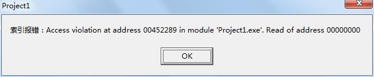
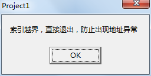
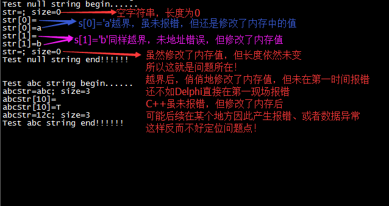
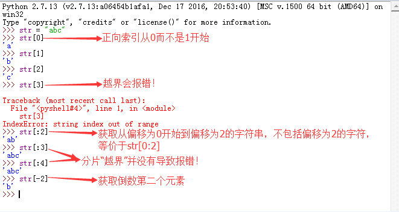

>下面讲到的这个点虽小、没啥技术含量，但犯错的概率还是挺高的！

## Delphi6的字符串

在通过下标索引读写Delphi6字符串的时候，首先判断下标索引是不是越界，否则会导致地址报错，比如下面这段代码

```
procedure TForm1.btn1Click(Sender: TObject);
var
  str: string;
  index: Integer;
begin
  try
    str := '';
    index := 1;
    if ('1' = str[index]) then
    begin
      ShowMessage('正确索引s[1]')
    end;
  except
    on E: Exception do
    begin
      ShowMessage('索引报错：' + E.Message);
    end;
  end;
end;
```

直接索引一个空字符串s的s[1]，会导致访问到空地址，产生如下的报错：



就像上面说的，在索引之前必须判断索引值是否越界，然后再决定下一步的逻辑

```
procedure TForm1.btn1Click(Sender: TObject);
var
  str: string;
  index: Integer;
begin
  try
    str := '';
    index := 1;
    if (index > Length(str)) then
    begin
      ShowMessage('索引越界，直接退出，防止出现地址异常');
      Exit;
    end;
    if ('1' = str[index]) then
    begin
      ShowMessage('正确索引s[1]')
    end;
  except
    on E: Exception do
    begin
      ShowMessage('索引报错：' + E.Message);
    end;
  end;
end;
```



## C++中的字符串呢？

上面讲的是Delphi6的string类型，在C++中也有string类型，之前有在[《C++对象内存模型：C++的string和Delphi的string》](http://www.xumenger.com/cpp-delphi-string-20161116/)中简单提到过：

* 首先，两者的内存模型是完全不同的
* 其次，Delphi的string从1开始索引，C++的string从0开始索引

下面针对C++的字符串测试看一下呢，编写下面的程序测试访问C++ string越界会有什么影响

```
#include <stdio.h>
#include <string>
#include <iostream>

using namespace std;

int main()
{
    cout << "Test null string begin......" << endl;
    string str = "";
    cout << "str=" << str << "; size=" << str.size() << endl;
    cout << "str[0]=" << str[0] << endl;  //索引s[0]读内存内容
    str[0] = 'a';                         //索引s[0]修改内容
    cout << "str[0]=" << str[0] << endl;  //检查是不是确实修改了内存中的值
    cout << "str[1]=" << str[1] << endl;
    str[1] = 'b';
    cout << "str[1]=" << str[1] << endl;
    cout << "str=" << str << "; size=" << str.size() << endl;
    cout << "Test null string end!!!!!!" << endl;

   
    cout << endl << endl; 
    cout << "Test abc string begin......" << endl;
    string abcStr = "abc";
    cout << "abcStr=" << abcStr << "; size=" << abcStr.size() << endl;
    abcStr[0] = '1';
    abcStr[1] = '2';
    cout << "abcStr[10]=" << abcStr[10] << endl;
    abcStr[10] = 'T';
    cout << "abcStr[10]=" << abcStr[10] << endl;
    cout << "abcStr=" << abcStr << "; size=" << abcStr.size() << endl;
    cout << "Test abc string end!!!!!!" << endl;

    return 0;
}
```

编译运行的效果如下



可以看到C++的string越界读写没有报错，但确实还是修改了内存中的值！其实这样反而更加危险！

>这里是在Linux下g++编译运行的效果，VC++等其他C++开发环境下还未做测试！

## 再去看看Python中的字符串呢

刚才说到，Delphi中string索引值越界会在第一现场导致非法地址访问报错；C++中string索引值越界虽没有直接导致非法地址访问错误，但实际上还是俏俏的修改了内存值，相比之下C++中如果因为越界在程序后续运行过程中导致问题反而是更难排查的！

现在来看看Python2中的字符串呢？！



* Python2字符串的索引从0开始
* Python2字符串索引越界会第一时间报错
* 另外，关于分片的使用可以参考[《python 字符串 索引和分片》](https://www.cnblogs.com/roicel/archive/2013/03/19/2970137.html)
