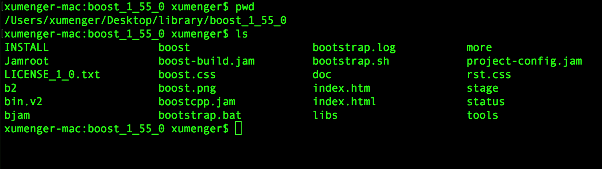
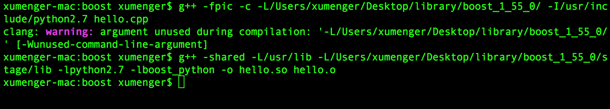
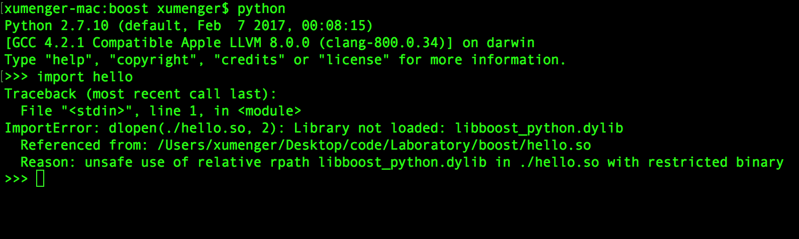

>本文展示使用ctypes、boost::python实现c/c++和python的混合编程，当然这只是一种方法的展示，除此之外还有其他的方式！包括boost::python的使用应该也不止一种！

# Python调用C函数

>完全参考[CoolShell](https://coolshell.cn/)博客[《PYTHON调用C语言函数》](https://coolshell.cn/articles/671.html)

使用Python的[ctypes](http://docs.python.org/library/ctypes.html)，我们可以直接调用由C编译出来的函数。其实就是调用动态链接库中的函数。为什么要这样做？因为有些时候，我们可能需要一个性能上比较讲究的算法；有些时候我们可以在Python中使用已经有了的现成的被封闭在动态链接库中的函数

比如，下面这样一个用C实现的加法程序

```
int add(int n1, int n2){
    return n1 + n2;
}
```

如果在Windows下，需要写成下面这样

```
#include <windows.h>

BOOL APIENTRY DllMain(HANDLE hModule, DWORD dwReason, LPVOID lpReserved){
    return TRUE;
}

__declspec(dllexport) int add(int n1, int n2){
    return n1 + n2;
}
```

Linux下用以下命令编译

```
gcc -c -fPIC libtest.c
gcc -shared libtest.o -o libtest.so
```

Windows下使用以下命令编译

```
cl -LD libtest.c -libtest.dll
```

然后在Python中如下使用（Windows的话将libtest.so改为libtest.dll即可）

```
[root@root test]# python
Python 2.6.6 (r266:84292, Sep  4 2013, 07:46:00) 
[GCC 4.4.7 20120313 (Red Hat 4.4.7-3)] on linux2
Type "help", "copyright", "credits" or "license" for more information.
>>> from ctypes import *
>>> import os
>>> libtest = cdll.LoadLibrary(os.getcwd() + '/libtest.so')
>>> print libtest.add(100, 10)
110
>>> 
```

# Boost::Python粘合C++和Python

Python已经提供了API，用于粘合Python和C。那Boost::Python又是什么？Boost::Python是Python/C API的一个封装(wrapper)。使用Python/C API，你需要在Python和C代码之间传递指针的前后，手动处理指针问题，比如指针不再指向原来的对象时，Boost::Python接管了这个任务，自动处理。此外，Boost::Python是我们能用C++的OOP方式，在Python对象上写操作

比如，对于Python代码`y = object_x[i]`，同样的功能用Python/C API实现，需要这样写

```
y = PySequence_GetItem(object_x, i);
```

作为对比，用Boost::Python这样写就好了

```
y = object_x[i];
```

>Boost::Python使得将我们的C++类输出为Python变得容易，甚至都不需要改变。Boost::Python的设计理念是：用户永远不需要接触PyObject\*

以下的事例是在Mac OS平台的实验情况，Windows、Linux还未做研究！

### 下载、编译安装boost

在浏览器中输入链接`http://jaist.dl.sourceforge.net/project/boost/boost/1.55.0/boost_1_55_0.tar.bz2`下载boost

解压缩`tar zxvf boost_1_55_0.tar.bz2`，然后进入文件夹`cd boost_1_55_0`

运行shell脚本`bash bootstrap.sh`

如果在当前目录下（比如/Users/xumenger/Desktop/library/boost_1_55_0）运行`b2`进行编译，那么在对应目录下生成如下内容



也可以`./b2 install`进行安装，执行完毕后头文件在/usr/local/include下、库文件在/usr/local/lib下

### C++导出函数

编写C++代码hello.cpp如下

```
#include <iostream>
#include <string>
#include <boost/python.hpp>

using namespace std;
using namespace boost::python;

void say()
{
   cout<<"Hello World!"<<endl;
}

BOOST_PYTHON_MODULE(hello)
{
   def("say", say);
}
```

g++使用第三方库编译是如下命令

```
g++ -fpic -c -L/Users/xumenger/Desktop/library/boost_1_55_0/ -I/usr/include/python2.7 hello.cpp
g++ -shared -L/usr/lib -L/Users/xumenger/Desktop/library/boost_1_55_0/stage/lib -lpython2.7 -lboost_python -o hello.so hello.o
```

编译结果如下



然后将/Users/xumenger/Desktop/library/boost_1_55_0/stage/lib/libboost_python.dylib拷贝到hello.so所在文件夹下

然后在hello.so所在目录启动Python，期间可能遇到ImportError的错误



参考[unsafe use of relative rpath libboost.dylib when making boost.python helloword demo?](https://stackoverflow.com/questions/33281753/unsafe-use-of-relative-rpath-libboost-dylib-when-making-boost-python-helloword-d)，运行以下命令

```
install_name_tool -change libboost_python.dylib /usr/local/lib/libboost_python.dylib hello.so 
otool -L hello.so
```

然后再在Python命令下执行即可成功！

```
xumenger-mac:boost xumenger$ python
Python 2.7.10 (default, Feb  7 2017, 00:08:15) 
[GCC 4.2.1 Compatible Apple LLVM 8.0.0 (clang-800.0.34)] on darwin
Type "help", "copyright", "credits" or "license" for more information.
>>> import hello
>>> hello.say()
Hello World!
>>> 
```

### C++导出类

编写程序testclass.cpp如下

```
#include <iostream>
#include <string>
#include <boost/python.hpp>

using namespace std;
using namespace boost::python;
  
class person  
{  
public:  
    void setname(string str)  
    {  
        name_ = str;  
    }  
  
    string getname()  
    {  
        return name_;  
    }  
      
    void setage(int age)  
    {  
        age_ = age;  
    }  
      
    int getage()  
    {  
        return age_;  
    }  
      
private:  
    string name_;  
    int age_;  
  
};

BOOST_PYTHON_MODULE(testclass)  //python模块  
{  
    class_<person>("person")  
        .def("setname", &person::setname)  
        .def("getname", &person::getname)  
        .def("setage", &person::setage)  
        .def("getage", &person::getage)  
        .add_property("name", &person::getname, &person::setname)  
        .add_property("age", &person::getage, &person::setage)  
        ;  
}  
```

编译程序，得到testclass.so

```
g++ -fpic -c -L/Users/xumenger/Desktop/library/boost_1_55_0/ -I/usr/include/python2.7 testclass.cpp
g++ -shared -L/usr/lib -L/Users/xumenger/Desktop/library/boost_1_55_0/stage/lib -lpython2.7 -lboost_python -o testclass.so testclass.o
```

执行下面命令，防止ImportError

```
install_name_tool -change libboost_python.dylib /usr/local/lib/libboost_python.dylib testclass.so 
otool -L testclass.so
```

然后开启Python进行测试

```
xumenger-mac:boost xumenger$ python
Python 2.7.10 (default, Feb  7 2017, 00:08:15) 
[GCC 4.2.1 Compatible Apple LLVM 8.0.0 (clang-800.0.34)] on darwin
Type "help", "copyright", "credits" or "license" for more information.
>>> import testclass
>>> p = testclass.person()
>>> p.setname("xumenger")
>>> p.setage(24)
>>> print p.name
xumenger
>>> print p.age
24
>>> 
```

## 参考资料

主要参考

* [《PYTHON调用C语言函数》](https://coolshell.cn/articles/671.html)
* [《boost.python编译及演示样例》](https://www.cnblogs.com/bhlsheji/p/5373344.html)
* [《Python学习：mac下使用boost.bython扩充python》](http://blog.csdn.net/kiterunner/article/details/47872121)
* [《利用Boost.Python实现Python C/C++混合编程》](http://blog.csdn.net/raby_gyl/article/details/70888387)
* [ctypes官方文档](https://docs.python.org/3/library/ctypes.html)
* [《Boost.Python简介》](https://www.cnblogs.com/zjutzz/p/6160889.html)
* [boost.python官方文档](http://www.boost.org/doc/libs/1_64_0/libs/python/doc/html/index.html)
* [unsafe use of relative rpath libboost.dylib when making boost.python helloword demo?](https://stackoverflow.com/questions/33281753/unsafe-use-of-relative-rpath-libboost-dylib-when-making-boost-python-helloword-d)

其他资料

* [《boost.python编译及示例》](http://blog.csdn.net/majianfei1023/article/details/46781581)
* [《Python C/C++混合编程》](http://blog.csdn.net/raby_gyl/article/details/70878120)
* [《Python的学习（三十二）---- ctypes库的使用整理》](http://blog.csdn.net/linda1000/article/details/12623527)
* [《利用boost将c++库封装成python模块》](http://blog.sina.com.cn/s/blog_71cc5f2101018jkp.html)
* [《Mac Boost安装及使用(命令行和Xcode)》](http://blog.csdn.net/to_be_better/article/details/53554254)
* [《caffe配置问题与解决方法集锦》](http://blog.csdn.net/u010167269/article/details/50703923)
