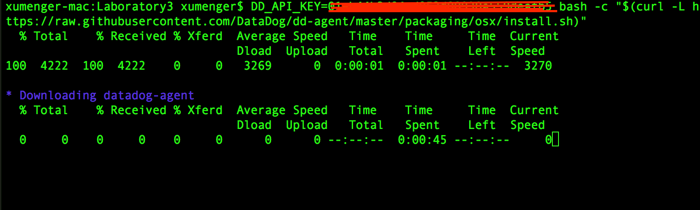

>系统并不安全，需要一只“看家护院”的【数据狗】，这只狗只会叫，不会咬人

## datadog简介

datadog agent是运行在你主机上的一款轻量级软件。它的作用就是忠心耿耿地为你收集事件和性能指标，传到datadog（需要用户在datadog网站平台上注册账户）中，以便你利用这些监控和运行数据来做点什么


它的工作方式是在每一台需要监控的服务器上运行它的Agent。Agent不但会收集这台机器的各种基础性能数据。如CPU使用率、剩余内存空间、剩余磁盘空间、网络流量等，也可以收集用户自定义的性能数据，灵活性很好

datadog也可以对各种监控的性能指标设定阀值，当指标超出阀值范围时，发出警报！

datadog另一个好用的地方在于它与众多的云服务和开源项目有整合，比如：Redis、Nginx、Slack（用来报警）……

## datadog组件

datadog agent主要由四个用Python编写的组件构成，每个组件都是单独运行的进程

* Collector(agent.py)：检查当前运行机器的集成环境，抓取系统性能指标，如内存和CPU数据
* Dogstatsd(dostatsd.py)：这是StatsD的后台服务器，它致力于**收集你从代码中发送出去的本地性能指标**
* Forwarder(ddagent.py)：Forwarder负责把Dogstatsd和Collector收集到的数据推到一个队列中，这些数据将会发往datadog
* Supervisor：由一个单独的管理进程控制。我们把它与其它组件分隔开来，因此如果你担心资源消耗而不想运行所有组件的话（虽然我们建议你这么做），可以单独运行它

>学习如何在现有基础上，扩展agent的检查内容，或者编写自己的一套版本，可以点击[这里](https://help.datadoghq.com/hc/en-us/articles/204679545-I-d-like-to-write-my-own-extend-one-of-your-integrations-to-include-additional-metrics-Is-this-possible-?spm=5176.100239.blogcont6636.10.KK3e53)学习

**Supervisors**作为一个主控根进程运行，可以fork所有的子进程为`user dd-agent`，其配置文件为`/opt/datadog-agent/etc/datadog.conf`和`/opt/datadog-agent/etc/conf.d/`。配置文件中包含了API key，以及其它访问性能指标（如mysql、postgresql metrics）所需的证书。以下端口对一般操作开放：

* 为一般操作提供的forwarder tcp/17123端口和启用了graphite服务的tcp/17124端口
* dogstatsd udp/8125

在3.4.1或以上版本中，所有监听进程都默认绑定127.0.0.1或::1。而早期版本中，他们则绑定至 0.0.0.0 （例如所有的接口）

**Collector**每15s收集一次性能指标，也支持运行基于Python的用户定义的检查内容。这些内容存储于`/etc/dd-agent/checks.d`下。用户定义的检查内容必须从抽象类AgentCheck继承，这个类定义在[checks/__init__.py](https://github.com/DataDog/dd-agent/blob/master/checks/__init__.py?spm=5176.100239.blogcont6636.13.iO6xH9&file=__init__.py)中

Forwarder监听并缓存传入的HTTP请求，接着通过HTTPS转发到Datadog中心。缓存请求使得网络可以一分为二，不影响性能指标的上报。性能指标将被缓存在内存中，直到达到必须发送的大小或数目才会发送。接着，最老的性能数据包就被丢弃，以确保forwarder有足够的存储空间

DogStatsD是用Python实现的[easy statsD](https://github.com/etsy/statsd?spm=5176.100239.blogcont6636.14.iO6xH9)性能指标整合进程，用于通过UDP协议接收和积累任意的性能指标，这样我们就可以度量自定义代码，而不会增加延迟

## 配置datadog

首先你需要在[datadog平台](https://app.datadoghq.com/account/login?next=%2Faccount%2Fsettings#agent)注册一个账户

首先需要[在你的主机上安装datadog agent](https://app.datadoghq.com/account/settings#agent)，它能收集和报告你主机的指标，这样就可以使用datadog查看和监控他们。安装这个代理通常仅需要一个命令（下面是[Mac平台的命令](https://app.datadoghq.com/account/settings#agent/mac)）

```
DD_API_KEY=???????????????????? bash -c "$(curl -L https://raw.githubusercontent.com/DataDog/dd-agent/master/packaging/osx/install.sh)"
```

运行情况大致如下



安装完成后，可以看到输出内容如下

```
* Installing datadog-agent, you might be asked for your sudo password...
Password:

    - Mounting the DMG installer...

    - Unpacking and copying files (this usually takes about a minute) ...

    - Unmounting the DMG installer ...

* Adding your API key to the Agent configuration: datadog.conf

* Restarting the Agent...


Your Agent has started up for the first time. We're currently verifying that
data is being submitted. You should see your Agent show up in Datadog shortly
at:

    https://app.datadoghq.com/infrastructure

Waiting for metrics.................................

Your Agent is running and functioning properly. It will continue to run in the
background and submit metrics to Datadog.

If you ever want to stop the Agent, please use the Datadog Agent App or
datadog-agent command.

It will start automatically at login, if you want to enable it at startup,
run these commands: (the agent will still run as your user)

    sudo cp '/opt/datadog-agent/etc/com.datadoghq.agent.plist' /Library/LaunchDaemons
    sudo launchctl load -w /Library/LaunchDaemons/com.datadoghq.agent.plist
```

只要你的代理启动并运行着，你会看到你主机的指标报告在你datadog账号下


比如上图中，可以点击xumenger这台主机的链接，看到更详细的信息，展示的是当前主机的CPU、内存、磁盘、网络等信息

## datadog agent使用说明（Mac OS）

参考其官方文档[Basic Agent Usage for OS X](https://docs.datadoghq.com/guides/basic_agent_usage/osx/)

**下面是agent的开关命令**

```
# 启动
/usr/local/bin/datadog-agent start

# 关闭
/usr/local/bin/datadog-agent stop

# 重启
/usr/local/bin/datadog-agent restart

```

**获取代理状态、信息**

```
# 检查代理是否正在运行
/usr/local/bin/datadog-agent status

# 获取代理的状态信息
/usr/local/bin/datadog-agent info

# 添加-v选项，会输出错误的回溯信息
/usr/local/bin/datadog-agent info -v

# 获取一个integration的更多的metrics, events and service checks信息
/usr/local/bin/datadog-agent check [integration]

# 添加check_rate可以获取最近更多的rate值
/usr/local/bin/datadog-agent check [integration] check_rate
```

**配置文件**

agent的配置文件位于`/opt/datadog-agent/etc/datadog.conf`，当前用户的配置位于`~/.datadog-agent/datadog.conf`

该文件包含比如下面有API Key等信息。除了API Key，还有一个叫做APP Key，可以在[https://app.datadoghq.com/account/settings#api](https://app.datadoghq.com/account/settings#api)创建一个新的APP Key

integrations的配置文件位于`/opt/datadog-agent/etc/conf.d/`，当前用户的配置位于`~/.datadog-agent/conf.d/`

**日志文件**

`/usr/local/bin/datadog-agent info`可以获取代理的信息。子系统的日志文件位于

* /var/log/datadog/supervisord.log (since 3.8.0)
* /var/log/datadog/collector.log
* /var/log/datadog/dogstatsd.log
* /var/log/datadog/forwarder.log

## datadog agent开发

首先安装datadog：`pip3 install datadog`


## 参考资料

* [datadog的github地址](https://github.com/DataDog)
* [datadog官网](https://www.datadoghq.com/)
* [官网API接口说明](https://docs.datadoghq.com/api/)
* [《Datadog Agent是啥？它消耗什么资源？》](https://yq.aliyun.com/articles/6636)
* [《生产环境下的性能监控 - Datadog》](http://tech.glowing.com/cn/performance-monitoring-with-datadog/)
* [《如何使用 Datadog 监控 NGINX（第三篇）》](https://linux.cn/article-6088-rss.html)
* [《Getting Started with the Agent》](https://docs.datadoghq.com/guides/basic_agent_usage/)
* [Getting started with DogStatsD](https://link.juejin.im/?target=http%3A%2F%2Fdocs.datadoghq.com%2Fguides%2Fdogstatsd%2F)
* [Datadog Graphing Primer](https://link.juejin.im/?target=http%3A%2F%2Fdocs.datadoghq.com%2Fgraphing%2F)
* [Datadog Monitoring Reference](https://link.juejin.im/?target=http%3A%2F%2Fdocs.datadoghq.com%2Fmonitoring%2F)
* [Datadog API Reference](https://link.juejin.im/?target=http%3A%2F%2Fdocs.datadoghq.com%2Fapi%2F)
* [Why should I install the agent on my AWS instances?](https://help.datadoghq.com/hc/en-us/articles/203657309-Why-do-I-need-to-install-the-agent-on-my-AWS-hosts-)
* [I'd like to write my own/extend one of your checks/integrations to include additional metrics. Is this possible? Does Datadog offer an SDK?](https://help.datadoghq.com/hc/en-us/articles/204679545-I-d-like-to-write-my-own-extend-one-of-your-integrations-to-include-additional-metrics-Is-this-possible-?spm=5176.100239.blogcont6636.10.KK3e53)
* [《Java 开发者最有用的监控工具有哪些呢?》](http://developer.51cto.com/art/201507/483006.htm)
* [《使用Datadog在docker环境下监控Java, Tomcat, Nginx, Kfaka, ZooKeeper》](http://www.coin163.com/it/3958864713191520387/nginx-tomcat-javaubuntulinux)
