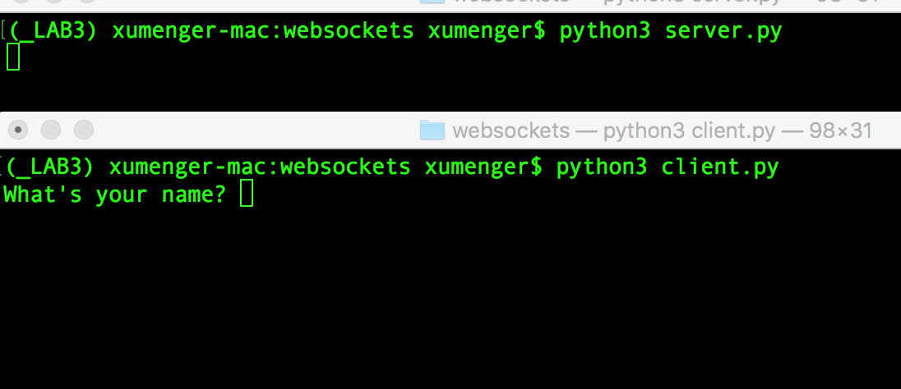
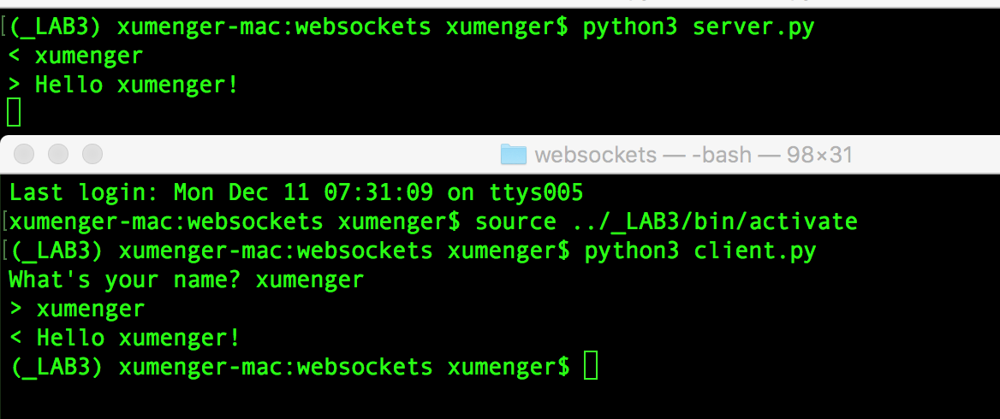

# 什么是WebSocket

首先参考[《看完让你彻底搞懂Websocket原理》](http://blog.csdn.net/frank_good/article/details/50856585)对WebSocket做一个简单的理解

### HTTP协议

HTTP有1.1和1.0之分，也就是所谓的keep-alive，把多个HTTP请求合并为一个，但Websocket其实是一个新协议，跟HTTP协议基本没有关系，只是为了兼容现有浏览器的握手规范而已，也就是说它是HTTP协议上的一种补充

WebSocket是一个持久化的协议，而HTTP这种非持久化的协议来说。HTTP的生命周期是通过请求和应答界定的，也就是一个Request对应一个Response，在HTTP1.0中，客户端发起一个请求，服务端返回一个应答，这个HTTP请求就结束了

在HTTP1.1中进行了改进，有了keep-alive，也就是说，在一个HTTP连接中，可以发送多个Request，接受多个Response，但请求和应答还是一对一的关系的，并且只有客户端发起请求，服务端才能返回应答。Response是被动的，不能由服务端主动给到客户端

### WebSocket技术解析

WebSocket是基于HTTP协议的，或者是说借用了HTTP的协议来完成一部分握手，首先来看一个典型的WebSocket握手（借用Wikipedia的）

```
GET /chat HTTP/1.1
Host: server.example.com
Upgrade: websocket
Connection: Upgrade
Sec-WebSocket-Key: x3JJHMbDL1EzLkh9GBhXDw==
Sec-WebSocket-Protocol: chat, superchat
Sec-WebSocket-Version: 13
Origin: http://example.com
```

这段类似HTTP协议的请求中，多了几个东西

```
Upgrade: websocket
Connection: Upgrade
```

这是WebSocket的核心，告诉Apache、Nginx等服务器：注意了，我现在发起的是WebSocket协议，而不是HTTP协议

```
Sec-WebSocket-Key: x3JJHMbDL1EzLkh9GBhXDw==
Sec-WebSocket-Protocol: chat, superchat
Sec-WebSocket-Version: 13
```

* Sec-WebSocket-Key是一个Base64 encode的值，这个是浏览器随机生成的，告诉服务器：我要验证你是不是真的WebSocket助理
* Sec-WebSocket-Protocol是一个用户定义的字符串，用来区别同URL下，不同的服务所需要的协议，简单的理解为：现在我需要服务A
* Sec-WebSocket-Version是高速服务器所使用的Websocket Draft（协议版本），在最初的时候，Websocket协议还在Draft阶段，各种奇奇怪怪的协议都有，而且还有很多期奇奇怪怪不同的东西，什么Firefox和Chrome用的不是一个版本之类的，当初Websocket协议太多可是一个大难题！不过现在还好，已经定下来啦

然后服务器会返回下列东西，表示已经接受到请求，成功建立WebSocket了

```
HTTP/1.1 101 Switching Protocols
Upgrade: websocket
Connection: Upgrade
Sec-WebSocket-Accept: HSmrc0sMlYUkAGmm5OPpG2HaGWk=
Sec-WebSocket-Protocol: chat
```

这里开始就是HTTP最后负责的区域了，告诉客户，我已经成功**切换协议**了

```
Upgrade: websocket
Connection: Upgrade
```

依然是固定的，告诉客户端即将升级的是Websocket协议，而不是mozillasocket，lurnarsocket或者shitsocket其它乱七八糟的协议；然后，Sec-WebSocket-Accept这个则是经过服务器确认，并且加密过后的Sec-WebSocket-Key。服务器：好了，给你看我的ID CARD来证明行了吧。后面的，Sec-WebSocket-Protocol则是表示最终使用的协议

至此，HTTP已经完成它所有工作了，接下来就是完全按照WebSocket协议进行了。具体的协议就不在这阐述了

### WebSocket和http long poll、ajax轮询比较

http long poll和ajax轮询都可以实现信息传递，那它们的区别是什么？

* ajax轮询的原理很简单，就是浏览器每隔几秒发一次请求，询问服务器是否有新信息，比如
	* 客户端：有没有新信息（request）
	* 服务端：没有（response）
	* 客户端：有没有新信息（request）
	* 服务端：没有（response）
	* 客户端：有没有新信息（request）
	* 服务端：没有（response）
	* 一直循环......
* http long poll的原理和ajax轮询差不多，都是轮询的方式，不过采取的是阻塞的模式，也就是说，客户端发起连接后，如果没有消息，就一直不返回Response给客户端。直到有消息才返回，返回完之后，客户端再次建立连接，周而复始
	* 客户端：有没有新信息，没有的话就等有了才返回给我吧（Request）
	* 服务端：额。。(等待到有消息的时候。。) 来 给你（Response）
	* 客户端：有没有新信息，没有的话就等有了才返回给我吧（Request） 
	* 服务端：额。。(等待到有消息的时候。。) 来 给你（Response）
	* 一直循环......
* WebSocket的简单进行说明
	* 客户端：我要建立WebSocket协议，需要的服务是chat，WebSocket协议版本：17（HTTP Request）
	* 服务端：ok，确认，已升级为WebSocket协议（HTTP Protocols Switched）
	* 客户端：麻烦你有信息的时候推送给我噢。。
	* 服务端：ok，有的时候会告诉你的。
	* 服务端：balabalabalabala
	* 服务端：balabalabalabala

WebSocket就变成了这样，只需要经过一次HTTP请求，就可以做到源源不断的信息传送了。（在程序设计中，这种设计叫做回调，即：你有信息了再来通知我，而不是我傻乎乎的每次跑来问你）。这样的协议解决了http long poll、ajax轮询同步有延迟，而且还非常消耗资源的这种情况！

WebSocket是类似Socket通信，Web端连接服务器后，握手成功，一直保持连接，可以理解为长连接，这时服务器就可以主动给客户端发送数据，实现数据的自动更新

使用WebSocket需要注意浏览器和当前的版本，不同的浏览器提供的支持不一样，因此设计服务器的时候，需要考虑

# 在Python3中使用websockets

websockets模块的官网是[http://websockets.readthedocs.io/en/stable/](http://websockets.readthedocs.io/en/stable/)，上面有关于websockets的详细介绍、说明。下面是官网上对其的简单说明

>websockets is a library for building WebSocket servers and clients in Python with a focus on correctness and simplicity

>Built on top of asyncio, Python’s standard asynchronous I/O framework, it provides an elegant coroutine-based API

首先安装websockets模块`pip install websockets`，要求Python的版本>=3.4

下面是一个使用Python实现的客户端

```
#!/usr/bin/env python3

import asyncio
import websockets

async def hello():
    # connect指定连接到的服务端地址
    async with websockets.connect('ws://localhost:8765') as websocket:
        # 输入用户名
        name = input("What's your name? ")
        # 发送给服务端
        await websocket.send(name)
        # 客户端自己输出用户名
        print("> {}".format(name))

        # 获取服务端的应答
        greeting = await websocket.recv()
        # 将服务端的应答输出
        print("< {}".format(greeting))

asyncio.get_event_loop().run_until_complete(hello())
```

下面是一个对应的服务端实现

```
#!/usr/bin/env python3

import asyncio
import websockets

async def hello(websocket, path):
    # 获取客户端的请求
    name = await websocket.recv()
    # 将客户端的请求输出
    print("< {}".format(name))

    # 根据客户端的请求生成应答
    greeting = "Hello {}!".format(name)
    # 将应答返回给客户端
    await websocket.send(greeting)
    # 服务端自己也输出应答
    print("> {}".format(greeting))

# 服务端绑定所监听的地址
start_server = websockets.serve(hello, 'localhost', 8765)

asyncio.get_event_loop().run_until_complete(start_server)
asyncio.get_event_loop().run_forever()
```

先`python3 server.py`启动服务端，然后`python3 client.py`启动客户端



然后在客户端输入xumenger，回车。看到如下输出



# python3的await和async关键字

>[《异步IO》](https://www.liaoxuefeng.com/wiki/0014316089557264a6b348958f449949df42a6d3a2e542c000/00143208573480558080fa77514407cb23834c78c6c7309000)

异步IO模型需要一个消息循环，在消息循环中，主线程不断地重复“读取消息-->处理消息”这一过程

```
#!/usr/bin/env python3

loop = get_event_loop()
while True:
    event = loop.get_event()
    process_event(event)
```

消息模型其实早就应用在桌面应用程序中了。一个GUI程序的主线程就负责不停地读取消息并处理。所有的键盘、鼠标等消息都被发送到GUI程序的消息队列中，然后由GUI程序的主线程处理。由于GUI线程处理键盘、鼠标等消息的速度非常快，所以用户感觉不到延迟

但假如GUI线程在一个消息处理的过程中遇到问题（比如死锁、死循环、阻塞）导致一次消息耗时长，那么用户会感觉到整个GUI程序停止响应了，敲键盘、点鼠标都没有反应。这种情况说明在消息模型中，处理一个消息必须非常迅速，否则，主线程将无法及时处理消息队列中的其他消息，导致程序看上去停止响应

### asyncio

asyncio是Python3.4版本引入的标准库，直接内置了对异步IO的支持。asyncio的编程模型就是一个消息循环。我们从asyncio模块中直接获取一个EventLoop的引用（@asyncio.coroutine把一个generator标记为coroutine类型），然后把需要执行的协程扔到EventLoop中执行，就实现了异步IO

```
#!/usr/bin/env python3

import asyncio

@asyncio.coroutine
def hello():
    print("Hello world!")
    # 异步调用asyncio.sleep(1)，可以把这个看成耗时1s的阻塞IO操作
    r = yield from asyncio.sleep(1)
    print("Hello again!")

# 获取EventLoop:
loop = asyncio.get_event_loop()
# 执行coroutine
loop.run_until_complete(hello())
loop.close()
```

运行效果如下

```
(_LAB3) xumenger-mac:websockets xumenger$ python3 async.py 
Hello world!
# 因为调用asyncio.sleep(1)，所以在这里等待1s
Hello again!
```

`hello()`会首先打印出Hello world!，然后，`yield from`语法可以让我们方便地调用另一个generator。由于`asyncio.sleep()`也是一个coroutine，所以线程不会等待`asyncio.sleep()`，而是直接中断并执行下一个消息循环。当`asyncio.sleep()`返回时，线程就可以从`yield from`拿到`asyncio.sleep(1)`返回值（此处是None），然后接着执行下一行语句

把`asyncio.sleep(1)`看成是一个耗时1秒的IO操作，在此期间，主线程并未等待，而是去执行EventLoop中其他可以执行的coroutine了，因此可以实现并发执行

因为上面只有一个task，所以看到的效果还是和顺序执行类似：print("Hello world!") -> 等待1s -> print("Hello again!")

**下面用Task封装两个coroutine，同时注意yield的用法**

```
#!/usr/bin/env python3

import threading
import asyncio

@asyncio.coroutine
def hello():
    print('Hello world! (%s)' % threading.currentThread())
    yield from asyncio.sleep(1)
    print('Hello again! (%s)' % threading.currentThread())

loop = asyncio.get_event_loop()
tasks = [hello(), hello()]
loop.run_until_complete(asyncio.wait(tasks))
loop.close()
```

运行效果如下

```
(_LAB3) xumenger-mac:websockets xumenger$ python3 async-2.py 
Hello world! (<_MainThread(MainThread, started 140736405758912)>)
Hello world! (<_MainThread(MainThread, started 140736405758912)>)
# 暂停约1s
Hello again! (<_MainThread(MainThread, started 140736405758912)>)
Hello again! (<_MainThread(MainThread, started 140736405758912)>)
```

通过上面的输出，我们可以看到以下信息

* 两个coroutine的线程信息一致，所以是由同一个线程执行的
* 先输出两个`Hello world!`，然后暂停约1s，最后输出`Hello again!`，大概的运行逻辑如下
	* 第一个Task正常输出`Hello world!`
	* 接着执行到第一个Task的`yield from asyncio.sleep(1)`，所以第一个Task阻塞了
	* 因为使用了asyncio，所以可以切换到第二个Task执行
	* 第二个Task正常输出`Hello world!`
	* 接着执行到第二个Task的`yield from asyncio.sleep(1)`，所以第二个Task阻塞了
	* 两个Task都阻塞了，所以暂停了约1s
	* 然后两个Task都阻塞完成
	* 接着开始执行第一个Task的`print('Hello again! (%s)' % threading.currentThread())`
	* 接着执行第二个Task的`print('Hello again! (%s)' % threading.currentThread())`

**试着将asyncio.sleep(1)换成time.sleep(1)**

```
#!/usr/bin/env python3

import threading
import asyncio
import time

@asyncio.coroutine
def hello():
    print('Hello world! (%s)' % threading.currentThread())
    #yield from asyncio.sleep(1)
    time.sleep(1)
    print('Hello again! (%s)' % threading.currentThread())

loop = asyncio.get_event_loop()
tasks = [hello(), hello()]
loop.run_until_complete(asyncio.wait(tasks))
loop.close()
```

运行效果如下

```
(_LAB3) xumenger-mac:websockets xumenger$ python3 async-3.py 
Hello world! (<_MainThread(MainThread, started 140736405758912)>)
# 暂停约1s
Hello again! (<_MainThread(MainThread, started 140736405758912)>)
Hello world! (<_MainThread(MainThread, started 140736405758912)>)
# 暂停约1s
Hello again! (<_MainThread(MainThread, started 140736405758912)>)
```

**再试试这样呢（自己封装一个@asyncio.coroutine的newsleep）？**

```
#!/usr/bin/env python3

import threading
import asyncio
import time

@asyncio.coroutine
def newsleep(sec):
    time.sleep(sec)
    return 100

@asyncio.coroutine
def hello():
    print('Hello world! (%s)' % threading.currentThread())
    #yield from asyncio.sleep(1)
    #time.sleep(1)
    r = yield from newsleep(1)
    print(r)
    print('Hello again! (%s)' % threading.currentThread())

loop = asyncio.get_event_loop()
tasks = [hello(), hello()]
loop.run_until_complete(asyncio.wait(tasks))
loop.close()
```

运行输入如下

```
(_LAB3) xumenger-mac:websockets xumenger$ python3 async-3.py 
Hello world! (<_MainThread(MainThread, started 140736405758912)>)
# 暂停约1s
100
Hello again! (<_MainThread(MainThread, started 140736405758912)>)
Hello world! (<_MainThread(MainThread, started 140736405758912)>)
# 暂停约1s
100
Hello again! (<_MainThread(MainThread, started 140736405758912)>)
```

>为什么自己用@asyncio.coroutine封装的newsleep()和asyncio.sleep()的运行效果完全不一样？那到底应该怎么封装？

>那真实的IO是什么样的效果？[《异步IO》](https://www.liaoxuefeng.com/wiki/0014316089557264a6b348958f449949df42a6d3a2e542c000/00143208573480558080fa77514407cb23834c78c6c7309000)中提到asyncio.sleep()可以用来模拟IO

>？？？？？

### await和async简化asyncio语法

为了简化并更好地标识异步IO，从Python 3.5开始引入了新的语法async和await

将上面讲到的第一份实例代码

```
#!/usr/bin/env python3

@asyncio.coroutine
def hello():
    print("Hello world!")
    r = yield from asyncio.sleep(1)
    print("Hello again!")
```

可以等价替换为

```
#!/usr/bin/env python3

# 把@asyncio.coroutine替换为async
async def hello():
    print("Hello world!")
    # 把yield from替换为await
    r = await asyncio.sleep(1)
    print("Hello again!")
```

剩下的代码保持不变，运行效果是一样的

### Python的asyncio和Delphi消息机制

看到asyncio的运行效果，和之前整理的[《ScktComp OnRead的回调逻辑》](http://www.xumenger.com/scktcomp-onread-test-20170329/)、[《ScktComp非阻塞网络编程的坑》](http://www.xumenger.com/socketapi-error-usage-20170404/)、[《ScktComp OnRead回调的各种诡异现象》](http://www.xumenger.com/socketapi-onread-20170406/)中Delphi的消息机制、Application.ProcessMessage的运行情况有一些类似的地方
