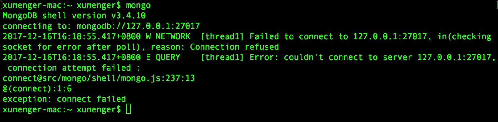
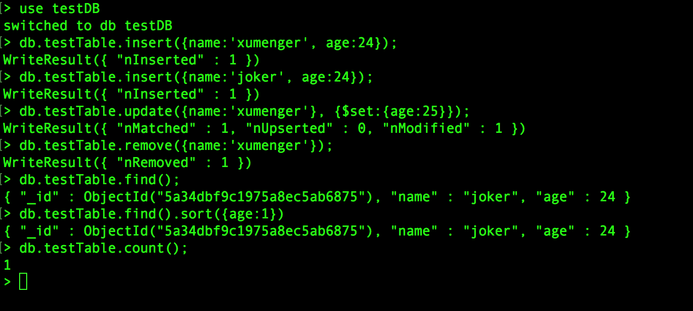
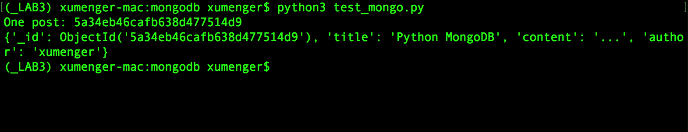

>以下简单展示MongoDB的用法，做一次感性的认知，其功能强大，远不止本文所说的这些

## 搭建开发环境

我是在Mac OS环境上做的测试，首先是安装mongodb

```
$ brew update
$ brew install mongodb
```

但是如果现在你就`mongodb`尝试启动会报错



在启动mongodb之前，需要创建一个目录，为mongodb默认的数据写入目录（默认为根目录下的/data/db），并且给可读可写权限

```
$ sudo mkdir -p /data/db
$ sudo chown `id -u` /data/db
```

然后启动mongodb服务即可

```
$ mongod
```

另外开启一个新的终端，执行下面的命令就可以连接到mongodb数据库

```
$ mongo
```

然后选择使用Python3来操作MongoDB，所以需要安装驱动

```
pip3 install pymongo
```

## 在命令行操作MongoDB

上面安装配置好mongodb后，就可以开始在命令行进行测试了（`mongod`开启服务，`mongo`连接到服务进行操作）

下面总结mongodb本身的一些命令

```
# 查询所有的数据库
> show dbs


# 查询当前数据库下所有表
> show collections


# 切换进数据库testDB，如果没有则新建一个
> use testDB


# 进入testDB
> use testDB
# 删除数据库
> db.dropDatabase();


# 进入数据库
> use testDB
# 如果有表则插入数据，否则新建表并插入数据（若未指定数据库，则默认创建在test库中）
> db.testTable.insert({name:'xumenger', age:24});
# 删除testTable
> db.testTable.drop()


# 单表的增删改
> use testDB
> db.testTable.insert({name:'xumenger', age:24});
# 新增
> db.testTable.insert({name:'joker', age:24});
# 修改
> db.testTable.update({name:'xumenger'}, {$set:{age:25}});
# 删除
> db.testTable.remove({name:'xumenger'});


# 查询myTable中所有数据
> db.testTable.find();
# 按age升序
> db.testTable.find().sort({age:1})
# 查询
> db.testTable.count();
```

>建议自己运行一下，根据输出感受一下效果



## Python操作MongoDB

编写的Python3程序如下：

```
# -*- coding: utf-8 -*-

import pymongo
from pymongo import MongoClient

# 创建客户端对象建立连接
client = MongoClient('localhost', 27017)


# 一旦你有了一个连接的MongoClient实例，可以在Mongo服务器中访问任何数据库
# 如果要访问一个数据库，可以将其当作属性访问，比如下面访问testDB数据库
db = client.testDB
# 或者可以字典形式访问
# db = client['testDB']
# 如果数据库不存在，将自动创建


# 插入文档（在数据库中存储数据）
# 首先指定你将使用哪个集合，在MongoDB中一个集合是在数据库中存储在一起的一组文档
# 集合可以理解为SQL中的表；文档可以理解为SQL中的行
# 然后是向集合插入数据
posts = db.posts
post_data = {
        'title': 'Python MongoDB',
        'content': '...',
        'author': 'xumenger'
        }
result = posts.insert_one(post_data)
print('One post: {0}'.format(result.inserted_id))

# 可以用insert_many插入多个文档
# posts.insert_many([post_1, post_2, post_3])


# 检索文档
xumenger_post = posts.find_one({'author': 'xumenger'})
print(xumenger_post)

# 可以用find查询多条记录
# scotts_posts = posts.find({'author': 'Scott'})

```

执行`python3 test_mongo.py`运行效果如下



## MongoDB和传统关系型数据库

>MongoDB是一个面向文档的，开源数据库程序，它平台无关。MongoDB像其他一些NoSQL数据库（但不是全部！）使用JSON结构的文档存储数据。这是使得数据非常灵活，不需要Schema

