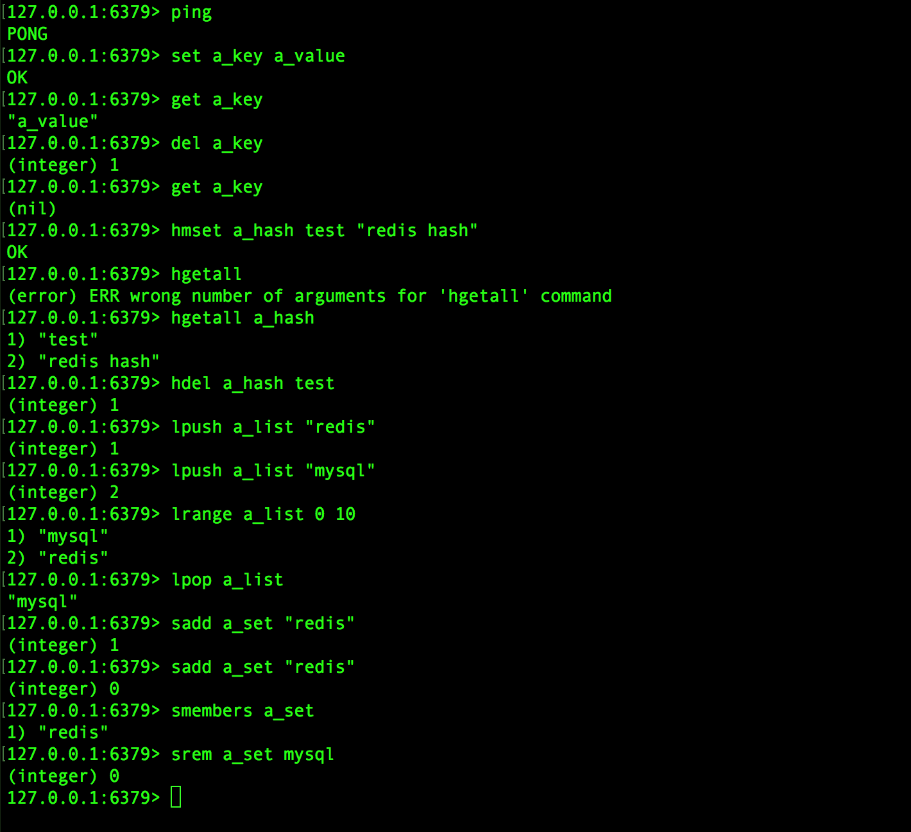
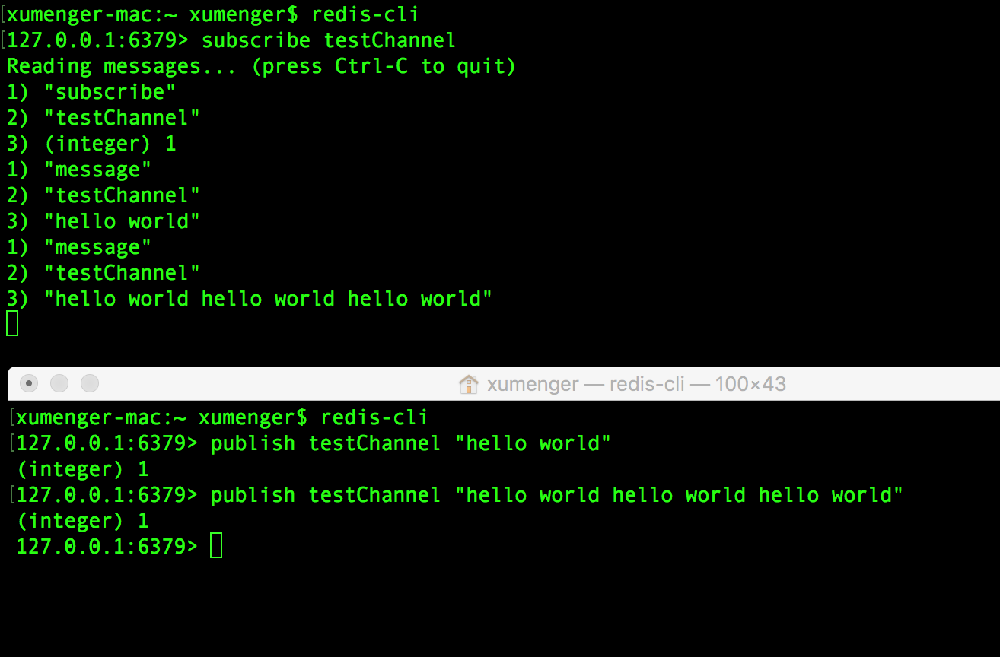

## 搭建开发环境

我是在Mac OS环境上做的测试，首先是安装redis

```
$ brew update
$ brew install redis
```

启动服务器

```
$ redis-server
```

再开启一个终端，启动客户端连接到redis服务

```
$ redis-cli
```

python3安装redis驱动

```
$ pip3 install Redis
```

## 在命令行中操作Redis

上面安装配置好redis后，就可以开始在命令行进行测试了（`redis-server`开启服务，`redis-cli`连接到服务进行操作）

下面总结redis本身的一些命令

```
# ping-pong测试
> ping


# 键命令
> set a_key a_value
> get a_key
> del a_key
> get a_key


# 哈希命令
> hmset a_hash test "redis hash"
> hgetall a_hash
> hdel a_hash test
> hdel a_hash "redis hash"


# 列表命令
> lpush a_list "redis"
> lpush a_list "mysql"
> lrange a_list 0 10
> lpop a_list


# 集合命令（集合会自动去重）
> sadd a_set "redis"
> sadd a_set "mysql"
> sadd a_set "mysql"
> smembers a_set
> srem a_set mysql
```

下面是一个实际运行的效果图（注意图中命令与上面列出的命令并不对应！）



## Redis发布订阅

发送订阅是一种消息通信模式：发布者pub发送消息，订阅者sub接收消息。发布者在接收者接收消息时发送消息。传送消息的链路称为信道。在redis中，客户端可以订阅任意数量的信道

开启一个新的终端，输入`redis-cli`连接到redis服务，订阅一个名为"testChannel"的信道

```
127.0.0.1:6379> subscribe testChannel
Reading messages... (press Ctrl-C to quit)
1) "subscribe"
2) "testChannel"
3) (integer) 1

```

然后再开启一个终端，连接到redis后，在testChannel信道上发布信息

```
127.0.0.1:6379> publish testChannel "hello world"
(integer) 1
```

然后在订阅端就可以看到信息了（当然可以继续发布更多信息）



## Python操作redis


