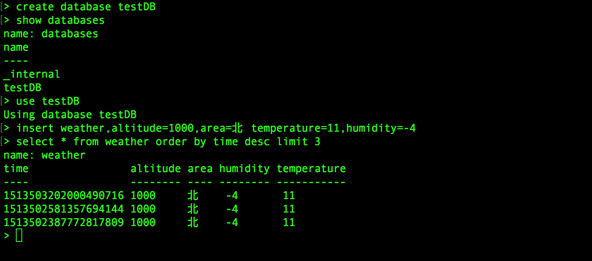
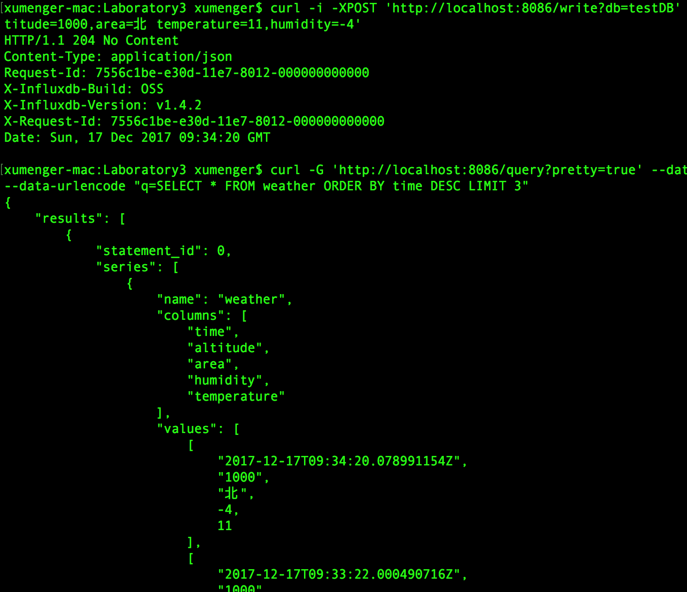
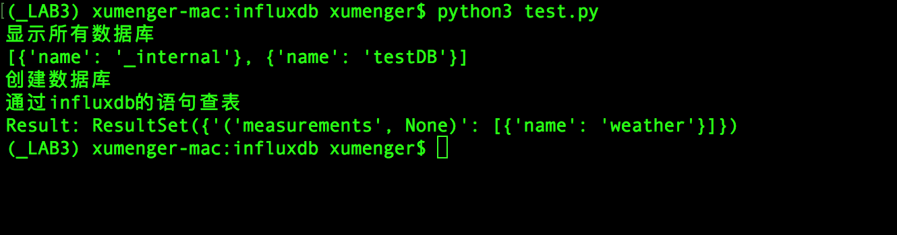
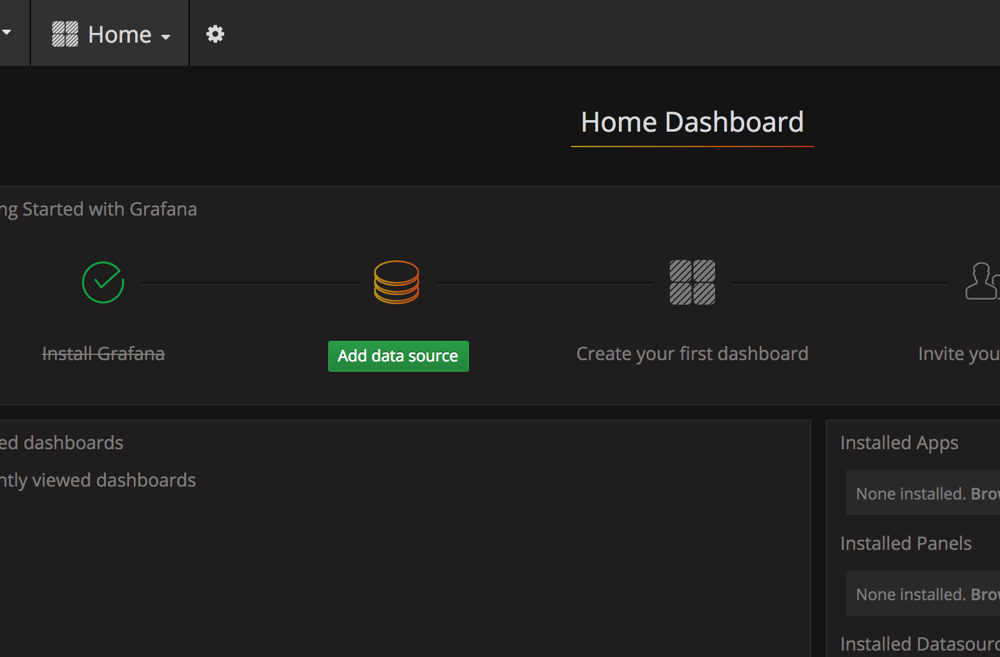
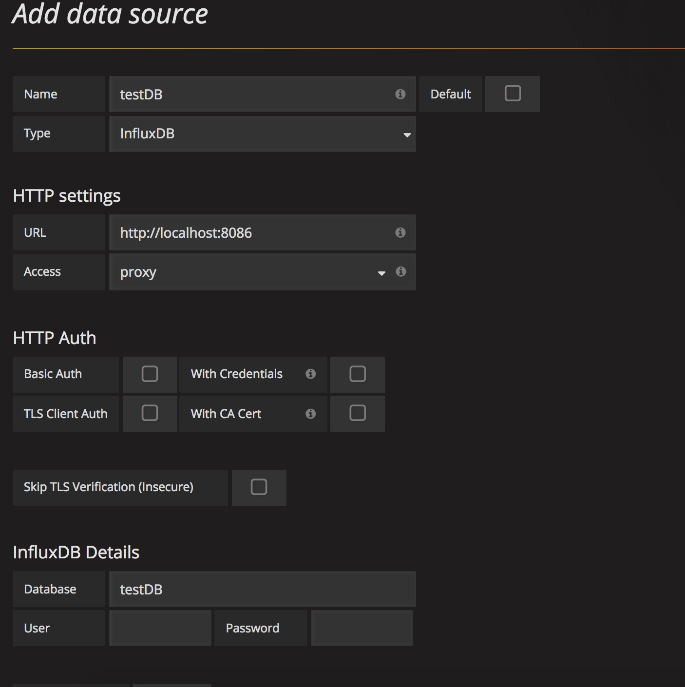

## 简介

时间序列数据库，最简单的定义就是数据格式里包含Timestamp字段的数据，比如某一时间环境的温度、CPU使用率等。时间序列数据的更重要的一个属性是如何去查询它，包括数据的过滤，计算等等（时间序列数据, 由一系列来自相同数据源, 按一定时间间隔采样的连续数据组成）

influxdb是一个开源的分布式时序、时间和指标数据库，使用go语言编写，它有三个特性

* 时序性（Time Series）：与时间相关的函数的灵活使用（诸如最大、最小、求和等）
* 度量（Metrics）：对实时大量数据进行计算
* 事件（Event）：支持任意的事件数据，换句话说，任意事件的数据我们都可以操作

granfana是一个open source的图形化数据展示工具，可以自定义datasource、自定义报表、显示数据等。grafana负责数据的展示，可以配置不同的数据源，其中包括graphite、influxdb

## 安装和配置

我是在Mac OS环境上做的测试，首先是安装grafana和influxdb

```
$ brew update
$ brew install influxdb
$ brew install grafana
```

同时说一下influxdb的两个http端口：

* 8083：管理页面端口，访问`http://localhost:8083`可以进入你本机的influxdb管理页面
* 8086：http连接influxdb client端口，一般使用该端口往本机的influxdb读写数据

再说一下grafana的端口，访问`http://localhost:3000`可以访问本地搭建的grafana，用户名跟密码都是admin

Python3安装influxdb驱动

```
$ pip3 install influxdb
```

## influxdb使用

开启一个终端，输入`influxd run`即可启动influxdb服务；再开启终端输入`influx`就能够连接到influxdb了

下面演示influx的常用命令

```
# 创建数据库
> create database "testDB"

# 删除数据库
# drop database "testDB"

# 显示所有数据库
> show databases

# 使用数据库
> use testDB

# 显示该数据库中的表
> show measurements

# 删除数据表
# drop measurements "testTable"

# 新增数据
> insert weather,altitude=1000,area=北 temperature=11,humidity=-4
weather 表名
altitude=1000, area=北 tag
temperature=11,humidity=-4 field

# 删除和修改
# 在InfluxDB中并没有提供数据的删除与修改方法
# 可以通过数据保存策略（Retention Policies）来实现删除

# 查询最新三条数据
> select * from weather order by time desc limit 3
```



另外还可以直接通过HTTP接口操作influxdb，比如插入数据、查询……

```
# 新增
$ curl -i -XPOST 'http://localhost:8086/write?db=testDB' --data-binary 'weather,altitude=1000,area=北 temperature=11,humidity=-4'

# 查询
$ curl -G 'http://localhost:8086/query?pretty=true' --data-urlencode "db=testDB"  --data-urlencode "q=SELECT * FROM weather ORDER BY time DESC LIMIT 3"
```



## Python操作infulxdb

编写简单测试程序如下

```
# -*- coding: utf-8 -*-

from influxdb import InfluxDBClient

client = InfluxDBClient('localhost', 8086, 'root', '', 'testDB')

print("显示所有数据库")
print(client.get_list_database())

print("创建数据库")
client.create_database("testDB")

# 删除数据库
# client.drop_database("testDB")

print("通过influxdb的语句查表")
result = client.query("show measurements;")
print("Result: {0}".format(result))

# 删除表
# client.query("drop measurement testTable")

```

运行效果如下



>推荐[《使用python操作InfluxDB》](https://www.cnblogs.com/MikeZhang/p/InfluxDBPythonOpt20170312.html)

## grafana使用

上面使用`brew install`安装了grafana，然后可以使用`brew services start grafana`启动服务

然后在浏览器输入`localhost:3000`，回车看到登录界面


默认账户（用户名admin、密码admin）登录系统，大概界面是这样的



上图中看到有【Add data source】，然后可以配置InfluxDB中的数据库



更多使用说明这里不做说明！

## 参考资料

* [《ELK Stack集群部署+Grafana及可视化图形》](http://blog.csdn.net/xiegh2014/article/details/54584171)
* [《使用graphite和grafana进行应用程序监控》](https://segmentfault.com/a/1190000007540752)
* [《Grafana 安装配置》](http://ju.outofmemory.cn/entry/257213)
* [《influxdb+grafana搭建业务监控平台前篇-相关环境搭建》](http://blog.csdn.net/u010185262/article/details/53118711)
* [《度量驱动开发之 InfluxDB》](http://www.jianshu.com/p/60764f9ae0d0)
* [《influxdb的简单使用》](http://www.361way.com/influxdb-user/5291.html)
* [《使用python操作InfluxDB》](https://www.cnblogs.com/MikeZhang/p/InfluxDBPythonOpt20170312.html)
* [《玩转时序数据库InfluxDB》](http://www.ywnds.com/?p=10763)
* [《使用Prometheus+Grafana监控MySQL实践》](http://www.ywnds.com/?p=9656)
* [《Grafana安装配置介绍》](http://www.ywnds.com/?p=5903)
* [《Graphite 和 grafana 集成》](https://segmentfault.com/a/1190000000693520)
* [《致这个看脸的世界 — 高颜值监控绘图工具Grafana》](http://www.jianshu.com/p/6bc606348050)
