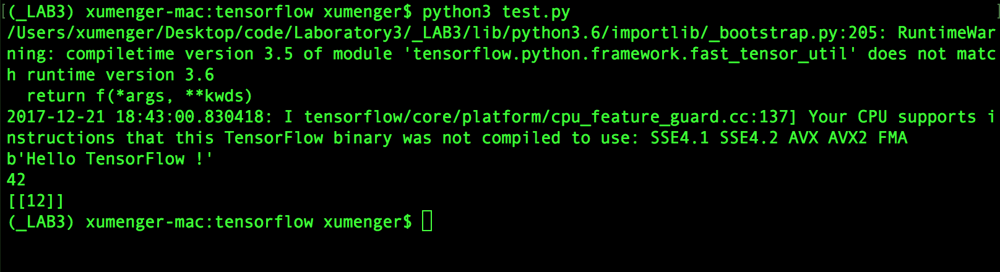
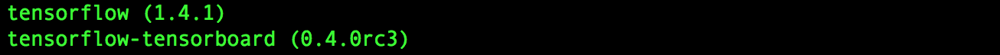
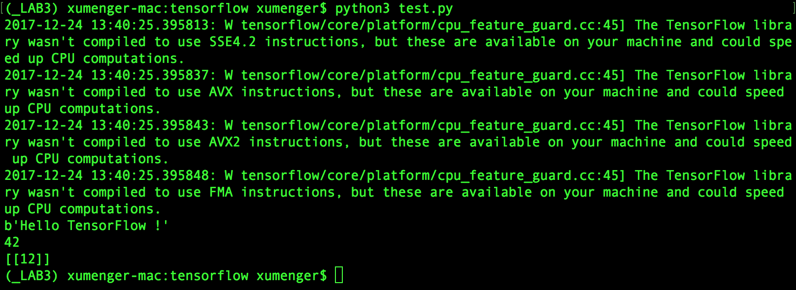

>[TensorFlow](http://www.tensorfly.cn)是一个采用数据流图（data flow graphs），用于数值计算的开源软件库。节点（nodes）在图中表示数学操作，图中的线（edges）则表示在节点之间相互联系的多维数据数组，即张量（tensor）。它灵活的架构让你可以在多种平台上展开计算，例如台式计算机中的一个或多个CPU（或GPU）、服务器、移动设备等。TensorFlow最初由Google大脑小组的研究员和工程师们开发出来，用于机器学习和深度神经网络方便的研究，但这个系统的通用性使其也可以广泛用于其他计算领域

>数据流图用节点（nodes）和线（edges）的有向图来描述数学操作，但也可以表示数据输入（feed in）的起点/输出（push out）的终点，或者是读取/写入持久变量（persistent variable）的终点。线表示节点之间的输入/输出关系。这些数据“线”可以输送“size可动态调整”的多维数据数组，即“张量”（tensor）。张量从图中流过的直观图像是这个工具取名为TensorFlow的原因。一旦输入端的所有张量准备好，节点将被分配到各种计算设备完成异步并行地执行计算


TensorFlow不是一个严格的“神经网络”库。只要你可以将你的计算表示为一个数据流图，你就可以使用TensorFlow。你来构建图，描写驱动计算的内部循环。TensorFlow提供了有用的工具来帮助你组装“子图”（常用于神经网络），当然用户也可以自己在TensorFlow基础上写自己的“上层库”。定义顺手好用的新复合操作和写一个Python函数一样容易，而且也不用担心性能损耗。当然万一你发现找不到想要的底层数据操作，你也可以自己写一点C++代码来丰富底层的操作

## Mac OS安装TensorFlow

进入Python3虚拟环境，使用pip3安装TensorFlow

```
$ source ./_LAB3/bin/active
$ pip3 install -U tensorflow
```

编写测试程序

```
# -*- coding: utf-8 -*-
import tensorflow as tf


# 输出 Hello TensorFlow !
hello = tf.constant('Hello TensorFlow !')
sess = tf.Session()
print(sess.run(hello))


# 计算 10+32 并输出
a = tf.constant(10)
b = tf.constant(32)
print(sess.run(a + b))


# 把一个1*2的矩阵和2*1的矩阵相乘并输出
matrix1 = tf.constant([[3, 3]])
matrix2 = tf.constant([[2], [2]])
product = tf.matmul(matrix1, matrix2)
ret = sess.run(product)
print(ret)


sess.close()
```

运行程序效果如下：



可以运行输出结果，但是会有警告信息

```
/Users/xumenger/Desktop/code/Laboratory3/_LAB3/lib/python3.6/importlib/_bootstrap.py:205: RuntimeWarning: compiletime version 3.5 of module 'tensorflow.python.framework.fast_tensor_util' does not match runtime version 3.6
  return f(*args, **kwds)
2017-12-24 13:27:26.113649: I tensorflow/core/platform/cpu_feature_guard.cc:137] Your CPU supports instructions that this TensorFlow binary was not compiled to use: SSE4.1 SSE4.2 AVX AVX2 FMA
```

使用`pip3 install ...`未指定版本安装，会安装最新版的包，可以使用`pip3 list`查看安装的tensorflow的版本是1.4



将其降版本到1.3.0

```
pip3 uninstall tensorflow
pip3 install tensorflow==1.3.0
```

然后再运行程序的输出结果为



程序正确执行，但是还有警告信息

```
2017-12-24 13:40:25.395813: W tensorflow/core/platform/cpu_feature_guard.cc:45] The TensorFlow library wasn't compiled to use SSE4.2 instructions, but these are available on your machine and could speed up CPU computations.
2017-12-24 13:40:25.395837: W tensorflow/core/platform/cpu_feature_guard.cc:45] The TensorFlow library wasn't compiled to use AVX instructions, but these are available on your machine and could speed up CPU computations.
2017-12-24 13:40:25.395843: W tensorflow/core/platform/cpu_feature_guard.cc:45] The TensorFlow library wasn't compiled to use AVX2 instructions, but these are available on your machine and could speed up CPU computations.
2017-12-24 13:40:25.395848: W tensorflow/core/platform/cpu_feature_guard.cc:45] The TensorFlow library wasn't compiled to use FMA instructions, but these are available on your machine and could speed up CPU computations.
```

这些警告信息的意思是：你的机器上有这些指令集可以用，并且用了他们会加快你的ＣＰＵ运行速度，但是你的TensorFlow在编译的时候并没有用到这些指令集

这部分不影响TensorFlow的使用，暂不解决！

