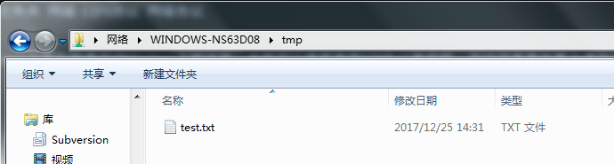
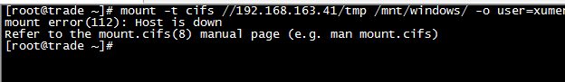

# 环境部署

文件放在Windows平台，但需要在Linux上开发程序访问Windows上的文件。当然可以使用使用FTP协议来实现，不过还有其他更方便的方式：Linux挂载Windows共享文件夹

* Windows 7 64位
* Red Hat Enterprise Linux Server release 6.5（可以用`cat /etc/issue`查看）


>本文主要介绍在Linux上访问Windows的共享文件；对应的如何配置使Windows访问Linux文件，可以参考[《Linux 和 Windows 之间共享文件之 samba》](https://segmentfault.com/a/1190000005821820)

### 在Windows上共享文件夹

首先共享Windows上的某个文件夹，比如E盘下的tmp文件夹，右键共享


然后选择对应的用户和权限（用户包含公司域名，所以马赛克了，比如用户名是xumeng13245@company.com）


然后共享成功，可以看到共享文件夹的URL是`file://WINDOWS-NS63D08/tmp`


可以在本机上打开一个窗口，输入这个地址测试是否可以访问



也可以使用使用IP的方式访问，在Windows上打开cmd窗口，输入`ipconfig`可以看到本机的IP


然后也可以在文件管理器中输入`\\192.168.163.41\tmp`或者file://192.168.163.41/tmp`这个地址来访问


为了让Linux可以远程访问，需要开启Windows的SMB服务，【控制面板】->【网络和Internet】->【网络和共享中心】->【高级共享设置】->【家庭或工作】


### 在Linux上进行挂载

Linux上挂载磁盘的命令是mount，这次挂载Windows的共享文件也是用到mount命令

```
# yum install cifs-utils
# yum install samba
# service smb restart
# mkdir /mnt/tmp
# mount -t cifs //192.168.163.41/tmp /mnt/tmp/ -o user=xumeng13245@company.com,password=*******,vers=2.0,rw,dir_mode=0777,file_mode=0777
```

mount命令的选项解释：

* user：远程访问备份服务器的用户名
* password：指定对应的密码
* rw：读写权限
* dir_mode=目录模式，访问目录的权限设置
* file_mode=文件模式，访问文件的权限设置

另外还有这些常用选项：

* setuid=509，因为mount需要root用户执行，这个选项可以指定某个非root用户访问远程共享文件的权限
* setgid=101，指定某个用户组

但挂载失败：



错误信息为

```
mount error(112): Host is down
Refer to the mount.cifs(8) manual page (e.g. man mount.cifs)
```

参考以下网页都无法解决这个问题

* [[系统管理] linux mount windows报错](http://bbs.chinaunix.net/thread-4159535-1-1.html)
* [Cannot mount Windows 7 share with CIFS Error 112 Host is down](http://samba.2283325.n4.nabble.com/Cannot-mount-Windows-7-share-with-CIFS-Error-112-Host-is-down-td2522267.html)
* [Mount CIFS Host is down](https://serverfault.com/questions/414074/mount-cifs-host-is-down)
* [[Solved] Can no longer mount cifs - mount error(112)](https://www.centos.org/forums/viewtopic.php?t=46961)

### 自动挂载

以上方法立即生效但是在Linux主机重启后失效，永久生效方法为

修改/etc/fstab文件，文件最后加入：

```
//192.168.163.41/tmp /mnt/tmp cifs username='xumeng13245@company.com',password='*******',vers=2.0,rw,dir_mode=0777,file_mode=0777
```

或在文件/etc/rc.local添加

```
mount -t cifs //192.168.163.41/tmp /mnt/tmp -o username='xumeng13245@company.com',password='*******',vers=2.0,rw,dir_mode=0777,file_mode=0777
```

>但这样存在一个耦合问题，就是当你要挂载的Windows服务器的IP地址变更的时候，需要修改所有依赖其IP的配置文件，这个确实比较坑爹，所以这部分需要思考一下如何搞定这个高耦合问题

# Mac挂载Windows共享文件夹

上面使用的Redhat、Windows7设置共享文件夹访问失败，试着换了台机器重新试一下

* 使用一台实体的MacOS机器
* 换了一个安装在MacOS上的VMWare下的Windows 7虚拟机
* 下面配置Windows 7共享文件夹，在MacOS上访问该文件夹

参考上面的方法，在Windows上共享一个文件夹，比如是Mac文件夹，这台Windows虚拟机的IP是172.16.192.140，另外这台虚拟机的用户名密码是xumenger/123

然后在Mac上打开一个终端，输入下面的命令安装必要软件、进行挂载

```
$ su

创建挂载在Mac上的目录
# mkdir /mnt/Mac

mount_smbfs //Windows用户名@Windows的IP/共享文件夹 Mac挂载点
# mount_smbfs //xumenger@172.16.192.140/Mac /mnt/Mac/

# cd /mnt/Mac/
# ls

修改文件内容
# vim test.txt
```


去虚拟机中的Windows下打开test.txt，发现修改生效了


如果想卸载该网络文件系统，使用`umount /mnt/Mac/`

# 文件系统

在工程架构领域中，存储是一个非常重要的方向，从低至上，大概分为以下几个层次：

* 硬件层：磁盘，SSD、SAS、NAS、RAID等硬件层的基本原理
* 操作系统层：即文件系统，操作系统如何将各个硬件管理并对上提供更高层次接口
* 单机引擎层：常见存储引擎对应单机引擎原理、利用文件系统接口提供更高级别的存储系统接口
* 分布式层：如何将多个单机引擎合成一个分布式存储系统
* 查询层：用户典型的查询语义表达以及解析

文件系统很重要的一点是它如何管理好硬件提供的磁盘空间。大概有下面几种典型的管理磁盘的技术方案

**连续分配**就是在创建文件的时候，给分配一组连续的块。再单独拿出一块地方存储各个文件的meta信息，meta信息很简单，包括文件名、起始地址和长度即可。这个存放meta信息的地方叫做FAT（文档分配表）


**链式分配**将文件块像链表一样管理起来，每个块中放一个指针，指针指向下一个文件块所在的位置。这样在FAT中存储也很简单，只需要存储文件名、起始块号和结束块号


**索引分配**是一个折中方案，也是现在大部分文件系统采用的方案，它综合了连续分配和链式分配的好处。该方案会在FAT中保存所有文件块的位置，各文件系统都有一套自己对应的细节分配策略，会保证一个文件尽量连续的同时，有避免出现大量的磁盘碎片


### 网络文件系统NFS

NFS的主要功能是通过网络让不同的机器系统之间可以彼此共享文件和目录。NFS服务器可以允许NFS客户端将远端NFS服务器端的共享目录挂载到本地的NFS客户端中。在本地的NFS客户端的机器看来，NFS服务器端共享的目录就好像自己的磁盘分区和目录一样


NFS是通过网络来进行服务端和客户端之间的数据传输。两者之间要传输数据就要有相对应的网络端口来进行传输。NFS服务器到底使用什么网络端口来传输数据的，NFS服务器端其实是随机选择端口来进行数据传输的（因为NFS有很多功能，不同的功能需要使用不同的端口。因此NFS无法固定端口）。那NFS客户端又是如何知道NFS服务器端到底使用的是哪个端口呢？其实NFS服务器是通过远程过程调用（Remote Procedure Call，简称RPC）协议/服务来实现的。也就是说RPC服务会统一管理NFS的端口，客户端和服务端通过RPC来先沟通NFS使用了哪些端口，之后再利用这些端口来进行数据的传输

NFS通信也是通过RPC方式进行通信的


在多个Linux系统之间共享文件可以通过使用NFS协议解决

>这是计算机领域典型思想的应用：大多数的问题都可以通过加一个中间层来解决！

### 通用网络文件系统CIFS

CIFS(Common Internet File System)，即网络文件系统，CIFS协议的前身是SMB协议（前面的内容也看到了Redhat尝试使用mount -t cifs就是使用CIFS协议，Mac使用mount_smbfs则是使用SMB协议），被大部分的Windows、商业服务器、存储应用支持

CIFS是一个新提出的协议，它使程序可以访问远程Internet计算机上的文件并要求此计算机的服务。CIFS使用客户/服务器模式。客户程序请求远在服务器上的服务器程序为它提供服务。服务器获得请求并返回响应。CIFS是公共的或开放的SMB协议版本，并由Microsoft使用。SMB协议现在是局域网上用于服务器文件访问和打印的协议。像SMB协议一样，CIFS在高层运行，而不像TCP/IP协议那样运行在底层。CIFS可以看做是应用程序协议如文件传输协议和超文本传输协议的一个实现

一般来说，CIFS使用户得到比FTP更好地对文件的控制。它提供潜在的更直接地服务器程序接口，这比使用HTTP协议的浏览器更好。CIFS最典型的应用是Windows用户能从“网上邻居”中找到网络中的其他主机并访问其中的共享文件夹


>[Common Internet File System](https://technet.microsoft.com/library/cc939973.aspx): When there is a request to open a shared file, the I/O calls the redirector, which in turn requests the redirector to choose the appropriate transport protocol. For NetBIOS requests, NetBIOS is encapsulated in the IP protocol and transported over the network to appropriate server. The request is passed up to the server, which sends data back to satisfy the request

# 后记

首先！

为什么这篇文章最开始配置的时候，总是会出现`host is down`的报错，到底问题出现在Windows的配置还是Linux的配置上？！

另外！

Windows下提供API(LockFile、UnlockFile等)实现对本地文件的指定字节长度的加锁和解锁；Linux下同样也有对应的接口(lockf()、fcntl()等)。但如果使用CIFS实现在Linux上访问Windows文件夹，那么如何对文件进行加锁？！这种跨操作系统的文件系统访问如何解决并发下的数据一致性问题？！

[《CIFS 下opportunistic locks（机会锁）》](http://blog.csdn.net/moyana/article/details/45539041)貌似给出了可能的解决方案！目前还未针对CIFS做深入研究

总之，

遗漏点还是有点多！

### 参考资料

* [《烂泥：CentOS6.5挂载windows共享文件夹》](https://www.ilanni.com/?p=6978)
* [《linux cifs自动挂载windows硬盘或文件夹》](http://blog.csdn.net/weiyuefei/article/details/52314590)
* [《Samba服务器访问CIFS网络共享文件》](http://blog.csdn.net/Sunny_Future/article/details/78736923)
* [《创建cifs系统案例之“实现将Windows磁盘共享至Linux”》](http://blog.csdn.net/huangyanlong/article/details/47720429)
* [《怎样共享windows和linux之间的文件》](https://www.cnblogs.com/lyrichu/p/6867573.html)
* [《mount.cifs》](http://blog.csdn.net/chengm8/article/details/48495745)
* [《CIFS 下opportunistic locks（机会锁）》](http://blog.csdn.net/moyana/article/details/45539041)
* [《SMB/CIFS协议简介》](http://blog.csdn.net/stonegirl07/article/details/7227799)
* [《NAS相关协议之CIFS》](http://blog.sina.com.cn/s/blog_70398db50100yzuf.html)
* [《[转]应用SMB/CIFS协议》](https://www.cnblogs.com/dolphi/archive/2012/08/22/2651344.html)
* [《NAS和CIFS区别》](http://blog.csdn.net/guangmingsky/article/details/53180378)
* [《大话存储系列15——NFS 和 CIFS 文件系统》](http://blog.csdn.net/cymm_liu/article/details/8697948)
* [《CIFS协议详解18》](http://3y.uu456.com/bp_6mdw911eyo6i8ss1cmw1_1.html)
* [《常用共享介绍：CIFS、AFP、NFS、WebDAV》](https://www.getnas.com/2015/01/176.html)
* [《FreeNAS：创建第一个 CIFS 共享》](http://www.getnas.com/2015/01/316.html)
* [《NFS原理详解》](http://blog.51cto.com/atong/1343950)
* [《存储系统科普——文件系统介绍》](https://www.cnblogs.com/xuanku/p/io_fs.html)
* [《鳥哥的 Linux 私房菜 -- NFS 伺服器》](http://linux.vbird.org/linux_server/0330nfs.php)
* [《网络文件系统 (NFS)》](https://help.ubuntu.com/lts/serverguide/network-file-system.html)
* [《学习运维——网络文件协议-CIFS与NFS》](http://blog.csdn.net/xayddxjsjxywuhui/article/details/63692502)
* [《Linux命令大全》](http://man.linuxde.net)
* [《pNFS，NFS，CIFS三者特点及信息流区别比较》](http://blog.csdn.net/amaowolf/article/details/7619916)
* [《Common Internet File System》](https://technet.microsoft.com/library/cc939973.aspx)
* [《访问网络文件共享服务CIFS与NFS》](http://blog.csdn.net/parameter_/article/details/71057093)
* [《Linux 和 Windows 之间共享文件之 samba》](https://segmentfault.com/a/1190000005821820)
* [Mount CIFS Host is down](https://serverfault.com/questions/414074/mount-cifs-host-is-down)
* [[Solved] Can no longer mount cifs - mount error(112)](https://www.centos.org/forums/viewtopic.php?t=46961)
* [《Mac 和 Windows 文件相互共享》](http://blog.csdn.net/lxmy2012/article/details/50039213)
* [《在Mac的terminal下连接 SMB 共享的三种方法》](http://blog.csdn.net/youxiansanren/article/details/51581282)
* [《mount.cifs 中文手册》](http://www.jinbuguo.com/man/mount.cifs.html)
* [《如何在 Mac 上启用 root 用户或更改 root 密码》](https://support.apple.com/zh-cn/HT204012)
* [Mount SMB shares from the command line ](http://hints.macworld.com/article.php?story=20020610225855377)
