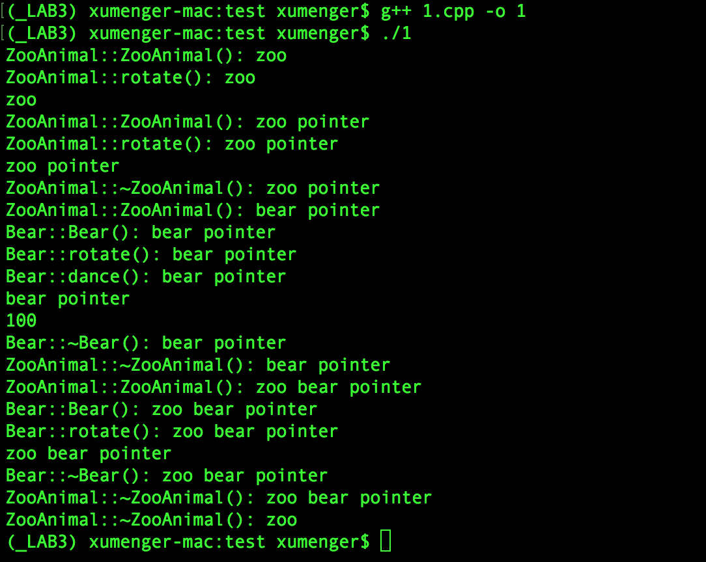
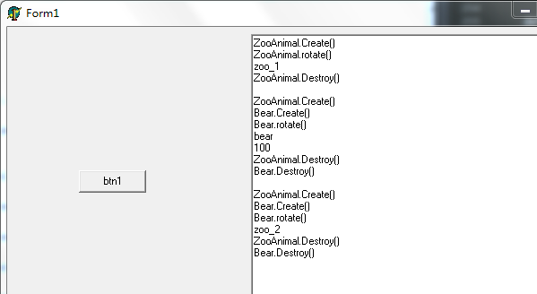
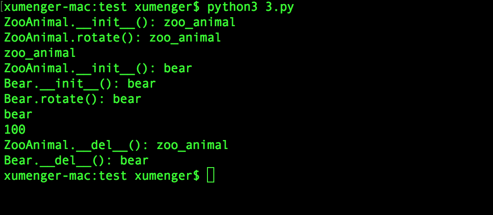
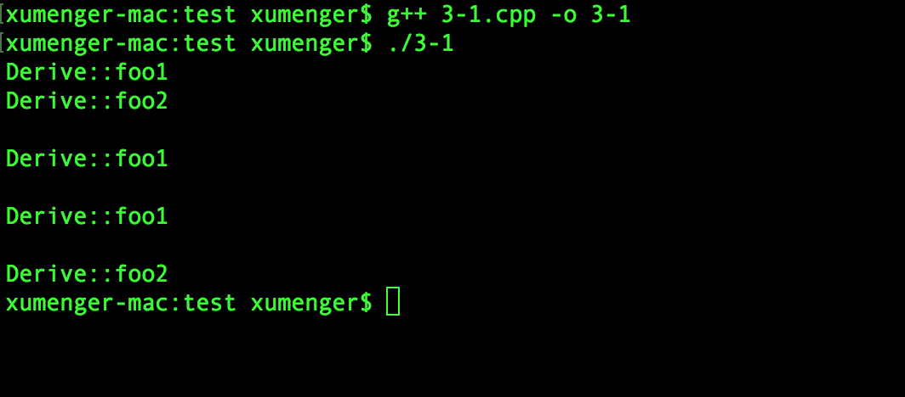
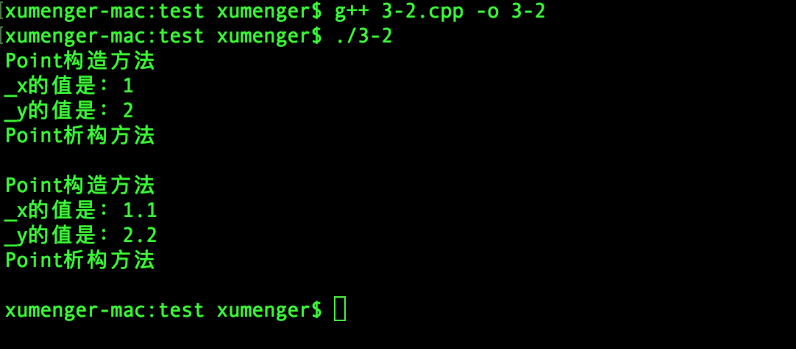
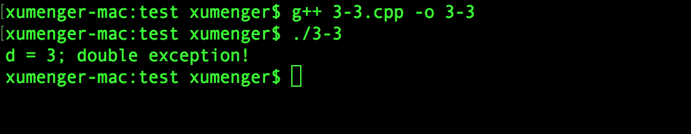

>**一篇学会C++是不存在的！！**

这篇文章只是将诸多常用的C++语言特性进行一个简单的总结，方便开发者在开发的时候快速翻阅、参考！其实这篇文章没啥意思，只是自己将以前写过的诸多内容重复再来一遍而已。不过为了保证不完全重复，会将一些C++隐藏的“坑”挑明，另外会穿插对比Delphi、Python的一些语法特性

# 面向对象

面向对象的三大基本特征：封装、继承、多态。既然提到C++大多数人想到的就是面向对象，那么就有必要对于其面向对象的语言特性在第一位进行讲解

封装很简单，就是通过定义一个类表示“现实”中的某个实体，将其属性、方法都放在类定义中

C++还支持多重继承，会在后续专门讲解，这里只是讲解简单的单继承情况！

对多态的通俗解释：定义一个基类指针，使用子类构造方法来对该指针进行构建，父类指针调用virtual方法实际会调用到子类的virtual方法。这就有一个问题：在Delphi、C++中有指针概念，但Python中没有指针，所以Delphi和C++中有多态的，Python中并没有多态语法的！

### C++面向对象

```
#include <iostream>
using namespace std;

class ZooAnimal{
    public:
        ZooAnimal( string nameval ){
            name = nameval;
            cout << "ZooAnimal::ZooAnimal(): " << name << endl;
        }
        virtual ~ZooAnimal(){
            cout << "ZooAnimal::~ZooAnimal(): " << name << endl;
        }
        virtual void rotate(){
            cout << "ZooAnimal::rotate(): " << name << endl;
        }
        string showname(){
            return name;
        }
    protected:
        string name;
};

class Bear : public ZooAnimal{
    public:
        Bear( int ageval, string nameval ) : ZooAnimal( nameval ){
            age = ageval;
            cout << "Bear::Bear(): " << name << endl;
        }
        ~Bear(){
            cout << "Bear::~Bear(): " << name << endl;
        }
        void rotate(){
            cout << "Bear::rotate(): " << name << endl;
        }
        virtual void dance(){
            cout << "Bear::dance(): " << name << endl;
        }
        int showage(){
            return age;
        }
    protected:
        int age;
};


int main()
{
    //对象在栈上
    ZooAnimal z("zoo");
    z.rotate();
    cout << z.showname() << endl;

    //对象在堆上
    ZooAnimal *p1 = new ZooAnimal("zoo pointer");
    p1->rotate();
    cout << p1->showname() << endl;
    delete p1;

    //继承
    Bear *p2 = new Bear(100, "bear pointer");
    p2->rotate();
    p2->dance();
    cout << p2->showname() << endl;
    cout << p2->showage() << endl;
    delete p2;


    //多态
    ZooAnimal *p3 = new Bear(100, "zoo bear pointer");
    p3->rotate();
    //p3是ZooAnimal，无dance()方法
    //p3->dance();
    cout << p3->showname() << endl;
    delete p3;

    return 0;
}
```

运行效果如下



### Delphi面向对象

```
unit Unit1;

interface

uses
  Windows, Messages, SysUtils, Variants, Classes, Graphics, Controls, Forms,
  Dialogs, StdCtrls;

type
  TForm1 = class(TForm)
    btn1: TButton;
    mmo1: TMemo;
    procedure btn1Click(Sender: TObject);
  private
    { Private declarations }
  public
    { Public declarations }
  end;

  ZooAnimal = class(TObject)
  public
    constructor Create(nameval: string);
    destructor Destroy(); override;
    procedure rotate(); virtual;
    function showname(): string;
  protected
    name: string;
  end;

  Bear = class(ZooAnimal)
  public
    constructor Create(ageval: Integer; nameval: string);
    destructor Destroy(); override;
    procedure rotate(); override;
    procedure dance(); virtual;
    function showage(): Integer;
  protected
    age: Integer;
  end;

var
  Form1: TForm1;

implementation

{$R *.dfm}

procedure TForm1.btn1Click(Sender: TObject);
var
  z1, z2: ZooAnimal;
  b: Bear;
begin
  z1 := ZooAnimal.Create('zoo_1');
  z1.rotate();
  Form1.mmo1.Lines.Add(z1.showname());
  z1.Free();
  Form1.mmo1.Lines.Add('');

  b := Bear.Create(100, 'bear');
  b.rotate();
  Form1.mmo1.Lines.Add(b.showname());
  Form1.mmo1.Lines.Add(IntToStr(b.showage()));
  b.Free();
  Form1.mmo1.Lines.Add('');

  z2 := Bear.Create(100, 'zoo_2');
  z2.rotate();
  Form1.mmo1.Lines.Add(z2.showname());
  //Form1.mmo1.Lines.Add(IntToStr(z2.showage()));
  z2.Free();
  Form1.mmo1.Lines.Add('');
end;

constructor ZooAnimal.Create(nameval: string);
begin
  name := nameval;
  inherited Create();
  Form1.mmo1.Lines.Add('ZooAnimal.Create()');
end;

destructor ZooAnimal.Destroy();
begin
  inherited;
  Form1.mmo1.Lines.Add('ZooAnimal.Destroy()');
end;

procedure ZooAnimal.rotate();
begin
  Form1.mmo1.Lines.Add('ZooAnimal.rotate()');
end;

function ZooAnimal.showname(): string;
begin
  Result := name;
end;

constructor Bear.Create(ageval: Integer; nameval: string);
begin
  age := ageval;
  inherited Create(nameval);
  Form1.mmo1.Lines.Add('Bear.Create()');
end;

destructor Bear.Destroy();
begin
  inherited;
  Form1.mmo1.Lines.Add('Bear.Destroy()');
end;

procedure Bear.rotate();
begin
  Form1.mmo1.Lines.Add('Bear.rotate()');
end;

procedure Bear.dance();
begin
  Form1.mmo1.Lines.Add('Bear.dance()');
end;

function Bear.showage(): Integer;
begin
  Result := age;
end;

end.
```

运行效果如下



### Python面向对象

```
class ZooAnimal(object): 
    
    def __init__(self, nameval):  
        self.name = nameval
        print("ZooAnimal.__init__(): " + self.name)

    def __del__(self):  
        print("ZooAnimal.__del__(): " + self.name)

    def rotate(self):
        print("ZooAnimal.rotate(): " + self.name)

    def showname(self):
        return self.name

class Bear(ZooAnimal):

    def __init__(self, ageval, nameval):
        super(Bear, self).__init__(nameval)
        print("Bear.__init__(): " + self.name)
        self.age = ageval

    def __del__(self):
        print("Bear.__del__(): " + self.name)

    def rotate(self):
        print("Bear.rotate(): " + self.name)

    def dance(self):
        print("Bear.dance(): " + self.name)

    def showage(self):
        return self.age


if __name__ == '__main__':
    z = ZooAnimal('zoo_animal')
    z.rotate()
    print(z.showname())

    b = Bear(100, "bear")
    b.rotate()
    print(b.showname())
    print(b.showage())

    # Python中无指针
    # 所以无法通过为父类指针调用子类构造方法创建对象以实现多态机制
    # 不赘言
```

运行效果如下



# 那些你看不到的东西

在[《STL使用上的更多细节》](http://www.xumenger.com/cpp-stl-usage-more-detail-20170916/)一文中讲到STL是基于拷贝的。其实不光是STL是基于拷贝的，C++中“拷贝”是大量存在的，在你看得见看不见的各种地方，另外还有各种看得到看不到的构造、析构！

本节讲到的东西都是C++中一些隐藏在后面的“幕后黑手”，你可能看不到，但他们实实在在的存在！而且可能不知道在什么时候绊你一跤！


http://www.xumenger.com/cpp-object-memory-01-20161113/


### 无处不在的拷贝


### 变量的作用域


### 定义虚析构方法


### 深拷贝和浅拷贝


# C++中其他常用的语法特性

C++中除了面向对象之外，还有像多重继承、模板、异常等更多的语法特性

### 多重继承

直接给一个多重继承用法的小例子：

```
#include <iostream>
using namespace std;

class Base1
{
public:
    virtual void foo1() = 0;
};

class Base2
{
public:
    virtual void foo2() = 0;
};

class Derive: public Base1, public Base2
{
public:
    virtual void foo1(){
        cout << "Derive::foo1" << endl;
    }

    virtual void foo2(){
         cout << "Derive::foo2" << endl;
    }
};


int main()
{
    Derive d;
    d.foo1();
    d.foo2();

    cout << endl;
    Base1 *p1 = &d;
    p1->foo1();

    //指针类型强行转换，没有偏移
    cout << endl;
    Base2 *p2 = (Base2 *)(p1);
    p2->foo2();

    //指针动态转换,dynamic_cast帮你偏移
    cout << endl;
    p2 = dynamic_cast<Base2 *>(p1);
    p2->foo2();

    return 0;
}
```

运行效果如下



>特别小心多重继承下的类型转换

### 模板

直接给一个模板用法的小例子：

```
#include<iostream>
using namespace std;

template<class Type>
class Point{
    public:
        Point(Type x = 0, Type y = 0){
            _x = x;
            _y = y;
            cout << "Point构造方法" << endl;
        }
        ~Point(){
            cout << "Point析构方法" << endl;
        }
        Type x(){
            cout << "_x的值是：" << _x << endl;
            return _x;
        }
        Type y(){
            cout << "_y的值是：" << _y << endl;
            return _y;
        }
    private:
        Type _x, _y;
};

int main()
{
    Point<int> *pi;
    pi = new Point<int>(1, 2);
    pi->x();
    pi->y();
    delete pi;
    cout << endl;

    Point<float> *pf;
    pf = new Point<float>(1.1, 2.2);
    pf->x();
    pf->y();
    delete pf;
    cout << endl;

    return 0;
}
```

运行效果如下



### 异常

直接给一个异常用法的小例子：

```
#include<iostream>
using namespace std;

int main()
{
    try{
        throw 3.0;
    }
    catch(int){
        cout << "int exception!" << endl;
    }
    catch(double d){
        cout << "d = "<< d << "; double exception!" << endl;
    }
    catch(...){
        cout << "unknown exception!" << endl;
    }

    return 0;
}
```

运行效果如下



# 其他

再说一遍，这里只是针对C++的最常见的一些语法特性，而其它高级特性，比如STL、Boost、智能指针、函数对象等并没有讲解

另外语言也只是工具，同样一把玄铁重剑，杨过就可以轻松的拿起来做攻守，但是大多数人根本连举都举不动（不举:(）！如何使用C++写出好的程序，还是需要依赖于如何使用C++灵活的运用算法与数据结构，以及系统调用（文件IO、网络IO、并发编程……）的熟练应用！

关于C++，最后还是推荐一个良心网站[http://en.cppreference.com/](http://en.cppreference.com/)

>本文是该系列文章的最后一篇，对之前相关研究的一个大勺汇！后面不再浪费时间在这个领域了，无用功！
