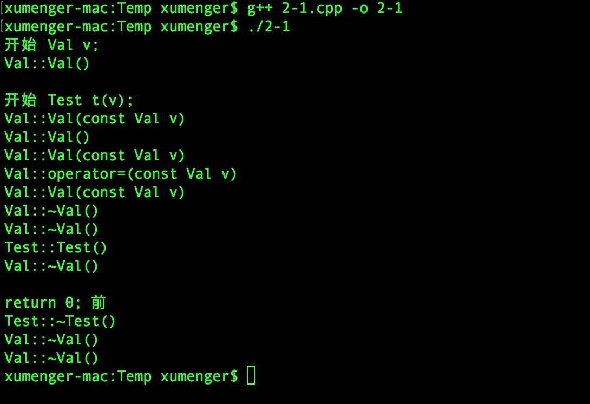

>**一篇学会C++是不存在的！！**

这篇文章只是将诸多常用的C++语言特性进行一个简单的总结，方便开发者在开发的时候快速翻阅、参考！其实这篇文章没啥意思，只是自己将以前写过的诸多内容重复再来一遍而已。不过为了保证不完全重复，会将一些C++隐藏的“坑”挑明，另外会穿插对比Delphi、Python的一些语法特性

# 面向对象

面向对象的三大基本特征：封装、继承、多态。既然提到C++大多数人想到的就是面向对象，那么就有必要对于其面向对象的语言特性在第一位进行讲解

封装很简单，就是通过定义一个类表示“现实”中的某个实体，将其属性、方法都放在类定义中

C++还支持多重继承，会在后续专门讲解，这里只是讲解简单的单继承情况！

对多态的通俗解释：定义一个基类指针，使用子类构造方法来对该指针进行构建，父类指针调用virtual方法实际会调用到子类的virtual方法。这就有一个问题：在Delphi、C++中有指针概念，但Python中没有指针，所以Delphi和C++中有多态的，Python中并没有多态语法的！

### C++面向对象

```
#include <iostream>
using namespace std;

class ZooAnimal{
    public:
        ZooAnimal( string nameval ){
            name = nameval;
            cout << "ZooAnimal::ZooAnimal(): " << name << endl;
        }
        virtual ~ZooAnimal(){
            cout << "ZooAnimal::~ZooAnimal(): " << name << endl;
        }
        virtual void rotate(){
            cout << "ZooAnimal::rotate(): " << name << endl;
        }
        string showname(){
            return name;
        }
    protected:
        string name;
};

class Bear : public ZooAnimal{
    public:
        Bear( int ageval, string nameval ) : ZooAnimal( nameval ){
            age = ageval;
            cout << "Bear::Bear(): " << name << endl;
        }
        ~Bear(){
            cout << "Bear::~Bear(): " << name << endl;
        }
        void rotate(){
            cout << "Bear::rotate(): " << name << endl;
        }
        virtual void dance(){
            cout << "Bear::dance(): " << name << endl;
        }
        int showage(){
            return age;
        }
    protected:
        int age;
};


int main()
{
    //对象在栈上
    ZooAnimal z("zoo");
    z.rotate();
    cout << z.showname() << endl;

    //对象在堆上
    ZooAnimal *p1 = new ZooAnimal("zoo pointer");
    p1->rotate();
    cout << p1->showname() << endl;
    delete p1;

    //继承
    Bear *p2 = new Bear(100, "bear pointer");
    p2->rotate();
    p2->dance();
    cout << p2->showname() << endl;
    cout << p2->showage() << endl;
    delete p2;

    //多态
    ZooAnimal *p3 = new Bear(100, "zoo bear pointer");
    p3->rotate();
    //p3是ZooAnimal，无dance()方法
    //p3->dance();
    cout << p3->showname() << endl;
    delete p3;

    return 0;
}
```

运行效果如下


### Delphi面向对象

```
unit Unit1;

interface

uses
  Windows, Messages, SysUtils, Variants, Classes, Graphics, Controls, Forms,
  Dialogs, StdCtrls;

type
  TForm1 = class(TForm)
    btn1: TButton;
    mmo1: TMemo;
    procedure btn1Click(Sender: TObject);
  private
    { Private declarations }
  public
    { Public declarations }
  end;

  ZooAnimal = class(TObject)
  public
    constructor Create(nameval: string);
    destructor Destroy(); override;
    procedure rotate(); virtual;
    function showname(): string;
  protected
    name: string;
  end;

  Bear = class(ZooAnimal)
  public
    constructor Create(ageval: Integer; nameval: string);
    destructor Destroy(); override;
    procedure rotate(); override;
    procedure dance(); virtual;
    function showage(): Integer;
  protected
    age: Integer;
  end;

var
  Form1: TForm1;

implementation

{$R *.dfm}

procedure TForm1.btn1Click(Sender: TObject);
var
  z1, z2: ZooAnimal;
  b: Bear;
begin
  z1 := ZooAnimal.Create('zoo_1');
  z1.rotate();
  Form1.mmo1.Lines.Add(z1.showname());
  z1.Free();
  Form1.mmo1.Lines.Add('');

  b := Bear.Create(100, 'bear');
  b.rotate();
  Form1.mmo1.Lines.Add(b.showname());
  Form1.mmo1.Lines.Add(IntToStr(b.showage()));
  b.Free();
  Form1.mmo1.Lines.Add('');

  z2 := Bear.Create(100, 'zoo_2');
  z2.rotate();
  Form1.mmo1.Lines.Add(z2.showname());
  //Form1.mmo1.Lines.Add(IntToStr(z2.showage()));
  z2.Free();
  Form1.mmo1.Lines.Add('');
end;

constructor ZooAnimal.Create(nameval: string);
begin
  name := nameval;
  inherited Create();
  Form1.mmo1.Lines.Add('ZooAnimal.Create()');
end;

destructor ZooAnimal.Destroy();
begin
  inherited;
  Form1.mmo1.Lines.Add('ZooAnimal.Destroy()');
end;

procedure ZooAnimal.rotate();
begin
  Form1.mmo1.Lines.Add('ZooAnimal.rotate()');
end;

function ZooAnimal.showname(): string;
begin
  Result := name;
end;

constructor Bear.Create(ageval: Integer; nameval: string);
begin
  age := ageval;
  inherited Create(nameval);
  Form1.mmo1.Lines.Add('Bear.Create()');
end;

destructor Bear.Destroy();
begin
  inherited;
  Form1.mmo1.Lines.Add('Bear.Destroy()');
end;

procedure Bear.rotate();
begin
  Form1.mmo1.Lines.Add('Bear.rotate()');
end;

procedure Bear.dance();
begin
  Form1.mmo1.Lines.Add('Bear.dance()');
end;

function Bear.showage(): Integer;
begin
  Result := age;
end;

end.
```

运行效果如下


Delphi中需要显式调用inherited来实现父类构造方法和析构方法的调用，而C++中则不是这样。另外，在类的Destroy如果没有使用override关键字，会导致最后在调用Free（内部调用Destroy）的时候，没有办法根据多态机制完全释放类对象的内存，从而出现内存泄漏（之前在工作的时候也遇到过这个问题！）

### Python面向对象

```
class ZooAnimal(object): 
    
    def __init__(self, nameval):  
        self.name = nameval
        print("ZooAnimal.__init__(): " + self.name)

    def __del__(self):  
        print("ZooAnimal.__del__(): " + self.name)

    def rotate(self):
        print("ZooAnimal.rotate(): " + self.name)

    def showname(self):
        return self.name

class Bear(ZooAnimal):

    def __init__(self, ageval, nameval):
        super(Bear, self).__init__(nameval)
        print("Bear.__init__(): " + self.name)
        self.age = ageval

    def __del__(self):
        print("Bear.__del__(): " + self.name)

    def rotate(self):
        print("Bear.rotate(): " + self.name)

    def dance(self):
        print("Bear.dance(): " + self.name)

    def showage(self):
        return self.age


if __name__ == '__main__':
    z = ZooAnimal('zoo_animal')
    z.rotate()
    print(z.showname())

    b = Bear(100, "bear")
    b.rotate()
    print(b.showname())
    print(b.showage())

    # Python中无指针
    # 所以无法通过为父类指针调用子类构造方法创建对象以实现多态机制
    # 不赘言
```

运行效果如下


# 那些你看不到的东西

在[《STL使用上的更多细节》](http://www.xumenger.com/cpp-stl-usage-more-detail-20170916/)一文中讲到STL是基于拷贝的。其实不光是STL是基于拷贝的，C++中“拷贝”是大量存在的，在你看得见看不见的各种地方，另外还有各种看得到看不到的构造、析构！

本节讲到的东西都是C++中一些隐藏在后面的“幕后黑手”，你可能看不到，但他们实实在在的存在！而且可能不知道在什么时候绊你一跤！

### 无处不在的拷贝

```
#include <iostream>
using namespace std;

class Val{
    public:
        //构造函数
        Val(){
            cout << "Val::Val()" << endl;
        }
        //拷贝构造函数
        Val(const Val &v){
            cout << "Val::Val(const Val v)" << endl;
        }
        //赋值运算符重载
        Val operator=(const Val v){
            cout << "Val::operator=(const Val v)" << endl;
            return *this;
        }
        ~Val(){
            cout << "Val::~Val()" << endl;
        }
};

class Test{
    public:
        Test(Val v){
            val = v;
            cout << "Test::Test()" << endl;
        }
        virtual ~Test(){
            cout << "Test::~Test()" << endl;
        }
    private:
        Val val;
};


int main()
{
    cout << "开始 Val v;" << endl;
    Val v;
    cout << endl;

    cout << "开始 Test t(v);" << endl;
    Test t(v);
    cout << endl;

    cout << "return 0; 前" << endl;
    return 0;
}
```



>传递参数、获取返回值这两个部分其实就是通过拷贝实现的（背后调用的是拷贝构造函数）；另外可以看到赋值符重载函数也被大量的调用！

所以修改为下面这个样子，通过使用`&`来避免拷贝

```
#include <iostream>
using namespace std;

class Val{
    public:
        //构造函数
        Val(){
            cout << "Val::Val()" << endl;
        }
        //拷贝构造函数
        //参数使用`&`引用
        Val(const Val &v){
            cout << "Val::Val(const Val &v)" << endl;
        }
        //赋值运算符重载
        //参数和返回值使用`&`引用
        Val &operator=(const Val &v){
            cout << "Val::&operator=(const Val &v)" << endl;
            return *this;
        }
        ~Val(){
            cout << "Val::~Val()" << endl;
        }
};

class Test{
    public:
        //参数使用`&`引用
        Test(Val &v){
            val = v;
            cout << "Test::Test()" << endl;
        }
        virtual ~Test(){
            cout << "Test::~Test()" << endl;
        }
    private:
        Val val;
};


int main()
{
    cout << "开始 Val v;" << endl;
    Val v;
    cout << endl;

    cout << "开始 Test t(v);" << endl;
    Test t(v);
    cout << endl;

    cout << "return 0; 前" << endl;
    return 0;
}
```

重新编译运行结果为


这里面将拷贝的问题有效的解决了，关于引用和拷贝可以参考[《C++函数传值返回和引用返回》](http://www.xumenger.com/cpp-return-reference-20170916/)和[《STL使用上的更多细节》](http://www.xumenger.com/cpp-stl-usage-more-detail-20170916/)

>下面在【深拷贝和浅拷贝】中会继续探讨赋值符重载函数的问题，主要就是考虑自赋值和深浅拷贝的问题！

### 变量的作用域

```
#include <iostream>
using namespace std;

class Test{
    public:
        Test(string nameval) {
            name = nameval;
            cout << name << "生命期开始" << endl;
        }
        virtual ~Test() {
            cout << name << "生命期结束" << endl;
        }
    private:
        string name;
};


int main()
{
    cout << "{ 外开始" << endl;
    {
        cout << "{ 内开始" << endl;

        Test t("test");

        cout << "} 内结束" << endl;
    }
    cout << "} 外结束" << endl;
    return 0;
}
```


### 定义虚析构方法

下面先看一个例子，例程中的类是简单的单一继承关系，没有用到virtual关键字，所以也就和多态没有什么关系

```
#include<iostream>

using namespace std;

class Base{
    public:
        Base(){
           cout << "父类的构造 Base()" << endl;
        }
        ~Base(){
            cout << "父类的析构 ~Base()" << endl;
        }
};

class Derived : public Base{
    public:
        Derived(){
            cout << "子类的构造 Derived()" << endl;
        }
        ~Derived(){
            cout << "子类的析构 ~Derived()" << endl;
        }
};


int main()
{
    //通过父类指针构造、析构子类对象
    Base *bpt = new Derived();
    delete bpt;
    cout << endl;

    //通过子类指针构造、析构子类对象
    Derived *dpt = new Derived();
    delete dpt;
    cout << endl;

    //直接声明一个父类对象
    Base b;
    cout << endl;

    //直接声明一个子类对象
    Derived d;
    cout << endl;

    return 0;
}
```


根据运行效果可以看到：通过父类指针构造、析构子类对象：先调用父类构造方法，再调用子类的构造方法；没有调用子类的析构方法，再调用父类的析构方法。所以如果在子类的构造方法中申请了资源，在子类的析构方法中来释放这些资源，那么明显因为子类的析构方法没有被调用会导致资源泄漏！

为了解决上面的这个问题，只需要修改一个点：将父类的析构方法定义为virtual

```
#include<iostream>

using namespace std;

class Base{
    public:
        Base(){
            cout << "父类的构造 Base()" << endl;
        }
        //父类的析构方法声明为虚方法
        virtual ~Base(){
            cout << "父类的析构 ~Base()" << endl;
        }
};

class Derived : public Base{
    public:
        Derived(){
            cout << "子类的构造 Derived()" << endl;
        }
        ~Derived(){
            cout << "子类的析构 ~Derived()" << endl;
        }
};


int main()
{
    //通过父类指针构造、析构子类对象
    Base *bpt = new Derived();
    delete bpt;
    cout << endl;

    //通过子类指针构造、析构子类对象
    Derived *dpt = new Derived();
    delete dpt;
    cout << endl;

    //直接声明一个父类对象
    Base b;
    cout << endl;

    //直接声明一个子类对象
    Derived d;
    cout << endl;

    return 0;
}
```


### 深拷贝和浅拷贝

```
#include<string.h>
#include<iostream>
using namespace std;

class String{
    public:
        String(const char *s){
            if(str != NULL){
                len = strlen(s);
                str = new char[len + 1];
                strcpy(str, s);
                cout << "构造非NULL" << endl;
            } else {
                str = new char[1];
                *str = '\0';
                len = 0;
                cout << "构造NULL" << endl;
            }
        }
        virtual ~String(){
            delete[] str;
            cout << "析构" << endl;
        }
        char *getStr(){
            cout << str << endl;
            return str;
        }
        int getLen(){
            cout << len << endl;
            return len;
        }
    
    private:
        char *str;  //指向字符串的指针
        int len;  //保存当前长度
};


int main()
{
    String a("hello");
    a.getStr();
    a.getLen();
    cout << endl;

    String b("world");
    b.getStr();
    b.getLen();
    cout << endl;

    //展示默认的拷贝构造函数
    String c(a);
    c.getStr();
    c.getLen();
    cout << endl;

    //展示默认的拷贝赋值函数
    b = a;
    b.getStr();
    b.getLen();
    cout << endl;

    return 0;
}
```


这个例子中，使用的是C++默认的拷贝构造函数、赋值符重载函数！

分析上面这个例子，a.str的内容是"hello"，b.str的内容是"world"。将a赋值给b，默认赋值函数的“按成员拷贝”意味着执行`b.str = a.str;`。同理调用默认拷贝构造函数String c(a)的时候也一样，会造成3个错误（下面以默认拷贝赋值函数为例进行讲解）

* b.str原持有的内存没有释放，造成内存泄漏，这个倒不会导致运行期报错
* b.str和a.str指向同一块内存，a或b任何一方变动都会影响另一方
* 在对象析构时（上面的例子讲到，对于类变量，会在main()函数结束时调用其析构方法），str被delete两次，这也就是上面的运行效果图中报错的原因！

上面的例子展示了如果使用C++默认生成的拷贝构造函数、拷贝赋值函数，如果在成员变量中有通过指针来动态申请和管理内存的时候会导致严重的问题。所以在这种情况下就不能再使用C++提供的默认拷贝函数，需要我们自己实现

下面的这个程序实例展示了如何自己实现拷贝函数和赋值符重载函数，保证内存的正确管理！

```
#include<string.h>
#include<iostream>
using namespace std;

class String{
    public:
        String(const char *s){
            if(str != NULL){
                len = strlen(s);
                str = new char[len + 1];
                strcpy(str, s);
                cout << "构造非NULL" << endl;
            } else {
                str = new char[1];
                *str = '\0';
                len = 0;
                cout << "构造NULL" << endl;
            }
        }
        virtual ~String(){
            delete[] str;
            cout << "析构" << endl;
        }
        //自定义拷贝构造函数
        String(const String &other){
            int l = strlen(other.str);
            str = new char[l + 1];
            strcpy(str, other.str);
            len = l;
        }
        //自定义赋值拷贝函数
        String &operator=(const String &other){
            //检查自赋值
            if(this != &other){
                //分配新的内存资源，并复制内容
                char *temp = new char[strlen(other.str) + 1];
                strcpy(temp, other.str);  //同时拷贝了'\0'
                //释放原有的内存资源
                delete[] str;
                str = temp;
                len = strlen(other.str);
            }
            //返回本对象的引用
            return *this;
        }
        char *getStr(){
            cout << str << endl;
            return str;
        }      
        int getLen(){
            cout << len << endl;
            return len;
        }

    private:
        char *str;  //指向字符串的指针
        int len;  //保存当前长度
};


int main()
{
    String a("hello");
    a.getStr();
    a.getLen();
    cout << endl;

    String b("world");
    b.getStr();
    b.getLen();
    cout << endl;

    //展示默认的拷贝构造函数
    String c(a);
    c.getStr();
    c.getLen();
    cout << endl;

    //展示默认的拷贝赋值函数
    b = a;
    b.getStr();
    b.getLen();
    cout << endl;

    return 0;
}
```


另外关于赋值符重载函数还可以参考[《一文说尽C++赋值运算符重载函数(operator=)》](https://www.cnblogs.com/zpcdbky/p/5027481.html)

# C++中其他常用的语法特性

C++中除了面向对象之外，还有像多重继承、模板、异常等更多的语法特性

### 多重继承

直接给一个多重继承用法的小例子：

```
#include <iostream>
using namespace std;

class Base1
{
    public:
        virtual void foo1() = 0;
};

class Base2
{
    public:
        virtual void foo2() = 0;
};

class Derive: public Base1, public Base2
{
    public:
        virtual void foo1(){
            cout << "Derive::foo1" << endl;
        }
        virtual void foo2(){
             cout << "Derive::foo2" << endl;
        }
};


int main()
{
    Derive d;
    d.foo1();
    d.foo2();

    cout << endl;
    Base1 *p1 = &d;
    p1->foo1();

    //指针类型强行转换，没有偏移
    cout << endl;
    Base2 *p2 = (Base2 *)(p1);
    p2->foo2();

    //指针动态转换,dynamic_cast帮你偏移
    cout << endl;
    p2 = dynamic_cast<Base2 *>(p1);
    p2->foo2();

    return 0;
}
```

运行效果如下


>特别小心多重继承下的类型转换

### 模板

直接给一个模板用法的小例子：

```
#include<iostream>
using namespace std;

template<class Type>
class Point{
    public:
        Point(Type x = 0, Type y = 0){
            _x = x;
            _y = y;
            cout << "Point构造方法" << endl;
        }
        ~Point(){
            cout << "Point析构方法" << endl;
        }
        Type x(){
            cout << "_x的值是：" << _x << endl;
            return _x;
        }
        Type y(){
            cout << "_y的值是：" << _y << endl;
            return _y;
        }
    private:
        Type _x, _y;
};


int main()
{
    Point<int> *pi;
    pi = new Point<int>(1, 2);
    pi->x();
    pi->y();
    delete pi;
    cout << endl;

    Point<float> *pf;
    pf = new Point<float>(1.1, 2.2);
    pf->x();
    pf->y();
    delete pf;
    cout << endl;

    return 0;
}
```

运行效果如下


### 异常

直接给一个异常用法的小例子：

```
#include<iostream>
using namespace std;


int main()
{
    try{
        //抛出double类型的异常
        throw 3.0;
    }
    //尝试捕获int类型的异常
    catch(int){
        cout << "int exception!" << endl;
    }
    //尝试捕获double类型的异常
    catch(double d){
        cout << "d = "<< d << "; double exception!" << endl;
    }
    //如果上面都没有捕获到，则在这里捕获
    catch(...){
        cout << "unknown exception!" << endl;
    }

    return 0;
}
```

运行效果如下


# 简单总结

再说一遍，这里只是针对C++的最常见的一些语法特性，而其它高级特性，比如STL、Boost、智能指针、函数对象等并没有讲解

另外语言也只是工具，同样一把玄铁重剑，杨过就可以轻松的拿起来做攻守，但是大多数人根本连举都举不动（不举）！如何使用C++写出好的程序，还是需要依赖于如何使用C++灵活的运用算法与数据结构，以及系统调用（文件IO、网络IO、并发编程……）的熟练应用！

关于C++，最后还是推荐一个良心网站[http://en.cppreference.com/](http://en.cppreference.com/)

>本文是该系列文章的最后一篇，对之前相关研究的一个大勺汇！后面不再浪费时间在这个领域了，无用功！

以下列出系列文章：

* [《Delphi配合VC++开发：基础数据类型对应关系》](http://www.xumenger.com/delphi-vc-dll-1-20160903/)
* [《Delphi配合VC++开发：结构体对齐机制》](http://www.xumenger.com/delphi-vc-dll-2-20160903/)
* [《Delphi配合VC++开发：Visual C++使用说明》](http://www.xumenger.com/delphi-vc-dll-3-20160903/)
* [《Delphi配合VC++开发：使用DLL进行对接》](http://www.xumenger.com/delphi-vc-dll-4-20160903/)
* [《Delphi配合VC++开发：跨语言传字符串》](http://www.xumenger.com/delphi-vc-dll-5-20160903/)
* [《C++对象内存模型：先简单展示几种典型C++类》](http://www.xumenger.com/cpp-object-memory-20161104/)
* [《C++对象内存模型：简单继承与多态下的内存模型》](http://www.xumenger.com/cpp-object-memory-01-20161105/)
* [《C++对象内存模型：编译器对C++的影响》](http://www.xumenger.com/cpp-object-memory-02-20161105/)
* [《C++对象内存模型：对象内存对齐机制》](http://www.xumenger.com/cpp-object-memory-03-20161105/)
* [《C++对象内存模型：通过重载与覆盖理解虚函数表指针》](http://www.xumenger.com/cpp-override-overload-20161106/)
* [《C++对象内存模型：构造、析构与拷贝》](http://www.xumenger.com/cpp-object-memory-01-20161113/)
* [《C++对象内存模型：模板、异常与RTTI》](http://www.xumenger.com/cpp-object-memory-02-20161113/)
* [《C++对象内存模型：C++的string和Delphi的string》](http://www.xumenger.com/cpp-delphi-string-20161116/)
* [《Delphi引用模型：Delphi和VC++通过接口进行对接》](http://www.xumenger.com/cpp-delphi-interface-20170620/)
* [《Delphi引用模型：接口的引用计数特性》](http://www.xumenger.com/delphi-interface-refcount-20170621/)
* [《C++函数传值返回和引用返回》](http://www.xumenger.com/cpp-return-reference-20170916/)
* [《STL使用上的更多细节》](http://www.xumenger.com/cpp-stl-usage-more-detail-20170916/)
* [《Delphi6结构体内存模型》](http://www.xumenger.com/windbg-delphi-record-new20170917/)
* [《通过WinDbg观察Delphi6字符串内存模型》](http://www.xumenger.com/windbg-delphi-string-20170918/)
* [《无处不在的const！》](http://www.xumenger.com/cpp-const-everywhere-20171104/)
* [《C/C++栈多维数组和堆多级指针的内存模型对比》](http://www.xumenger.com/c-n-dimensional-array-20171117/)
* [《Delphi/C++/Python小心索引字符串越界》](http://www.xumenger.com/delphi-cpp-python-string-1-20171204/)
* ......