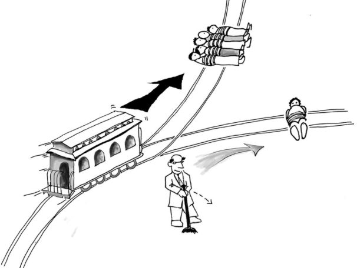
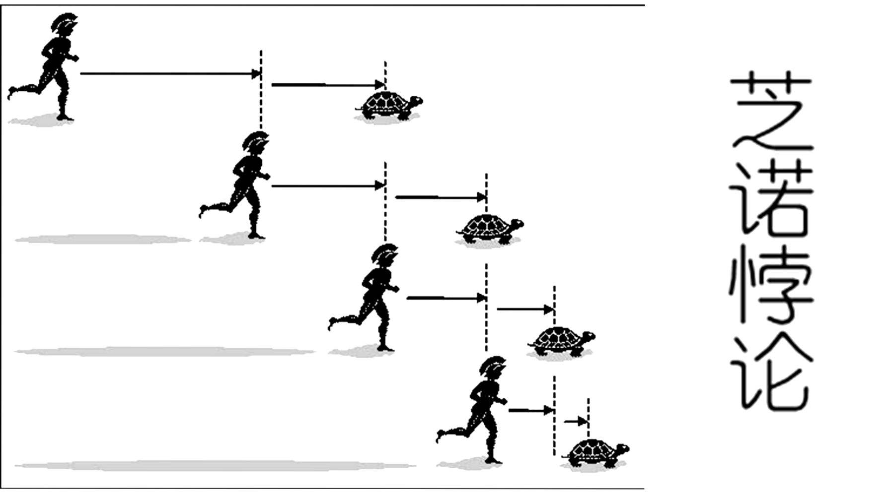
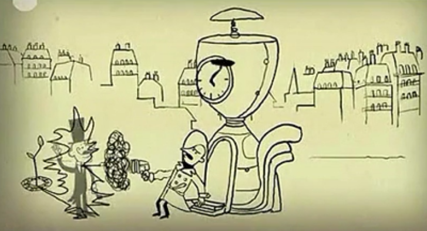
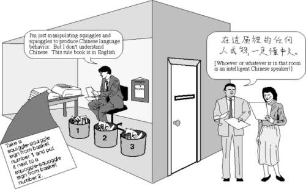
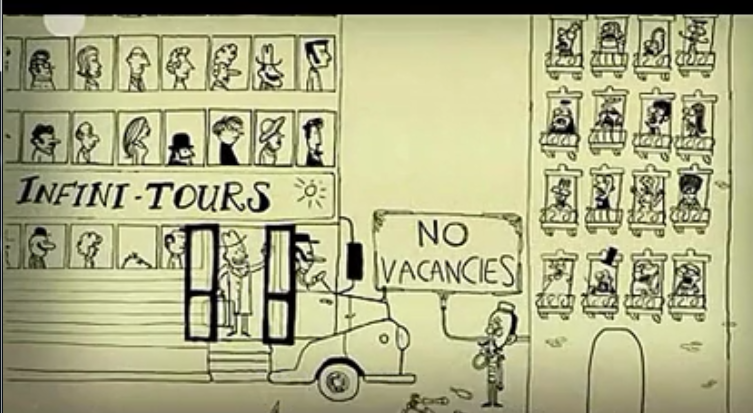
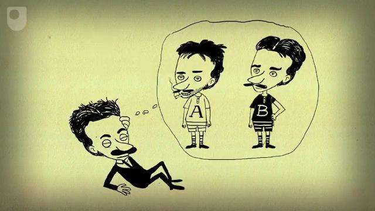
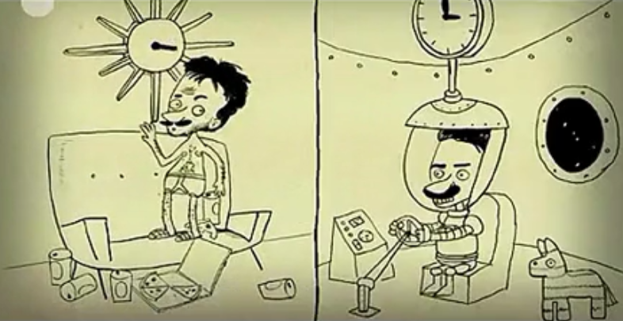
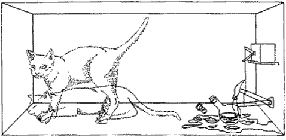

## 电车难题

先说一个伦理学领域的一个难题！



一个疯子把五个无辜的人绑在电车轨道上。一辆失控的电车朝他们开过来，并且片刻后就要碾压他们。幸运的是，你可以拉一个拉杆，让电车开到另一条轨道上。但还有一个问题，那个疯子在另一条轨道上也帮了一个无辜的人

那么你到底是要拉拉杆，还是让电车在原来的轨道上运行？

>就让我们以感受如此艰难的人生作为新年伊始的感受吧！

## 芝诺悖论

公元前5世纪，芝诺提出了悖论：小乌龟如何跑赢希腊传奇英雄阿喀琉斯？

首先，乌龟先出发，为了追上乌龟，阿喀琉斯必须先跑完乌龟跑过的距离；与此同时，乌龟又前进了一段距离，阿喀琉斯又要跑完这段距离；同时，乌龟又多跑了一段......

逻辑上，这种追逐会永远持续下去。不管乌龟和阿喀琉斯的距离多近，乌龟总能在阿喀琉斯追赶时多跑一段，意味着阿喀琉斯永远无法超越乌龟

极端地说，这个奇怪的悖论证明了所有运动都是不可能的，但它也说明了有限的东西可以被分割成无限的部分（连续和离散）

>1/2 + 1/4 + 1/8 + 1/16 + 1/32 + 1/64 + 1/128 + 1/256 + ......



“无穷级数”的概念通常被用在金融上计算支付贷款，这也是为什么贷款永远还不清的原因！

## 祖父悖论

时间旅行可能吗？法国记者雷纳·巴雅瓦（也是一位科幻作家）花了很长时间思考时间旅行的问题

1943年，雷纳·巴雅瓦提出：如果一个人穿越时间，回到他的父母出生前的时间点，杀掉他的祖父，会发生什么？



没有祖父，他的父母就不会出生，因此他自身也不应该存在，这样一开始就没有人回到过去杀掉祖父

祖父悖论看似扯淡，但却是很多哲学和物理理论的基础！

有些人试图为时间旅行辩护，他们提出了“平行宇宙理论”——时间旅行者所作出的改变会创造出一段全新的、孤立的历史，从已有的时间流中分离出来

>不过祖父悖论只是“你”回到过去杀了祖父会无法解释，但是“你”祖父穿越到现在杀了你好像没有什么解释不通的......

## 中文房间

一台机器真的能被称为“有智能的”吗？美国哲学家、罗德奖得主约翰·赛尔在1980年提出了思想实验——中文房间，挑战人工智能的概念

赛尔假设自己处在一间房间中，里面有许多装汉字的盒子（他不懂中文）和一本说明书（他可以看懂），一个说中文的人站在门外，从门缝里给赛尔传字条，赛尔可以按照说明书来选择合适的回复，门外的人就可以认为他正在和一个中文使用者对话，而实际上房间中的人不懂中文，只是一个被中文弄糊涂的哲学家



根据计算机科学之父阿兰·图灵的设想，如果一个计算机程序在和人类对话时能够被相信是一个真人，它就能被称为“能够思考的”

而“中文房间”实验则说明：不管你的程序有多好，它实际上并不能理解中文，程序只能模拟知识的内容，这并不是真正的智能

## 希尔伯特的无限旅馆

一家有着无数间房间的大旅馆，里面住着无数的房客。为了挑战对无限的理解，他提问：如果一个新房客要入住该怎么办？

他的答案是：让所有的房客都往后挪一个房间，一号房的房客挪到二号房，就像这样(n->n+1)，新来的住户就能住在一号房里了

>∞ + 1 = ∞

但如果来了一车无数的游客（当然这是假设，不可能有无数的人），希尔伯特给出的解决方法是空出无数间房间：让住户们搬到房间号两倍于原来的房间中(n->2n)，这样就空出了无数的空房间

>∞ + ∞ = ∞



这个设想吸引数学家、物理学家和哲学家甚至包括神学家的思考

>∞ × ∞ = ?

>无穷(∞)到底是多大？

## 双胞胎悖论

爱因斯坦提出了一个有趣的关于双胞胎的假设。假设有对双胞胎兄弟，叫阿尔和伯特，阿尔是个电视迷，伯特却爱旅行



伯特跳进一艘太空船，以接近光速离开，这时爱因斯坦的相对论就插进来了。相对论认为，穿越太空的速度越快，他所经历的时间就越慢。从阿尔的视角来看，伯特的时间比自己的要慢



过一段时间后，伯特决定回头，仍然以近光速飞行，带着礼物回去看他的兄弟，当伯特到家时，阿尔会变得比他要老


尽管这个悖论难以置信，但爱因斯坦只是让他的理论符合逻辑，而最终证明他是正确的

## 薛定谔的猫



埃尔文·薛定谔是物理学家、理论生物学家，同样也是“爱狗不爱猫”派。19世纪末20世纪初，科学家创立了量子力学，认为一些粒子十分微小，以至于不可能在不影响的前提下测量

理论说明，在你测量例子之前，粒子处于“叠加状态”中，同一时刻可能呈现出不同状态

为了进一步说明，薛定谔假设一只猫、一个放射性粒子同在一个盒子中，盒子中连接者毒气罐的盖革计数器，如果粒子衰变，盖革计数器就会触发，释放毒气，猫就挂了。但因为粒子同时处于两种状态（即可能衰变、可能不衰变），那么猫也可能同时处于两种状态：既是死的又是活的。直到有人开始观察盒子里才能确定猫到底是死是活

## 理发师悖论

[理发师悖论](http://wiki.mbalib.com/wiki/理发师悖论)是[罗素悖论](http://wiki.mbalib.com/wiki/%E7%BD%97%E7%B4%A0%E6%82%96%E8%AE%BA)的通俗举例，是由伯特兰·罗素在1901年提出的。罗素悖论的出现是由于朴素集合论对于元素的不加限制的定义。由于当时集合论已成为数学理论的基础，这一悖论的出现直接导致了第三次数学危机，也引发了众多的数学家对这个问题的补救，最终形成了现在的公理化集合论。同时，罗素悖论的出现促使数学家认识到将数学基础公理化的必要性

理发师悖论的内容如下：

一个城市里唯一的理发师立下了下面的规定：只帮城里那些自己不理发的人理发。那就出现一个问题：理发师应该给自己理发吗？

很明显，理发师处于两难中，因为：

* 如果理发师不给自己理发，他需要遵守规则，给自己理发
* 如果理发师给自己理发，他需要遵守规则，不给自己理发

换成集合语言：可以把集合分为两类，凡不以自身为元素的集合称为第一类集合；凡以自身为元素的集合称为第二类集合。显然每个集合或为第一类集合或为第二类集合。设A为第一类集合的全体组成的集合

* 如果A是第一类集合，由集合A的定义知：A应该是A的元素，这表明A是第二类集合
* 如果A是第二类集合，那么A是它自身的元素

>二者皆导出矛盾，而整个讨论逻辑上是没有问题的。问题只能是出现在集合的定义上

## 停机问题

>不存在这样一个程序，它能计算任何程序在给定输入上是否会结束（停机）

如何证明呢？我们可以用反证法证明！

假设某一天某个牛人真的开发出来这样的程序，只要给它一段程序（二进制描述），再给它这段程序的输入，就能告诉你这段程序可以在这个输入上会不会结束（停机）

```
bool Amazing(char *program, char *input) {
    if (<program> halts on <input>) {
        return true;
    }
    return false;
}
```

这里我们假设if的判断语句里面是这个牛人天才思考的结晶，它能够像上帝一样洞察一切程序的宿命

现在我们从这个Amazing出发导出一个新的算法（邪恶算法）

```
bool Evil(char *program) {
    if (Amazing(program, program)) {
        while(1);  //死循环
        return false;
    } else {
        return true;
    }
}
```

如果将这个算法用到它自己身上会怎么样呢？`Evil(Evil)`，我们来分析一下这个简单的调用：

* `Evil(Evil)`这个调用要么能运行结束（停机），要么不能返回（死循环）
* 如果它能结束，那么Evil算法中if判断成立`Amazing(Evil, Evil)`返回true
	* 接下来程序便进入`while(1);`死循环
	* 于是这个`Evil(Evil)`调用便永远不会返回（结束）了
* 而如果它不能结束呢，则if判断会失败
	* 接下来程序便进入`return true;`
	* 于是这个`Evil(Evil)`调用可以结束

所以这他妈就尴尬了！停也不是，不停也不是！

* 如果`Evil(Evil)`能停机，那么根据上面的程序证明出`Evil(Evil)`不能停机
* 如果`Evil(Evil)`不能停机，那么根据上面的程序证明出`Evil(Evil)`能停机

>这个看似不可捉摸的技巧背后其实隐藏着深刻的数学原理（甚至是哲学原理）
