>转载[《Lua简明教程》](https://coolshell.cn/articles/10739.html)

这几天系统地学习了一下[Lua这个脚本语言](http://www.lua.org/)，Lua脚本是一个很轻量级的脚本，也是号称性能最高的脚本，用在很多需要性能的地方，比如：游戏脚本、Nginx、WireShark的脚本，当你把它的源码下载下来编译后，你会发现解释器居然不到200k，这是多么地变态啊（/bin/sh都要1M，MacOS平台），而且能和C语言非常好的互动。我很好奇的浏览了一下Lua解释器的源码，这可能是我看过最干净的C源码了

我不想写一篇大而全的语言手册，一方面是因为已经有了（见本文后面的链接），重要的原因是，因为大篇幅的文章会挫败人的学习热情，我始终觉得好的文章读起来就像拉大便一样，能一口气很流畅地搞完，才会让人爽（这也是我为什么不想写书的原因）。所以，这必然又是一篇“入厕文章”，还是那句话，我希望本文能够让大家利用上下班，上厕所大便的时间学习一个技术。呵呵。

相信你现在已经在厕所里脱掉裤子露出屁股已经准备好大便了，那就让我们畅快地排泄吧……

# 安装运行

Mac OS上执行`brew install lua`即可完成安装

首先，我们知道，Lua是类C的，所以它是大小写字符敏感的

下面是Lua的Hello World，注意：Lua脚本的语句的分号是可选的，这个和[GO语言很类似](https://coolshell.cn/articles/8460.html)

```lua
print("Hello World")
```

你可以像Python一样，在命令行上运行Lua命令后进入Lua的Shell环境中执行语句

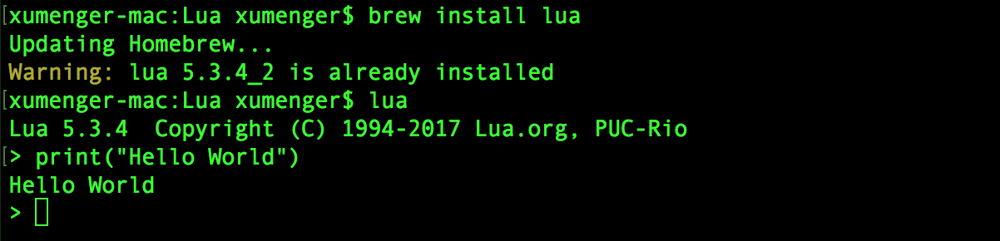

也可以把脚本存成一个文件，用lua命令来运行

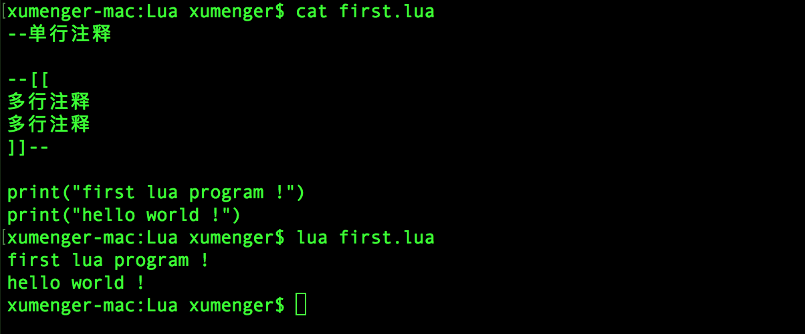

# 语法

### 注释

```lua
--两个减号是行注释
```

```lua
--[[
这是块注释
这是块注释
]]--
```

### 变量

Lua的数字只有double类型，64bits，你不必担心Lua处理浮点数会慢（除非大于100,000,000,000,000），活着会是京都问题

你可以以如下的方式表示数字，0x开头的16进制和C是很像的

```lua
num = 1024
num = 3.0
num = 3.1416
num = 314.16e-2
num = 0.31416E1
num = 0xff
num = 0x56
```

字符串你可以用单引号，也可以是双引号，还支持C类型的转义，比如： '\a' （响铃）， '\b' （退格）， '\f' （表单）， '\n' （换行）， '\r' （回车）， '\t' （横向制表）， '\v' （纵向制表）， '\"' （双引号）， 以及 '\'' （单引号)等

下面的四种方式定义了完全相同的字符串，其中的两个中括号可以用于定义有换行的字符串

```lua
a = 'alo\n123"'
a = "alo\n123\""
a = '\97lo\10\04923"'
a = [[alo
123"]]
```

C语言中的NULL在Lua中是nil，比如你访问一个没有生命过的变量，就是nil

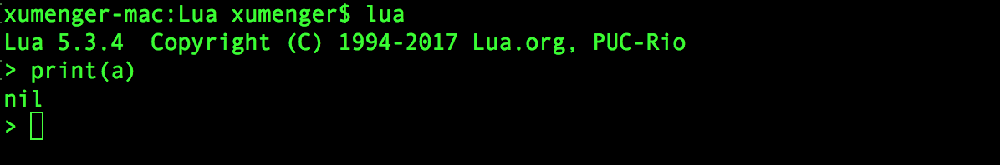

布尔类型只有nil和false是false，其它都是true，包括数字0、空字符串

另外，需要注意的是：lua中的变量如果没有特殊说明，都是全局变量，哪怕是语句块或是函数里。变量前加local关键字的是局部变量

```lua
theGlobalVar = 500
local theLocalVar = 'local variable'
```

# 控制语句

不多说了，直接看代码吧（注意：Lua没有++或+=这样的操作）

### while循环

```lua
sum = 0
num = 1
while num <= 100 do
    sum = sum + num
    num = num + 1
end

print("sum = ", sum)
```

### if-else分支

```lua
if age == 40 and sex =="Male" then
    print("男人四十一枝花")
elseif age > 60 and sex ~="Female" then
    print("old man without country!")
elseif age < 20 then
    io.write("too young, too naive!\n")
else
    local age = io.read()
    print("Your age is "..age)
end
```

上面的语句不但展示了if-else语句，也展示了：

* `~=`是不等于，而不是`!=`
* io库的分别从stdin和stdout读写的read和write函数
* 字符串的拼接使用操作符`..`

另外，条件表达式中的与或非分别是：and、or、not

### for循环

从1加到100

```lua
sum = 0
for i=1, 100 do
    sum = sum + i
end
```

从1到100的奇数和

```lua
sum = 0
for i=1, 100, 2 do
   sum = sum + i
end
```

从100到1的偶数和

```lua
sum = 0
for i=100, 1, -2 do
    sum = sum + i
end
```

### until循环

```lua
sum = 2
repeat
    sum = sum ^ 2   --幂操作
    print(sum)
until sum > 1000
```

# 函数

Lua函数和JavaScript很像

### 递归

```lua
function fib(n)
    if n < 2 then
        return 1
    end
    return fib(n-2) + fib(n-1)
end

print(fib(5))
```

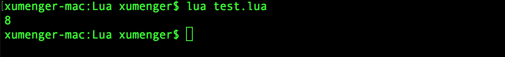

### 闭包

同样，JavaScript附体

```lua
function newCounter()
    local i = 0
    return function()      -- anonymous function
        i = i + 1
        return i
    end
end

c1 = newCounter()
print(c1())
print(c1())
```

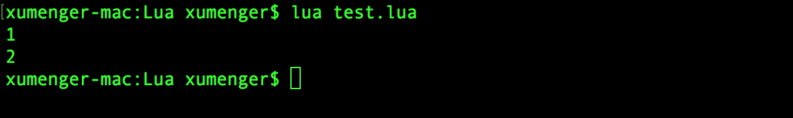

```lua
function myPower(x)
    return function(y)
        return y ^ x
    end
end

power2 = myPower(2)
power3 = myPower(3)

print(power2(4))   -->4^2
print(power3(5))   -->5^3
```

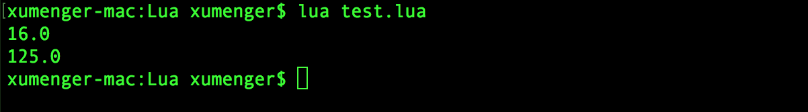

### 函数的返回值

和[GO语言一样](https://coolshell.cn/articles/8460.html)，可以一条语句上赋多个值，如：

```lua
name, age, bGay = "haoel", 37, false, "haoel@hotmail.com"
```

上面的代码中，因为只有3个变量，所以第四个值被丢弃

函数也可以返回多个值：

```lua
function getUserInfo(id)
    print(id)
    return "haoel", 37, "haoel@hotmail.com", "https://coolshell.cn"
end
 
name, age, email, website, bGay = getUserInfo()

print(name)
print(age)
print(email)
print(website)
print(bGay)
```

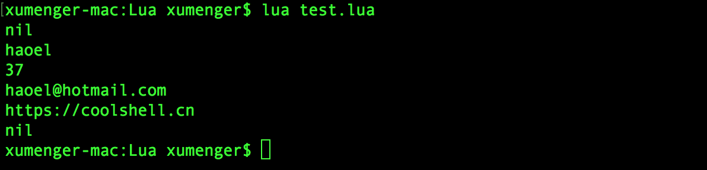

注意：上面的示例中，因为没有传id，所以函数中的id输出为nil，因为没有返回bGay，所以bGay也是nil

### 局部函数

函数前面加上local就是局部函数，其实，Lua中的函数和JavaScript中的一个德行

比如，下面的这两个函数是一样的

```lua
function foo(x) return x^2 end
foo = function(x) return x^2 end
```

# Table

所谓的Table其实就是一个Key-Value的数据结构，它很像JavaScript中的Object，或是PHP中的数组，在别的语言中叫做Dict或Map，Table长成这个样子

```lua
haoel = {name="ChenHao", age=37, handsome=True}
```

下面是Table的CRUD操作：

```lua
haoel.website="https://coolshell.cn/"
local age = haoel.age
haoel.handsome = false
haoel.name=nil
```

看上去像C/C++中的结构体，但name、age、handsome、website都是key。你还可以像下面这样定义Table

```lua
t = {[20] = 100, ['name'] = 'ChenHao', [3.14] = 'PI'}
```

这样就更像Key Value了。于是你可以这样访问：t[20]，t[“name”], t[3.14]

### 数组

我们再来看看数组

```lua
arr = {10, 20, 30, 40, 50}
```

这样看上去就像数组了，但其实等价于：

```lua
arr = {[1] = 10, [2] = 20, [3] = 30, [4] = 40, [5] = 50}
```

所以，你也可以定义成不同类型的数组，比如

```lua
arr = {"string", 100, "haoel", function() print("coolshell.cn") end}
```

其中的函数可以这样调用：`arr[4]()`

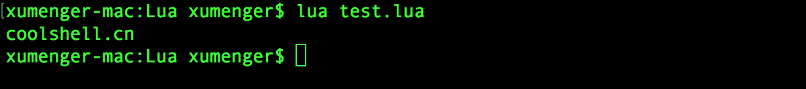

Lua中数组的下标是从1而不是0开始的

```lua
arr = {"string", 100, "haoel", function() print("coolshell.cn") end}
for i=1, #arr do
    print(arr[i])
end
```

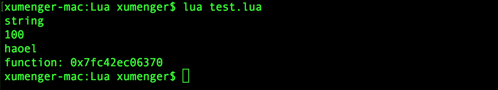

注：上面的程序中，#arr表示arr的长度

### \_G全局表

Lua中的变量，如果没有local关键字，全是全局变量，Lua也是用Table来管理全局变量的，Lua把这些全局变量放在一个叫做\_G的Table中

我们可以用下面这样的方式访问全局变量

```lua
globalvar = 'global'

print(_G.globalvar)
print(_G['globalvar'])
```

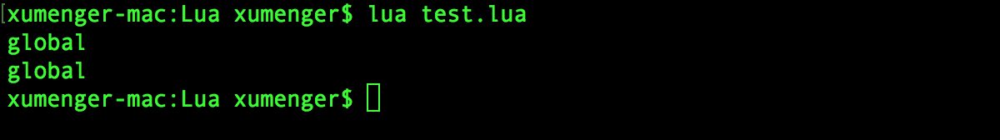

### Table的遍历

```lua
t = {key1 = 'val1', key2 = 'val2', key3 = 'val3'}
for k, v in pairs(t) do
    print(k, v)
end
```

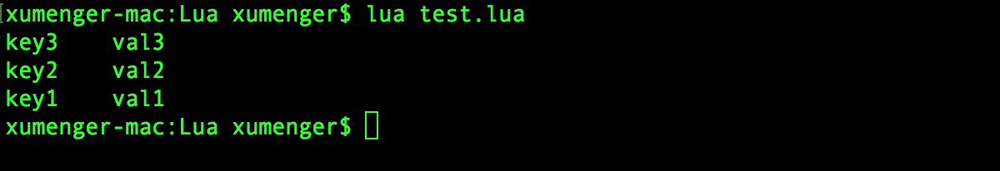

# MetaTable和MetaMethod

MetaTable和MetaMethod是Lua中重要的语法

### MetaTable

MetaTable主要是用来做一些类似于C++重载操作符的功能

比如我们有两个分数

```lua
fraction_a = {numerator=2, denominator=3}
fraction_b = {numerator=4, denominator=7}
```

想要实现分数间的相加：2/3 + 4/7，我们如果要执行： fraction_a + fraction_b，会报错的

```lua
fraction_a = {numerator=2, denominator=3}
fraction_b = {numerator=4, denominator=7}

fraction_a + fraction_b
```

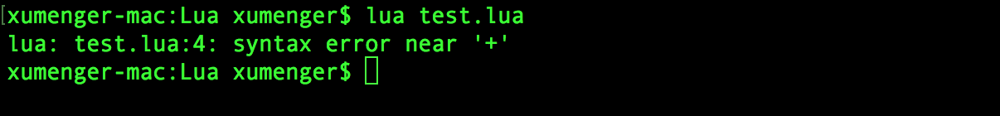

所以，我们可以动用MetaTable，如下所示：

```lua
fraction_op={}
function fraction_op.__add(f1, f2)
    ret = {}
    ret.numerator = f1.numerator * f2.denominator + f2.numerator * f1.denominator
    ret.denominator = f1.denominator * f2.denominator
    return ret
end

fraction_a = {numerator=2, denominator=3}
fraction_b = {numerator=4, denominator=7}

--为之前定义的两个table设置MetaTable
--其中setmetable是库函数
setmetatable(fraction_a, fraction_op)
setmetatable(fraction_b, fraction_op)

--进行加法运算
fraction_s = fraction_a + fraction_b
print(fraction_s.numerator, fraction_s.denominator)
```

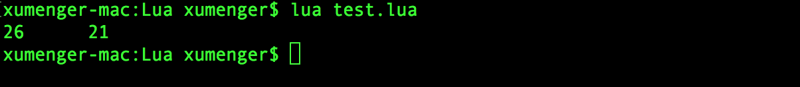

其中`fraction_s = fraction_a + fraction_b`其实就是调用的`fraction_op.__add(f1, f2)`函数

至于`__add`这就是MetaMethod

### MetaMethod

像`_add`这些都是Lua内建约定的MetaMethod，其它的还有如下的MetaMethod

```lua
__add(a, b)                     对应表达式 a + b
__sub(a, b)                     对应表达式 a - b
__mul(a, b)                     对应表达式 a * b
__div(a, b)                     对应表达式 a / b
__mod(a, b)                     对应表达式 a % b
__pow(a, b)                     对应表达式 a ^ b
__unm(a)                        对应表达式 -a
__concat(a, b)                  对应表达式 a .. b
__len(a)                        对应表达式 #a
__eq(a, b)                      对应表达式 a == b
__lt(a, b)                      对应表达式 a < b
__le(a, b)                      对应表达式 a <= b
__index(a, b)                   对应表达式 a.b
__newindex(a, b, c)             对应表达式 a.b = c
__call(a, ...)                  对应表达式 a(...)
```

# 面向对象

上面我们看到有一个`__index`这个重载，这个东西主要是重载find key的操作，这个操作可以让你的Lua变得有点面向对象的感觉，让其有点像Javascript的prototype。（关于Javascrip的面向对象，你可以参看我之前写的[Javascript的面向对象](https://coolshell.cn/articles/6441.html)）

所谓`__index`，说得明确一点，如果我们有两个对象a和b，我们想让b作为a的prototype只需要

```lua
setmetatable(a, {__index = b})
```

例如，下面这个例子，你可以用一个Window_Prototype的模板加上`__index`的MetaMethod来创建另一个实例：

```lua
Window_Prototype = {x=0, y=0, width=100, height=100}
MyWin = {title='hello'}
setmetatable(MyWin, {__index=Window_Prototype})
```

于是：MyWin就可以访问x、y、width、height的东西

>注：当表要索引一个值时如table[key]，Lua会首先在table本身查找key的值，如果没有并且这个table存在一个带有`__index`属性的MetaTable，则Lua就会按照`__index`所定义的函数逻辑查找

有了以上的基础，就可以来说说所谓的Lua的面向对象了

### Lua面向对象

```lua
Person = {}

function Person:new(p)
    local obj = p
    if(nil == obj) then
        obj = {name='ChenHao', age=37, handsome=true}
    end
    self.__index = self
    return setmetatable(obj, self)
end

function Person:toString()
    return self.name .." : ".. self.age .." : ".. (self.handsome and "handsome" or "ugly")
end


me = Person:new()
print(me:toString())


kf = Person:new{name="King's fucking", age=70, handsome=false}
print(kf:toString())
```

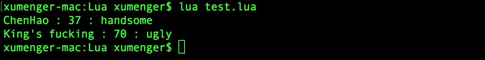

上面我们可以看到有一个new方法和toString方法，其中

* self就是Person，`Person:new(p)`相当于`Person.new(self, p)`
* new方法的`self.__index = self`的意图时怕self被扩展后改写，所以，让其保持原样
* setmetatable这个函数返回的是第一个参数的值

### 继承

继承如下，我就不多说了，Lua和Javascript很相似，都是在Prototype的实例上改过来改过去的

```lua
Person = {}

function Person:new(p)
    local obj = p
    if(nil == obj) then
        obj = {name='ChenHao', age=37, handsome=true}
    end
    self.__index = self
    return setmetatable(obj, self)
end

function Person:toString()
    return self.name .." : ".. self.age .." : ".. (self.handsome and "handsome" or "ugly")
end


Student = Person:new()

function Student:new()
    local newObj = {year = 2013}
    self.__index = self
    return setmetatable(newObj, self)
end
 
function Student:toString()
    return "Student : ".. self.year.." : " .. self.name
end


s = Student:new()
print(s:toString())
```


# 模块

我们可以直接使用`require("model_name")`来载入别的lua文件，文件的后缀是.lua。载入的时候就可以直接执行那个文件了，比如，有一个hello.lua文件

```lua
print("Hello, World!")
```

如果我们直接在另一个文件中`require("hello")`，那么就直接输出Hello, World！了

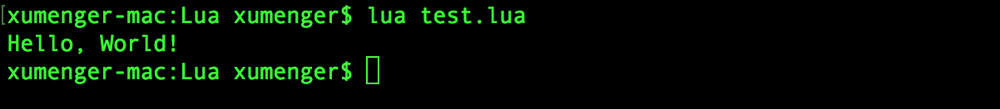

注意：

* require函数，载入同样的lua文件时，只有第一次时会去执行，后面的相同的都不会执行了
* 如果你要让每一次文件都执行的话，可以用`dofile('hello.lua')`函数，注意不是dofile('hello')

如果你要玩载入后不执行，而是在需要的时候执行，可以用loadfile函数

```lua
local hello = loadfile("hello.lua")

hello()
```

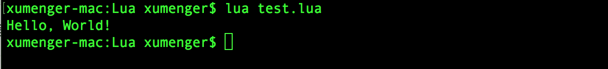

loadfile(“hello”)后，文件并不执行，我们把文件赋给一个变量hello，当hello()时，才真的执行。（我们多希望JavaScript也有这样的功能（参看[《Javascript 装载和执行》](https://coolshell.cn/articles/9749.html)））

当然，更为标准的玩法如下，假设我们有一个文件叫做mymod.lua 

```lua
local HaosMod = {}

local function getname()
    return "Hao Chen"
end

function HaosMod.Greeting()
    print("Hello, My name is "..getname())
end


return HaosMod
```

于是我们可以这样使用

```lua
local hao_mod = require('mymod')
hao_mod.Greeting()
```

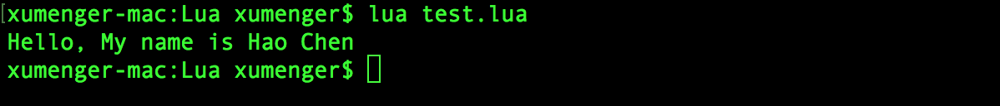

其实require干的事情就如下（所以你知道为什么我们的模块文件要写成那样了）

```lua
local hao_mod = (function()
    --mymod.lua文件的内容
end)()
```

# 扩展链接

* [Lua语法教程](http://www.runoob.com/lua/lua-tutorial.html)
* [Lua官网](http://www.lua.org)
* [云风的Lua文章](https://blog.codingnow.com/eo/luaoeeeaeau/)
* [codedump的Lua文章](http://www.codedump.info/?tag=lua)
* [Lua的github地址](https://github.com/lua/lua)
* [《Lua简明教程》](https://coolshell.cn/articles/10739.html)
* [lua在线手册](http://manual.luaer.cn/)
* [lua在线lua学习教程](http://book.luaer.cn/)
* [Lua参考手册的中文翻译（云风翻译版本）](http://www.codingnow.com/2000/download/lua_manual.html)
