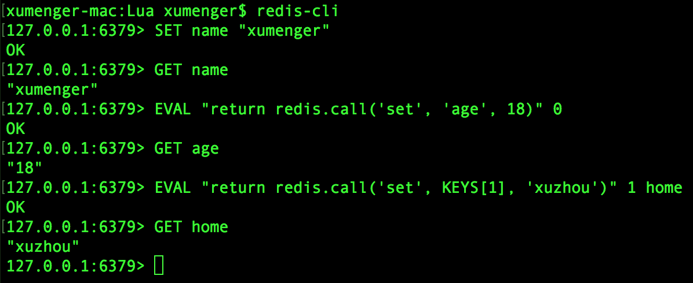

Redis在2.6版本开始引入对Lua脚本的支持，通过在服务器中嵌入Lua环境，Redis客户端可以使用Lua脚本，直接在服务器端原子地执行多个Redis命令

## Redis命令行中直接执行Lua指令

最简单的，使用EVAL命令可以直接对输入的脚本进行求值

```
redis> EVAL "return 'hello world'" 0
```


说一下EVAL命令的格式

>EVAL script numkeys key [key ...] arg [arg ...]

* script：是一段Lua脚本程序
* numkeys：用于指定键名参数的个数
* key [key ...]：从EVAL的第三个参数开始算起，表示在脚本中所用的那些Redis键，这些参数可以在Lua中通过全局变量KEYS数组，用1为基址的形式访问（KEYS[1]、KEYS[2]……以此类推）
* arg [arg ...]：附加参数，在Lua中通过全局变量ARGV数组访问，访问的形式和keys变量类似（ARGV[1]、ARGV[2]……以此类推）

比如执行下面命令可以看看运行效果：

```
redis> EVAL "return {KEYS[1], KEYS[2], ARGV[1], ARGV[2]}" 2 key1 key2 first second
```


另外可以使用redis.call、redis.pcall完成Redis命令调用

```
--直接调用redis命令
redis> SET name "xumenger"

--使用redis.call方式
redis> EVAL "return redis.call('set', 'age', 18)" 0

--上面这段脚本的确实现了将键 age 的值设为 18 的目的
--但是，它违反了 EVAL 命令的语义
--因为脚本里使用的所有键都应该由 KEYS 数组来传递
redis> EVAL "return redis.call('set',KEYS[1],'xuzhou')" 1 home
```

执行效果如下


## 执行脚本中的Lua程序

比如编写下面的Lua脚本程序random.lua

```
local i = 10
local seq = {}

while (i > 0) do
    seq[i] = math.random(i)
    i = i - 1
end

return seq
```

可以在Redis运行环境下通过命令`redis-cli --eval random.lua`执行该脚本



## 参考资料

* [《Lua语言模型与Redis应用》](http://blog.jobbole.com/106456/?utm_source=blog.jobbole.com&utm_medium=relatedPosts)
* [《Redis EVAL命令》](http://www.runoob.com/redis/scripting-eval.html)
* [《Redis Lua脚本原理》](https://www.cnblogs.com/xing901022/p/4872279.html)
