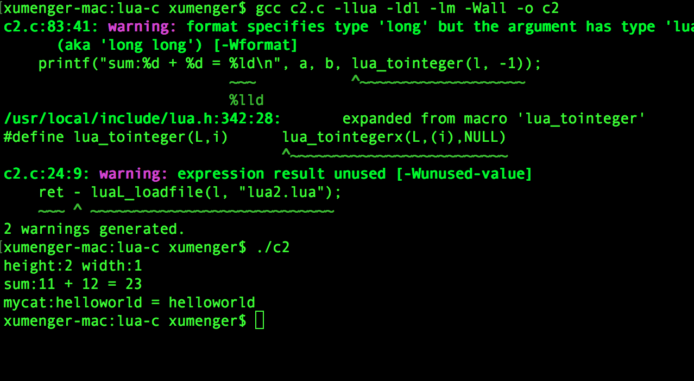

之前也零零星星的梳理过像Delphi与C/C++混合编程、Python与C/C++混合编程的文章。这里展示一下Lua与C/C++混合编程的简单实例

## Lua调用C

本质上是定义一个lua\_CFunctin，然后通过把其关联到Lua中的一个Table中

编写C函数如下c1.c

```c
#include <stdio.h>
#include <string.h>

#include <lua.h>
#include <lualib.h>
#include <lauxlib.h>

/*
 * 所有注册给Lua的函数的原型是
 * typedef int(*lua_CFunction)(lua_State *L);
 */
static int add(lua_State *L)
{
    double op1 = luaL_checknumber(L, 1);
    double op2 = luaL_checknumber(L, 2);
    lua_pushnumber(L, op1 + op2);

    return 1;
}

static int sub(lua_State *L)
{
    double op1 = luaL_checknumber(L,1);
    double op2 = luaL_checknumber(L,2);
    lua_pushnumber(L,op1 - op2);
    return 1;
}

/*
 * 需要一个luaL_Reg类型的结构体，其中每个元素对应一个提供的Lua函数
 * 每个元素中包含此函数在Lua中的名字，以及该函数在C库中的函数指针
 * 最后一个元素为“哨兵元素”（两个NULL），用于告诉Lua没有其他的函数需要注册
 */
static const struct luaL_Reg mylib[] = {
    {"add", add},
    {"sub", sub},
    {NULL, NULL}
};

/*
 * 此函数为C库中的特殊函数
 * 通过调用它注册所有C库中的函数，并将它们存储在适当的位置
 * 此函数的命名规则：
 *   1.使用"luaopen_"作为前缀
 *   2.前缀之后的名字作为Lua代码"require"的参数
 */
extern int luaopen_c1(lua_State *L)
{
    /* 
     * void luaL_newlib (lua_State *L, const luaL_Reg l[]);
     * 创建一个新的table，并将const luaL_Reg l[]中所列出的函数注册为Table的域
     */
    luaL_newlib(L, mylib);

    return 1;
}
```

编写Lua函数如下lua1.lua

```lua
--指定包名称
local mylib = require "c1"

--在调用时，必须是package.function
print(mylib.add(1.0, 2.0))
print(mylib.sub(20.1, 19))
```

编译c1.c得到so文件`gcc c1.c -llua -ldl -lm -fPIC -shared -o c1.so -Wall`，然后运行`lua lua1.lua`即可看到如下运行效果


## C调用Lua

通过lua\_call和lua\_pcall实现，先把函数压栈，这里的函数是指Lua中的Function（由于上面C函数可以关联到Lua的某个Table中，所以其实也可以是C函数），然后把返回结果再压栈

编写Lua源文件为lua2.lua

```lua
--变量定义
width = 1
height = 2

--Lua实现加法函数
function sum(a, b)
    return a + b
end

--Lua函数定义，实现字符串连接
function mycat(a, b)
    return a..b
end
```

编写调用Lua的C源码c2.c

```c
#include <stdio.h>
#include <stdlib.h>
#include <string.h>
#include <errno.h>

//Lua头文件
#include <lua.h>
#include <lualib.h>
#include <lauxlib.h>

#define err_exit(num, fmt, args...)  \
    do{printf("[%s:%d]"fmt"\n",__FILE__,__LINE__,##args);exit(num);} while(0)
#define err_return(num, fmt, args...)  \
    do{printf("[%s:%d]"fmt"\n",__FILE__,__LINE__,##args);return(num);} while(0)

int main(int argc, char **argv)
{
    // 创建Lua运行环境
    lua_State *l = luaL_newstate();
    if (l == NULL) err_return(-1, "luaL_newstat() failed"); 

    int ret = 0 ;
    //加载Lua脚本文件
    ret - luaL_loadfile(l, "lua2.lua");
    if (ret != 0) err_return(-1, "luaL_loadfile failed") ;

    ret = lua_pcall(l, 0, 0, 0);
    if (ret != 0) err_return(-1, "lua_pcall failed:%s", lua_tostring(l, -1));


    /* 
     * Lua和C/C++数据交互通过“栈”进行，操作数据时，首先将数据拷贝到“栈”上
     * 然后获取数据，栈中的每个数据通过索引值进行定位
     * 索引值为正表示相对栈底的偏移索引；索引值为负表示相对栈顶的偏移索引
     * 索引值以1或-1为起始值，因此栈顶索引值永远为-1，栈底索引值永远为1
     * 栈相当于数据在Lua和C/C++之间的中转地
     */
    /* 数据入“栈函数
     * void (lua_pushnil) (lua_State *L);
     * void (lua_pushnumber) (lua_State *L, lua_Number n);
     * void (lua_pushinteger) (lua_State *L, lua_Integer n);
     * void (lua_pushlstring) (lua_State *L, const char *s, size_t l);
     * void (lua_pushstring) (lua_State *L, const char *s);
     * void (lua_pushboolean) (lua_State *L, int b);
     * void (lua_pushcclosure) (lua_State *L, lua_CFunction fn, int n);
     */
    /* 数据获取接口
     * lua_Number      (lua_tonumber) (lua_State *L, int idx);
     * lua_Integer     (lua_tointeger) (lua_State *L, int idx);
     * int             (lua_toboolean) (lua_State *L, int idx);
     * const char     *(lua_tolstring) (lua_State *L, int idx, size_t *len);
     * lua_CFunction   (lua_tocfunction) (lua_State *L, int idx);
     */


    //获取Lua中定义的全局变量
    lua_getglobal(l, "width");
    lua_getglobal(l, "height");
    //输出这些变量
    printf("height:%lld width:%lld\n", lua_tointeger(l, -1), lua_tointeger(l, -2));
    //恢复Lua的栈
    lua_pop(l, 1);


    int a = 11;
    int b = 12;
    //获取lua.lua中定义的sum函数
    lua_getglobal(l, "sum");
    //将第一个参数压栈
    lua_pushinteger(l, a);
    //将第二个参数压栈
    lua_pushinteger(l, b);
    /* 调用函数
     * lua_pcall(lua_State *L, int nargs, int nresults, int errfunc)
     * L：Lua运行环境
     * nargs：参数个数
     * nresults：返回值个数
     * errFunc：错误处理函数，0表示无，表示错误处理函数在栈中的索引
     */
    ret = lua_pcall(l, 2, 1, 0);
    if (ret != 0) err_return(-1, "lua_pcall failed:%s", lua_tostring(l, -1));
    //从栈上获取返回值
    printf("sum:%d + %d = %ld\n", a, b, lua_tointeger(l, -1));
    //恢复Lua的栈
    lua_pop(l, 1);


    const char str1[] = "hello";
    const char str2[] = "world";
    lua_getglobal(l, "mycat");
    lua_pushstring(l, str1);
    lua_pushstring(l, str2);
    ret = lua_pcall(l, 2, 1, 0);
    if (ret != 0) err_return(-1, "lua_pcall failed:%s", lua_tostring(l,-1));
    printf("mycat:%s%s = %s\n", str1, str2, lua_tostring(l, -1));
    lua_pop(l, 1) ;


    //释放Lua运行环境
    lua_close(l);
    return 0;
}
```

`gcc c2.c -llua -ldl -lm -Wall -o c2`编译程序，然后`./c2`运行程序效果如下



## 参考资料

* [《lua和c/c++互相调用实例分析》](http://www.cppblog.com/lxyfirst/archive/2008/10/29/65447.aspx)
* [《Lua ，C，C#互相调用的理解》](https://zhuanlan.zhihu.com/p/25985695)
* [《C/C++ 与 Lua 的混合编程》](https://blog.codingnow.com/2009/10/sdchina_lua.html)
* [《Lua C API 的正确用法》](https://blog.codingnow.com/2015/05/lua_c_api.html)
* [《快速掌握Lua 5.3 —— 从Lua中调用C函数》](http://blog.csdn.net/vermilliontear/article/details/50947379)
* [《Lua中调用C函数》](https://www.cnblogs.com/sifenkesi/p/3876745.html)
