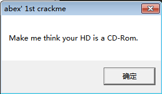
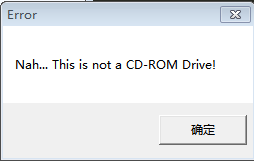
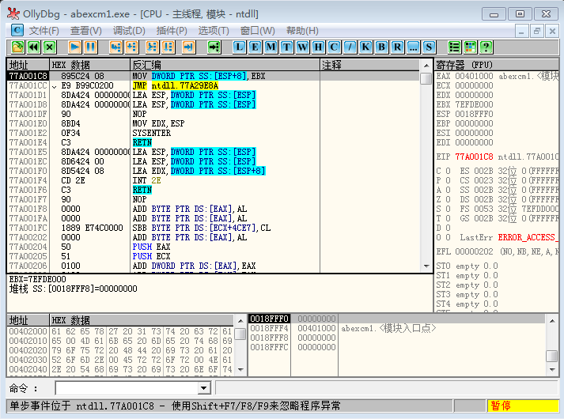
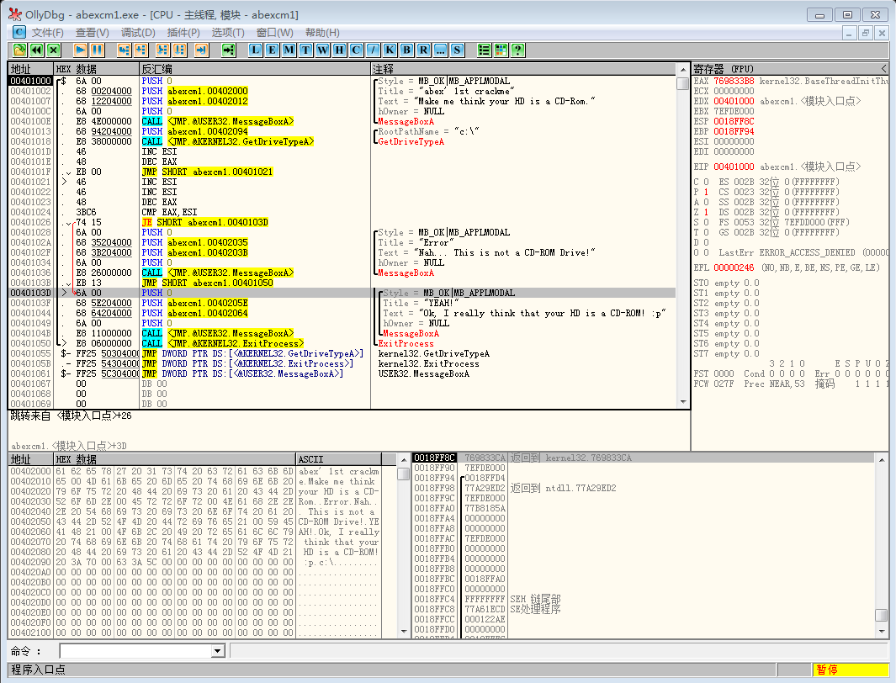
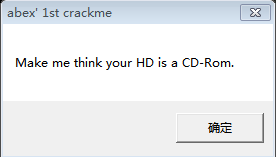
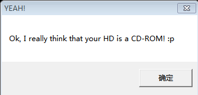

本文讲解使用OllyDbg逆向分析并破解一个简单的小程序，对应的exe程序可以点击[这里](../download/20180203/abexcm1.zip)下载

点击程序abex crackme #1后运行效果如下





打开OllyDbg，载入这个小程序



然后按`F9`运行程序，程序会在启动处暂停，可以看到这时的汇编代码



使用VC++、VC、Delphi等开发工具编写程序时，除了自己编写的代码外，还有一部分启动函数是由编译器添加的，经过反汇编之后，代码看上去就比较复杂，比如在[《汇编与逆向基础：使用IDA和OllyDbg分析C函数调用》](http://www.xumenger.com/c-assembly-ollydbg-ida-20161216/)看到的那样

但如果直接使用汇编语言编写程序，汇编代码会直接变为反汇编代码。观察上面截图中该crack程序的汇编代码，main()直接出现在EP中，简洁又直观，充分证明了这是一个直接用汇编语言编写的程序

先看汇编程序中涉及到Win32 API调用的内容

```
MessageBox("Make me think you HD is a CD-Rom.")
GetDriveType("C:\\")
...
MessageBox("Nah... This is not a CD-ROM Driver!")
MessageBox("OK, I really think that your HD is a CD-ROM! :p")
ExitProcess()
```

如果之前大家从事过Windows应用程序的开发，那么对以上几个函数的含义应该非常了解。从上述代码的分析中，我们能够准确把握程序制作者的真正意图。在消息窗口按“确定”后，程序会调用GetDriveType() API，获取C驱动器的类型（大部分返回的时HDD类型），然后操作它，使之被识别为CD-ROM类型，在在消息窗口中输出"OK, I really think that your HD is a CD-ROM! :p"消息

然后逐行分析crackme的代码

```
;调用MessageBoxA()函数
00401000 >/$  6A 00         PUSH 0                                         ; /Style = MB_OK|MB_APPLMODAL
00401002  |.  68 00204000   PUSH abexcm1.00402000                          ; |Title = "abex' 1st crackme"
00401007  |.  68 12204000   PUSH abexcm1.00402012                          ; |Text = "Make me think your HD is a CD-Rom."
0040100C  |.  6A 00         PUSH 0                                         ; |hOwner = NULL
                                                                           ; 执行PUSH指令，将参数到栈中
0040100E  |.  E8 4E000000   CALL <JMP.&USER32.MessageBoxA>                 ; \MessageBoxA
                                                                           ; 在函数内部ESI被设置为FFFFFFFF

;调用GetDriveType()函数
00401013  |.  68 94204000   PUSH abexcm1.00402094                          ; /RootPathName = "c:\"
00401018  |.  E8 38000000   CALL <JMP.&KERNEL32.GetDriveTypeA>             ; \GetDriveTypeA
                                                                           ; 返回值 (EAX) 是3（DRIVE_FIXED）

0040101D  |.  46            INC ESI
0040101E  |.  48            DEC EAX
0040101F  |.  EB 00         JMP SHORT abexcm1.00401021                     ; 无意义的JMP命令（垃圾代码）
00401021  |>  46            INC ESI
00401022  |.  46            INC ESI
00401023  |.  48            DEC EAX

;条件分支（401028 或 40103D）
00401024  |.  3BC6          CMP EAX,ESI                                    ; 比较EAX(1)与ESI(2)
00401026  |.  74 15         JE SHORT abexcm1.0040103D                      ; JE（Jump If Equal）条件分支命令
                                                                           ; 若两值相等，则跳转到40103D
                                                                           ; 若两值不等，则从401028继续执行
                                                                           ; 在40103D地址为消息框输出代码

;MessageBoxA()函数调用失败
00401028  |.  6A 00         PUSH 0                                         ; /Style = MB_OK|MB_APPLMODAL
0040102A  |.  68 35204000   PUSH abexcm1.00402035                          ; |Title = "Error"
0040102F  |.  68 3B204000   PUSH abexcm1.0040203B                          ; |Text = "Nah... This is not a CD-ROM Drive!"
00401034  |.  6A 00         PUSH 0                                         ; |hOwner = NULL
00401036  |.  E8 26000000   CALL <JMP.&USER32.MessageBoxA>                 ; \MessageBoxA
0040103B  |.  EB 13         JMP SHORT abexcm1.00401050

;MessageBoxa()函数调用成功
0040103D  |>  6A 00         PUSH 0                                         ; |/Style = MB_OK|MB_APPLMODAL
0040103F  |.  68 5E204000   PUSH abexcm1.0040205E                          ; ||Title = "YEAH!"
00401044  |.  68 64204000   PUSH abexcm1.00402064                          ; ||Text = "Ok, I really think that your HD is a CD-ROM! :p"
00401049  |.  6A 00         PUSH 0                                         ; ||hOwner = NULL
0040104B  |.  E8 11000000   CALL <JMP.&USER32.MessageBoxA>                 ; |\MessageBoxA

;终止进程
00401050  \>  E8 06000000   CALL <JMP.&KERNEL32.ExitProcess>               ; \ExitProcess

00401055   $- FF25 50304000 JMP DWORD PTR DS:[<&KERNEL32.GetDriveTypeA>]   ;  kernel32.GetDriveTypeA
0040105B   .- FF25 54304000 JMP DWORD PTR DS:[<&KERNEL32.ExitProcess>]     ;  kernel32.ExitProcess
00401061   $- FF25 5C304000 JMP DWORD PTR DS:[<&USER32.MessageBoxA>]       ;  USER32.MessageBoxA

```

特别说一下JMP和JE指令

* JMP：直接跳转到指定地址
* JE：条件跳转指令（Jump if Equal），若ZF标志位为1，则跳转

下面修改汇编指令代码来破解这个小程序

>代码逆向分析技术中，我们把有意将已有代码（或数据）覆盖为其他代码的行为称为“打补丁”（patch）

将光标移动到401026地址处，按空格键，在打开的汇编窗口中将汇编指令`JE SHORT 0040103D`替换为`JMP SHORT 0040103D`。换言之，通过汇编命令窗口将条件分支语句（JE）替换为无条件跳转语句（JMP）


对于中文版的OllyDbg，在反汇编窗口右键-->复制到可执行文件-->选择，打开一个新的窗口，然后右键-->保存文件，就将原有的exe程序中的逻辑做了修改，并且生成一个新的EXE，该EXE的逻辑变了，所以相当于对原有的程序进行了成功的破解

运行破解后的程序





>最后推荐相关文章[《汇编与逆向基础：使用IDA和OllyDbg分析C函数调用》](http://www.xumenger.com/c-assembly-ollydbg-ida-20161216/)
