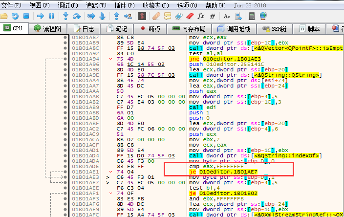
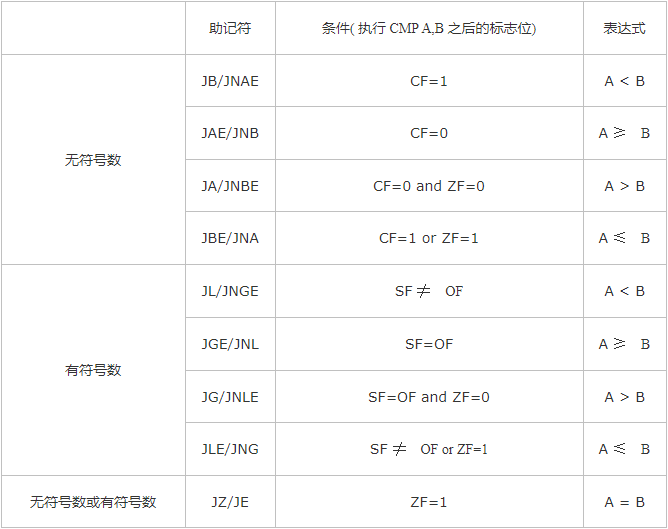

>首先说明汇编指令有Intel语法和AT&T两种不同的语法，本文使用的是Intel语法，所谓Intel语法就是：先目标，再是源，也就是从右到左赋值。`mov dst, src`

## 一些比较和跳转指令的例子

如果ebx寄存器值不等于0x93，则跳转到????????地址处继续执行

```asm
cmp ebx, 93
jne ????????
```

如果ebx寄存器值等于0x93，则跳转到????????地址处继续执行

```asm
cmp ebx, 93
je ????????
```

比如下面这张x32Dbg在调试汇编程序时的截图



问题：je、jne等指令要完成跳转需要知道cmp的比较结果，那je、jne到底是怎么知道的呢？

## cmp指令详解

`cmp op1, op2`即计算op1-op2的值，op1为任意通用寄存器或存储器操作数，op2为任意通用寄存器或存储器操作数，立即数也可以作为op2

其不影响操作数的值，但影响Flag的CF、ZF、OF、AF、PF这几个标志位，也就是说，执行完cmp指令后，根据计算结果会对应修改这些标志位的值，后面je、jne等指令正是通过判断这些标志位的值来决定跳转逻辑的

cmp指令对标志位的影响同sub指令，完成的操作也和sub类似，唯一的区别是`sub op1, op2`将op1-op2的结果送回op1，而cmp只是完成比较，仅修改标志位，结果不做存储！

其对标志位影响的规律是这样的，若指令执行后：

* ZF=1，表示两个操作数相等
* 假如把操作数看成无符号数：
	* CF=1，有进位或借位，cmp是减操作，故可看做是借位，即说明`op1<op2`
	* CF=0，无借位，需判断ZF是否为0，若为0，说明op1和op2不相等，即`op1>op2`
* 假如把操作数看成有符号数：
	* 若SF=0，OF=0，说明此时值为正数，无溢出，直观的看出`op1>op2`
	* 若SF=1，OF=0，说明此时值为负数，无溢出，直观的看出`op1<op2`
	* 若SF=0，OF=1，说明此时值为正数，有溢出，即`op1<op2`
	* 若SF=1，OF=1，说明此时值为负数，有溢出，即`op1>op2`

对于有符号数进行cmp操作，其实就是利用了溢出的本质：

* 两数为正，相加，值为负的话，说明产生了溢出
* 两数为负，相加，值为正的话，说明产生了溢出
* 两个同符号的数相减，不会溢出的

## 跳转指令详解

上面讲到cmp对操作数进行比较，通过修改标志位给出比较的结果，je、jne等跳转指令则是通过判断标志位的值来得到比较结果决定跳转路径

比如先进行了`cmp A, B`操作



## 参考资料

* [《cmp(compare)指令》](http://blog.csdn.net/farmwang/article/details/50194337)
* [《x86汇编语言语法简介》](http://www.xumenger.com/x86-20160720/)
* [《Intel格式和AT&T格式汇编区别》](https://www.cnblogs.com/hdk1993/p/4820353.html)
