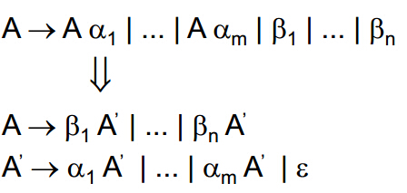

>乱文一篇！！！

## BNF范式

BNF范式是一种用来描述语法的语言，比如四则运算的规则可以表示如下：

```
<expr> ::= <expr> + <term>
         | <expr> - <term>
         | <term>

<term> ::= <term> * <factor>
         | <term> / <factor>
         | <factor>

<factor> ::= ( <expr> )
         | Num
```

其中用尖括号`<>`括起来的被称为非终结符，因为它们可以用`::=`右侧的式子代替。`|`表示选择，如`<expr>`可以是`<expr> + <term>`、`<expr> - <term>`或`<term>`中的一种

没有出现在`::=`左边的就称为终结符，一般终结符对应于词法分析器输出的标记

## 递归下降

上面列出了四则运算的BNF语法描述，我们可以以`3 * (4 + 2)`为例对齐进行语法分析。假设词法分析器已经正确地将其中的数字识别成标记`Num`了

递归下降是从起始的非终结符开始（顶），本例中是`<expr>`，实际中可以自己指定，不指定的话一般认为是第一个出现的非终结符

```
<expr> => <expr>
          => <term>      * <factor>
             => <factor>   |
                => Num(3)  |
                           => ( <expr> )
                                => <expr>        + <term>
                                   => <term>       |
                                      => <factor>  |
                                         => Num(4)
                                                   => <factor>
                                                      => Num(2)
```

可以看到，整个解析的过程是不断对非终结符进行替换（向下），直到遇见终结符（底）。而我们可以从解析的过程中看出，一些非终结符如`<expr>`被递归地使用了

## BNF文法代码化！

比如有下面的这种简单的BNF文法

```
<A> ::= a<B>b
      | b<A><B>
<B> ::= ???
```

伪代码实现而如下：

```
function A() {
    case 当前标记 {
        'a':
           匹配a，移动到下一个标记;
           调用函数B;
           匹配B，移动到下一个标记;
        'b':
            匹配b，移动到下一个标记;
            调用函数A;
            调用函数B;
    }
}
```

这种方法被称为递归预测向下分析，通过case语句来预测两种可能性，从而做出不同的判断。但这种方式的效率还是不如动态规划的！

## 什么是左递归？

一个左递归的语法通常有这样的形式：`A -> Aa`，对应BNF文法表示为：`<A> ::= <A>a`，而自顶向下的语法分析是无法处理左递归语法的。因为无论是递归分析还是预测分析或者是LL文法分析，在碰到这种语法时都会陷入死循环中

如果我们用递归分析，那么在分析A这个非终结符的时候会调用function A()，function A()会将A分解成Aa，然后再次碰到A的时候又调用function A()，这样就会形成无限递归

所以必须采用手段消除左递归！

## 消除左递归

比如有文法为`A -> Aα1|...|Aαm|β1|...|βn`，对其消除左递归：



其实原理在于通过转换将A的语法不从非终结符号(A本身)开始，而是从终结符号β1...βn开始。虽然A的原语法是从A本身开始的，但是第一个符号一定是β1...βn中的一个，而不可能是任何一个α

所以通过一个中间变量A'来表示剩下的α，然而不要忘记由于`A' -> αA'`这条规则，`A' -> ε`必须也存在于语法规则中，否则末尾将无法匹配完成

## 四则表达式BNF文法消除左递归

上文提到的四则运算的文法表示就是左递归的，左递归的语法是没法直接使用递归下降方法实现的，因此要消除左递归

```
<expr> ::= <term> <expr_tail>
<expr_tail> ::= + <term> <expr_tail>
              | - <term> <expr_tail>
              | <empty>

<term> ::= <factor> <term_tail>
<term_tail> ::= * <factor> <term_tail>
              | / <factor> <term_tail>
              | <empty>

<factor> ::= ( <expr> )
           | Num
```

## 更多概念总结

* 自顶向下语法分析：从起始非终结符开始，不断地对非终结符进行分解，直到匹配输入的终结符
* 自底向上语法分析：不断地对终结符进行合并，直到合并成起始的非终结符
* 递归下降解析：从起始非终结符开始，不断向下替换，直到遇到终结符
* LL(1)：非递归预测向下分析。第一个L表示从左到右扫描、第二个L表示产生最左推导、1表示每次只往前走一步就可以决定语法分析的动作

## 参考资料

* [《简述自顶向下的语法分析》](http://www.cnblogs.com/nano94/p/4017730.html)
* [《如何消除左递归》](http://www.cnblogs.com/nano94/p/4020775.html)
* [《左递归文法》](http://blog.csdn.net/kavensu/article/details/8020437)
* [《语法分析之左递归消除一》](https://www.cnblogs.com/Alexkk/p/5977899.html)
* [《LL(1),LR(0),SLR(1),LR(1),LALR(1)的 联系与区别》](http://www.cnblogs.com/Alexkk/p/6033159.html)
* [为什么递归下降分析中要消除左递归？](https://www.zhihu.com/question/28397643)
* [《消除文法左递归-编译原理》](http://blog.csdn.net/qq78442761/article/details/53967139)
* [《BNF与ABNF》](http://www.xumenger.com/compile-bnf-abnf-20170812/)
