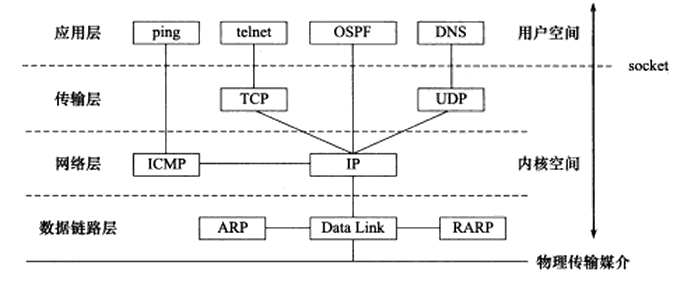
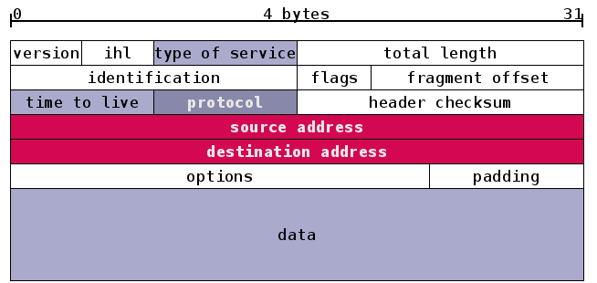

现在Internet使用的主流协议族是TCP/IP协议族，它是一个分层、多协议的通信体系。TCP/IP协议族是一个四层协议系统，自底向上分别是数据链路层、网络层、传输层和应用层。每一层完成不同的功能，且通过若干协议来实现，上层协议使用下层协议提供的服务



# IP协议

IP协议是TCP/IP协议族的动力，它为上层协议提供无状态、无连接、不可靠的服务

IPv4协议头部结构如下



>IP头部中的type of service（TOS）包括一个3位的优先权字段（现在已被忽略），4位的TOS字段（最小延时、最大吞吐量、最高可靠性、最小费用，最多有一个能置为1）和1位保留字段（必须置为0）。应用程序应该根据实际需要来设置它，比如ssh和telnet这样的登录程序需要的是最小延时的服务，而文件传输程序ftp则需要最大吞吐量的服务

### tcpdump简介

研究网络协议时，使用像tcpdump、wireshark这样的抓包软件是十分有助于网络协议的研究的，因为你将会直观的看到网络协议数据本身，这里简单对tcpdump命令进行介绍


tcpdump命令格式为`tcpdump option filter`，option是命令选项，比如-n、-i any等；filter是过滤包的条件，比如tcp、src port 58895等

tcpdump的option主要包括：

* tcpdump -i en2：指定在en2这个网络接口监听
* tcpdump -n：不要把ip转换为机器名字
* tcpdump -w - |strings：-w表示把内容write到某个地方；-表示标准输出，也就是输出到标准输出；|strings表示用字符形式展示网络包内容
* tcpdump -w a.cap：抓包结果写到a.cap文件
* tcpdump -r a.cap：从a.cap文件中读取内容
* tcpdump -X：以十六进制以及ASCII的形式打印数据内容
* tcpdump -x：除了打印出header外，还打印packet中的数据（十六进制的形式）
* tcpdump -D：查看目前机器上有哪些网络接口


tcpdump的filter主要包括以下三种类型的关键字！

第一种是关于类型的关键字，主要包括host、net、port，例如`host 210.27.48.2`，指明210.27.48.2是一台主机；`net 202.0.0.0`指明202.0.0.0是一个网络地址；`port 23`指明端口是23。如果没有指定类型，缺省的类型是host

第二种是确定传输方向的关键字，主要包括src、dst、dst or src、dst and src，这些关键词指明了传输的方向。举例说明，`src 210.27.38.2`指明ip包中源地址是210.27.48.2，`dst net 202.0.0.0`指明目的网络地址是202.0.0.0。如果没有指明方向关键字，则缺省是src or dst关键字

第三类是协议的关键字，主要包括fddi、ip、arp、rarp、tcp、udp等类型。fddi指明是在FDDI（分布式光纤数据接口网络）上的特定的网络协议，实际上它是"ether"的别名，fddi和ether具有类似的源地址和目的地址，所以可以将fddi协议包当做ether的包进行处理和分析。其他的关键字就是指明了监听的包的协议内容。如果没有指定任何协议，则tcpdump将会监听所有协议的信息包

除了这三种类型的关键字之外，其他重要的关键字如下：gateway、broadcast、less、greater，还有三种逻辑运算，取非：not、!；与运算：and、&&；或运算：or、||

下面将以上关键字组合给出一些常用的tcpdump命令

* `tcpdump ip host 210.27.48.1 and ! 210.27.48.2`：获取主机210.27.48.1除了和主机210.27.48.2之外所有主机通信的ip包
* `tcpdump tcp port 23 host 210.27.48.1`：获取主机210.27.48.1接收或发出的telnet（23端口）包
* `tcpdump udp port 123`：对本机UDP的123端口进行监视

参考以下资料：

* [《实用tcpdump命令》](http://www.itshouce.com.cn/linux/linux-tcpdump.html)
* [《超级详细Tcpdump的用法》](https://www.cnblogs.com/maifengqiang/p/3863168.html)

上面对tcpdump命令进行了简单总结，下面来个实际的抓包分析

### tcpdump分析telnet

开启一个终端输入`sudo tcpdump -ntx -i lo dst port 23`。`-x`选项使之输出数据包的二进制码；`dst port 23`指定监听目的端口为23的数据包（telnet服务器程序使用的端口正是23）；`-i lo`表示抓取回环网口的包


然后再开启一个新的终端，使用telnet命令登录本机


切换到tcpdump命令运行的窗口，可以看到抓包的第一个IP数据包内容是


拷贝该内容如下：

```
[????@????? ~]# sudo tcpdump -ntx -i lo dst port 23
tcpdump: verbose output suppressed, use -v or -vv for full protocol decode
listening on lo, link-type EN10MB (Ethernet), capture size 65535 bytes
IP 127.0.0.1.64807 > 127.0.0.1.telnet: Flags [S], seq 3494510260, win 32792, options [mss 16396,sackOK,TS val 470043205 ecr 0,nop,wscale 7], length 0
        0x0000:  4510 003c b4f1 4000 4006 87b8 7f00 0001
        0x0010:  7f00 0001 fd27 0017 d049 feb4 0000 0000
        0x0020:  a002 8018 5d06 0000 0204 400c 0402 080a
        0x0030:  1c04 4a45 0000 0000 0103 0307
```

结合上面列出的IPv4协议数据头部逐字节分析该内容

十六进制数            | 十进制表示    | IP头部信息  
--------------------- | ------------- | ------------  
0x4(4bit)             | 4             | IP版本号
0x5(4bit)             | 5             | 头部长度为5个32位（20字节）
0x10(8bit)            |               | TOS选项中最小延时服务被开启
0x003c(16bit)         | 60            | 数据包总长度，60字节
0xb4f1(16bit)         |               | 数据报标识
0x4(4bit)             |               | 设置了禁止分片标识
0x000(12bit)          | 0             | 分片偏移
0x40(8bit)            | 64            | TTL（生存时间，数据报到达目的地之前允许的最大路由器跳数）被设置为64
0x06(8bit)            | 6             | 协议字段为6，标识上层协议是TCP
0x87b8(16bit)         |               | IP头部校验和
0x7f000001(32bit)     |               | 32位源端IP地址：127.0.0.1（0x7f=127；0x00=0；0x00=0；0x01=1）
0x7f000001(32bit)     |               | 32位目的端IP地址：127.0.0.1

### IP分片

当IP数据报的长度超过帧的MTU时，它将被分片传输。分片可能发生在发送端，也可能发生在中转路由器上，而且可能在传输过程中被多次分片，但只有在最终的目标机器上，这些分片才会被内核中的IP模块重新组装

IP头部中的数据报标识、标志和片偏移为IP的分片和重组提供了足够的信息。一个IP数据报的每个分片都具有自己的IP头部，它们有相同的值标识值，但具有不同的片偏移，并且除了最后一个分片外，其他分片都将被设置MF标志。此外，每个分片的IP头部的总长度字段将被设置为该分片的长度

使用ifconfig命令可以查看每个网卡的MTU


可以看到以太网卡的MTU是1500，回环网卡的MTU是16436。以以外网卡为例，其MTU是1500Byte，因此它携带的IP数据报的数据部分最多是1480（IP头部占20字节），所以如果用IP数据报封装一个长度为1481Byte的ICMP报文（包括8Byte的ICMP头部，所以其数据部分长度是1473字节），则该数据报在使用以太网帧传输时必须被分片

测试一下！开启一个终端使用`sudo tcpdump -ntv -i eth0 icmp`监听eth0网卡的icmp协议报文，再开启一个新的终端使用`ping 192.168.63.41 -s 1473`指定一次向192.168.63.41这台机器发送1473字节的数据

看ping命令，可以看到成功ping通，并且收到192.168.63.41机器的应答


再去看tcpdump的输出内容


前两条是ICMP的请求报文，因为总长度是1473(包体) + 8(ICMP头部) + 20(IP头部) = 1501，而eth0的MTU是1500，所以被分片，分为两次发送出去。可以看到其id都是17242，第一条的偏移是0，第二条的偏移是1480。第一条的flags [+]表示设置了标志以表示还有后续分片；第二条的flags [none]表示没有任何标志，即该报文为最后一个分片。第一条发送1500字节(20字节IP头部 + 8字节ICMP头部 + 1472包体)，第二条发送21字节(20字节IP头部 + 1字节包体)

### IP路由

IP协议的一个核心任务就是数据报的路由，即决定发送数据报到目标机器的路径！

要研究IP路由机制，需要先了解路由表的内容，使用`route`可以查看路由表


字段         | 含义    
------------ | -------------   
Destination  | 目标网络或主机            
Gateway      | 网关地址，\*表示目标主机和本机在同一网络，不需要路由
Genmask      | 网络掩码
Flags        | 路由项标志，常见的有如下五种：U(该路由项是活动的)；H(该路由项的目标是一台主机)；G(该路由项的目标是网关)；D(该路由项是由重定向生成的)；M(该路由项被重定向修改过)
Metric       | 路由距离，即到达指定网络所需要的中转数
Ref          | 路由项被引用的次数（Linux未使用）
Use          | 该路由项被使用的次数
Iface        | 该路由项对应的输出网卡接口

上面截图中的路由表信息拷贝如下

```
Kernel IP routing table
Destination     Gateway         Genmask         Flags Metric Ref    Use Iface
192.168.39.0    *               255.255.255.0   U     0      0        0 eth0
link-local      *               255.255.0.0     U     1002   0        0 eth0
default         192.168.39.1    0.0.0.0         UG    0      0        0 eth0
```

第三项的目标地址是default，即所谓的默认路由项。该项包含一个G标志，说明路由的下一条目标是网关，其地址是192.168.39.1；第一项的目标地址是192.168.39.0，它指的是本地局域网，该路由项的网关地址是\*，说明数据包不需要路由中转，可以直接发送到目标机器

那么路由表是如何按照IP地址分类的呢？或者说给定数据报的目标IP地址，它将匹配路由表中的哪一项？这就是IP的路由机制：

* 查找路由表中和数据报的目标IP地址完全匹配的主机IP地址，如果找到，就使用该路由项，否则进入下一步
* 查找路由表中和数据报的目标IP地址具有相同网络ID的网络IP地址，如果找到，就使用该路由项，否则进入下一步
* 选择默认路由项，这通常意味着数据报的下一跳路由是网关

>关于IP路由还有路由表更新、IP转发等更多知识点，这里不再赘述

# TCP协议

TCP协议的核心可以简单划分为如下几个方面：

* TCP头部信息。TCP头部分析出现在每一个TCP报文段中，用于指定通信的源端口号、目的端口号，管理TCP连接，控制两个方向的数据流
* TCP状态转移过程。TCP连接的任意一端都是一个状态机。在TCP连接从建立到断开的整个过程中，连接两端的状态机将精力不同的状态变迁。理解TCP状态转移对于调试网络应用程序将有很大的帮助
* TCP数据流。通过分析TCP数据流，可以从网络应用程序外部来了解应用层协议和通信双方交换的应用程序数据
* TCP数据流的控制。为了保证可靠传输和提高网络通信质量，内核需要对TCP数据流进行控制，包括超时重传、拥塞控制等

首先看TCP协议的报文头部格式！


简单说明一下TCP报文头中的各个关键字段：

* 16位端口：IP层只包含IP地址信息，而IP地址只能标记到具体的主机，而不能对应到某个具体的应用程序，所以需要在传输层有端口这个概念
* 32位序号(Sequence Number)：假设A和B进行TCP通信，A发送B的第一个TCP报文段中，序号值被系统初始化为某个随机值ISN(Initial Sequence Number, 初始序号值)，那么在这个传输方向上(从A到B)，后续的TCP报文段中序号值将被系统设置成ISN加上该报文段所携带数据的第一个字节在整个字节流中的偏移。比如某个TCP报文段传送的数据是字节流中的1025~2048字节，那么该报文段的序号值就是ISN+1025。另外一个传输方向(从B到A)的TCP报文段的序号值也有相同的含义
* 32位确认号(Acknowledgement Number)，用做对另一方发送来的TCP报文段的响应。其值是收到的TCP报文段的序号值加1。假设A和B进行TCP通信，那么A发出的TCP报文段不仅携带自己的序号，而且还包含B发送来的TCP报文段的确认号。反之，B发送出来的TCP报文段也同时携带自己的序号和对A发送来的报文段的确认号
* 4位头部长度，标识该TCP头部有多少32bit字(4字节)。因为4位最大能表示15，所有TCP头部最长是60字节
* 6位标志位
	* URG，紧急指针是否有效
	* ACK，确认号是否有效，携带ACK标识的TCP报文段为确认报文段
	* PSH，提示接收端应用程序应该立即从TCP接收缓冲区中读走数据，为接收后续数据腾出空间(如果应用程序不降接收到的数据读走，它们就会一直停留在TCP接收缓冲区中)
	* RST，表示要求对方重新建立连接。携带RST标志的TCP报文段称为复位报文段
	* SYN，表示请求建立一个连接。携带SYN标志的TCP报文段为同步报文段
	* FIN，表示通知对方本端要关闭连接了。携带FIN标志的TCP报文段为结束报文段
* 16位窗口大小，TCP控制流量的一个手段，这里说的窗口，指的是接收通告窗口。它告诉对方本端TCP接收缓冲区还能容纳多少字节的数据，这样对方就可以控制发送数据的速度
* 16位校验和
* 16位紧急指针

以上是20字节的固定长度，后续还有60-20=40字节的变长内容

### tcpdump分析TCP通信

上面在使用tcpdump分析了IP报文头部，下面继续分析TCP的报文头部

整个报文信息如下

```
[????@????? ~]# sudo tcpdump -ntx -i lo dst port 23
tcpdump: verbose output suppressed, use -v or -vv for full protocol decode
listening on lo, link-type EN10MB (Ethernet), capture size 65535 bytes
IP 127.0.0.1.64807 > 127.0.0.1.telnet: Flags [S], seq 3494510260, win 32792, options [mss 16396,sackOK,TS val 470043205 ecr 0,nop,wscale 7], length 0
        0x0000:  4510 003c b4f1 4000 4006 87b8 7f00 0001
        0x0010:  7f00 0001 fd27 0017 d049 feb4 0000 0000
        0x0020:  a002 8018 5d06 0000 0204 400c 0402 080a
        0x0030:  1c04 4a45 0000 0000 0103 0307
```

上面在分析IP报文头部的时候，分析到了

```
[????@????? ~]# sudo tcpdump -ntx -i lo dst port 23
tcpdump: verbose output suppressed, use -v or -vv for full protocol decode
listening on lo, link-type EN10MB (Ethernet), capture size 65535 bytes
IP 127.0.0.1.64807 > 127.0.0.1.telnet: Flags [S], seq 3494510260, win 32792, options [mss 16396,sackOK,TS val 470043205 ecr 0,nop,wscale 7], length 0
        0x0000:  4510 003c b4f1 4000 4006 87b8 7f00 0001
        0x0010:  7f00 0001 
```

下面继续往后分析

```
                           fd27 0017 d049 feb4 0000 0000
        0x0020:  a002 8018 5d06 0000 0204 400c 0402 080a
        0x0030:  1c04 4a45 0000 0000 0103 0307
```

很明显，TCP报文头部就在IP报文头部的后面

先看tcpdump输出的最开始的那些信息

```
[????@????? ~]# sudo tcpdump -ntx -i lo dst port 23
tcpdump: verbose output suppressed, use -v or -vv for full protocol decode
listening on lo, link-type EN10MB (Ethernet), capture size 65535 bytes
IP 127.0.0.1.64807 > 127.0.0.1.telnet: Flags [S], seq 3494510260, win 32792, options [mss 16396,sackOK,TS val 470043205 ecr 0,nop,wscale 7], length 0
```

* Flags [S]表示该TCP报文段包含SYN标志，因此它是一个同步报文段，如果TCP报文段包含其他标志，则tcpdump也会将该标志的首字母显示在"Flags"后面的方括号中
* seq 3494510260，表示序号值是3494510260，因为该同步报文段是从127.0.0.1.64807(客户端IP地址和端口号)到127.0.0.1.telnet(服务端)这个传输方向上的第一个TCP报文段，所以这个序号值也就是此次通信过程中该传输方向的ISN值
* win 32792，是接收通告窗口的大小。因为这是一个同步报文段，所以win值反映的是实际的接收通告窗口的大小
* options是TCP选项，其具体的内容列在方括号中
	* mss是发送端通告的最大报文段长度，通过ifconfig命令查看回路接口的MTU为16436，因此预想TCP报文段的MSS为16396(16436字节MTU-20字节IP头部-20字节TCP头部)
	* sackOK表示发送端支持并同意使用SACK选项
	* TS val是发送端的时间戳
	* ecr是时间戳回显应答
	* nop是一个空操作选项
	* wscale指出发送端使用的窗口扩大因子为7

十六进制数            | 十进制表示    | IP头部信息  
--------------------- | ------------- | ------------  
0xfd27(16bit)         | 64807         | 源端口号
0x0017(16bit)         | 23            | 目的端口号
0xd049feb4(32bit)     | 3494510260    | 序号
0x00000000(32bit)     | 0             | 确认号
0xa(4bit)             | 10            | TCP头部长度为10个32位(40字节)
0x002(12bit)          |               | 设置了SYN标志
0x8018(16bit)         | 32792         | 接收通告窗口大小
0x5d06(16bit)         |               | 头部校验和
0x0000(16bit)         |               | 没设置URG标志，所以紧急指针值无意义
0x0204(16bit)         |               | 最大报文段长度选项的kind值和length值
0x400c(16bit)         | 16296         | 最大报文段长度
0x0402(16bit)         |               | 允许SACK选项
0x080a(16bit)         |               | 时间戳选项的kind值和length值
0x1c044a45(32bit)     | 470043205     | 时间戳
0x00000000(32bit)     | 0             | 回显应答时间戳
0x01(8bit)            |               | 空操作选项
0x0303(16bit)         |               | 窗口扩大因子选项的kind值和length值
0x07(8bit)            | 7             | 窗口扩大因子为7

### TCP状态机

在[《Socket API的本质？》](http://www.xumenger.com/tcp-connect-send-close-20170911/)和[《使用WireShark分析TCP的三次握手过程》](http://www.xumenger.com/wireshark-tcp-20160716/)两篇文章中使用抓包工具对TCP的三次握手和四次挥手分别进行了剖析！

下面的图中是TCP状态机在对应的socket API调用下的转换过程


其实socket API的调用，背后其实就是TCP数据的发送和接收而已，在[《Socket API的本质？》](http://www.xumenger.com/tcp-connect-send-close-20170911/)一文中我做过简单的解释

下面再给出TCP状态机在收到对应的TCP报文时进行的转换


**先看看服务器端典型的状态转移**

服务器通过listen系统调用进入LISTEN状态，被动等待客户端连接，因此执行的是所谓的被动打开。服务器一旦监听到某个连接请求(收到同步报文段)，就将该连接放入内核等待队列中，并向客户端发送带SYN标志的确认报文段。此时该连接处于SYN\_RCVD状态，如果服务器成功地接收到客户端发送回的确认报文段，则该连接转移到ESTABLISHED状态。**ESTABLISHED状态是连接双方能够进行双向数据传输的状态**

当客户端主动关闭连接时(close或shutdown系统调用向服务器发送结束报文段)，服务器通过返回确认报文段使连接进入CLOSE\_WAIT状态，这个状态的含义很明确：服务器应用程序关闭连接。通常，服务器检测到客户端关闭连接后，也会立即给客户端发送一个结束报文来关闭连接。这将使连接转移到LAST\_ACK状态，以等待客户端对结束报文的最后一次确认。一旦确认完成，连接就彻底关闭了！

**再看看客户端典型的状态转移**

客户端调用connect系统调用主动与服务器建立连接。connect首先给服务器发送一个同步报文段，使连接转移到SYN\_SENT状态。如果connect返回失败，则状态返回CLOSED状态；如果返回成功，即客户端成功收到服务端的同步报文段和确认，进入ESTABLISHED状态

当客户端主动执行关闭连接时，它向服务端发送一个结束报文段，同时连接进入FIN\_WAIT\_1状态。若此时客户端收到服务器专门用于确认目的的确认报文段，则连接进入FIN\_WAIT\_2状态。当客户端处于FIN\_WAIT\_2状态时，服务器处于CLOSE\_WAIT状态，这一对状态是可能发生半连接的状态。此时如果服务器也关闭连接(发送结束报文段)，则客户端将给予确认并进入TIME\_WAIT状态(注意，这里没有进入CLOSED状态，而是先进入TIME\_WAIT状态，关于TIME\_WAIT将在下面进行讲解)

### TIME\_WAIT状态

上面在分析TCP状态机的时候，发现客户端、服务端谁先主动关闭连接，谁就有可能进入TIME\_WAIT状态，而TIME\_WAIT是一个比较危险的状态

在TIME\_WAIT状态，要等待2MSL(报文段最大生存时间)才能关闭。MSL是TCP报文段在网络中的最大生存时间，标准文档RFC 1122的建议值是2min

TIME\_WAIT状态存在的原因有两点：

* 可靠的终止TCP连接
* 保证让迟来的TCP报文段有足够的时间被识别并丢弃

因为TIME\_WAIT的这个特点，如果是客户端主动关闭连接，那么可能客户端会处于TIME\_WAIT状态，其占用的端口因为其没有真正被关闭，所以一直不可复用。但因为客户端一般使用系统随机分配的临时端口来建立连接，所以临时端口号一般和程序上一次使用的端口号(还处于TIME\_WAIT状态的那个连接使用的端口号)不同，所以客户端程序一般可以立即重启

但如果是服务端主动关闭连接后异常终止，因为它总是使用同一个知名端口号，所以连接的TIME\_WAIT状态将导致它不能立即重启。不过，我们可以通过socket选项SO\_REUSEADDR来强制进程立即使用处于TIME\_WAIT状态的连接占用的端口！

### netcat

netcat是一个用于TCP/UDP连接和监听的linux工具，主要用于网络传输及调试领域

netcat可以打开TCP连接发送UDP报文，监听在TCP和UDP端口，以及TCP端口扫描，并将错误消息输出到屏幕上。它可以从文件或网络的一端读取数据，原封不动的将数据发送到另一台主机或文件中netcat一般缩写为nc

* 支持客户端和服务端
* 支持连出和连入，TCP和UDP以及任意源/目的端口
* 內建端口扫描功能，带有随机数发生器
* 支持设定TOS等

下面分别展示netcat的一些常用方式：

* 服务端客户端
	* nc -l -p 8080：-l指定netcat处于监听模式、-p指定源端口号
	* nc 127.0.0.1 8080：启动客户端连接到127.0.0.1 8080这个服务器，然后输出字符串按回车即可发送
* 使用netcat传输文件
	* nc -l -p 8899 < aa.pcap
	* nc 127.0.0.1 8899 > bb.pcap
* 使用netcat进行端口扫描，nc -v -z -r -i 1 127.0.0.1 20-100
	* -z：指定端口扫描打开仅连接不发送数据
	* -v：显示详细信息（不指定不会报告打开的端口）
	* -i：当连接多个端口时，两个端口建立连接的时间间隔
	* -r：让netcat在指定的端口范围内无序的扫描端口（默认是从低到高依次扫描）
* ……更多使用方式


### netstat

netstat命令是一个监控TCP/IP网络的非常有用的工具，它可以显示路由表、实际的网络连接以及每一个网络接口设备的状态信息

* netstat -a：列出所有端口
* netstat -at：列出所有TCP端口
* netstat -au：列出所有UDP端口
* netstat -l：只显示监听端口
* netstat -s：显示所有端口的统计信息
* netstat -p：显示pid和进程名称，可以结合grep搜索某个进程，比如netstat -p | grep mysql
* netstat -r：显示核心路由信息
* netstat -antp | grep ssh：查看端口和服务


### 超时重传

TCP服务必须能够重传超时时间内未收到确认的TCP报文段。为此，TCP模块为每个TCP报文段都维护了一个重传定时器，该定时器在TCP报文段每一次被发送时启动，如果超时时间内未收到接收方的应答，TCP模块将重传TCP报文段并重置定时器

下次重传超时时间如何选择、最多执行多少次重传，就是TCP的重传策略

下面这种异常网络场景下，就会发生超时重传！

服务端启动，收到客户端连接(三次握手)，客户端发送数据"abc"(服务端同时返回应答)，然后服务端的网线断开，此时客户端继续发送"def"，但是这时候因为服务端的网线断开，所以服务端收不到数据，也就没有办法发回应答，这时候客户端超时收不到应答，就认为服务端没有收到，此时客户端会重新发送"def"，但是服务端还是因为断线收不到，所以无法给客户端确认，客户端继续超时重传……

这时候我们关注客户端如何选择重传超时时间、最多执行多少次重传，就是研究到TCP重传策略的关键！

###拥塞控制

TCP模块还有一个重要的任务，就是提高网络利用率，降低丢包率，并保证网络资源对每条数据流的公平性，这就是所谓的拥塞控制。拥塞控制主要包括四个部分：慢启动、拥塞避免、快速重传、快速恢复。拥塞控制算法在Linux下有多种实现，比如reno算法、vegas算法、cubic算法等，它们或者部分或者全部实现上述四个部分，/proc/sys/net/ipv4/tcp\_congestion\_control文件指示机器当前所使用的拥塞控制算法


拥塞控制的最终受控变量是发送端向网络一次连续写入(收到其中第一个数据的确认之前)的数据量，我们称之为SWND(Send Window, 发送窗口)。不过，发送端最终以TCP报文段来发送数据，所以SWND限定了发送端能连续发送的TCP报文段数量。这些TCP报文段的最大长度(仅指数据部分)成为SMSS(Sender Maximum Segment Size, 发送者最大段大小)，其值一般等于MSS

发送端需要合理地选择MSS的大小。如果SWND太小，会引起明显的网络延迟；反之，如果SWND太大，则容易导致网络拥塞。接收方通过其接收通告窗口(RWND)来控制发送端的SWND。但这明显不够，所以发送端引入了一个成为拥塞窗口(Congestion Window, CWND)的状态变量。实际的SWND值是RWND和CWND中的较小值

# HTTP协议

HTTP协议是一种应用层协议，它默认使用的传输层协议是TCP协议。并且TCP协议是请求-应答模式的网络协议

HTTP请求报文格式


HTTP应答报文格式


### 代理服务器

在HTTP通信链上，客户端和目标服务器之间通常存在某些中转代理服务器，它们提供对目标资源的中转访问。一个HTTP请求可能被多个代理服务器转发，后面的服务器称为前面服务器的上游服务器。代理服务器按照其使用方式和作用，分为正向代理服务器、反向代理服务器和透明代理服务器

正向代理要求客户端自己设置代理服务器的地址。客户的每次请求都将直接发送到该代理服务器，并由代理服务器来请求目标资源。比如处于防火墙内的局域网机器要访问Internet，或者要访问一些被屏蔽掉的国外网站，就需要使用正向代理服务器

反向代理则被设置在服务器端，因而客户端无须进行任何设置。反向代理是指用代理服务器来接收Internet上的连接请求，然后将请求转发给内部网络上的服务器，并将从内部服务器上得到的结果返回给客户端。这种情况下，代理服务器对外就表现为一个真实的服务器。各大网站通常分区域设置了代理服务器，所以在不同地方ping同一个域名可能得到不同的IP地址，因为这些IP地址实际上是代理服务器的IP地址


透明代理只能设置在网关上。用户访问Internet的数据报必然都经过网关，如果在网关上设置代理，则该代理对用户来说显然是透明的。透明代理可以看作正向代码的一种特殊情况

代理方服务器通常还提供缓存目标资源的功能(可选)，这样用户下次访问统一资源时速度将很快

### HTTP无状态

HTTP协议是一种无状态的协议，即每个HTTP之间没有任何上下文关系。如果服务器后续处理HTTP请求时需要用到前面的HTTP请求的相关信息，客户端必须重传这些信息。这样就导致HTTP请求必须传输更多的数据

在交互式Web应用程序兴起之后，HTTP协议的这种无状态特征就显得不适应了，因为交互式程序要承上启下。因此，我们要使用额外的手段来保持HTTP连接状态，常见的解决方案就是Cookie。Cookie是服务端发送给客户端的特殊信息(通过HTTP应答的头部字段Set-Cookie)，客户端每次向服务器发送请求的时候只要带上Cookie信息(通过HTTP请求的头部字段Cookie)。这样服务器就能区分不同的客户了

基于浏览器的自动登录就是用Cookie实现的

下面展示Chrome浏览器存储的[www.baidu.com](https://www.baidu.com)的Cookie信息


# 更多相关资料

* [《实用tcpdump命令》](http://www.itshouce.com.cn/linux/linux-tcpdump.html)
* [《超级详细Tcpdump的用法》](https://www.cnblogs.com/maifengqiang/p/3863168.html)
* [《TCP/IP学习笔记：网络协议的层结构》](http://www.xumenger.com/network-1-20161021/)
* [《TCP/IP学习笔记：初识TCP协议》](http://www.xumenger.com/network-2-20161023/)
* [《Socket API的本质？》](http://www.xumenger.com/tcp-connect-send-close-20170911/)
* [《网络编程第一篇》](http://www.xumenger.com/tcp-ip-program-20170117/)
* [《WireShark/tcpdump分析telnet》](http://www.xumenger.com/linux-windows-wireshark-tcpdump-telnet-20170706/)
* [《WireShark抓包分析简单网络问题》](http://www.xumenger.com/tcp-wireshark-20170215/)
* [《使用WireShark分析TCP的三次握手过程》](http://www.xumenger.com/wireshark-tcp-20160716/)
* [《netcat应用》](http://blog.csdn.net/chengtong222/article/details/64131358)
* [《netstat命令详解》](https://www.cnblogs.com/xieshengsen/p/6618993.html)
* 《Linux高性能服务器编程》
