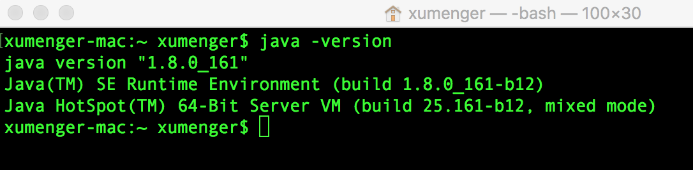
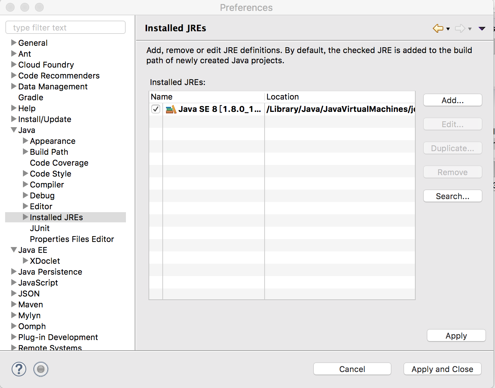
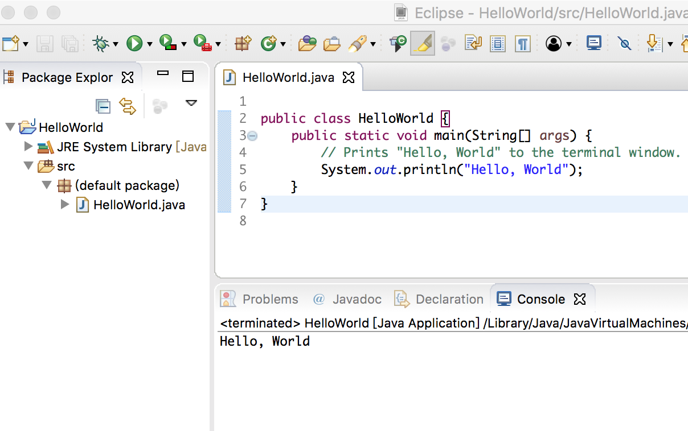

首先列一下JDK、Eclipse的下载地址：

* [JDK下载地址](http://www.oracle.com/technetwork/java/javase/downloads/jdk8-downloads-2133151.html)
* [Eclipse下载地址](http://www.eclipse.org/downloads/eclipse-packages/?osType=macosx&release=undefined)

Mac上默认是没有安装JDK的，所以需要自己安装

下载好JDK的dmg文件后，在Mac下直接安装，然后`java -version`即可检查其安装成功



同样Eclipse也是一个dmg文件，下载后直接点击安装即可，安装后，Eclipse会自动配置JDK



上图中同样会有【Add】按钮，所以你可以配置新的JDK！

然后写一个万年不变的Hello World看看

```java
public class HelloWorld {
	public static void main(String[] args) {
        // Prints "Hello, World" to the terminal window.
        System.out.println("Hello, World");
    }
}
```



## 参考资料

* [《Mac下如何安装JDK》](http://www.cnblogs.com/quickcodes/p/5127101.html)
* [《Mac下安装及配置Eclipse》](http://www.cnblogs.com/quickcodes/p/5399385.html)
