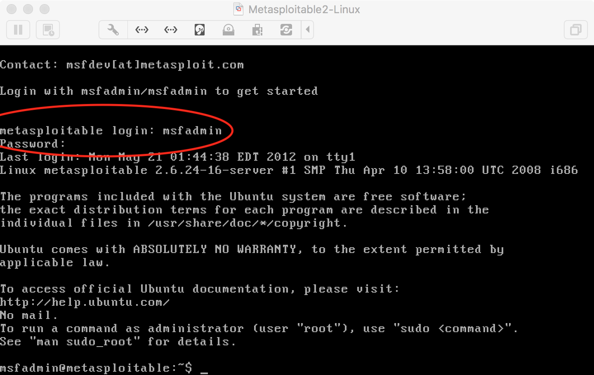

## vmware安装kali

[Kali官网](https://www.kali.org/downloads/)先下载Kali Linux 64 Bit

参考[《如何在虚拟机中安装kali linux》](http://blog.csdn.net/lunar_queen/article/details/60963729)开始安装，下面列一些注意事项

首先是选择Linux版本时，选择“其它 Linux 3.x 内核 64位”

其次是我们选择图形化界面安装

另外在安装的过程中要求设置主机名、域名，这些直接使用默认的设置即可！

Installthe GRUB boot loader on a hard disk这一步选择/dev/sda

其它的详细参见[《如何在虚拟机中安装kali linux》](http://blog.csdn.net/lunar_queen/article/details/60963729)的过程即可

安装完成后，启动操作系统，登录系统后界面如下

## Kali启动MetaSploit

>[MetaSploit官网](https://www.metasploit.com/)

Kali是默认安装了MetaSploit，所以省去了复杂的安装流程

直接点击工具栏上的图标即可（或者启动终端，输入`msfconsole`命令启动MetaSploit），但是结果竟然启动失败

看到有一个错误信息【Errno::ENOMEM】，所以怀疑是不是内存不够用了，试一下

关闭Kali，在虚拟机上将其内存从768提升到2048

再重启Kali，重启MetaSploit，这次成功了！

## 使用BeEF

BeEF是目前最流行的Web框架攻击平台，其全称是the Browser Exploitation Framework project。通过XSS这个简单的漏洞，BeEF可以通过一段编制好的JavaScript控制目标主机的浏览器，通过浏览器拿到各种信息并且扫描内网信息，同时能够配合MetaSploit进一步渗透主机，强大的有些吓人！

Kali也是默认安装了BeEF的

点击该图标，或者在终端输入`beef-xss`命令即可启动BeEF

然后打开浏览器，输入`http://127.0.0.1:3000/ui/authentication`

然后输入默认用户名密码：beef/beef

## 搭建Metasploitable环境

点击[这个地址](https://sourceforge.net/projects/metasploitable/)下载Metasploitable2 linux靶机，下载下来的是一个vmwarevm虚拟机文件，可以直接放到指定目录，然后直接用VMWare打开该虚拟机

VMWare ->【文件】->【打开】选择对应的vmwarevm虚拟机文件

设置靶机虚拟机的硬件，内存设置为1G，网卡适配器设置为NAT模式

其默认的用户名密码是msfadmin/msfadmin，登录即可

## 参考资料

* [《如何在虚拟机中安装kali linux》](http://blog.csdn.net/lunar_queen/article/details/60963729)
* [《kali Linux系列教程之BeFF安装与集成Metasploit》](http://www.cnblogs.com/xuanhun/p/4203143.html)
* [《kali下启用metasploit》](http://blog.csdn.net/l_mingo/article/details/51589303)
* [《kali linux 2.0下安装metasploit》](http://blog.csdn.net/jiangliuzheng/article/details/50546373)
* [《如何在BeEF中使用metasploit颠覆你的浏览器》](http://www.freebuf.com/sectool/4799.html)
* [《kali linux攻击机及windowsXp/Metasploit_linux靶机安装及在此基础上的蜜罐系统搭建(中)》](http://blog.csdn.net/m0_38073011/article/details/73501397?locationNum=1&fps=1)
