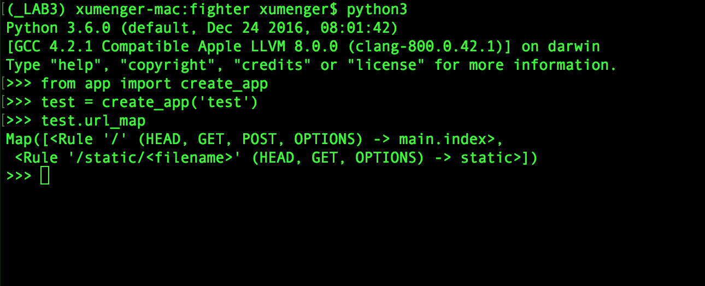
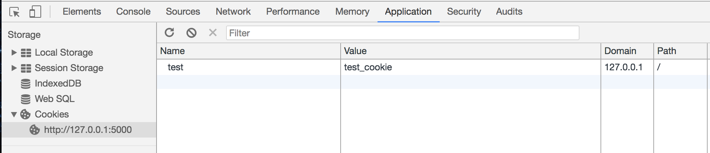
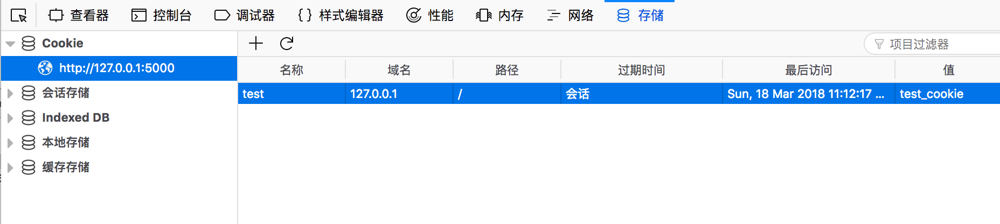

之前在[《使用Flask进行简单Web开发》](http://www.xumenger.com/python2-flask-20170701/)对Flask、Flask的URL路由、Flask模板引擎等进行了简单介绍。本文来讲解关于Flask更多的内容

## Flask 上下文

* current\_app：程序上下文。当前激活程序的程序实例
* g：程序上下文。处理请求时用作临时存储的对象。每次请求都会重设这个变量
* request：请求上下文。请求对象，封装了客户端发出的HTTP请求中的内容
* session：请求上下文。用户会话，用于存储请求中间需要“记住”的值的词典

在视图函数中使用current\_app、g、request、session看起来像全局变量一样。事实上request等不可能是全局变量。试想，在多线程服务器中，多个线程同时处理不同客户端发送的不同请求时，每个线程看到的request对象必然不同。Flask使用上下文让特定的变量在一个线程中全局可访问，与此同时却不会干扰到其它线程

## 请求调度

程序收到客户端发来的请求时，要找到处理该请求的视图函数。为了完成这个任务，Flask会在程序的URL映射中查找请求的URL。URL映射是URL和视图函数之间的对应关系

Flask使用app.route修饰器或非修饰器形式的app.add\_url\_rule()生成映射

要想查看Flask程序中的URL映射是什么样子，可以查看url\_map



* `<Rule '/' (HEAD, GET, POST, OPTIONS) -> main.index>`路由是在程序中使用app.route修饰器定义
* `<Rule '/static/<filename>' (HEAD, GET, OPTIONS) -> static>`路由是Flask添加的特殊路由，用于访问静态文件

URL映射中的HEAD、GET、POST、OPTIONS是请求方法，由路由定义处理。Flask为每个路由都指定了请求方法，这样不同的请求方法发送到相同的URL上时，会使用不同的视图函数进行处理

HEAD、OPTIONS方法由Flask自动处理

## 请求钩子

有时在处理请求的前后执行代码会很有需要。例如在请求开始时，可能需要先创建数据库连接（当然如果你的程序实现真的是每收到一次请求就发起一次数据库连接，那也真的是够了）或认证发起请求的用户。为了避免在每个视图函数中都使用重复的代码，Flask提供了注册通用函数的功能，注册的函数可以在请求被分发到视图函数之前或之后调用

请求钩子使用修饰器实现

* before\_first\_request：注册一个函数，在处理第一个请求之前运行
* before\_request：注册一个函数，在每次请求之前运行
* after\_request：注册一个函数，如果没有未处理的异常抛出，在每次请求之后运行
* teardown\_request：注册一个函数，即使有未处理的异常抛出，也在每次请求之后运行

在请求钩子函数和视图函数之间共享数据一般使用上下文全局变量g。例如，before\_request处理程序可以从数据库中加载已登录用户，并将其保存在g.user中。随后调用视图函数时，视图函数再使用g.user获取用户

## HTTP 响应

Flask调用视图函数后，会将其返回值作为响应的内容。大多数情况下，响应就是一个简单的字符串，作为HTML页面回送客户端。但HTTP协议需要的不仅仅是作为请求响应的字符串，HTTP响应中一个很重要的部分是状态码，Flask默认设置为200

如果视图函数返回的响应需要使用不同的状态码，那么可以把数字代码作为第二个返回值，添加到响应文本之后

```python
@app.route('/')
def index():
    return '<h1>Bad Request</h1>', 400
```

视图函数返回的响应还可以接受第三个参数，这是一个由首部（header）组成的字典，可以添加到HTTP响应中。一般并不需要这么做

如果不想返回由1个、2个或3个值组成的元组，Flask视图函数还可以返回Response对象。make\_response()函数可接受1个、2个或3个参数（和视图函数的返回值一样），并返回一个Response对象。有时我们需要在视图函数中进行这种转换，然后在响应对象上调用各种方法，进一步设置响应。比如下面创建一个实例，然后设置cookie

```python
from flask import make_response

@app.route('/')
def index():
    response = make_response('<h1>Index Page carries a cookie</h1>')
    response.set_cookie('test', 'test_cookie')
    return response
```

然后访问首页，Chrome下可以查看其Cookie如下



FireFox下查看其Cookie如下



## 参考资料

* [《使用Flask进行简单Web开发》](http://www.xumenger.com/python2-flask-20170701/)
* [《使用web.py进行简单Web开发》](http://www.xumenger.com/python-webpy-20170115/)
