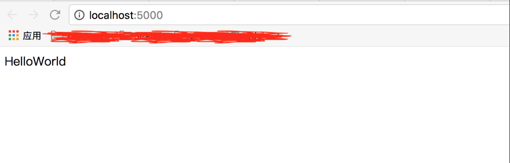

# Flask扩展简介

Flask是一个微框架，通常需要一些重复的步骤来让第三方库工作。因为在很多时候，这些步骤可以被分离出来，来支持多个项目，所以就有了[Flask Extension Registry](http://flask.pocoo.org/extensions/)

所有的扩展都位于一个叫做flask\_something的包，其中something是你想要连接的库的名字。那么，例如当你计划要为Flask添加一个叫做simplexml的库的支持时，你应该把你扩展的包命名为flask\_simplexml

实际的扩展名（人类可读的名称）无论如何会是“Flask-SimpleXML“之类的东西。确保在名字中包含”Flask“并注意大小写，这是用户可以在它们的setup.py文件中注册你扩展依赖的方式

Flask设立了一个叫做flask.ext的重定向包，用户应该从这个包倒入扩展，例如，如果你有一个叫做flask\_something的包，用户应该用flask.ext.something的方式倒入。这样是为了从老命名空间的包过渡

但是扩展如何看起来像扩展？一个扩展必须保证它可以同时在多个Flask应用中工作。这是必要条件，因为许多人会使用类似**应用工厂**的模式来创建应用来进行单元测试或支持多套配置，因此，你的应用支持这种行为非常重要

# Flask扩展实例

现在我们开始创建一个Flask扩展。很简单的一个扩展，目录结构是这样的：

```
flask-hello/
  setup.py
  flask_hello.py
  LISCENSE
  README
```

这是最重要的文件的内容（LISCENSE、README其实可以不用的）

### setup.py

一个绝对重要的文件是setup.py，用于安装你的Flask扩展，可以使用下面的内容：

```python
"""
Flask-Hello
-------------

This is the description for that library
"""
from setuptools import setup


setup(
    name='Flask-Hello',
    version='1.0',
    url='http://example.com/flask-hello/',
    license='BSD',
    author='xumenger',
    author_email='xumenger@126.com',
    description='My First Flask Extension',
    long_description=__doc__,
    py_modules=['flask_hello'],
    # if you would be using a package instead use packages instead
    # of py_modules:
    # packages=['flask_hello'],
    zip_safe=False,
    include_package_data=True,
    platforms='any',
    install_requires=[
        'Flask'
    ],
    classifiers=[
        'Environment :: Web Environment',
        'Intended Audience :: Developers',
        'License :: OSI Approved :: BSD License',
        'Operating System :: OS Independent',
        'Programming Language :: Python',
        'Topic :: Internet :: WWW/HTTP :: Dynamic Content',
        'Topic :: Software Development :: Libraries :: Python Modules'
    ]
)
```

### flask\_hello.py

代码如下：

```python
try:                                     
    from flask import _app_ctx_stack as stack
except ImportError: 
    from flask import _request_ctx_stack as stack

class Hello(object):

    def __init__(self, app=None):
        if app is not None:
            self.app = app
            self.init_app(self.app)
        else:
            self.app = None

    def init_app(self, app):
        app.config.setdefault('HELLO_NAME', 'World')

        '''
        teardown请参见
        http://www.pythondoc.com/flask/patterns/sqlite3.html#sqlite3
        '''
        if hasattr(app, 'teardown_appcontext'):
            app.teardown_appcontext(self.teardown)
        else:
            app.teardown_request(self.teardown)

    def say(self):
        return 'Hello' + self.app.config['HELLO_NAME']

    def teardown(self, exception):
        print('Hello.teardown()')
```

# 使用扩展

### 安装扩展

进入flask-hello目录，然后使用setup.py安装插件

```
$ python3 setup.py build
```


```
$ python3 setup.py install
```


`pip3 freeze | grep Hello`可以看到扩展已经安装


### 编写测试程序

测试程序文件命名为：test-flask-hello.py

```python
# -*- coding: utf-8 -*-

from flask import Flask
from flask_hello import Hello

app = Flask(__name__)
hello = Hello(app)

@app.route('/')
def index():
    return hello.say()

if __name__ == '__main__':
    app.run(debug = True)

```

### 开始测试

启动服务器


在浏览器地址栏输入`http://localhost:5000/`回车，可以看到浏览器的输出如下



同时可以看到服务器的输出如下


可以看到teardown()方法有被调用

刷新浏览器，向服务端再次发起一次访问，可以看到teardown()方法被再次调用


# 更深入的讲解

上面粗略的讲到了一个Flask扩展的开发流程：

* 扩展的命名规范
* 扩展的目录结构
* setup.py的编写
* 扩展程序的代码
* 编写测试程序测试扩展程序
* 扩展程序中的teardown()方法被调用的时机

Flask、Flask扩展开发还有一些更为进阶的内容：

* 上下文栈
* 工厂模式
* before\_request和teardown\_request

详细可以参考[《Flask扩展开发》](http://www.pythondoc.com/flask/.html#flask)、[《在 Flask 中使用 SQLite 3》](http://www.pythondoc.com/flask/patterns/sqlite3.html#sqlite3)等文章

# 总结

本文梳理了Flask如何开发一个扩展程序，以及该扩展程序如何在Flask项目中使用

* 扩展的命名规范
* 扩展的目录结构
* setup.py的编写规范
* 扩展程序的代码
* python如何使用setup.py安装
* 编写测试程序测试扩展程序
* 扩展程序中的teardown()方法被调用的时机
* 上下文栈
* 工厂模式
* before\_request和teardown\_request

简单是很简单的，但是对于理解Flask的可扩展性、灵活的使用Flask扩展开发、Flask扩展的工作原理有很好的帮助！

# 参考资料

* [《Flask扩展开发》](http://www.pythondoc.com/flask/.html#flask)
* [《在 Flask 中使用 SQLite 3》](http://www.pythondoc.com/flask/patterns/sqlite3.html#sqlite3)
